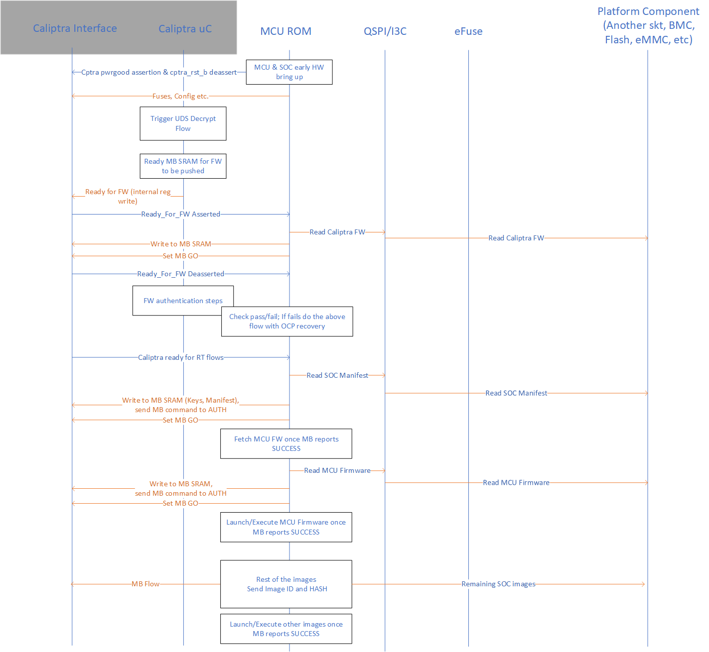

Caliptra Subsystem Hardware Specification

Version 0.1

# Scope

This document defines technical specifications for a reference subsystem design utilizing Caliptra RoT for Measurement (RTM). This document, along with [Caliptra Hardware Specification](https://github.com/chipsalliance/caliptra-rtl/blob/main/docs/CaliptraHardwareSpecification.md), shall comprise the Caliptra Subsystem technical specification.

# Overview

This document provides definitions and requirements for the components used specifically for the subsystem. For specifications of the components re-used from Caliptra RTM, see the [Caliptra Hardware Specification](https://github.com/chipsalliance/caliptra-rtl/blob/main/docs/CaliptraHardwareSpecification.md).

The following figure shows the block diagram for the subsystem reference design.

*Figure 1: Caliptra Subsystem Block Diagram

# Caliptra Manufacturer Control Unit

The Caliptra Manufacturer Control Unit (MCU) repurposes a subset of the Caliptra RTM design. The MCU is intended to run manufacturer specific firmware that will interface with Caliptra to authenticate, measure and load all of the SoC firmware. The MCU firmware is also responsible for performing SoC specific initializations, and should be able to toggle functional signals and resets specific to the SoC.
In addition to the peripherals leveraged from Caliptra RTM design, the subsystem includes an I3C peripheral for loading firmware, an AXI command buffer that initiates transactions onto the SoC fabric for communication with Caliptra as well as loading firmware to other SoC peripherals, and a custom fuse controller block for handling Caliptra and subsystem specific fuses.

## MCU Boot Flow

The MCU will be responsible for driving the boot flow for Caliptra. This includes bringing Caliptra out of reset, pushing the appropriate fuses to Caliptra and providing the FMC and runtime firmware. After Caliptra has verified its own firmware, the MCU can utilize Caliptra services to verify its own firmware and any firmware on the SoC.

The following figure shows an example of the possible boot flow involving Caliptra core and the MCU.

*Figure 2: MCU Boot Flow

# I3C

Development of I3C is WIP.

# AXI Command Buffer

The AXI Command Buffer utilizes a 64B data buffer and a set of command API registers to initiate read and write transactions onto the SoC fabric using AXI protocol. The MCU programs the address and command type for the requested transaction and populates the data buffer for write transactions before setting a GO register that will initiate the transaction. Read transactions will store their return data in the data buffer.

## API

The MCU will be responsible for programming the command buffer API registers to initiate transactions over the AXI interface.

The START_ADDRESS, BURST, and LENGTH will be routed to the appropriate read or write channel addr, burst, and len interfaces based on the RW register value.

The DATA register is used to store the pending write data as well as the read return data, depending on the transaction type.

Setting the GO register will initiate the transaction flow

*Table 1: AXI Command Buffer Registers*

| **Register name** | **Width** | **Description** |
| :--------- | :--------- | :--------- |
| START_ADDRESS | [31:0] | Indicates the start address for the AXI command |
| RW | [1:0] | Indicates the type of transaction. 10: READ, 01: WRITE |
| BURST | [1:0] | Type of burst transaction 00: FIXED, 01: INCR, 10: WRAP |
| LENGTH | [4:0] | Indicates the length of the transaction in beats. |
| DATA | [15:0][31:0] | Write transactions data will come from here, read transactions will return data here. |
| GO | [0:0] | Once set, the command buffer will initiate the requested transaction. |
| VALID | [0:0] | Valid is set once the transaction has completed |
| RESP | [1:0] | Read or write response bits from AXI protocol |

# Fuse Controller

Development of Fuse Controller is WIP.
