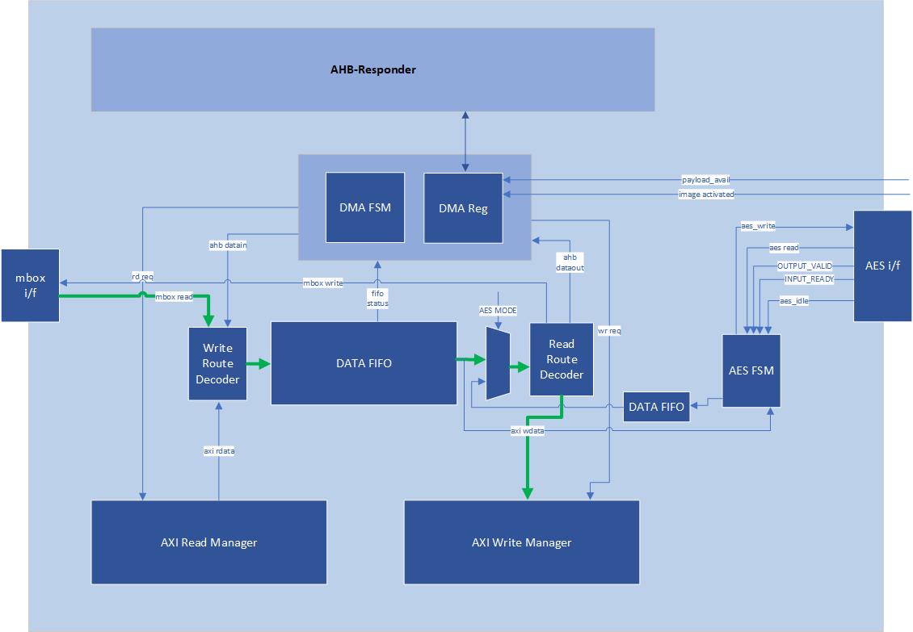
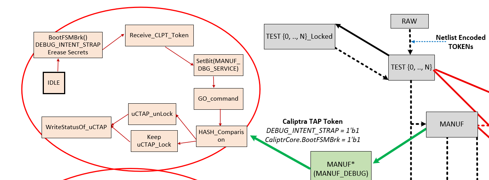
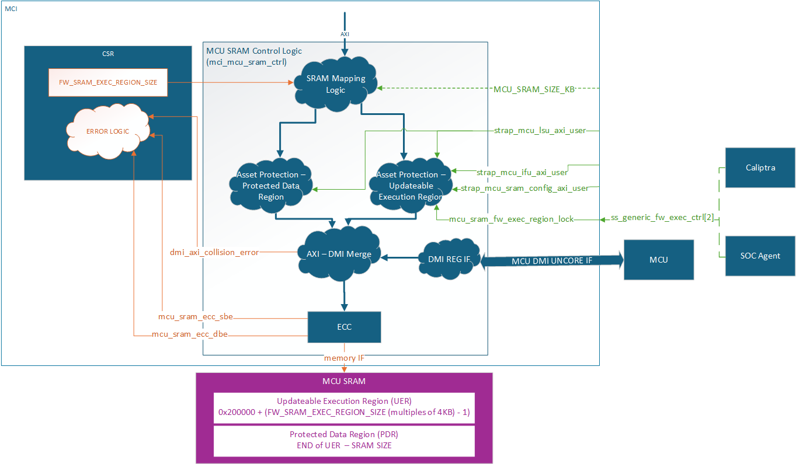

<div align="center">
  
</div>

<h1 align="center"> Caliptra Subsystem Hardware Specification v0p8 </h1>

- [Scope](#scope)
- [Caliptra Subsystem Requirements](#caliptra-subsystem-requirements)
  - [Definitions](#definitions)
  - [Caliptra-Passive-Mode (Legacy)](#caliptra-passive-mode-legacy)
  - [Caliptra-subsystem-mode](#caliptra-subsystem-mode)
  - [Caliptra Subsystem Architectural Requirements](#caliptra-subsystem-architectural-requirements)
  - [Caliptra Subsystem HW Requirements](#caliptra-subsystem-hw-requirements)
    - [Caliptra 2.0 HW requirements (Subsystem Support)](#caliptra-20-hw-requirements-subsystem-support)
    - [Caliptra 2.0 HW requirements (Not subsystem related)](#caliptra-20-hw-requirements-not-subsystem-related)
    - [MCU HW requirements](#mcu-hw-requirements)
    - [Subsystem Components HW requirements](#subsystem-components-hw-requirements)
      - [Fabric](#fabric)
      - [MCU SRAM](#mcu-sram)
      - [MCU ROM](#mcu-rom)
      - [I3C](#i3c)
      - [Fuse Controller](#fuse-controller)
      - [MCI](#mci)
  - [Caliptra Subsystem Hardware Block Diagram](#caliptra-subsystem-hardware-block-diagram)
- [Caliptra Subsystem Architectural Flows](#caliptra-subsystem-architectural-flows)
- [I3C Streaming Boot (Recovery) Interface](#i3c-streaming-boot-recovery-interface)
  - [Streaming Boot (Recovery) Interface hard coded logic](#streaming-boot-recovery-interface-hard-coded-logic)
  - [Hardware Registers](#hardware-registers)
  - [Streaming Boot (Recovery) Interface Wires](#streaming-boot-recovery-interface-wires)
  - [I3C Streaming Boot (Recovery) Flow](#i3c-streaming-boot-recovery-flow)
  - [Caliptra ROM Requirements](#caliptra-rom-requirements)
  - [I3C and Caliptra-AXI Interactions](#i3c-and-caliptra-axi-interactions)
- [Caliptra AXI Manager \& DMA assist](#caliptra-axi-manager--dma-assist)
  - [AXI Feature Support](#axi-feature-support)
  - [Routes](#routes)
  - [Streaming Boot Payloads](#streaming-boot-payloads)
  - [Programming Flowchart {#programming-flowchart}](#programming-flowchart-programming-flowchart)
  - [Descriptor](#descriptor)
- [Caliptra SS Fuse Controller](#caliptra-ss-fuse-controller)
  - [Partition Details](#partition-details)
    - [Key Characteristics of Secret Partitions:](#key-characteristics-of-secret-partitions)
  - [Partition-Specific Behaviors](#partition-specific-behaviors)
    - [Life Cycle Partition](#life-cycle-partition)
    - [Vendor Test Partition](#vendor-test-partition)
  - [Locking the Validated Public Key Partition](#locking-the-validated-public-key-partition)
  - [Hardware Integrity Checker](#hardware-integrity-checker)
    - [Purpose](#purpose)
  - [Zeroization Flow for Secret FUSEs](#zeroization-flow-for-secret-fuses)
    - [Conditions for Zeroization](#conditions-for-zeroization)
    - [Zeroization Process](#zeroization-process)
    - [Cold Reset and Final Zeroization](#cold-reset-and-final-zeroization)
  - [Notes](#notes)
  - [Programmer's Guide](#programmers-guide)
  - [General Guidance](#general-guidance)
    - [Initialization](#initialization)
    - [Reset Considerations](#reset-considerations)
    - [Programming Already Programmed Regions](#programming-already-programmed-regions)
  - [Direct Access Interface](#direct-access-interface)
    - [Readout Sequence](#readout-sequence)
    - [Programming Sequence](#programming-sequence)
    - [Digest Calculation Sequence](#digest-calculation-sequence)
- [Caliptra SS Life Cycle Controller](#caliptra-ss-life-cycle-controller)
  - [Caliptra Subsystem, SOC Debug Architecture Interaction](#caliptra-subsystem-soc-debug-architecture-interaction)
  - [Caliptra Subsystem LCC State Definitions](#caliptra-subsystem-lcc-state-definitions)
  - [DFT \& DFD LC States](#dft--dfd-lc-states)
  - [LCC State and State Decoder Output Ports](#lcc-state-and-state-decoder-output-ports)
  - [TAP Pin Muxing](#tap-pin-muxing)
    - [How does Caliptra Subsystem enable manufacturing debug mode?](#how-does-caliptra-subsystem-enable-manufacturing-debug-mode)
      - [Flow Explanation:](#flow-explanation)
  - [Production Debug Unlock Architecture](#production-debug-unlock-architecture)
  - [Masking Logic for Debugging Features in Production Debug Mode (MCI)](#masking-logic-for-debugging-features-in-production-debug-mode-mci)
  - [Production Debug Policy Authorization Content](#production-debug-policy-authorization-content)
  - [SOC \& Manuf Debug Caliptra Subsystem Hardware Requirements](#soc--manuf-debug-caliptra-subsystem-hardware-requirements)
    - [Caliptra Requirement List for Production Debug Unlock Architecture](#caliptra-requirement-list-for-production-debug-unlock-architecture)
    - [Caliptra Requirement List for Manufacturing Debug Unlock Architecture](#caliptra-requirement-list-for-manufacturing-debug-unlock-architecture)
    - [MCU and MCI Requirements](#mcu-and-mci-requirements)
    - [FUSE Requirements](#fuse-requirements)
  - [LCC Interpretation for Caliptra “Core” Security States](#lcc-interpretation-for-caliptra-core-security-states)
  - [Exception: Non-Volatile Debugging Infrastructure and Initial RAW State Operations](#exception-non-volatile-debugging-infrastructure-and-initial-raw-state-operations)
  - [SOC LCC Interface usage \& requirements](#soc-lcc-interface-usage--requirements)
  - [LCC Module: Summarized Theory of operation](#lcc-module-summarized-theory-of-operation)
- [Manufacturer Control Unit (MCU)](#manufacturer-control-unit-mcu)
- [Manufacturer Control Interface (MCI)](#manufacturer-control-interface-mci)
  - [Overview](#overview)
  - [MCI Feature Descriptions](#mci-feature-descriptions)
    - [Control/Status Registers (CSRs)](#controlstatus-registers-csrs)
      - [MCI CSR Access Restrictions](#mci-csr-access-restrictions)
    - [MCI Straps](#mci-straps)
    - [Subsystem Boot Finite State Machine (CSS-BootFSM)](#subsystem-boot-finite-state-machine-css-bootfsm)
    - [Watchdog Timer](#watchdog-timer)
    - [MCU Mailbox](#mcu-mailbox)
      - [MCU Mailbox Limited Trusted AXI users](#mcu-mailbox-limited-trusted-axi-users)
      - [MCU Mailbox Locking](#mcu-mailbox-locking)
      - [MCU Mailbox Target User](#mcu-mailbox-target-user)
      - [MCU Mailbox Fully addressable SRAM](#mcu-mailbox-fully-addressable-sram)
      - [MCU Mailbox SRAM Clearing](#mcu-mailbox-sram-clearing)
      - [MCU Mailbox Interrupts](#mcu-mailbox-interrupts)
      - [MCU Mailbox Errors](#mcu-mailbox-errors)
      - [MCU Mailbox MCU Access](#mcu-mailbox-mcu-access)
      - [MCU Mailbox Address Map](#mcu-mailbox-address-map)
    - [MCU SRAM](#mcu-sram-1)
      - [MCU Hitless Update Handshake](#mcu-hitless-update-handshake)
    - [MCI AXI Subordinate](#mci-axi-subordinate)
    - [MCI Interrupts](#mci-interrupts)
    - [MCI Error handling](#mci-error-handling)
    - [MCI Fuse Storage Support](#mci-fuse-storage-support)
    - [MCU Timer](#mcu-timer)
    - [MCU Trace Buffer](#mcu-trace-buffer)
      - [MCU Trace Buffer SW Interface](#mcu-trace-buffer-sw-interface)
      - [MCU Trace Buffer Packet](#mcu-trace-buffer-packet)
      - [MCU Trace Buffer Extraction](#mcu-trace-buffer-extraction)
      - [MCU Trace Buffer Error Handling](#mcu-trace-buffer-error-handling)
  - [MCI Debug](#mci-debug)
    - [MCI Debug Access](#mci-debug-access)
      - [MCI DMI](#mci-dmi)
        - [MCU DMI Enable Control](#mcu-dmi-enable-control)
        - [MCI DMI Interface](#mci-dmi-interface)
        - [MCI DMI Memory Map](#mci-dmi-memory-map)
          - [DMI Only Registers](#dmi-only-registers)
        - [DMI MCU SRAM Access](#dmi-mcu-sram-access)
        - [DMI MCU Trace Buffer Access](#dmi-mcu-trace-buffer-access)
    - [MCI Boot FSM Breakpoint](#mci-boot-fsm-breakpoint)
      - [MCI Boot FSM Breakpoint Flow](#mci-boot-fsm-breakpoint-flow)
  - [MCI Design for Test (DFT)](#mci-design-for-test-dft)
    - [Reset Controls](#reset-controls)
- [Subsystem Memory Map](#subsystem-memory-map)
- [Subsystem HW Security](#subsystem-hw-security)


# Scope

This document defines technical specifications for a subsystem design utilizing Caliptra RoT in Subystem Mode. This document, along with [Caliptra Hardware Specification](https://github.com/chipsalliance/caliptra-rtl/blob/main/docs/CaliptraHardwareSpecification.md), shall comprise the Caliptra Subsystem technical specification.


# Caliptra Subsystem Requirements
## Definitions
* RA: Recovery Agent
* MCI: Manufacturer Control Interface
* MCU: Manufacturer Control Unit
  
## Caliptra-Passive-Mode (Legacy)
SOC manages boot media peripherals and Caliptra is used as Root of trust for measurements.

## Caliptra-subsystem-mode 
Caliptra owns the recovery interface (peripheral independent) and Caliptra is THE RoT of the SoC. Any SOC specific variables that needs to be stored and retrieved securely from NV storage is handled using Caliptra.

## Caliptra Subsystem Architectural Requirements

1. MCU [Manufacturer Control Unit] runs Manufacturer specific FW authenticated, measured & loaded by Caliptra at boot time.
2. MCU will use Caliptra RT FW to auth/measure/load all of the FW belonging to the SOC.
3. MCU ROM/FW on MCU should be capable of performing SOC specific initialization.
4. MCU ROM/FW should be able to perform SoC management functions including performing reset control, SoC specific security policy enforcement, SOC initial configuration (eg. any GPIO programming, glitch detection circuits, reading/moving non-secret fuses etc.).
  * Note: Widgets that toggle the reset or other wires that set security permissions are SOC specific implementations.
6. Fuse controller for provisioning Caliptra fuses -> IFP (In-field programmable) fusing is performed by MCU RT; SW partition fuses in fuse controller are managed by MCU (ROM or RT); Caliptra HW is responsible for reading the secret fuses (Caliptra ROM, MCU ROM or any other SOC ROM or any RT FW should NOT have access to read the secret fuses in production).
7. Recovery stack must be implemented. Please refer to I3C recovery section for more details and references.
OCP Recovery registers implemented in I3C must follow the security filtering requirements specified in the recovery implementation spec (eg. MCU can ONLY access subset of the recovery registers as defined by the recovery implementation).
8. Supports silicon t0 boot to load and run required FW across chiplets.
9. OCP recovery stack is implemented in Caliptra for Caliptra-subsystem-mode
10. MCU SRAM (or part of the SRAM that is mapped for Code/Data execution) should be readable/writeable ONLY by Caliptra until Caliptra gives permission to MCU to use it.
11. Caliptra can only load its FW, SOC manifest and MCU FW by reading the recovery interface registers.
12. Caliptra ROM should know the offset of the recovery interface at its boot time. SOC has a choice to program this interface using MCU ROM or Hard strapped register address at integration time (Hard strapping at SOC integration time is recommended)
13. Caliptra HW must know the offset of the registers where secrets (UDS, FE) and assets (PK hashes) exist at boot time. These should be hard strapped/configured at integration time.
14. Caliptra ROM must know the address to where UDS-seed needs to be written to; this address should be hard strapped/configured at integration time.
15. Any registers holding secrets/assets in fuse controller must follow the same rules as Caliptra 1.0/2.0 fuse register requirements (eg. clear on debug, clear on read once etc.)
16. MCU SRAM and ROM sizes should be configurable at SOC integration time.

## Caliptra Subsystem HW Requirements

### Caliptra 2.0 HW requirements (Subsystem Support)
1. Full AXI read/write channels (aka AXI manager) for subsystem (for MCU and Caliptra)
    a. For backward compatibility, AXI mgr. interface can be a no-connect and that configuration is validated.
2. HW logic/Programmable DMA
  * Read MMIO space for variable length.
  * Data returned from the above read can be exposed directly to the FW OR allow it to be written to a subsystem/SOC destination as programmed by ROM/FW.
  * Programmable logic to allow for SOC directed writes (from FW or from the above route back) to be sent through the SHA accelerator.
  * (Future open/stretch goal): If AES engine accelerator is integrated into Caliptra, then implement decryption before sending the writes back to the destination programmed by the ROM/FW.
  * This widget should have accessibility in manufacturing and debug mode over JTAG (can be exposed using the same JTAG interface as Caliptra 1.0). Ensure through validation that no asset can be read using this widget in those modes.
3. Expand manuf flow register to include UDS programming request steps
4. SOC Key Release HW (Required for OCP Lock flow too)
  * Separate SOC Key Vault must be implemented (it is a separate structure from the current Caliptra KV).
  * In at least one configuration, the SOC KV must be implemented as an SRAM that is external and configurable by the SOC OR or an internal configurable SOC KV structure. If this is achievable within the Caliptra 2.0 milestone, only one of these would be the chosen implementation and configuration. This will be a design decision based on effort & schedule.
  * If implemented as a SRAM, data written and read into the SOC KV SRAM is decrypted & encrypted so that SOC DFT or other side channels cannot exfilterate the data.
  * Caliptra FW will indicate to the SOC KV Release HW to release the key by supplying the key handle to read from.
  * Destination address to which the key must be written to is programmed by the Caliptra FW into AXI MGR DMA HW.
  * SOC KV must have the same attributes as Caliptra internal KV. Additionally, it must also have an attribute of read-once and clear.

### Caliptra 2.0 HW requirements (Not subsystem related)
1. Ability to use two or more cryptos concurrently
2. Change APB -> AXI-Sub with the same capabilities (AXI USERID filtering replaces PAUSER based filtering, multiple targets for SHA acc, mailbox, fuses, registers etc. all)
3. Future/Stretch Goal: Parity support on AXI-SUB & MGR


### MCU HW requirements
1. MCU should not be in the FIPS boundary and must not have any crypto functions. MCU must use Caliptra for any security flows (eg. security policy authorization) or traditional RoT support (eg. SPDM).
2. MCU VeeR must support PMP & User mode.
3. MCU AXI is directly connected to the SOC fabric in a way that allows a MMIO based control of the SoC as required for SOC security, manageability and boot functionality.
4. MCU HW should add AXI-ID without any involvement of the ROM or FW running on the MCU; Implying any AXI access out of MCU (LSU side) should carry MCU USERID that HW populates.
5. MCU executes from a SRAM that is at subsystem level.
6. MCU uses instruction cache for speed up
7. It is required that all NV read/writes (eg. NV variables in flash) that require a RoT support to securely store/restore must go through Caliptra.
8. NV-storage peripheral shall be built in such a way that it will only accept transactions from MCU.
9. Support for MCU first fetch vector to direct towards MCU SRAM post reset 


### Subsystem Components HW requirements
#### Fabric
1. AXI Interconnect connects Caliptra, I3C, Fuse Controller, Life Cycle Controller, MCU and its memory components with the rest of the SOC.
  * **Note:** Because each SOC integration model is different, AXI interconnect is NOT implemented by the subsystem but subsystem must validate using an AXI interconnect VIP to ensure all the components operate per the flows documented in this specification.
  * For the VIP interconnect configuration, all subtractively decoded transactions are sent towards SoC. AXI interconnect & Subsystem is validated with the assumption that all of them are running on the same clock domain.
2. To be documented: AXI-USERID requirements

#### MCU SRAM 
1. Since it's used for instruction and data execution – therefore requires AXI Sub with USERID filtering.
2. Provide JTAG accessibility to allow for SRAM to be populated in a secured debug mode at power on time (debug policies will be same as Caliptra)
3. MCU SRAM should have an aperture that can only be unlocked by Caliptra after it loads the image
4. MCU SRAM has an aperture for MCU ROM to use part of the SRAM as a stack for its execution.
5. MCU SRAM supports an aperture to be used as a MCU Mailbox.

#### MCU ROM
* MCU ROM also needs to have AXI Sub for any data access from MCU and thereby requires AXI-ID/USERID filtering.

#### I3C 
1. I3C on AXI interconnect with AXI Subordinate
2. Spec 1.1.1 aligned, but only with optional features that are required per PCIe ECN # <>
3. AXI Sub must be supported.
4. UserID to MCU and Caliptra
5. MCU access lock for I3C recovery and data (FIFO) registers until recovery flow is completed. In other words, MCU ROM must not impact the data flow into Recovery IFC registers.
Stretch Goal: DMA data payload back to destination (Caliptra or MCU) 

#### Fuse Controller
1. AXI sub interface
2. Secrets (separate USERID and access constraints) vs SW partition separation
3. Registers implemented for “Secrets” should follow the same rules as Caliptra (no scan, clear on specific life cycle/security states)
4. Life cycle transition shall be implemented in hardware with no ROM/FW implementation and provides redundancy against fault & glitch attacks in the digital logic itself.
5. SOC debug in production mode shall be supported with the help Caliptra through post quantum resilient algorithms.
6. When debug mode is intended to be enabled & when enabled, all secrets/assets as defined should be wiped and provide the indication to SOC for any secrets/assets it may have.

#### MCI
* HW logic to move secret fuses from Fuse controller to Caliptra.

## Caliptra Subsystem Hardware Block Diagram

*Figure: Caliptra Subsystem Block Diagram*


# Caliptra Subsystem Architectural Flows
Please refer to [Caliptra Security Subsystem Specification](https://github.com/chipsalliance/Caliptra/blob/main/doc/Caliptra.md#caliptra-security-subsystem) for more details.

# I3C Streaming Boot (Recovery) Interface
The I3C recovery interface acts as a standalone I3C target device for recovery. It will have a unique address compared to any other I3C endpoint for the device. It will comply with I3C Basic v1.1.1 specification. It will support I3C read and write transfer operations. It must support Max read and write data transfer of 1-256B excluding the command code (1 Byte), length (2 Byte), and PEC (1 Byte), total 4 Byte I3C header. Therefore, max recovery data per transfer will be limited to 256-byte data.
	
I3C recovery interface is responsible for the following list of actions: 
1. Responding to command sent by Recovery Agent (RA)
2. Updating status registers based on interaction of AC-RoT and other devices
3. Asserting / Deasserting “payload_available” & “image_activated” signals

## Streaming Boot (Recovery) Interface hard coded logic
Hardware registers size is fixed to multiple of 4 bytes, so that firmware can read or write with word boundary. Address offset will be programmed outside of the I3C device. Register access size must be restricted to individual register space and burst access with higher size must not be allowed.

*Figure: I3C Streaming Boot (Recovery) Interface Logic Block Diagram*


## Hardware Registers
Hardware registers size is fixed to multiple of 4 bytes, so that firmware can read or write with word boundary. Address offset will be programmed outside of the I3C device. Register access size must be restricted to individual register space and burst access with higher size must not be allowed.

**Note:** Accessing the same address for INDIRECT_FIFO_DATA register will write or read the FIFO. It will not be available to access randomly as specified by the specification. 

**TODO:** Add a link to rdl -> html file

## Streaming Boot (Recovery) Interface Wires
	
1. **Payload available**
  * The Recovery Interface (I3C target) should receive a write transaction to INDIRECT_FIFO_DATA reg from BMC - 256B + 4B (Header), and wait for each I3C write to finish. Once I3C write transaction to INDIRECT_FIFO_DATA register is completed and PEC verification is successful, then the I3C target must assert "payload_available". DMA assist must wait for "payload_available" before reading. It must read 256B or last read with remaining data.
  * The "payload_available" signal remains asserted until Recovery Interface receives Read from DMA over AXI for INDIRECT_FIFO_DATA.
2. **Image_activated**
  * The I3C target will assert "image_activated" signal as soon as write to RECOVERY_CTRL register is received.
  * ROM will clear “image_activated” bit by writing to RECOVERY_CTRL register via DMA assist after the image is authenticated. As defined in the OCP Recovery Specification, RECOVERY_CTRL, byte 2 is used to specify the image activation control, and is Write-1-Clear. ROM must write 0xFF to this field to clear the image recovery status, which will also result in the Recovery Interface deasserting the “image_activated” signal to Caliptra.

## I3C Streaming Boot (Recovery) Flow

Please refer to [Caliptra Security Subsystem Recovery Sequence](https://github.com/chipsalliance/Caliptra/blob/main/doc/Caliptra.md#caliptra-subsystem-recovery-sequence).

*Figure: Caliptra Subsystem I3C Streaming Boot (Recovery) Flow*


## Caliptra ROM Requirements
Caliptra ROM & RT firmware must program DMA assist with correct image size (multiple of 4B) + FIXED Read + block size is 256B (burst / FIFO size). Caliptra ROM & RT Firmware must wait for "image_activated" signal to assert before processing the image. Once the image is processed, Caliptra ROM & RT firmware must initiate a write with data 1 via DMA to clear byte 2 “Image_activated” of the RECOVERY_CTRL register. This will allow BMC (or streaming boot initiator) to initiate subsequent image writes. 

## I3C and Caliptra-AXI Interactions
Received transfer data can be obtained by the driver via a read from XFER_DATA_PORT register. Received data threshold is indicated to BMC by the controller with TX_THLD_STAT interrupt if RX_THLD_STAT_EN is set. The RX threshold can be set via RX_BUF_THLD. In case of a read when no RX data is available, the controller shall raise an error on the frontend bus interface (AHB / AXI).

# Caliptra AXI Manager & DMA assist
SOC\_IFC includes a hardware-assist block that is capable of initiating DMA transfers to the attached SoC AXI interconnect. The DMA transfers include several modes of operation, including raw transfer between SoC (AXI) addresses, moving data into or out of the SOC\_IFC mailbox, and directly driving data through AHB CSR accesses to datain/dataout registers. One additional operating mode allows the DMA engine to autonomously wait for data availability via the OCP Recovery interface (which will be slowly populated via an I3C or similar interface). 

Caliptra arms transfers by populating a transaction descriptor to the AXI DMA CSR block via register writes over the internal AHB bus. Once armed, the DMA will autonomously issue AXI transactions to the SoC until the requested data movement is completed. The DMA uses an internal FIFO to buffer transfer data. For any transfer using AXI Writes (Write Route is not disabled), the DMA waits until sufficient data is available in the FIFO before initiating any AXI write requests.

When arming the engine, Caliptra firmware is expected to have information about available AXI addresses that are legal for DMA usage. The DMA can facilitate transfer requests with 64-bit addresses. DMA AXI Manager logic automatically breaks larger transfer sizes into multiple valid AXI burst transfers (max 4KiB size), and legally traverses 4KiB address boundaries. The DMA AXI Manager supports a maximum transfer size of 1MiB in total. FIXED AXI bursts are allowed, to facilitate a FIFO-like operation on either read or write channels.


## AXI Feature Support
The DMA assist initiates transactions on the AXI manager interface in compliance with the AXI specification. The generated AXI transactions adhere to the following rules:
* All address requests will be aligned to the data width of the interface, which is configured as 32-bit in the 2.0 release.
* The DMA will not issue Narrow transfers. That is, AxSIZE will always be set to match the data width of the interface (4 bytes).
* All data lanes are used on all transfers. That is, the AXI manager Write channel will always set WSTRB to all 1s.
* At most, 2 reads and 2 writes will be initiated at any time.
  * When using a non-zero block\_size for the transfer, in accordance with the [Streaming Boot](#Streaming-Boot-Payloads) feature, at most 1 read and 1 write will be issued concurrently.
* All transactions are initiated with AxID = 0, meaning that both reads and writes require in-order responses.
* The maximum burst length initiated is constrained by the following parameters:
  * Any transfer using the INCR burst type is restricted by both the maximum allowable length of an AXI transaction (AxLEN=255 or total byte count of 4KiB, whichever is smaller) and the size of the internal FIFO. In the 2.0 release the internal FIFO is configured with a depth of 512 bytes; the maximum transaction size allowed is 256 bytes, to allow up to 2 transactions to be outstanding at a time. In summary, the transfer size will always be 256 bytes or less (AxLEN = 63), as this is the smallest of (AxLEN = 255 -> 1KiB, 4KiB, and 256 bytes).
  * Any transfer using the FIXED burst type is restricted by the AXI specification to a burst length of 16.
  * When the block\_size field is set to a non-zero value when arming the DMA, all transfers are restricted in size to specified block_size, in bytes.
  * AXI transactions must not cross a 4KiB boundary, per the specification. If the transfer size requires crossing a boundary, the DMA will break it into smaller transactions that will go up to the boundary, then start from the next alignment boundary.

## Routes

In the AXI DMA control state machine, both the read and write interfaces have their own “route”. A route is configured for read and write channels for every DMA operation that is requested. Routes determine how data flows through the DMA block.

Read routes always apply when an AXI read is requested. Any AXI read will push the response data into the internal FIFO. The read route determines where this data will ultimately be sent when it is popped from the FIFO. For the AHB route, data from the FIFO is populated to the dataout register, where it may be read via AHB by the Caliptra RV core. For the mailbox route, data from the FIFO flows into the mailbox; for these operations, the mailbox address is determined by the destination address register value, with an offset applied based on how many bytes have been written to the mailbox. For the AXI route, data from the FIFO flows into the AXI Write Manager, whereupon it is sent out to AXI on the WDATA signal.

Write routes always apply when an AXI write is requested. Any AXI write will read data from the internal FIFO before sending it over AXI. The write route determines where this data originates before it is pushed onto the FIFO. For the AHB route, a write to the datain register via AHB results in write data being pushed onto the FIFO. For the mailbox route, data is read from the mailbox and pushed onto the FIFO; for these operations, the mailbox address is determined by the source address register value, with an offset applied based on how many bytes have been read from the mailbox. For the AXI route, data flows from the AXI Read Manager into the FIFO.

*Example 1: Write Route \== MBOX*



*Example 2: Read Route \== AHB*


## Streaming Boot Payloads

The DMA block supports a special mode of operation that is intended for use in reading Firmware Image Payloads (for Streaming Boot) from the Recovery Interface, present in the Caliptra Subsystem. This operation mode relies on three key control signals: the payload\_available signal input from the recovery interface, the read\_fixed control bit, and the block\_size register (from the DMA control CSR block). 

This special mode of operation is only used for AXI Reads. To trigger the DMA to operate in this mode, Caliptra Firmware must program the block\_size register to a non-zero value that is a power-of-two. Caliptra Firmware must also program the read\_fixed control bit. Once the “go” bit is set, causing the DMA to begin operation, the DMA control logic will wait for the payload\_available input to trigger. When this occurs, the DMA controller issues a read that has a size equal to (or smaller) than the configured block\_size (the read may be smaller if required by AXI rules). This process repeats until the amount of data indicated in the byte\_size register has been transferred.

When programming an AXI to AXI transfer for a Streaming Boot Payload (e.g., to transfer an SoC Firmware manifest into an AXI-attached SRAM), firmware must also follow these rules:
* Programmed value of block\_size must not exceed the largest legal AXI transaction size for a FIXED burst type. The DMA assist has a native data width of 4-bytes, so transaction size is restricted to 64-bytes due to the AXI specification limit of AxLEN == 15 for FIXED transactions.
* Destination address must be aligned to the programmed value of block\_size. For example, if block\_size is set to 64-bytes, destination address must be an integer multiple of 0x40.

In all cases other than reading Recovery Interface Payloads, the block\_size register must be programmed to 0\.

## Programming Flowchart {#programming-flowchart}

General Rules:

1. If either Read or Write route is configured to AXI RD \-\> AXI WR, both routes must be configured as AXI RD \-\> AXI WR.  
2. Read Route and Write Route must not both be disabled.  
3. If Read Route is enabled to any configuration other than AXI RD-\> AXI WR, Write route must be disabled.  
4. If Read Route is disabled, Write route must be enabled to a configuration that is not AXI RD \-\> AXI WR.  
5. If Read Route is disabled, Read Fixed field is ignored.  
6. If Write Route is disabled, Write Fixed field is ignored.  
7. Addresses and Byte Counts must be aligned to AXI data width (1 DWORD).

8. Block Size is used only for reads from the Subsystem Recovery Interface. When block size has a non-zero value, the DMA will only issue AXI read requests when the payload available input signal is set to 1, and will limit the size of read requests to the value of block size. For all other transactions (such as AXI writes, or any single-dword access to a subsystem register via the DMA), block size shall be set to a value of 0 for every transaction.

Steps:

1. Write Byte Count  
2. Write Block Size  
3. Write Source Addr (value is ignored if data is from AHB)  
4. Write Dest Addr (value is ignored if data is to AHB).  
   1. To perform an accelerated SHA operation on incoming read data, firmware sets the Read/Write route to AXI RD-\> AXI WR, and the destination address to the SoC address for the SHA Acceleration data in aperture.  
5. Set Interrupt Enables (optional)  
6. If Mailbox R/W: Acquire Mailbox Lock  
7. If SHA Acc Op:   
   1. First acquire Sha Accel Lock via AXI by using this flow (with the AHB-\> AXI WR route) to initiate AXI manager action  
   2. Initiate Sha Accel streaming operation via AXI by using this flow (with the AHB-\> AXI WR route) to initiate AXI manager action  
   3. Run this operation with the AXI RD \-\> AXI WR route to move data from SoC location into Sha Accelerator  
8. Set Control Register  
   1. Set Read/Write Routes  
   2. Set Read/Write Fixed=0/1  
   3. GO  
   4. (All 3 may be single write or separate, GO must be last bit to set)  
9. If AHB data: Wait for RD FIFO not empty or WR FIFO not full  
   1. Push/Pop data (using Rd Data/Wr Data register offsets) until all requested bytes transferred  
   2. If AHB Error – check status0 for Error, then check for “Command Error”   
10. Wait for TXN Done Interrupt (or Poll Status0)   
11. Read Status0, confirm Busy=0, Error=0

## Descriptor

https://chipsalliance.github.io/caliptra-rtl/main/internal-regs/?p=clp.axi_dma_reg

# Caliptra SS Fuse Controller

FUSE controller is an RTL module that is responsible for programming and reading the FUSEs. This module has an AXI interface that is connected to Caliptra Subsystem’s AXI interconnect. This module provides the device with one-time programming functionality, resulting in non-volatile programming that cannot be reversed. This functionality is delivered via an open-source FUSE Controller and a proprietary FUSE/OTP Macro. This RTL module manages the following FUSE partition mapping, which can be found in the [Fuse Controller Memory Map](../src/fuse_ctrl/doc/otp_ctrl_mmap.md).


## Partition Details

The Fuse Controller supports a total of **13 partitions** (See [Fuse Controller's Fuse Partition Map](../src/fuse_ctrl/doc/otp_ctrl_mmap.md)). Secret FUSE partitions are prefixed with the word "Secret" and are associated with specific Life Cycle Controller (LCC) states, such as "MANUF" or "PROD." This naming convention indicates the LCC state required to provision each partition.

### Key Characteristics of Secret Partitions:
1. **Programming Access:**  
   - `UDS_SEED` and `FIELD_ENTROPY` partitions can only be programmed by the Caliptra-Core.
   - Secret partitions are buffered, meaning they are stored in registers and are erased (zeroized) if Caliptra-SS enters debug mode.  
2. **Locking Mechanism:**  
   - Write access to a partition can be permanently locked when no further updates are required.  
   - To lock a partition, an integrity constant is calculated and programmed alongside the data for that partition.

## Partition-Specific Behaviors

### Life Cycle Partition
- The life cycle partition remains active across all stages and cannot be locked.  
- This ensures that the device can transition back to the **RMA** state in case of unexpected failures during production.  

### Vendor Test Partition
- The vendor test partition is used for FUSE programming smoke checks during manufacturing.  
- Unlike other partitions, ECC uncorrectable errors in this partition do not trigger fatal errors or alerts due to the nature of FUSE smoke checks, which may leave certain FUSE words in inconsistent states.


## Locking the Validated Public Key Partition
<a name="locking-the-validated-public-key-partition"></a>

During firmware authentication, the ROM validates the vendor public keys provided in the firmware payload. These keys, which support ECC, MLDSA, and LMS algorithms, are individually hashed and compared against stored fuse values (e.g., `CPTRA_CORE_VENDOR_PK_HASH_n`). Once a valid key is identified, the ROM locks that specific public key hash and all higher-order public key hash entries until the next cold reset. This ensures that the validated key’s fuse entry remains immutable. Importantly, the locking mechanism is applied only to the public key hashes. The associated revocation bits, which allow for runtime key revocation, remain unlocked. To support this, the fuse controller (FC) implements two distinct partitions:

1. **PK Hash Partition**  
   - **Purpose:**  
     - Contains the `CPTRA_CORE_VENDOR_PK_HASH[i]` registers for *i* ranging from 1 to N.
     - Once a key is validated, the corresponding hash and all higher-order hashes are locked by MCU ROM, making them immutable until a cold reset.
   - **Layout & Details:**  
     - **Partition Items:** `CPTRA_CORE_VENDOR_PK_HASH[i]` where *i* ranges from 1 to N.  
       - **Default N:** 1  
       - **Maximum N:** 16  
       - **Size:** N × 384 bits (each hash is 384-bit)  
       - **Programming:**  
         - The first key (i=1) is programmed during the manufacturing phase.  
         - The remaining keys (if any, i.e., N–1) can be programmed during manufacturing or in the field (production).
     - **Partition Item:**
       - `CPTRA_CORE_VENDOR_PK_HASH_VALID` is used to indicate which of the N keys is valid. Therefore, the length is N to support N-bit hot-encoding.
       
2. **PK Hash Revocation Partition**  
   - **Purpose:**  
     This partition stores runtime-updateable revocation bits and PQC type information.
   - **Layout & Details:**  
     - For each vendor public key (`VENDOR_PK_HASH[i]`), the partition contains:  
       - **ECC Revocation Bits:** 4 bits (e.g., `CPTRA_CORE_ECC_REVOCATION[i]`)  
       - **LMS Revocation Bits:** 32 bits (e.g., `CPTRA_CORE_LMS_REVOCATION[i]`)  
       - **MLDSA Revocation Bits:** 4 bits (e.g., `CPTRA_CORE_MLDSA_REVOCATION[i]`)  
       - **PQC Key Type Bits:** 1-bit one-hot encoded selection (e.g., `CPTRA_CORE_PQC_KEY_TYPE[i]`)
     - **Attributes:**  
       - This partition is kept separate from the PK hash partition to allow for runtime updates even after the validated public key is locked.
3. **Volatile Locking Mechanism** 
  - To ensure that the validated public key remains immutable once selected, the FC uses a volatile lock mechanism implemented via the new register `otp_ctrl.VENDOR_PK_HASH_LOCK`.
  - Once the ROM determines the valid public key (e.g., the 3rd key is selected), it locks the corresponding fuse entries in the PK hash partition.
  - The lock is applied by writing a specific value to `otp_ctrl.VENDOR_PK_HASH_LOCK`.
     - **Example:**
       ```c
       // Lock the 3rd vendor public key hash and all higher order key hashes
       write_register(otp_ctrl.VENDOR_PK_HASH_LOCK, 0xFFF2);
       // This operation disables any further write updates to the validated public key fuse region.
       ```
  -  The ROM polls the [`STATUS`](../src/fuse_ctrl/doc/registers.md#status) register until the Direct Access Interface (DAI) returns to idle, confirming the completion of the lock operation. If any errors occur, appropriate error recovery measures are initiated.
  - Once locked, the PK hash partition cannot be modified, ensuring that the validated public key remains unchanged, thereby preserving the secure boot chain.
  - If there needs to be update or programming sequence in PK_HASH set, it needs to be in ROM execution time based on a valid request. Therefore, requires cold-reset.
  - The PK hash revocation partition remains unlocked. This design allows the chip owner to update revocation bits and PQC type settings at runtime, enabling the dynamic revocation of keys without affecting the locked public key.

---

## Hardware Integrity Checker

Once partitions are locked, the hardware integrity checker performs two primary integrity checks to ensure the consistency of the volatile buffer registers:

1. **ECC Protection:**  
   - All buffered partitions include additional ECC protection (8-bit ECC for each 64-bit block), which is monitored concurrently.

2. **Digest Verification:**  
   - The digest of each partition is recomputed at semi-random intervals and compared to the digest stored alongside the partition.

### Purpose
These integrity checks verify whether the contents of the buffer registers remain consistent with the calculated digest. They do not verify the consistency between storage flops and the FUSE.

## Zeroization Flow for Secret FUSEs

The secret FUSE partitions are **zeroized** when the Caliptra-SS Life Cycle Controller (LCC) enters the **SCRAP** state. However, due to lifecycle constraints, the zeroization process requires a **transient condition** before the system reaches the **SCRAP** state.

### Conditions for Zeroization

Zeroization occurs under the following conditions:

1. **Persistent Condition:**  
   - The **Life Cycle Controller (LCC)** must be in the **SCRAP** state.
   - This transition to SCRAP occurs only **after a cold reset** followed by **SCRAP** state transition request.

2. **Transient Condition (Before Cold Reset):**  
   - The **`cptra_ss_FIPS_ZEROIZATION_PPD_i`** GPIO pin must be **asserted high**.
   - The **`ss_soc_MCU_ROM_zeroization_mask_reg`** must also be set.

### Zeroization Process

1. A new input port, `cptra_ss_FIPS_ZEROIZATION_PPD_i`, is introduced in the Caliptra Subsystem.
2. When this signal is asserted, it triggers preemptive zeroization of secret FUSEs before the SCRAP state transition.
3. The **MCU ROM** samples `cptra_ss_FIPS_ZEROIZATION_PPD_i` by reading the corresponding register storing its value.
4. If `cptra_ss_FIPS_ZEROIZATION_PPD_i == HIGH`, the MCU ROM executes the following sequence:
   1. Writes `32'hFFFF_FFFF` to the `ss_soc_MCU_ROM_zeroization_mask_reg` register of **MCI**.
   2. Creates a **Life Cycle Controller (LCC) transition request** to switch to the **SCRAP** state.

- **Note:** The LCC state transition to SCRAP is completed **only after a cold reset**.
- **Note:** The `ss_soc_MCU_ROM_zeroization_mask_reg` register can be set only by MCU ROM that prohibits run-time firmware to update this register.

### Cold Reset and Final Zeroization

- The system remains in a **transient zeroization state** managed by:
  - `cptra_ss_FIPS_ZEROIZATION_PPD_i`
  - `ss_soc_MCU_ROM_zeroization_mask_reg`
- After the **cold reset**, the **LCC enters SCRAP state**.
- All secret FUSEs are permanently zeroized as a direct result of the **SCRAP state transition**.

---

## Notes
- **Zeroization of Secret Partitions:**  
  Secret partitions are temporarily zeroized when Caliptra-SS enters debug mode to ensure security.
- **Locking Requirement:**  
  After the device finishes provisioning and transitions into production, partitions that no longer require updates should be locked to prevent unauthorized modifications.
- **Further Information:**  
  For more information about the conditional states, please refer to [OpenTitan open-source silicon Root of Trust (RoT) project](https://opentitan.org/book/hw/ip/lc_ctrl/doc/theory_of_operation.html).

## Programmer's Guide

During provisioning and manufacturing, SW interacts with the OTP controller mostly through the Direct Access Interface (DAI), which is described below.
Afterwards during production, SW is expected to perform only read accesses via the exposed CSRs and CSR windows, since all write access to the partitions has been locked down.

The following sections provide some general guidance, followed by an explanation of the DAI and a detailed OTP memory map.
Typical programming sequences are explained at the end of the Programmer's guide.

## General Guidance

### Initialization

The OTP controller initializes automatically upon power-up and is fully operational by the time the processor boots.
The only initialization steps that SW should perform are:

1. Check that the OTP controller has successfully initialized by reading [`STATUS`](../src/fuse_ctrl/doc/registers.md#status). I.e., make sure that none of the ERROR bits are set, and that the DAI is idle ([`STATUS.DAI_IDLE`](../src/fuse_ctrl/doc/registers.md#status)).
    - Choose whether the periodic [background checks](#partition-checks) shall be subject to a timeout by programming a nonzero timeout cycle count to [`CHECK_TIMEOUT`](registers.md#check_timeout).
      In this case, the [`CHECK_TIMEOUT`](registers.md#check_timeout) register must be set before the [`INTEGRITY_CHECK_PERIOD`](registers.md#integrity_check_period) and [`CONSISTENCY_CHECK_PERIOD`](registers.md#consistency_check_period) registers (see next point).
    - Enable periodic [background checks](#partition-checks) by programming nonzero mask values to [`INTEGRITY_CHECK_PERIOD`](registers.md#integrity_check_period) and [`CONSISTENCY_CHECK_PERIOD`](registers.md#consistency_check_period).
    - It is recommended to lock down the background check registers via [`CHECK_REGWEN`](registers.md#check_regwen), once the background checks have been set up

If needed, one-off integrity and consistency checks can be triggered via [`CHECK_TRIGGER`](../src/fuse_ctrl/doc/registers.md#check_trigger).
If this functionality is not needed, it is recommended to lock down the trigger register via [`CHECK_TRIGGER_REGWEN`](../src/fuse_ctrl/doc/registers.md#check_trigger_regwen).

Later on during the boot process, SW may also choose to block read access to the SW managed partitions via the associated partition lock registers, e.g. [`CREATOR_SW_CFG_READ_LOCK`](../src/fuse_ctrl/doc/registers.md#creator_sw_cfg_read_lock) or [`OWNER_SW_CFG_READ_LOCK`](../src/fuse_ctrl/doc/registers.md#owner_sw_cfg_read_lock).

### Reset Considerations

It is important to note that values in OTP **can be corrupted** if a reset occurs during a programming operation.
This should be of minor concern for SW, however, since all partitions except for the LIFE_CYCLE partition are being provisioned in secure and controlled environments, and not in the field.
The LIFE_CYCLE partition is the only partition that is modified in the field - but that partition is entirely owned by the life cycle controller and not by SW.

### Programming Already Programmed Regions

OTP words cannot be programmed twice, and doing so may damage the memory array.
Hence the OTP controller performs a blank check and returns an error if a write operation is issued to an already programmed location.


## Direct Access Interface

OTP has to be programmed via the Direct Access Interface, which is comprised of the following CSRs:

CSR Name                             | Description
-------------------------------------|------------------------------------
[`DIRECT_ACCESS_WDATA_0`](../src/fuse_ctrl/doc/registers.md#direct_access_wdata) | Low 32bit word to be written.
[`DIRECT_ACCESS_WDATA_1`](../src/fuse_ctrl/doc/registers.md#direct_access_wdata) | High 32bit word to be written.
[`DIRECT_ACCESS_RDATA_0`](../src/fuse_ctrl/doc/registers.md#direct_access_rdata) | Low 32bit word that has been read.
[`DIRECT_ACCESS_RDATA_1`](../src/fuse_ctrl/doc/registers.md#direct_access_rdata) | High 32bit word that has been read.
[`DIRECT_ACCESS_ADDRESS`](../src/fuse_ctrl/doc/registers.md#direct_access_address) | byte address for the access.
[`DIRECT_ACCESS_CMD`](../src/fuse_ctrl/doc/registers.md#direct_access_cmd)     | Command register to trigger a read or a write access.
[`DIRECT_ACCESS_REGWEN`](../src/fuse_ctrl/doc/registers.md#direct_access_regwen)  | Write protection register for DAI.

See further below for a detailed Memory Map of the address space accessible via the DAI.

### Readout Sequence

A typical readout sequence looks as follows:

1. Check whether the DAI is idle by reading the [`STATUS`](../src/fuse_ctrl/doc/registers.md#status) register.
2. Write the byte address for the access to [`DIRECT_ACCESS_ADDRESS`](../src/fuse_ctrl/doc/registers.md#direct_access_address).
Note that the address is aligned with the granule, meaning that either 2 or 3 LSBs of the address are ignored, depending on whether the access granule is 32 or 64bit.
3. Trigger a read command by writing 0x1 to [`DIRECT_ACCESS_CMD`](../src/fuse_ctrl/doc/registers.md#direct_access_cmd).
4. Poll the [`STATUS`](../src/fuse_ctrl/doc/registers.md#status) until the DAI state goes back to idle.
Alternatively, the `otp_operation_done` interrupt can be enabled up to notify the processor once an access has completed.
5. If the status register flags a DAI error, additional handling is required.
6. If the region accessed has a 32bit access granule, the 32bit chunk of read data can be read from [`DIRECT_ACCESS_RDATA_0`](../src/fuse_ctrl/doc/registers.md#direct_access_rdata).
If the region accessed has a 64bit access granule, the 64bit chunk of read data can be read from the [`DIRECT_ACCESS_RDATA_0`](../src/fuse_ctrl/doc/registers.md#direct_access_rdata) and [`DIRECT_ACCESS_RDATA_1`](../src/fuse_ctrl/doc/registers.md#direct_access_rdata) registers.
7. Go back to 1. and repeat until all data has been read.

The hardware will set [`DIRECT_ACCESS_REGWEN`](../src/fuse_ctrl/doc/registers.md#direct_access_regwen) to 0x0 while an operation is pending in order to temporarily lock write access to the CSRs registers.

### Programming Sequence

A typical programming sequence looks as follows:

1. Check whether the DAI is idle by reading the [`STATUS`](../src/fuse_ctrl/doc/registers.md#status) register.
2. If the region to be accessed has a 32bit access granule, place a 32bit chunk of data into [`DIRECT_ACCESS_WDATA_0`](../src/fuse_ctrl/doc/registers.md#direct_access_wdata).
If the region to be accessed has a 64bit access granule, both the [`DIRECT_ACCESS_WDATA_0`](../src/fuse_ctrl/doc/registers.md#direct_access_wdata) and [`DIRECT_ACCESS_WDATA_1`](../src/fuse_ctrl/doc/registers.md#direct_access_wdata) registers have to be used.
3. Write the byte address for the access to [`DIRECT_ACCESS_ADDRESS`](../src/fuse_ctrl/doc/registers.md#direct_access_address).
Note that the address is aligned with the granule, meaning that either 2 or 3 LSBs of the address are ignored, depending on whether the access granule is 32 or 64bit.
4. Trigger a write command by writing 0x2 to [`DIRECT_ACCESS_CMD`](../src/fuse_ctrl/doc/registers.md#direct_access_cmd).
5. Poll the [`STATUS`](../src/fuse_ctrl/doc/registers.md#status) until the DAI state goes back to idle.
Alternatively, the `otp_operation_done` interrupt can be enabled up to notify the processor once an access has completed.
6. If the status register flags a DAI error, additional handling is required.
7. Go back to 1. and repeat until all data has been written.

The hardware will set [`DIRECT_ACCESS_REGWEN`](../src/fuse_ctrl/doc/registers.md#direct_access_regwen) to 0x0 while an operation is pending in order to temporarily lock write access to the CSRs registers.

Note that SW is responsible for keeping track of already programmed OTP word locations during the provisioning phase.
**It is imperative that SW does not write the same word location twice**, since this can lead to ECC inconsistencies, thereby potentially rendering the device useless.

### Digest Calculation Sequence

The hardware digest computation for the hardware and secret partitions can be triggered as follows:

1. Check whether the DAI is idle by reading the [`STATUS`](../src/fuse_ctrl/doc/registers.md#status) register.
3. Write the partition base address to [`DIRECT_ACCESS_ADDRESS`](../src/fuse_ctrl/doc/registers.md#direct_access_address).
4. Trigger a digest calculation command by writing 0x4 to [`DIRECT_ACCESS_CMD`](../src/fuse_ctrl/doc/registers.md#direct_access_cmd).
5. Poll the [`STATUS`](../src/fuse_ctrl/doc/registers.md#status) until the DAI state goes back to idle.
Alternatively, the `otp_operation_done` interrupt can be enabled up to notify the processor once an access has completed.
6. If the status register flags a DAI error, additional handling is required.

The hardware will set [`DIRECT_ACCESS_REGWEN`](../src/fuse_ctrl/doc/registers.md#direct_access_regwen) to 0x0 while an operation is pending in order to temporarily lock write access to the CSRs registers.

It should also be noted that the effect of locking a partition via the digest only takes effect **after** the next system reset.
To prevent integrity check failures SW must therefore ensure that no more programming operations are issued to the affected partition after initiating the digest calculation sequence.


# Caliptra SS Life Cycle Controller
It is an overview of the architecture of the Life-Cycle Controller (LCC) Module for its use in the Caliptra Subsystem. The LCC is responsible for managing the life-cycle states of the system, ensuring secure transitions between states, and enforcing security policies.

## Caliptra Subsystem, SOC Debug Architecture Interaction
Figure below shows the Debug Architecture of the Caliptra Subsystem and some important high-level signals routed towards SOC. The table in Key Components and Interfaces section shows all the signals that are available to SOC (outside of Caliptra Subsystem usage).

*Figure: Caliptra Subsystem & SOC Debug Architecture Interaction*

**Note:** SoC Debug Architecture of the Caliptra Subsystem with LCC; the red dashed circles highlight the newly added blocks and signals.

The figure below shows the LCC state transition and Caliptra Subsystem enhancement on LCC state transitions. It illustrates the life cycle flow of Caliptra Subsystem.

*Figure: Caliptra Subsystem Life Cycle Controller Summary*


**Note:** Caliptra Subsystem life cycle flow. This flow shows legal state transitions in life cycle controller by excluding its invalid states for simplicity.

## Caliptra Subsystem LCC State Definitions

| **Name** 	         | **Encoding** 	| **Description** |
| :--------- 	      | :--------- 	   | :--------- 	   |
| RAW                | FUSE            | This is the default state of the FUSE. During this state, no functions other than transition to TEST_UNLOCKED0 are available. The token authorizing the transition from RAW to TEST_UNLOCKED0 is a value that is secret global to all devices. This is known as the RAW_UNLOCK token. |
| TEST_LOCKED{N}     |    FUSE         | TEST_LOCKED{N} states have identical functionality to RAW state and serve as a way for the Silicon Creator to protect devices in transit. It is not possible to provision FUSE root secrets during this state. This is enforced by hardware and is implementation defined. To progress from a TEST_LOCKED state to another TEST_UNLOCKED state, a TEST_UNLOCKED token is required.|
| TEST_UNLOCKED{N}   | FUSE            | Transition from RAW state using token stored in FUSE. This state is used for manufacturing and production testing. During this state: CLTAP (chip level TAPs) is enabled; Debug functions are enabled; DFT functions are enabled. It is expected that LCC tokens will be provisioned into FUSE during these states. Once provisioned, these tokens are no longer readable by software.|
| MANUF              | FUSE            | Transition from TEST_UNLOCKED state using token stored in FUSE. This is a mutually exclusive state to PROD and PROD_END. To enter this state, MANUF_TOKEN is required. This state is used for developing provisioning and mission mode. In this state, UDS and Field Entropy FUSE partitions can be provisioned. During this state: CLTAP (chip level TAPs) is enabled; Debug functions are enabled; DFT functions are disabled |
| PROD               | FUSE            | Transition from MANUF state using token stored in FUSE. PROD is a mutually exclusive state to MANUF and PROD_END. To enter this state, PROD_TOKEN is required. This state is used both for provisioning and mission mode. During this state: CLTAP is disabled; Debug functions are disabled; DFT functions are disabled; Caliptra Subsytem can grant SoC debug unlock flow if the conditions provided in “SoC Debug Flow and Architecture for Production Mode” section are satisfied. SoC debug unlock overwrites the signals and gives the following cases: CLTAP is enabled; Debug functions are enabled based on the defined debug policy; DFT is enabled but this DFT enable is called SOC_DFT_EN, which has less capabilities than DFT_EN granted in TEST_UNLOCKED. |
| PROD_END           | FUSE            | This state is identical in functionality to PROD, except the device is never allowed to transition to RMA state. To enter this state, a PROD_END token is required. It also means that Caliptra-SS cannot enter debug mode anymore. Only transition to SCRAP mode is allowed.|
| RMA                | FUSE            | Transition from TEST_UNLOCKED / PROD / MANUF using token stored in FUSE. It is not possible to reach this state from PROD_END. If the RMA transition is requested, the request must follow the asserted RMA PPD pin. Without this pin, RMA request is discarded. See `cptra_ss_lc_Allow_RMA_or_SCRAP_on_PPD_i` in [Caliptra Subsystem Integration Specification Document](CaliptraSSIntegrationSpecification.md). When transitioning from PROD or MANUF, an RMA_UNLOCK token is required. When transitioning from TEST_UNLOCKED, no RMA_UNLOCK token is required. During this state: CLTAP is enabled; Debug functions are enabled; DFT functions are enabled |
| SCRAP              | FUSE            | Transition from any state. If the SCRAP transition is requested, the request must follow the asserted SCRAP PPD pin. Without this pin, SCRAP request is discarded. See `cptra_ss_lc_Allow_RMA_or_SCRAP_on_PPD_i` in [Caliptra Subsystem Integration Specification Document](CaliptraSSIntegrationSpecification.md). During SCRAP state the device is completely dead. All functions, including CPU execution are disabled. The only exception is the TAP of the life cycle controller which is always accessible so that the device state can be read out. No owner consent is required to transition to SCRAP. Note also, SCRAP is meant as an EOL manufacturing state. Transition to this state is always purposeful and persistent, it is NOT part of the device’s native security countermeasure to transition to this state.|
| INVALID            | FUSE            | Invalid is any combination of FUSE values that do not fall in the categories above. It is the “default” state of life cycle when no other conditions match. Functionally, INVALID is identical to SCRAP in that no functions are allowed and no transitions are allowed. A user is not able to explicitly transition into INVALID (unlike SCRAP), instead, INVALID is meant to cover in-field corruptions, failures or active attacks.|

**Note**
* The LCC performs state transitions in a forward-only manner. It begins in the RAW state and follows the sequence: TEST_UNLOCKED and TEST_LOCKED, then MANUF, then PROD, and finally either PROD_END or RMA. After transitioning to TEST_UNLOCKED, the LCC can branch to any of the following states: MANUF, PROD, PROD_END, or RMA. However, once the LCC transitions to PROD, PROD_END, or RMA, it cannot return to the MANUF state. Additionally, note that the LCC cannot branch to RMA from PROD_END.


## DFT & DFD LC States

In addition to the decoding signals of the Life-Cycle Controller (LCC) proposed in the OpenTitan open-source silicon Root of Trust (RoT) project, we introduce new signals: SOC_DFT_EN as SOC_HW_DEBUG_EN. These signals are critical for managing the test and debug interfaces within the Caliptra Subsystem, as well as at the broader SoC level.

While this architecture document explains how the Caliptra Subsystem provides DFT and DFD mechanisms through the DFT_EN, SOC_HW_DEBUG_EN, and SOC_DFT_EN signals, it also offers greater flexibility by supporting various SoC debugging options through the broader SoC debug infrastructure. The architecture does not constrain the SoC’s flexibility with the core security states of Caliptra and LCC states.
We establish a set of clear guidelines for how the Caliptra Subsystem transitions through the unprovisioned, manufacturing, and production phases, ensuring security. However, this architecture remains flexible, offering multiple levels of debugging options in production debug mode. Level 0 is designated for debugging the Caliptra Subsystem itself, while higher levels can be interpreted and customized by the SoC designer to implement additional debugging features. For instance, if the SoC designer wishes to include extra DFT and DFD capabilities, they can utilize one of the debug levels provided during production debug mode and expand its functionality accordingly. For more details, see “SoC Debug Flow and Architecture for Production Mode” Section and “Masking Logic for Debugging Features in Production Debug Mode” Section.

The DFT_EN signal is designed to control the scan capabilities of both the Caliptra Subsystem and the SoC. When DFT_EN is set to HIGH, it enables the scan chains and other Design for Testability (DFT) features across the system, allowing for thorough testing of the chip. This signal is already provided by the existing LCC module, ensuring compatibility with current test structures. However, the SoC integrator has the flexibility to assign additional functionality to one of the debugging options provided by the debug level signals during production debug mode. For example, at the SoC level, an integrator may choose to use one of these levels to enable broader SoC DFT features, allowing for system-level testing while maintaining Caliptra's protection. To enable SoC DFT signal, SoC needs to set SOC_DFT_EN signal HIGH by using the infrastructure defined in “Masking Logic for Debugging Features in Production Debug Mode” Section. Note that SOC_DFT_EN has a different capabilities than DFT_EN signal. DFT_EN is contolled by LCC, while SOC_DFT_EN is controlled by MCI.

The SOC_HW_DEBUG_EN signal is a new addition that governs the availability of the Chip-level TAP (CLTAP). CLTAP provides a hardware debug interface at the SoC level, and it is accessible when SOC_HW_DEBUG_EN is set to HIGH. For further details on how this signal integrates with the overall system, refer to the “TAP Pin Muxing” Section of this document.

In the manufacturing phase, the Caliptra Subsystem asserts SOC_HW_DEBUG_EN high, with the signal being controlled by the LCC. In PROD mode, this signal is low. However, the SoC integrator has the flexibility to enable CLTAP during production debug mode by incorporating additional logic, such as an OR gate, to override the SOC_HW_DEBUG_EN signal, like DFT_EN. This architecture provides a mask register that allows SoC to program/configure this overriding mechanism at integration time or using MCU ROM. This allows the SoC to maintain control over hardware debug access while preserving the intended security protections in production.


*Table: LCC State and State Decoder output ports*
## LCC State and State Decoder Output Ports
| **LCC State\Decoder Output** 	| **DFT_EN** 	         | **SOC_DFT_EN** 	      | **SOC_HW_DEBUG_EN** 	|
| :--------- 			            | :--------- 	         | :--------- 	 	      | :--------- 	 	      |
| RAW 				               | Low 		            | Low 			         | Low 			         |
| TEST_LOCKED 			            | Low 		            | Low 			         | Low 			         |
| TEST_UNLOCKED 		            | High 		            | High 			         | High 			         |
| MANUF* 			               | Low 		            | Low 			         | High 			         |
| PROD* 			                  | Low 		            | TOKEN - CONDITIONED** | TOKEN - CONDITIONED** |
| PROD_END 			               | Low 		            | Low 			         | Low 			         |
| RMA 				               | High***	            | High 			         | High 			         | 
| SCRAP 			                  | Low 		            | Low 			         | Low 			         |
| INVALID 			               | Low 		            | Low 			         | Low 			         |
| POST_TRANSITION 	            | Low 		            | Low 			         | Low 			         |


*: Caliptra can enter debug mode and update these signals even though LCC is in MANUF or PROD states. This case is explained in “How does Caliptra Subsystem enable manufacturing debug mode?” and “SoC Debug Flow and Architecture for Production Mode”.

**: SOC_DFT_EN and SOC_HW_DEBUG_EN can be high if Caliptra SS grants debug mode (either manufacturing or production). This case is explained in “How does Caliptra Subsystem enable manufacturing debug mode?” and “SoC Debug Flow and Architecture for Production Mode”. SOC_HW_DEBUG_EN is set high to open CLTAP and SOC_DFT_EN enables DFT by SoC design support. However, this condition also needs to go through the flow described in “SoC Debug Flow and Architecture for Production Mode”. Caliptra Subsystem state should be set to either the manufacturing mode debug unlock or Level 0 of the production debug unlock.

***: RMA state enables DFT_EN but Caliptra-Core enters the debug mode when LCC enters RMA state. Thus, Caliptra-Core clears UDS and Field Entropy secrets. 

## TAP Pin Muxing
The LCC includes a TAP interface, which operates on its own dedicated clock and is used for injecting tokens into the LCC. Notably, the LCC TAP interface remains accessible in all life cycle states, providing a consistent entry point for test and debug operations. This TAP interface can be driven by either the TAP GPIO pins or internal chip-level wires, depending on the system's current configuration.

*Figure: Caliptra Subsystem Life Cycle Controller Summary*

**Note:** Above figure of TAP pin muxing block diagram with a conceptual representation. SOCs may implement this in their own way

SOC logic incorporates the TAP pin muxing to provide the integration support and manage the connection between the TAP GPIO pins and the Chip-Level TAP (CLTAP). As illustrated in figure above, this muxing logic determines the source that drives the LCC TAP interface. The selection between these two sources is controlled by the SOC_HW_DEBUG_EN signal. When SOC_HW_DEBUG_EN is set to high, control is handed over to the CLTAP, allowing for chip-level debug access through the TAP GPIO pins. Conversely, when SOC_HW_DEBUG_EN is low, the TAP GPIO pins take control, enabling external access to the LCC TAP interface.

**[LCC State and State Decoder Output Ports Table](#lcc-state-and-state-decoder-output-ports)**  outlines the specific LCC states that enable the SOC_HW_DEBUG_EN signal. These states include TEST_UNLOCK, MANUF, PROD (debug unlocked version only), and RMA. In these states, the LCC allows internal chip-level debug access via CLTAP, thereby facilitating advanced debugging capabilities. This muxing approach ensures that the TAP interface is appropriately secured, and that access is granted only under specific conditions, aligning with the overall security and functional requirements of the Caliptra Subsystem. 
**Note:** It is important to note that CLTAP provides access to the TAP interfaces of the LCC, MCU, or Caliptra-core. This functionality is managed by SoC logic, not by Caliptra-SS. Consequently, the SoC integration effort should ideally include an additional mux after CTAP to route the connection to one of the following: the LCC TAP, MCU TAP, or Caliptra-core TAP.

TAP pin muxing also enables routing to Caliptra TAP. This selection happens when DEBUG_INTENT_STRAP is high. This selection is done through the GPIO and indicates that Caliptra will enter debug mode if the secret tokens are provided. Caliptra Subsystem has two debug modes: manufacturing debug and production debug. Entering these debug flows are explained in the following sections:
**[How does Caliptra Subsystem enable manufacturing debug mode?](#how-does-caliptra-subsystem-enable-manufacturing-debug-mode), 
[SoC Debug Flow and Architecture for Production Mode](#soc-debug-flow-and-architecture-for-production-mode) and
[Masking Logic for Debugging Features in Production Debug Mode](#masking-logic-for-debugging-features-in-production-debug-mode)**


**Note:** The Caliptra TAP can run exact flow with AXI, targeting the mailbox and SOC provides that interface to platform.

### How does Caliptra Subsystem enable manufacturing debug mode?

The following figure illustrates how Caliptra Subsystem enters the manufacturing debug mode. To enter this mode, LCC should be in MANUF state. While being in manufacturing debug mode, LCC does not change its state from MANUF to any other state. During the MANUF state, Caliptra Subsystem can enable manufacturing debug flow by following steps:

*Figure: Caliptra Subsystem Manuf Debug Life Cycle View*

**Note:** The flow diagram on the right side shows the LCC states (grey boxes) and their transitions, while the flow diagram on the left illustrates Caliptra SS’s enhancements to the LCC for the manufacturing phase. Specifically, the flow on the left depicts the routine for entering manufacturing debug mode.

#### Flow Explanation:

1. **(Platform) Assert BootFSMBrk :** Temporarily halting the Caliptra HW bootfsm boot process to allow for secure operations like token injection and verification.
2. **(Platform) Assert DEBUG_INTENT_STRAP:** If Caliptra core HW samples this pin as high and sees that LCC is in MANUF mode, it prepares itself for entering debug mode. Once the DEBUG_INTENT_STRAP is detected, Caliptra HW immediately wipes out its secret assets, including the Unique Device Secret (UDS) and Field entropy, ensuring that no sensitive data remains accessible. If this Pin is not high, Caliptra continues always in non-debug mode without taking any further action listed with the following states.
3. **(Platform over TAP)** MANUF_DEBUG_UNLOCK_REQ: The system intends to be in debug mode for manufacturing services.
4. **(Platform over TAP)** Write to Boot Continue: Resuming the boot process after halting it with BootFSMBrk.
5. **ROM reads MANUF_DEBUG_UNLOCK_REQ** at optimal time for ROM and clears mailbox lock
6. **Platform over TAP requests Caliptra mailbox lock**. If lock is obtained, then platform over TAP writes to TAP mailbox to inject Token via TAP Register Write: Enabling the injection of a token through TAP and writing to a specific register. The injected token is combined with a 256-bit nonce value that is updated for each boot session and generated by ROM. **TODO:** Update this step with the latest HW implementation
7. **ROM Executes Hash Hashing:** Calculates the authentication value of the injected token using a hash-core which is a cryptographic authentication technique that uses a hash function and a secret key. Before starting this operation, ROM also asserts MANUF_DEBUG_UNLOCK_IN_PROGRESS.
8. **Token Comparison:** A constant-time comparison between the authentication values of injected token and the FUSE content.
9. **ROM Drives MANUF_DEBUG_UNLOCK Signal:** The ROM writes to a register that controls the MANUF_DEBUG_UNLOCK signal based on the result of the token verification.

**Note:** The manufacturing debug flow relies on the hash comparison hardness rather than an authentication check provided with an asymmetric cryptography scheme. However, the following sections show that production debug flow relies on asymmetric cryptography scheme hardness. The reason behind this choice is that the manufacturing phase is the early phase of the delivery, and this phase is entered in an authorized entity’s facility. Therefore, this architecture keeps the manufacturing phase simpler.

The pseudo code given below explains the details of the token authentication.
```c
{
   // Step 1: Assert BootFSMBrk to Caliptra and Debug intent strap GPIO pin
   Assert DEBUG_INTENT_STRAP  // Caliptra HW erases the secret assets and opens Caliptra TAP.

   Assert BootFSMBrk()        // Caliptra HW is paused

   // Step 2: Request MANUF_DEBUG_UNLOCK_REQ service
   WriteToRegister(DEBUG_SERVICE_REQ_MANUF_DEBUG_UNLOCK, 1)  // TAP writes to Caliptra HW

   // Step 3: Write to Boot Continue to proceed with the boot sequence
   WriteToRegister(BOOT_CONTINUE, 1)  // Caliptra ROM continues with GO command via TAP

   // Step 4: TAP reads waiting for Caliptra mailbox lock
   ReadRegister(CALIPTRA_MAILBOX_STS)

   // Step 5: TAP writes to Caliptra mailbox with payload & command
   MANUF_DEBUG_token_via_Caliptra_TAP = ReceiveTokenViaTAP()  // Token injected via Caliptra TAP

   // Step 6: Caliptra ROM indicates that the authentication process is in progress
   if (LCC_state == MANUF) {
      WriteToRegister(MANUF_DEBUG_UNLOCK_IN_PROGRESS, 1)  // Indicated by Caliptra ROM

      /* TOKEN FORMAT = (64’h0 || 128-bit raw data || 64’h0)
         Raw data is padded with 64-bit zeros (prefix and suffix) by Caliptra ROM. */
      WriteToRegister(SHA_512_API_Reg, (token || nonce_0))  // Store token in the pre-message register

      // Step 7: Caliptra ROM performs hashing and token verification
      ROM_ExecAlgorithm() {
         expected_token = SHA_512(SHA_512_API_Reg)        // Calculate token hash via Caliptra ROM
         fuse_value = ReadFromFUSE()                     // Read secret value from FUSE

         // Calculate stored token hash via Caliptra ROM
         stored_token = SHA_512(64’h0 || fuse_value || 64’h0 || nonce_0)

         if (expected_token == stored_token) {
               WriteToRegister(MANUF_DEBUG_UNLOCK_SUCCESS, 1)      // Success: set by Caliptra ROM
               WriteToRegister(MANUF_DEBUG_UNLOCK_IN_PROGRESS, 0)  // Clear in-progress flag
               WriteToRegister(uCTAP_UNLOCK, 1)                   // Unlock uCTAP
         } else {
               WriteToRegister(MANUF_DEBUG_UNLOCK_FAILURE, 1)      // Failure: set by Caliptra ROM
               WriteToRegister(MANUF_DEBUG_UNLOCK_IN_PROGRESS, 0)  // Clear in-progress flag
               WriteToRegister(uCTAP_UNLOCK, 0)                   // Do not unlock uCTAP
         }
      }
   }
}
```
<!--Emre: update the pseudocode visibility-->  
## Production Debug Unlock Architecture

The Caliptra Subsystem includes SoC debugger logic that supports Caliptra’s production debug mode. This debugger logic extends the capabilities of the Lifecycle Controller (LCC) by providing a production debug mode architecture that the LCC does not inherently support, except in the RMA state. This architecture manages the initiation and handling of the production debug mode separately from the LCC's lifecycle states.

The process of enabling production debug mode begins when the DEBUG_INTENT_STRAP pin is asserted high via the SoC’s GPIO. This pin signals Caliptra to start the debug mode when the LCC is in the PROD state. Even though the DEBUG_INTENT_STRAP can be set high at any time, Caliptra evaluates the request only during two distinct phases: Pre-ROM execution and Post-ROM execution.

In addition to DEBUG_INTENT_STRAP pin, there is also SoC-based DEBUG intent strap configuration, which has two values: DEBUG_AUTH_PK_HASH_REG_BANK_OFFSET and NUM_OF_ DEBUG_AUTH_PK_HASHES. The value DEBUG_AUTH_PK_HASH_REG_BANK_OFFSET represents an address offset, while NUM_OF_ DEBUG_AUTH_PK_HASHES defines how many registers are available for reading. These two values establish the debug policy depth, allowing flexibility beyond the earlier limit of N number public keys for different debugging levels. When the subsystem powers up, Caliptra hardware latches and locks the DEBUG_AUTH_PK_HASH_REG_BANK_OFFSET and NUM_OF_ DEBUG_AUTH_PK_HASHES values, ensuring that these cannot be modified later through firmware or any run-time activity. NUM_OF_ DEBUG_AUTH_PK_HASHES is needed to prevent out-of-bound access.

Once the DEBUG_INTENT_STRAP is detected, Caliptra immediately wipes out its secret assets, including the Unique Device Secret (UDS) and Field entropy, ensuring that no sensitive data remains accessible. After erasing the secret assets, Caliptra opens the TAP interface (in a safe mode to write to registers, not for active debug), which allows the debugger to interact with the system. The debugger verifies that the TAP interface is open by reading the TAP CSR (FIXME: to be documented once defined). The next step involves the debugger sending a Hybrid public key and a payload (employing both MLDSA and ECC cryptosystems) to Caliptra through the TAP interface. Caliptra receives these packages and writes them to its MailBox for further processing.

At this point, the debugger triggers the continuation of the boot sequence by setting the CPTRA_BOOTFSM_GO signal high through the TAP interface. This command signals Caliptra’s BootFSM to proceed. If the debug mode request occurs during run-time (after ROM execution), the debugger sets the GO command through the MailBox instead. Upon receiving the GO command, Caliptra locks the data in the MailBox to ensure its integrity, while the debugger waits for Caliptra to evaluate the request.

When a public key corresponding to a specific debug level is provided, denoted by the number i (Index_Of_Public_Key). Caliptra reads the i(th) register after setting the DEBUG_AUTH_PK_HASH_REG_BANK_OFFSET. This read operation retrieves the hash of the i(th) level PRE_DEBUG_PK from the appropriate register. Once Caliptra obtains this hash value, it compares it with the hash of the corresponding DEBUG_PK provided through the TAP interface. If the hash comparison is successful, Caliptra proceeds to authenticate the payload using the corresponding DEBUG_PKs.

If either the authentication or the hash comparison fails, Caliptra returns a failure status and updates the Reg_CLPT_to_MCU register in the MailBox to reflect the error. On the other hand, if both the hash comparison and the authentication are successful, Caliptra grants access to production debug mode by writing to the Reg_CLPT_to_MCU register, setting the PROD_DEBUG_EN bit. This action signals that the SoC is now in production debug mode and ready for further operations.

This flow establishes a secure and controlled process for entering Caliptra’s production debug mode, ensuring that only authorized access is granted while maintaining the integrity and confidentiality of the system’s sensitive assets. The more details about the flow sequence as illustrated with flow figure and explanation of each steps in the flow.

*Figure: Caliptra Subsystem Production Debug Life Cycle View*


1. (Platform) DEBUG_INTENT_STRAP Assertion:
   * The process is initiated when the DEBUG_INTENT_STRAP pin, connected via the SoC's GPIO, is asserted high.
   * When this pin is high and the LCC is in the PROD state, Caliptra HW observes this activity. The DEBUG_INTENT_STRAP can be asserted at any time, but Caliptra handles it in two phases: Pre-ROM Execution and Post-ROM Execution. Based on the timing, the debugger might need to assert BootFSMBrk (if ROM based debug unlock has to be executed).
2. (Caliptra HW) Erasing Secret Assets: Caliptra HW wipes secret assets (Unique Device Secret (UDS) and Field entropy).
3. (Platform over TAP requests) PROD_DEBUG_UNLOCK_REQ: The system intends to be in debug mode for manufacturing services.
4. (Platform over TAP requests) Write to Boot Continue: Resuming the boot process after halting it with BootFSMBrk (CPTRA_BOOTFSM_GO).
5. (Caliptra ROM) Reads PROD_DEBUG_UNLOCK_REQ at optimal time for ROM and clears mailbox lock
6. (Platform over TAP requests) Reads Caliptra mailbox lock. If lock is obtained, then platform over TAP writes Auth Debug Unlock Request DOE object (see the table below) to TAP mailbox.
   * **Auth Debug Unlock Request DOE object:** The debugger sends 24-bits desired unlock category
7. (Caliptra ROM) Reads and parses Auth Debug Unlock Request DOE object
8. (Caliptra ROM) Generates Auth Challenge DoE response object. Generates random 48-byte nonce. Gathers the unique device identifier. Packages them as described in Auth Challenge DoE response object Table. Places Auth
9. (Platform over TAP requests) Reads Places Auth Challenge DoE response
10. (Platform) Asks the authorized server to receive hybrid signature of Auth Challenge DoE response object. The signature payload is called Auth response unlock token (see the table below)
11. (Platform over TAP requests) Writes Auth response unlock token to MailBox Following Steps by Caliptra ROM:
12. **Payload Authentication:**
 * Caliptra ROM asserts PROD_DEBUG_UNLOCK_IN_PROGRESS.
 * Caliptra ROM reads public key indexed with Auth Debug Unlock Request DOE object.
 * Caliptra ROM checks the authentication of Auth response unlock token with this public key.
 * If the authentication fails, Caliptra ROM returns a failure status and reflects it in the PROD_DEBUG_UNLOCK_FAILURE register.
 * Otherwise, PROD_DEBUG_UNLOCK_SUCCESS register will be written.; Caliptra ROM also de-asserts PROD_DEBUG_UNLOCK_IN_PROGRESS register.

**Granting Production Debug Mode:**
* If authentication succeeds, Caliptra ROM does not immediately grant full production debug mode. Instead, the ROM sets the appropriate **"debug level"** signal, which corresponds to the type of debug access being requested.
* Caliptra ROM writes CALIPTRA_SS_SOC_DEBUG_UNLOCK_LEVEL register, which will be wired to the specific debug enable signal. This signal is part of an N-wide signal that is mapped to the payload encoding received during the debug request. N is defined by NUM_OF_ DEBUG_AUTH_PK_HASHES. The default version of N is 8. The payload encoding can either be one-hot encoded or a general encoded format, and this signal is passed to the SoC to allow it to make the final decision about the level of debug access that should be granted. In Caliptra’s subsystem-specific implementation, the logic is configured to handle one-hot encoding for these 8 bits. The level 0 bit is routed to both Caliptra and the MCU TAP interface, allowing them to unlock based on this level of debug access. This granular approach ensures that the system can selectively unlock different levels of debugging capability, depending on the payload and the authorization level provided by the debugger.

## Masking Logic for Debugging Features in Production Debug Mode (MCI)
In the production debug mode, the SoC can enable certain debugging features—such as DFT_EN and SOC_HW_DEBUG_EN—using a masking mechanism implemented within the Manufacturer Control Interface (MCI). This masking infrastructure allows the SoC to selectively control debug features that are normally gated by Caliptra’s internal signals. The masking logic functions as a set of registers, implemented in the MCI, that can be written by the SoC to override or enable specific debugging functionalities in production debug mode.
The masking registers in the MCI act as an OR gate with the existing debug signals. For instance, if DFT_EN is controlled by Caliptra, the SoC can assert the corresponding mask register to enable Design for Test (DFT) capabilities in the SoC, even if Caliptra has not explicitly enabled it. Similarly, the SOC_HW_DEBUG_EN signal can be masked through the MCI registers, giving the SoC the flexibility to unlock TAP interfaces and provide the required debugging in production.

*Figure: Caliptra Subsystem Infrastructure for SOC flexibility to override various debug signals*


This mechanism is only authorized when both the LCC and Caliptra core are in the PROD state and operating in production debug mode. The masking logic ensures that these features are enabled securely, in line with the production debug flow described in the "SoC Debug Flow and Architecture for Production Mode" section. By leveraging the MCI’s masking infrastructure, the SoC integrator has greater flexibility to implement custom debugging options during production without compromising the security framework established by Caliptra.


## Production Debug Policy Authorization Content

The Caliptra production debug mode architecture supports up to eight distinct categories of debug access, though it is not necessary to utilize all eight. Each category is associated with a unique set of cryptographic keys, offering flexibility and granularity in the debug process. The MCU sends the hash results of up to 8 PRE_DEBUG_PKs to Caliptra, where 8 is the default value and see the definition of NUM_OF_ DEBUG_AUTH_PK_HASHES for more details. These hash values are derived from the public keys corresponding to each debug category and are securely stored in the MCU’s FUSE.

Upon receiving the hash results, Caliptra selects the appropriate PRE_DEBUG_PK hash to compare against the stored DEBUG_PK, determining which debug category is being requested. This selection is made based on the specific debug operation being invoked. Caliptra then authenticates the request using a Hybrid cryptosystem that combines both ECC (Elliptic Curve Cryptography) and MLDSA (PQC Digital Signature Algorithm).
The private keys corresponding to these public keys are stored securely on an external authorization server, ensuring that they remain protected and isolated from the SoC. For each of the eight debug categories, the validity of the public keys is tracked via a valid/invalid bit stored in the FUSE. This bit serves as a key revocation mechanism, allowing keys to be invalidated if necessary, such as when a key is compromised or no longer needed. This revocation system enhances security by ensuring that only valid keys can be used for debug access, preventing unauthorized attempts to enter debug mode.

| **Payload Content** 		|  **Size (Byte)**  |
| :--------- 	      		| :--------- | 
| Marker 			| 4 |
| Hybrid PK (ECC or MLDSA) 	| 2640 |
| Index_Of_Public_Key 		| 4 |
| Unique_Device_ID 		| 32 |
| Message 			| 128 |
| Signature (ECC or MLDSA) 	| 4723 |
| Reserved 			| 1 |
|Total Byte Count 		| 7,532 (~8KB) |


## SOC & Manuf Debug Caliptra Subsystem Hardware Requirements

### Caliptra Requirement List for Production Debug Unlock Architecture

* Wiring DEBUG_INTENT_STRAP to Caliptra debug mode logic to trigger debug preparation·
* Caliptra Mailbox is open to TAP interface to read/write only if DEBUG_INTENT_STRAP is set and if any of the DBG_SERVICE_REQ bits are set
* Separate Request and Response registers exposed for JTAG/TAP access in Debug locked mode and over AXI.
* Functionality to communicate with MCU to ask hashed public key by using “SS_PROD_DEBUG_UNLOCK_AUTH_PK_HASH_REG_BANK_OFFSET”, “SS_NUM_OF_DEBUG_AUTH_PK_HASHES” (default is 8) and “i” values
* Mailbox command & payloads are defined by Caliptra ROM spec (includes MLDSA and ECC infrastructure for payload commands)
      
### Caliptra Requirement List for Manufacturing Debug Unlock Architecture

* MANUF_DEBUG_REQ allocation for requesting service and MANUF_DEBUG_RSP for responses accessible over TAP and over AXI
* Caliptra Mailbox infrastructure for command, payload and public key authentication (that gets the 256-bit for TOKEN)
* Capability to generate 256-bit Nonce
* Having SHA_512 infrastructure

### MCU and MCI Requirements
* Masking registers to override  DFT_EN, SOC_HW_DEBUG_EN
* CLTAP Unlock logic
* Caliptra Subsystem’s Boot/Reset Sequencer signals for LCC’s power manager interface
* MCU ROM reading flow for hashed public key and allocate to registers implemented at “SS_PROD_DEBUG_UNLOCK_AUTH_PK_HASH_REG_BANK_OFFSET” with "SS_NUM_OF_DEBUG_AUTH_PK_HASHES" of PK hashes

### FUSE Requirements
* A public content FUSEs for hashed public keys for SS_NUM_OF_DEBUG_AUTH_PK_HASHES (Default of 8)

## LCC Interpretation for Caliptra “Core” Security States

Caliptra Core has five security states as given with the figure below (Copied from Caliptra core specification). Three of these states enable debugging with different features, while two of these states are in non-debug mode. Caliptra Subsystem implements gasket logic to translate the LCC states to Caliptra “Core” security states.

*Figure: Caliptra Core Security States*


This translation is essential for ensuring that the system behaves correctly according to its current lifecycle stage, whether it is in a development phase, production, or end-of-life states.
The LCC provides specific decoding signals—DFT_EN, SOC_DFT_EN, SOC_HW_DEBUG_EN—that accommodates the debug capabilities and security states of the Caliptra Core. Depending on the values of these signals, the Caliptra Core transitions between different security states as follows:

**Non-Debug Mode:** This state is enforced when the LCC is in RAW, TEST_LOCKED, SCRAP, INVALID, or POST_TRANSITION states. In these states, the DFT_EN, SOC_DFT_EN, SOC_HW_DEBUG_EN signals are all low, ensuring that no debug functionality is available. Caliptra remains in a secure, non-debug state, with no access to debugging interfaces.

**Unprovisioned Debug Mode:** When the LCC is in the TEST_UNLOCKED state, the DFT_EN, SOC_DFT_EN, SOC_HW_DEBUG_EN signals are all set high, enabling debug functionality. In this mode, the Caliptra Core allows extensive debugging capabilities, which is typically used during early development and bring-up phases.

**Manufacturing Non-Debug Mode:** This state occurs when the LCC is in the MANUF state, with SOC_HW_DEBUG_EN high and DFT_EN and  SOC_DFT_EN low. In this state, the secrets have been programmed into the system, and the Caliptra can generate CSR (Certificate Signing Request) upon request. However, it remains in a secure, non-debug mode to prevent reading secrets through the debugging interfaces.

**Manufacturing Debug Mode:** Also occurring in the MANUF state, this mode is enabled when SOC_HW_DEBUG_EN is high. Here, the Caliptra Core provides debugging capabilities while maintaining security measures suitable for manufacturing environments. In this state, DFT_EN is low. However, it is important to note that it is up to SoC integrator if there is a need to enable DFT_EN with another set of mask register since LCC state is reflected to SoC. 

**Production Non-Debug Mode:** This state is active when the LCC is in the PROD or PROD_END states, with all debug signals (DFT_EN, SOC_HW_DEBUG_EN) set to low. The Caliptra Core operates in a secure mode with no debug access, suitable for fully deployed production environments.

**Production Debug Mode:** This state is active when the LCC is in the PROD, with debug DFT_EN, SOC_HW_DEBUG_EN set to low. Caliptra Core provides debugging capabilities while maintaining security measures suitable for manufacturing environments. However, SOC_DFT_EN can be set high and CLTAP can be open if MCI masking logic is used.

**Production Debug Mode in RMA:** In the RMA state, all debug signals are set high, allowing full debugging access. This state is typically used for end-of-life scenarios where detailed inspection of the system's operation is required.

The table below summarizes the relationship between the LCC state, the decoder output signals, and the resulting Caliptra “Core” security state:

*Table: LCC state translation to Caliptra "Core" security states*

| **LCC State vs Decoder Output** 	| **DFT_EN** 	| **SOC_DFT_EN** 	| **SOC_HW_DEBUG_EN**   | **Caliptra “Core” Security States**  |
| :--------- 	      			      | :--------- 	| :--------- 	   | :--------- 	         | :---------                           |
| RAW 					               | Low 		   | Low 		      | Low 			         | Non-Debug                            |
| TEST_LOCKED 				            | Low 		   | Low 		      | Low 			         | Non-Debug                            |
| TEST_UNLOCKED  			            | High  	      | High  	         | High	 		         | Unprovisioned Debug                  |
| MANUF 				                  | Low 		   | Low 		      | High 			         | Manuf Non-Debug                      |
| MANUF* 				               | Low 		   | Low 		      | High 			         | Manuf Debug                          |
| PROD 					               | Low 		   | Low 		      | Low 			         | Prod Non-Debug                       |
| PROD* 				                  | Low 	      | High**          | High** 		         | Prod Debug                           |
| PROD_END 				               | Low 		   | Low 		      | Low 			         | Prod Non-Debug                       |
| RMA 					               | High 		   | High 		      | High 			         | Prod Debug                           |
| SCRAP 				                  | Low 		   | Low 		      | Low 			         | Non-Debug                            |
| INVALID 				               | Low 		   | Low 		      | Low 			         | Non-Debug                            |

**Note:** In RAW, TEST_LOCKED, SCRAP and INVALID states, Caliptra “Core” is not brought out of reset.
*: These states are Caliptra SS’s extension to LCC. Although the LCC is in either MANUF or PROD states, Caliptra core can grant debug mode through the logics explained in “How does Caliptra Subsystem enable manufacturing debug mode?” and “SoC Debug Flow and Architecture for Production Mode”. 
**: SOC_HW_DEBUG_EN and DFT_EN can be overridden by SoC support in PROD state.

## Exception: Non-Volatile Debugging Infrastructure and Initial RAW State Operations
The Caliptra Subsystem features a non-volatile debugging infrastructure that allows the SoC integrator to utilize a dedicated SRAM for early-stage debugging during the VolatileUnlock state. This SRAM provides a means to store executable content for the MCU, enabling early manufacturing debug operations.

It is important to note that the VolatileUnlock state is not a standard LCC state but rather a temporary state. Unlike other LCC states, the LCC can transition to this state without requiring a power cycle, provided the necessary global VolatileUnlock token is passed. This token is unique in that it is not stored in the FUSE partition but is instead a global netlist secret.

Once in the VolatileUnlock state, the MCU can execute instructions stored in the SRAM, which can be initialized through a backdoor mechanism. This capability allows for basic FUSE tests and calibration operations during early debugging. However, the VolatileUnlock state is inherently unstable and temporary—if a reset is applied or the Caliptra Subsystem undergoes a power cycle, the LCC will return to the RAW state.

## SOC LCC Interface usage & requirements

The interaction between the SoC and the LCC within the Caliptra Subsystem is pivotal for maintaining the security and functionality of the overall system. This section outlines the specific usage and requirements for interfacing with the LCC from the SoC perspective.

**SOC_HW_DEBUG_EN Utilization:** The SOC_HW_DEBUG_EN signal plays a crucial role in controlling access to the Chip-Level TAP (CLTAP). When SOC_HW_DEBUG_EN is asserted high, it enables the exposure of registers to the TAP interface that are deemed secure for access during debugging. This is particularly important when CLTAP is open, as it allows authorized debugging operations while ensuring that sensitive or secure information remains protected.

**LCC Outputs for Security/Debug Purposes:** Beyond the primary debug controls, all other LCC outputs, as listed in the signal table below, are available for use by the SoC for any security or debugging purposes. These outputs provide the SoC with additional control signals that can be leveraged to enhance system security, monitor debug operations, or implement custom security features.

**Integration with Clock/Voltage Monitoring Logic:** If the SoC includes clock or voltage monitoring logic, it is recommended that these components be connected to the LCC's escalation interface. By integrating with the LCC, the SoC can ensure that any detected anomalies, such as voltage fluctuations or clock inconsistencies, trigger appropriate secure transitions as defined in [this document](https://opentitan.org/book/hw/ip/lc_ctrl/doc/theory_of_operation.html). This connection enhances the overall security posture by enabling the LCC to respond dynamically to potential threats or system irregularities.

These requirements ensure that the SoC and LCC work in tandem to maintain a secure environment, particularly during debugging and system monitoring. By adhering to these guidelines, the SoC can leverage the LCC’s capabilities to protect sensitive operations and enforce security policies across the system.

## LCC Module: Summarized Theory of operation

The LCC is designed to handle the various life-cycle states of the device, from initial provisioning through manufacturing to production and eventual decommissioning (RMA). It provides mechanisms for state transitions, secure key management, and debug control, ensuring that the device operates securely throughout its lifecycle. For more information, please refer to the [Life-cycle controller documentation](https://opentitan.org/book/hw/ip/lc_ctrl/doc/theory_of_operation.html). While the LCC is reused from OpenTitan, Caliptra Subsystem’s security & debug architecture has some differences. Therefore, Subsystem implements the functions required to meet Caliptra specific requirements.

LCC has the same power up sequence as described in Life cycle controller documentation of [OpenTitan open-source silicon Root of Trust (RoT) project](https://opentitan.org/book/hw/ip/lc_ctrl/doc/theory_of_operation.html). After completing the power up sequence, the LCC enters the normal operation routine. During this phase, its output remains static unless specifically requested to change. The LCC accepts life-cycle transition change requests from its TAP interface (TAP Pin Muxing). There are two types of state transitions: (i) unconditional transitions and (ii) conditional transitions.

For unconditional transitions, the LCC advances the state by requesting an FUSE update to the FUSE controller. Once the programming is confirmed, the life cycle controller reports a success to the requesting agent and waits for the device to reboot.

For conditional transitions, the LCC can also branch different states (TEST_UNLOCK, MANUF, PROD, PROD_EN, RMA) based on the received token through the TAP interface and compared the received tokens against the ones stored in FUSE . This branching is called conditional transitions. For more information about the conditional states, please refer to [OpenTitan open-source silicon Root of Trust (RoT) project](https://opentitan.org/book/hw/ip/lc_ctrl/doc/theory_of_operation.html).

**Notes:**
* Some tokens are hardcoded design constants (specifically for RAW to TEST_UNLOCK), while others are stored in FUSE.
* Conditional transitions will only be allowed if the FUSE partition holding the corresponding token has been provisioned and locked.
* For transition counter limits and token hashing mechanism, please refer to OpenTitan open-source silicon Root of Trust (RoT) project  [1].
* The LCC enters the post transition handling routine after completing conditional and unconditional transitions. During this routine, the LCC disables all of its decoded outputs and puts the system in an inert state.


# Manufacturer Control Unit (MCU)

MCU is another instance of VeeR EL2 core. The following features are enabled on MCU - iCache, dedicated DCCM, AXI interfaces with seperate AXI USER ID to ROM and MCI, bit manipulation extensions that we have for Caliptra core (Zba, Zbb, Zbc, Zbs) and PMP + SMEPMP with max PMP entries. Please see Caliptra subsystem integration spec for the configuration options available at subsystem level.

# Manufacturer Control Interface (MCI)
## Overview
The Manufacturer Control Interface (MCI) is a critical hardware block designed to supplement the Manufacturer Control Unit (MCU) within a System on Chip (SoC). The primary functions of the MCI include providing an SRAM bank, facilitating restricted communication through a mailbox from external entities, and managing a bank of Control/Status Registers (CSRs). Additionally, the MCI incorporates a Watchdog Timer and a Boot Sequencing Finite State Machine (FSM) to manage timing and control during the SoC boot sequence after power application. This boot sequence encompasses reset deassertion, initialization of the Fuse Controller, initialization of the Lifecycle Controller, and enabling the JTAG block for debugging and manufacturing processes.

The following diagram illustrates the internal components of the MCI.


## MCI Feature Descriptions
### Control/Status Registers (CSRs)
The Control/Status Registers (CSRs) within the MCI are designed to provide critical control and status monitoring functions for the SoC. These registers include configuration settings, status indicators, and control bits that allow communication and management of the various operations of the MCI. The CSR bank is accessible via the AXI interface and is mapped into the memory space to facilitate straightforward access and manipulation.

**FIXME the link:** caliptra-ss/src/mci/rtl/mci_reg.rdl

#### MCI CSR Access Restrictions

Certain registers within the CSR bank have write access restrictions based off of:

1. AXI User
2. Lock bits (SS_CONFIG_DONE, CAP_LOCK, etc.)

The privilaged users for the MCI CSRs are:

1. MCU
2. MCI SOC Config User (MSCU)

Both of these AXI Users come from straps and are not modifiable by SW. MCU is given the highest level of access and is expected to configure MCI registers and lock the configuration with various SS_CONFIG_DONE and LOCK bits. It also has access to certain functionalality like timers that are needed by the SOC but are critical for MCU functionality. 

The MSCU is meant as a secondary config agent if the MCU is unable to configure MCI. Example when in the no ROM config it is expected the MCSCU can configure and lock down the MCI configuration. 

The registers can be split up into a few different categories:


| **Write restrictions**     | **Description**     | 
| :---------     | :---------| 
| MCU Only        | These registers are only meant for MCU to have access. There is no reason for SOC or the MCI SOC Config User to access the. Example is the MTIMER|
| MCU or MCSU      |  Access restricted to trusted agent but not locked. Example:RESET_REQUEST for MCU. |
| MCU or MCSU and CONFIG locked      | Locked configuration by MCU ROM/MCSU and configured after each warm reset |
| Sticky MCU or MCSU and CONFIG locked      | Locked configuration by MCU ROM/MCSU and configured after each cold reset |
| Locked by SS_CONFIG_DONE_STICKY        | Configuration once per cold reset. |
| MCU or MSCU until CAP_LOCK       | Configured by a trusted agent to show HW/FW capabilieds then locked until next warm reset |
| MBOX_USER_LOCK       |  Mailbox specific configuration locked by it's own LOCK bit. Configured afer each arem reset.       |


### MCI Straps

All MCI straps shall be static before mci_rst_b is deasserted. Some straps have further restrictions as described below.  

MCI has the following types of straps:

| **Strap Type**     | **Sampled or Direct Use**|**Description**     | 
| :---------     | :---------| :---------| 
| **Non-configurable Direct** |Direct  | Used directly by MCI and not sampled at all. These shall be constant non-configurable inputs to CSS/MCI. Inside MCI these are not overridable by SW.| 
| **Non-configurable Sampled** | Sampled*  | Sampled once per cold boot and not overridable by SW | 
| **Configurable Sampled** | Sampled**  | Sampled once per warm boot and SW can override via MCI Register Bank until SS_CONFIG_DONE is set.|


*NOTE: Strap sampling occurs when mci_rst_b is deasserted and is typically performed once per cold boot. This process is controlled by the SS_CONFIG_DONE_STICKY register; when set, sampling is skipped. If a warm reset happens before SS_CONFIG_DONE_STICKY is set, the straps will be sampled again, although this is not the usual behavior.

**NOTE: Strap sampling occurs when mci_rst_b is deasserted.

| **Strap Name**     | **Strap Type**|**Description**     | 
| :---------     | :---------| :---------| 
|`strap_mcu_lsu_axi_user`|Non-configurable Direct|MCU Load Store Unit AXI User. Given Special Access within MCI. |
|`strap_mcu_ifu_axi_user`|Non-configurable Direct|MCU Instruction Fetch Unit AXI User. given special access within MCI.|
|`strap_mcu_sram_config_axi_user`|Non-configurable Direct|MCU SRAM Config agent who is given special access to MCU SRAM Execution region to load FW image. Typically set to Caliptra's AXI User.|
|`strap_mci_soc_config_axi_user`|Non-configurable Direct|MCI SOC Config User (MSCU). AXI agent with MCI configuration access. |
|`strap_mcu_reset_vector`|Configurable Sampled|Default MCU reset vector.|
|`ss_debug_intent`|Non-configurable Sampled| Provides some debug access to MCI. Show the intent to put the part in a debug unlocked state. Although not writable by SW via AXI. This is writable via DMI.|


### Subsystem Boot Finite State Machine (CSS-BootFSM)

The Boot Sequencer FSM is responsible for the orderly and controlled boot process of the Caliptra Subsystem. This state machine ensures that all necessary initialization steps are completed in the correct sequence after power application. The boot sequence includes MCU and Caliptra Reset deassertions, Fuse Controller Initialization, and Lifecycle Controller Initialization.

The following boot flow explains the Caliptra subsystem bootFSM sequence.

**Note:** SOC may have other HW FSM steps that were done before Caliptra (CSS) is brought out of reset such as locking a PLL or calibrating a CRO, setting up GPIOs, test logic bring up etc. using SOC HW FSM.

1. SOC asserts Caliptra SS powergood and desserts Caliptra SS reset to MCI
   
   a. SOC may choose to connect the same signals to the AXI fabric or bring it out of reset using a different signals. But the requirement is that before MCU is out of reset, fabric should be operational.

2. CSS-BootFSM will sample straps in MCI and will drive its outputs to reset defaults.
   
   c. **Note:** In allowed LCC states, MCU TAP will be available when MCI is brought out of reset. Uncore registers in MCI will be available, but Core registers within MCU will only be available when MCU reset is deasserted.

3. CSS-BootFSM will go through Caliptra Subsystem Fuse controller (CSS FC) Init Sequence Init Sequence/handshakes
4. CSS-BootFSM will go through Caliptra Subsystem Life Cycle Controller (CSS LCC) Init Sequence/handshakes
   
   a. **SOC Note:** Note that LCC shall start on an SOC generated internal clock to prevent clock stretch attacks
   
   b. **SOC Note:** If the life cycle state is in RAW, TEST* or RMA, and if TRANSITION_CTRL.EXT_CLOCK_EN is set to one, the CLK_BYP_REQ signal is asserted in order to switch the main system clock to an external clock signal. This functionality is needed in certain life cycle states where the SOC internal clock source may not be fully calibrated yet, since the FUSE macro requires a stable clock frequency in order to reliably program the fuse array. Note that the TRANSITION_CTRL.EXT_CLOCK_EN register can only be set to one if the transition interface has been claimed via the CLAIM_TRANSITION_IF mutex. This function is not available in production life cycle states.

5. If MCU-No-ROM-Config strap is not set, then CSS-BootFSM will bring MCU out of reset and MCU ROM will start executing.
   
   a. **Note:** MCU ROM may be used by some SOCs for doing additional SOC specific initializations.An example of such a SoC construction is MCI, MCU, CSS Fabric are running on external clock initially. MCU brings up PLL, some GPIO peripherals, does I3C init sequence etc and then performs clock switch to internal PLL clock domain so that the fabric is running on the internal clock domain before secrets are read on it from the fuse controller.
   
6. If MCU-No-ROM-Config is not set, MCU ROM will bring Caliptra out of reset by writing a MCI register (CPTRA_BOOT_GO)
7. If MCU-No-ROM-Config is set, CSS-BootFSM waits for a Caliptra GO write from SOC to bring Caliptra out of reset.
   
   a. **Note:** MCU Reset Vector will be strapped to the MCU SRAM executable location at integration time.
   
   b. **Note:** MCI will allow "MCI SOC CONFIG" AXI User to configure MCI registers MCU typically configures. 
   
   b. **Note:** MCI will allow any AXI User to write into SRAM if the LCC & debug state allows. SOC will have flexibility to implement desired logic to write to MCU SRAM to skip MCU ROM and a register bit to bring MCU out of reset. MCU will start executing from the reset vector that was strapped which enables the first fetch vector to access MCI SRAM
8. Caliptra reset (cptra_rst_b) is deasserted.
9. Caliptra BootFSM will go through its own boot flow as documented in Caliptra spec, reads secret fuses and sets “ready_for_fuses” to MCI.

   **Note:** In MCU-NO-ROM-CONFIG, steps 11 through 14 & steps 16 through 18 are done by a SOC entity. Otherwise, MCU ROM will do the below steps. 
   
10. MCU ROM will be polling for this indication
11. MCU ROM will now read FC’s SW partition for all the required fuses including its own and also write Caliptra fuses. Note that only non-secret fuses are accessible for MCU ROM by fuse controller construction.
    a. Note: All fuses will be zero if FC is not programmed
12. MCU ROM will also write owner_pk_hash register (and any other additional pre-ROM configuration writes here)
13. MCU ROM will do a fuse_write_done write to Caliptra
14. Caliptra ROM starts to execute from here on.
15. Once Caliptra populates MCU SRAM, it will set FW_EXEC_CTL[2] which will trigger a reset request to MCU. MCU either needs to enable interrupts or poll on the appropriate bit to detect that Caliptra has requested a reset.
16. CSS-BootFSM waits for MCU to request the reset. Then CSS-BootFSM will do a halt req/ack handshake with MCU and assert the MCU reset after the MCU reports that it has successfully halted.
17. MCU ROM will read the reset reason in the MCI and execute from MCU SRAM


### Watchdog Timer
The Watchdog Timer within the MCI is a crucial component designed to enhance the reliability and robustness of the SoC. This timer monitors the operation of the system and can trigger a system reset if it detects that the system is not functioning correctly. The Watchdog Timer is configurable through CSRs and provides various timeout periods and control mechanisms to ensure the system operates within defined parameters.
The Watchdog timer contains two different timers. These timers can be configured in two different modes:
	1. Cascade
	2. Independent

In cascade mode when the first timer reaches a timeout two things will happen:
	1. An error interrupt will be triggered
	2. Timer 2 will start counting

If the WDT is not serviced before Timer 2 times out two things happen:
	1. NMI output pin is asserted
	2. NMI HW_ERROR_FATAL is triggered which can assert an error_fatal on the MCI port.

In Independent mode the two timers are completely independent of each other. When they timeout an error interrupt will be asserted. The NMI will never be asserted while in independent mode.

### MCU Mailbox

There are 2 mailboxes in the MCI. Each Mailbox component of the MCI allows for secure and restricted communication between external SoC entities and the MCU. This communication channel is essential for exchanging control messages, status updates, and other critical information that the MCU will use to monitor system boot, firmware updates, and security critical operations. Mailboxes are designed to ensure that only authorized entities can access and communicate through it, preserving the integrity and security of the SoC operations.

#### MCU Mailbox Limited Trusted AXI users

There are 4 trusted AXI Users determined at build time via parameters or via MCI lockable registers. These users, a default user 0xFFFF_FFFF, and MCU are the only AXI users that can access or obtain a lock on the mailbox.

Any untrusted AXI user trying to read or write the mailbox will receive an AXI error response ([MCU Mailbox Errors](#mcu-mailbox-errors)).

Trusted users always have read access to the CSRs in the mailbox, but require a [lock](#mcu-mailbox-locking) to write the CSRs or read/write the SRAM.

#### MCU Mailbox Locking

A Requester will read the "LOCK" register to obtain a lock on the mailbox. This is a read-set register, the lock is acquired when read returns 0. The Requester must be a [Trusted user](#mcu-mailbox-limited-trusted-axi-users). Once the lock is obtained the Requestor has read access to the entire mailbox and write access to: 

- All mailbox registers except the following will be RO:
  -  CMD_STATUS
  -  TARGET_STATUS
  -  TARGET_DONE
  -  TARGET_USER
- Mailbox SRAM
Unlocking/releasing occurs when the requestor writes 0 to the EXECUTE register. After releasing the mailbox the SRAM is zeroed out([MCU Mailbox SRAM Clearing](#mcu-mailbox-sram-clearing)).

On MCI reset release the MCU MBOX is locked for MCU. The MCU shall set the DLEN to the size of the SRAM and release the MBOX, causing the SRAM to be zeroed. This is done to prevent data leaking between warm resets via the SRAM. 

#### MCU Mailbox Target User

A Target user is an additional user that can access and process the MBOX request. This user can only be setup by MCU and only valid when the TARGET_USER_VALID bit is set.

One example of when a Target user becomes necessary is when the SOC wants Caliptra to process a MBOX request. The SOC will obtain a lock, MCU will see the command request is for Caliptra, MCU will add Caliptra as the Target user and notify Caliptra.

Another example is when MCU itself obtains the mailbox lock. It will add a Target user and notify the Target user via AXI or some other mechanism.

A Target user has read access to the entire mailbox and write access to:

- DLEN register
- TARGET_STATUS register
- TARGET_DONE register
- Mailbox SRAM

The Target user will notify MCU it is done processing by setting TARGET_STATUS and TARGET_DONE. Setting TARGET_DONE will interrupt MCU. If required, MCU will then update the CMD_STATUS register with the final status of the command for the Requestor. 

If a second Target user is required it is the MCU's responsibility to:

1. Clear TARGET_STATUS
2. Clear TARGET_DONE
3. Set new TARGET_USER

Otherwise these registers are cleared when the mailbox lock is released. 

Target users must be an [MCU Mailbox trusted user](mcu-mailbox-limited-trusted-AXI-user)
#### MCU Mailbox Fully addressable SRAM

The SRAM is fully addressable and reads are not destructive in this mailbox.

**Min Size**: 0

**Max Size**: 2MB

If set to 0 the mailbox is not instantiated. 

#### MCU Mailbox SRAM Clearing

When the mailbox lock is released the SRAM is zeroed out from 0 to max DLEN set during the locking period. The flow for clearing the SRAM is:

1. Requester releases lock
2. MCU SRAM starts clearing
3. MCU SRAM clearing ends
4. Mailbox is unlocked

The Requester is locked out of the mailbox after step 1, even though the lock isn't cleared until step 4. 

It is expected that agents write their content from 0 to DLEN. If an agent writes outside of this SRAM area, there is no security guarantee for that content because that data would not be zeroized between mailbox operations.

#### MCU Mailbox Interrupts

The following interrupts are sent to MCU:

| **Interrupt** | **Description**     | 
| :---------         | :---------     | 
| SOC request MBOX             | Asserted when MCU has MBOX lock and an SOC agent tries to obtain the lock. MCU can decide to release the mailbox if this happens.        | 
| Mailbox data available from SOC             | Asserted when a SOC agent gets lock and assert the EXECUTE register, indicating data is availalbe for MCU.        | 
| Target Done          | Asserted when the Target user is done processing the data and is ready for MCU to consume or pass data to Requestor.         | 

The following interrup(s) are available for SOC consumption:

| **Interrupt** | **Description**     | 
| :---------         | :---------     | 
| Mailbox data available from MCU             | Asserted when MCU gets lock and assert the EXECUTE register, indicating data is available for SOC consumption.        |
#### MCU Mailbox Errors

Each mailbox has the following errors:

| **Error Type** | **Response**     | **Description** |
| :---------         | :---------     | :---------     | 
| Untrusted User Access | Read:<br>&nbsp;- Data return 0 <br>&nbsp;- AXI Error<br>Write:<br>&nbsp;- Data dropped<br>&nbsp;- AXI Error | When an [Untrusted user](#mcu-mailbox-limited-trusted-axi-users) tries to access any address within the MBOX. |
| Trusted User Illegal Access | Read:<br>&nbsp;- Data return 0 <br>Write:<br>&nbsp;- Data dropped| When a [Trusted user](#mcu-mailbox-limited-trusted-axi-users) tries to:<br>- Access the mailbox when it doesn't have a lock<br>- Tries to write to a register it doesn't have access to.<br>- Tries to access an illegal SRAM address within the mailbox. |
| Single Bit ECC Error |- Interrupt to MCU<br>- Mailbox ECC SB status set<br>- Data corrected | Single bit ECC error while reading Mailbox. |
| Double Bit ECC Error |- Error interrupt to MCU<br> - HW_NON_FATAL error set for SOC consumption<br>- Mailbox ECC DB status set<br>- Invalid data returned | Double bit ECC error while reading Mailbox. |

Whenever an agent reads data from the SRAM they either need to consume the Double Bit ECC interrupt wire or check the MCU Mailbox status registers to know if the data they received is valid. 

#### MCU Mailbox MCU Access

When there is a mailbox lock the MCU has full access to the mailbox CSRs and SRAM in order to facilitage interactions and help with any lockup. 

It is the only agent allowed to set TARGET_USER and update the final CMD_STATUS. 

#### MCU Mailbox Address Map

| Start Address    | End Address      | Name              | Description               |
|------------------|------------------|-------------------|---------------------------|
| 0x0000_0000      | 0x01F_FFFF*      | MBOX SRAM        | Mailbox SRAM              |
| 0x0020_0000      | 0x020_003F       | MBOX CSR        | Mailbox Control Status Registers              |

  *NOTE: MBOX SRAM size is configurable, but MBOX always reserves 2MB address space. See [MCU Mailbox Errors](#mcu-mailbox-errors) for how access to and invalid SRAM address are handled. 

### MCU SRAM


The MCU SRAM provides essential data and instruction memory for the Manufacturer Control Unit. This SRAM bank is utilized by the MCU to load firmware images, store application data structures, and create a runtime stack. The SRAM is accessible via the AXI interface and is mapped into the MCI's memory space for easy access and management. Exposing this SRAM via a restricted API through the SoC AXI interconnect enables seamless and secured Firmware Updates to be managed by Caliptra.

**Min Size**: 4KB

**Max Size**: 2MB

AXI USER filtering is used to restrict access within the MCU SRAM based on system state and accessor. Access permissions are based on the AXI USER input straps (either the MCU SRAM Config AXI_USER, or the MCU IFU/LSU AXI USERS). Any write attempt by an invalid AXI_USER is discarded and returns an error status. Any read attempt returns 0 data and an error status.
The MCU SRAM contains two regions, a Protected Data Region and an Updatable Execution Region, each with a different set of access rules.

After each MCU reset the Updateable Execution Region may only be read/written by MCU SRAM Config User (typically Caliptra) prior to mcu_sram_fw_exec_region_lock input signal is set. Once fw_exec_region_lock is set it can be read/written by the MCU IFU or MCU LSU until MCU reset is asserted. 

The Protected Data Region is only ever read/write accessible by MCU LSU.
The span of each region is dynamically defined by the MCU ROM during boot up. Once MCU has switched to running Runtime Firmware, the RAM sizing shall be locked until any SoC-level reset. ROM uses the register FW_SRAM_EXEC_REGION_SIZE to configure the SRAM allocation in 4KB increments. FW_SRAM_EXEC_REGION_SIZE counts in base 0 meaning the smallest the Updateable Execution Region size can be is 4KB. It is possible for the entire SRAM to be allocated to the Updatable Execution Region and there be no Protected Data Region. 

The entire MCU SRAM has ECC protection with no ability to disable. Single bit errors are detected and corrected. Double bit errors are detected and error. 

**MCI actions for single bit errors:**
- Correct data and pass corrected data back to the initiator.
- Send interrupt notification to MCU.

**MCI actions for double bit errors:**
- AXI SLVERR response to the initiator
- HW_ERROR_FATAL asserted and sent to SOC

MCU SRAM is accessible via DMI, see [DMI MCU SRAM Access](#dmi-mcu-sram-access) for more details.

#### MCU Hitless Update Handshake

The hitless flow is described in full in [Caliptra Top Spec](https://github.com/chipsalliance/Caliptra/blob/main/doc/Caliptra.md#subsystem-support-for-hitless-updates). The [Caliptra SS Integration Spec](https://github.com/chipsalliance/caliptra-ss/blob/main/docs/CaliptraSSIntegrationSpecification.md#mci) contains all MCI warm reset and hitless update flows and restrictions. This section is focused on the HW registers both Caliptra and MCU will used to complete the flow. 

MCI tracks three different ```RESET_REASON``` in its register bank:
| Reset type    | Description     |
|------------------|------------------|
|```WARM_RESET```| MCI reset cycle. MCU SRAM has FW image but need Caliptra interaction before jumping to the FW image.|
| ```FW_BOOT_UPD_RESET```      | First hitless update since MCI warm reset. MCU SRAM needs full initialization.      | 
| ```FW_HITLESS_UPD_RESET```      | Second or greater hitless update since MCI warm reset. MCU SRAM can be partially initialized since valid content still exists in the MCU SRAM from previous firmware.| 

```WARM_RESET``` will be set by hardware when a warm reset occurs. It should be cleared by the Caliptra Core during a firmware boot or hitless update flow.

```FW_BOOT_UPD_RESET``` and ```FW_HITLESS_UPD_RESET``` are typically set and cleared by the Caliptra Core during a firmware boot or hitless update flow. If Caliptra Core is not used in the design, the SoC needs to designate a different trusted entity to control these registers.

```FW_EXEC_CTLR[2]``` is an input signal to the MCI and is sent as an interrupt (```notif_cptra_mcu_reset_req_sts```) to the MCU. This interrupt should be cleared by the MCU before the requested reset with ```RESET_REQUEST.req```. After a warm reset, setting ```FW_EXEC_CTRL[2]``` will trigger an interrupt to the MCU, indicating that the MCU should reset itself with ```RESET_REQUEST.req```. After the first MCU reset request, when this input signal is cleared, it triggers the interrupt. The MCU is held in reset until ```FW_EXEC_CTRL[2]``` is set, with a minimum reset time determined by the ```MIN_MCU_RST_COUNTER``` MCI parameter.

### MCI AXI Subordinate

MCI AXI Subordinate decodes the incoming AXI transaction and passes it onto the appropriate submodule within MCI. 

The MCI AXI Sub will respond with an AXI error if one of the following conditions is met:

1. Submodule error response

AXI access misses are:

1. Writes dropped
2. Reads return 0


### MCI Interrupts


All interrupt status and control registers live in the CSR block. Each interrupt has the following properties:
- Status: W1C for SW to clear
- Enable: Prevents status from propagating. It does not block the status from being set.
- SW Trigger: Ability for SW to manually trigger the interrupt. Typically used for debug.
- Counter: Counts number of times the interrupt event was detected (SW or HW). 

There are two different groups of interrupts
- Error
- Notification 

Each group of interrupts has its own global status and enable registers that are an aggregate of all interrupts in the group. These status and enable registers have the same properties as the individual interrupt status and enable registers.  

All interrupt groups are ORed and sent out on a signal mci_intr pin. 

SW access to all interrupt registers are restricted to MCU.

MCI aggregates other Caliptra SS interrupts in this infrastructure. To clear these interrupts FW must:

1. Service the interrupt at the IP source.
2. Clear the interrupt in MCI.

Interrupts that are aggregated in MCI:

1. Caliptra MBOX data available
2. [OTP FC Done Interrupt](https://github.com/lowRISC/opentitan/blob/backport-25674-to-earlgrey_1.0.0/hw/ip/otp_ctrl/doc/interfaces.md#interrupts)

### MCI Error handling

MCI aggregates the error information (Fatal, Non-Fatal errors from Caliptra, any error signals that fuse controller, i3c etc.) and provides subsystem level FATAL and NON FATAL error signals. For all the error information being collected from other subystem modules, MCI also provides masking capability for MCU FW to program/enable based on SOC specific architectures to provide maximum flexibility.


Aggregate error register assignments are documented in the register specification: **TODO:** Add a link to rdl -> html file

Regions of 6 bits in the aggregate error registers are reserved for each component.
MCU and Caliptra errors are connected to appropriate severity levels.
Lifecycle controller, fuse controller and I3C are connected to both severities. 
Masks are used to set the severity of each error for these components. These can be configured by integrators, ROM, or runtime firmware.

| **Error Register Bits** | **Component**         | **Default Error Severity** | **Description**          |
| :---------              | :---------            | :---------                 |:---------                |
| Aggregate error[5:0]    | Caliptra core         | Both                       | [Caliptra errors](https://github.com/chipsalliance/Caliptra/blob/main/doc/Caliptra.md#error-reporting-and-handling) |
| Aggregate error[11:6]   | MCU                   | Both                       | DCCM double bit ECC error is fatal <br> DCCM single bit ECC error is non-fatal |
| Aggregate error[17:12]  | Life cycle controller | Fatal                      | [LCC alerts](https://opentitan.org/book/hw/ip/lc_ctrl/doc/interfaces.html#security-alerts) |
| Aggregate error[23:18]  | OTP Fuse controller   | Fatal                      | [FC alerts](https://opentitan.org/book/hw/top_earlgrey/ip_autogen/otp_ctrl/doc/interfaces.html#security-alerts) |
| Aggregate error[29:24]  | I3C                   | Non-Fatal                  | Peripheral reset and escalated reset pins from I3C <br> **TODO:** Add a link to I3C doc |
| Aggregate error[31:30]  | Spare bits            | None                       | Spare bits for integrator use |

MCI also generates error signals for its own internal blocks, specifically for MCU SRAM & mailboxes double bit ECC and WDT.


### MCI Fuse Storage Support
MCI also provides capability to store fuses required for Caliptra subsystem for Caliptra core's usage for production debug unlock feature. MCU will read the fuse controller for the production debug unlock hashes , write to the corresponding registers in the MCI block and lock the registers from being changed by MCU RT FW. Lock is done by writing to do a FUSE_WR_DONE (FIXME: Add specific register & bit names).

### MCU Timer
Standard RISC-V timer interrupts for MCU are implemented using the mtime and mtimecmp registers defined in the RISC-V Privileged Architecture Specification. Both mtime and mtimecmp are included in the MCI register bank, and are accessible by the MCU to facilitate precise timing tasks. Frequency for the timers is configured by the SoC using the dedicated timer configuration register, which satisfies the requirement prescribed in the RISC-V specification for such a mechanism. These timer registers drive the timer_int pin into the MCU.

### MCU Trace Buffer


MCI hosts the MCU trace buffer. It can hold up to 64 trace packets from the MCU, see [MCU Trace Buffer Packet](#mcu-trace-buffer-packet) for the data format. Read access to the trace buffer is controlled by the LCC state Translator. When Debug Locked all AXI and DMI accesses to the trace buffer are rejected. See [MCU Trace Buffer Error Handling](#mcu-trace-buffer-error-handling) for expected response while Debug Locked.

MCU RISC-V processor can enable/disable tracing with an internal CSR, by default it is enabled. Within MCI there is no way to disable traces.

The trace buffer is a circular buffer where the oldest data is overwritten by new traces when the buffer is full. When a trace packet is stored the write pointer increments by [MCU Trace Buffer Packet Size](#mcu-trace-buffer-packet)/DWORD

The trace buffer is reset when MCI reset is asserted (warm reset).


#### MCU Trace Buffer SW Interface
Below is the SW interface to extract trace data:

| **Register Name** | **Access Type**     | **Description**     | 
| :---------         | :---------     | :---------| 
| DATA               | RO        | Trace data at READ_PTR location|
| READ_PTR           | RW        | Read pointer in trace buffer for DATA. NOTE: this is not an address, meaning increment by 1 to get the next entry. | 
| WRITE_PTR          | RO        | Offset to store next trace entry in trace buffer. If VALID_DATA is set, WRITE_PTR - 1 is the newest trace entry.              |
| STATUS.VALID_DATA         | RO        | Indicates at least one entry is valid in the trace buffer.      |
| STATUS.WRAPPED            | RO        | Indicates the trace buffer has wrapped at least once. Meaning all entries in the trace buffer are valid. If 0, then the oldest entry in the buffer is at ptr=0. If 1, the oldest entry is at WRITE_PTR|
| CONFIG.TRACE_BUFFER_DEPTH | RO        | Indicates the total number of 32 bit entries in the trace buffer. TRACE_BUFFER_DEPTH - 1 is the last valid WRITE/READ_PTR entry in the trace buffer. NOTE: This is the trace buffer depth and not the number of [MCU Trace Buffer Packets](#mcu-trace-buffer-packet). |

#### MCU Trace Buffer Packet

A single MCU trace packet is more than 32 bits, meaning each trace takes up more than one READ/WRITE_PTR entry. Trace data is stored in the following format:


Assuming there is only one trace stored in the trace buffer the WRITE_PTR would read as 0x4. To get the entire trace packet the user would need to read offsets 0x0, 0x1, 0x2, and 0x3. 

#### MCU Trace Buffer Extraction

To extract trace buffer data the user should send the following transaction:

1. Write READ_PTR
2. Read DATA

Repeat these steps until all data required has been extracted. 

The user should use the combination of WRITE_PTR, VALID_DATA, WRAPPED, and TRACE_BUFFER_DEPTH to know where valid data lives in the trace buffer.

#### MCU Trace Buffer Error Handling

AXI access to the MCU Trace Buffer while not in debug mode will result in an AXI error.

DMI access to the MCU Trace Buffer while not in debug mode will result in writes being dropped and reads returning 0. 

If the user sets the READ_PTR > (TRACE_BUFFER_DEPTH - 1) and tries to read the DATA register, the behavior is undefined. 

## MCI Debug

### MCI Debug Access

MCI provides DMI access via MCU TAP and a DEBUG AXI USER address for debug access to MCI. 

#### MCI DMI

**NOTE: DMI access to MBOX0/1 is not enabled in Caliptra 2.0. This will be enabled in future Caliptra versions**


The DMI port on MCU is a dedicated interface that is controlled via the MCU TAP interface. MCI provides two services when it comes to DMI:

1. MCU DMI enable control (uncore and core)

2. DMI interface for debug access to MCI address space

##### MCU DMI Enable Control

The MCU has two different DMI enables:

1. Core
   - Access to internal MCU registers
2. Uncore
   - Access to MCI registers


MCI provides the logic for these enables. When the following condition(s) are met the enables are set:

**MCU Core Enable**: Debug Mode

**MCU Uncore Enable**: Debug Mode **OR** LCC Manufacturing Mode **OR** DEBUG_INTENT strap set

*Note: These are the exact same controls Calipitra Core uses for DMI enable* 


##### MCI DMI Interface

The MCI DMI Interface gives select access to the blocks inside MCI.

Access to MCI's DMI space is split into two different levels of security:

| **Access** 	| **Description** 	| 
| :--------- 	| :--------- 	| 
| **Debug Intent/Manufacture Mode**|  Always accessable over DMI whenever [MCU uncore DMI enabled](#mcu-dmi-enable-control).| 
| **Debug Unlock**|  Accessable over DMI only if LCC is Debug Unlocked| 

Illegal accesses will result in writes being dropped and reads returning 0.

*NOTE: MCI DMI address space is different than MCI AXI address space.*

##### MCI DMI Memory Map

| Register Name | DMI Address | Access Type | Debug Intent Access | Manufacture Mode Access | Debug Unlock Access |
| :---- | :---- | :---- | :---- | :---- | :---- |
| **NOT ENABLED IN 2.0** MBOX0\_DLEN | 0x50 | RO | Yes |  |  |
| **NOT ENABLED IN 2.0** MBOX0\_DOUT | 0x51 | RO | Yes |  |  |
| **NOT ENABLED IN 2.0** MBOX0\_STATUS | 0x52 | RO | Yes |  |  |
| **NOT ENABLED IN 2.0** MBOX0\_DIN | 0x53 | WO | Yes |  |  |
| **NOT ENABLED IN 2.0** MBOX1\_DLEN | 0x54 | RO | Yes |  |  |
| **NOT ENABLED IN 2.0** MBOX1\_DOUT | 0x55 | RO | Yes |  |  |
| **NOT ENABLED IN 2.0** MBOX1\_STATUS | 0x56 | RO | Yes |  |  |
| **NOT ENABLED IN 2.0** MBOX1\_DIN | 0x57 | WO | Yes |  |  |
| MCU\_SRAM\_ADDR | 0x58 | RW |  |  | Yes |
| MCU\_SRAM\_DATA | 0x59 | RW |  |  | Yes |
| MCU\_TRACE\_STATUS | 0x5A | RO |  |  | Yes |
| MCU\_TRACE\_CONFIG | 0x5B | RO |  |  | Yes |
| MCU\_TRACE\_WR\_PTR | 0x5C | RO |  |  | Yes |
| MCU\_TRACE\_RD\_PTR | 0x5D | RW |  |  | Yes |
| MCU\_TRACE\_DATA | 0x5E | RO |  |  | Yes |
| HW\_FLOW\_STATUS | 0x5F | RO | Yes |  |  |
| RESET\_REASON | 0x60 | RO | Yes |  |  |
| RESET\_STATUS | 0x61 | RO | Yes |  |  |
| FW\_FLOW\_STATUS | 0x62 | RO | Yes |  |  |
| HW\_ERROR\_FATAL | 0x63 | RO | Yes |  |  |
| AGG\_ERROR\_FATAL | 0x64 | RO | Yes |  |  |
| HW\_ERROR\_NON\_FATAL | 0x65 | RO | Yes |  |  |
| AGG\_ERROR\_NON\_FATAL | 0x66 | RO | Yes |  |  |
| FW\_ERROR\_FATAL | 0x67 | RO | Yes |  |  |
| FW\_ERROR\_NON\_FATAL | 0x68 | RO | Yes |  |  |
| HW\_ERROR\_ENC | 0x69 | RO | Yes |  |  |
| FW\_ERROR\_ENC | 0x6A | RO | Yes |  |  |
| FW\_EXTENDED\_ERROR\_INFO\_0 | 0x6B | RO | Yes |  |  |
| FW\_EXTENDED\_ERROR\_INFO\_1 | 0x6C | RO | Yes |  |  |
| FW\_EXTENDED\_ERROR\_INFO\_2 | 0x6D | RO | Yes |  |  |
| FW\_EXTENDED\_ERROR\_INFO\_3 | 0x6E | RO | Yes |  |  |
| FW\_EXTENDED\_ERROR\_INFO\_4 | 0x6F | RO | Yes |  |  |
| FW\_EXTENDED\_ERROR\_INFO\_5 | 0x70 | RO | Yes |  |  |
| FW\_EXTENDED\_ERROR\_INFO\_6 | 0x71 | RO | Yes |  |  |
| FW\_EXTENDED\_ERROR\_INFO\_7 | 0x72 | RO | Yes |  |  |
| RESET\_REQUEST | 0x73 | RW |  |  | Yes |
| MCI\_BOOTFSM\_GO | 0x74 | RW | Yes |  |  |
| CPTRA\_BOOT\_GO | 0x75 | RW |  |  | Yes |
| FW\_SRAM\_EXEC\_REGION\_SIZE | 0x76 | RW |  |  | Yes |
| MCU\_RESET\_VECTOR | 0x77 | RW |  |  | Yes |
| SS\_DEBUG\_INTENT | 0x78 | RW |  |  | Yes |
| SS\_CONFIG\_DONE | 0x79 | RW |  |  | Yes |
| SS\_CONFIG\_DONE\_STICKY | 0x7A | RW |  |  | Yes |
| MCU\_NMI\_VECTOR | 0x7B | RW |  |  | Yes |
| MCI\_DMI\_MCI\_HW\_OVERRIDE ([DMI ONLY Reg](#dmi-only-registers)) | 0x7C | RW |  |  | Yes |

###### DMI Only Registers 

MCI\_DMI\_MCU\_HW\_OVERRIDE

| Field Name | Bits  | Access Type | Description | 
| :----      | :---- | :----       | :----       | 
| `mcu_sram_fw_exec_region_lock`      | [0]  | RW          | mcu_sram_fw_exec_region_lock control. ORed with input signal giving debugger control if Caliptra Core in reset while attempting MCU reset flow.         |
| `reserved`      | [31:1]  | RW          | Reserved         |


##### DMI MCU SRAM Access

MCU SRAM is only accessable via DMI while in **Debug Unlock**. While in **Debug Unlock** DMI has RW permission to the entire MCU SRAM.

Due to limited DMI address space the MCU SRAM is accessable via a two register mailbox.

* `MCU_SRAM_ADDR`
* `MCU_SRAM_DATA`

The first MCU SRAM address is at address 0x0. The address is byte addressable, but all accesses must be DWORD aligned. Failure to align the address will result in undefined behavior. Access to addresses beyond the MCU SRAM size will result in address wrapping. 

To write content to the MCU SRAM the flow is:

1. Write `MCU_SRAM_ADDR`
2. Write `MCU_SRAM_DATA`

To read content from the MCU SRAM the flow is:

1. Write `MCU_SRAM_ADDR`
2. Read `MCU_SRAM_DATA`

There is no error response on the DMI port, so any ECC error must be checked via the ECC registers in the MCI Register Bank.  


##### DMI MCU Trace Buffer Access

Access to the MCU Trace buffer via DMI is the same SW interface as specified in [MCU Trace Buffer](#mcu-trace-buffer).

Access is limited to **Debug Unlock** mode only. Access to this space while not in **Debug Unlock** will result in writes being dropped and reads return 0x0. 

### MCI Boot FSM Breakpoint

The MCI Breakpoint is used as a stopping point for debugging Caliptra SS. At this breakpoint the user can either use one of the [MCI Debug Access](#MCI-Debug-Access) mechanisms to configure MCI before bringing MCU or Caliptra out of reset.

#### MCI Boot FSM Breakpoint Flow

1. Assert mci_boot_seq_brkpoint
2. Deassert MCI Reset
3. DEBUG ACCESS TO MCI
4. Set MCI's BRKPOINT_GO register to 1
    - Through one of the [MCI Debug Access](#MCI-Debug-Access) methods. 
5. FSM will continue

## MCI Design for Test (DFT)

### Reset Controls

MCI controls various resets for other IPs like MCU and Caliptra Core. When the `scan_mode` input port is set these resets are directly controlled by the mcu_rst_b input intead of the internal MCI logic.


# Subsystem Memory Map

# Subsystem HW Security
