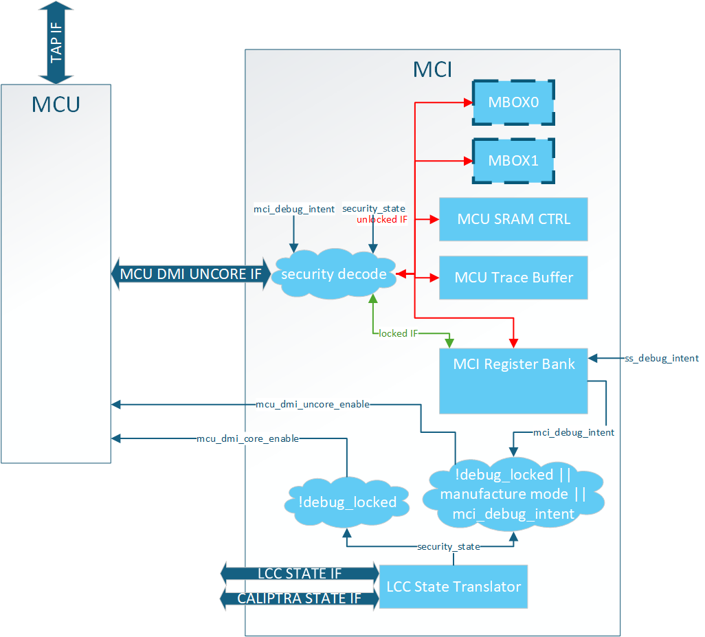

<div align="center">
  
</div>

<h1 align="center"> Caliptra Subsystem Integration Specification v0p8 </h1>

- [Scope](#scope)
  - [Document Version](#document-version)
  - [Related repositories \& specifications](#related-repositories--specifications)
- [Overview](#overview)
- [Calpitra Subsystem High level diagram](#calpitra-subsystem-high-level-diagram)
- [Integration Considerations](#integration-considerations)
  - [Design Considerations](#design-considerations)
  - [Verification Considerations](#verification-considerations)
- [Verification View of Caliptra Subsystem](#verification-view-of-caliptra-subsystem)
  - [Memory Requirements](#memory-requirements)
- [Caliptra Subsystem Top](#caliptra-subsystem-top)
  - [Parameters \& Defines](#parameters--defines)
  - [Interfaces \& Signals](#interfaces--signals)
    - [AXI Interface (axi\_if)](#axi-interface-axi_if)
    - [Caliptra Subsystem Top Interface \& signals](#caliptra-subsystem-top-interface--signals)
  - [Integration Requirements](#integration-requirements)
    - [Clock](#clock)
    - [Reset](#reset)
    - [Power Good Signal](#power-good-signal)
    - [Connecting AXI Interconnect](#connecting-axi-interconnect)
    - [FW Execution Control Connections](#fw-execution-control-connections)
    - [Caliptra Core Reset Control](#caliptra-core-reset-control)
  - [Programming interface](#programming-interface)
  - [Sequences](#sequences)
  - [How to test](#how-to-test)
- [Caliptra Core](#caliptra-core)
- [MCU (Manufacturer Control Unit)](#mcu-manufacturer-control-unit)
  - [Overview](#overview-1)
    - [Parameters \& Defines](#parameters--defines-1)
  - [MCU Integration Requirements](#mcu-integration-requirements)
  - [MCU Programming interface](#mcu-programming-interface)
    - [MCU Linker Script Integration](#mcu-linker-script-integration)
    - [MCU External Interrupt Connections](#mcu-external-interrupt-connections)
- [Fuse Controller](#fuse-controller)
  - [Overview](#overview-2)
  - [Parameters \& Defines](#parameters--defines-2)
  - [Interface](#interface)
  - [Memory Map	/ Address map](#memory-map-address-map)
  - [FC Integration Requirements](#fc-integration-requirements)
  - [Programming interface](#programming-interface-1)
  - [Sequences: Reset, Boot](#sequences-reset-boot)
  - [How to test : Smoke \& more](#how-to-test--smoke--more)
- [Life Cycle Controller](#life-cycle-controller)
  - [Overview](#overview-3)
  - [Parameters \& Defines](#parameters--defines-3)
  - [Interface](#interface-1)
  - [Memory Map / Address Map](#memory-map--address-map)
  - [LC Integration Requirements](#lc-integration-requirements)
  - [Programming Interface](#programming-interface-2)
  - [Sequences: Reset, Boot](#sequences-reset-boot-1)
  - [How to Test: Smoke \& More](#how-to-test-smoke--more)
    - [Smoke Test](#smoke-test)
    - [Functional Tests](#functional-tests)
    - [Advanced Tests](#advanced-tests)
- [MCI](#mci)
  - [Overview](#overview-4)
  - [Parameters \& Defines](#parameters--defines-4)
  - [Interface](#interface-2)
  - [Memory Map	/ Address map](#memory-map-address-map-1)
    - [Top Level Memory Map](#top-level-memory-map)
    - [MCU SRAM Memory Map](#mcu-sram-memory-map)
  - [MCI Integration Requirements](#mci-integration-requirements)
    - [Error Aggregation Connectivity Requirements](#error-aggregation-connectivity-requirements)
    - [Subsystem Internal Fuse Controller Initialization Connectivity Requirements](#subsystem-internal-fuse-controller-initialization-connectivity-requirements)
    - [Subsystem Internal Life Cycle Controller Initialization Connectivity Requirements](#subsystem-internal-life-cycle-controller-initialization-connectivity-requirements)
    - [MCI MCU Connectivity Requirements](#mci-mcu-connectivity-requirements)
    - [MCI Caliptra Core Connectivity Requirements](#mci-caliptra-core-connectivity-requirements)
    - [LCC Gasket Connectivity Requirements](#lcc-gasket-connectivity-requirements)
    - [MCU SRAM Sizing Requirements](#mcu-sram-sizing-requirements)
    - [MCU MBOX SRAM Sizing Requirements](#mcu-mbox-sram-sizing-requirements)
  - [Programming interface](#programming-interface-3)
    - [MCI Register Spec](#mci-register-spec)
    - [MCU Mailbox](#mcu-mailbox)
      - [MCU Mailbox Limited Trusted AXI users](#mcu-mailbox-limited-trusted-axi-users)
      - [Reset](#reset-1)
      - [MCI Debug Lock Status](#mci-debug-lock-status)
      - [MCU to SOC Receiver Flow](#mcu-to-soc-receiver-flow)
      - [SOC Sender to MCU Flow](#soc-sender-to-mcu-flow)
      - [SOC Sender to SOC Receiver Communication Flow (MCU as intermediary)](#soc-sender-to-soc-receiver-communication-flow-mcu-as-intermediary)
    - [MCU JTAG/DMI Access](#mcu-jtagdmi-access)
      - [MCU SRAM JTAG Access](#mcu-sram-jtag-access)
    - [MCU Trace Buffer](#mcu-trace-buffer)
    - [MCU Halt Ack Interface](#mcu-halt-ack-interface)
  - [Sequences : Reset, Boot,](#sequences--reset-boot)
    - [MCI Boot Sequencer](#mci-boot-sequencer)
      - [Breakpoint Flow](#breakpoint-flow)
      - [MCU No ROM Config](#mcu-no-rom-config)
      - [No Caliptra Core Config](#no-caliptra-core-config)
    - [Reset Ordering](#reset-ordering)
    - [MCU FW Update Flows](#mcu-fw-update-flows)
      - [MCU FW Boot Update](#mcu-fw-boot-update)
      - [MCU Hitless FW Update](#mcu-hitless-fw-update)
      - [MCU Warm Reset FW Update](#mcu-warm-reset-fw-update)
    - [Error Flows](#error-flows)
  - [How to test : Smoke \& more](#how-to-test--smoke--more-1)
  - [Other requirements](#other-requirements)
- [I3C core](#i3c-core)
  - [Overview](#overview-5)
  - [Integration Considerations](#integration-considerations-1)
  - [Paratmeters and defines](#paratmeters-and-defines)
  - [Interface](#interface-3)
  - [I3C Integration Requirements](#i3c-integration-requirements)
  - [Programming Sequence](#programming-sequence)
    - [Programming Sequence from AXI Side](#programming-sequence-from-axi-side)
    - [Programming Sequence from GPIO Side](#programming-sequence-from-gpio-side)
  - [How to test : Smoke \& more](#how-to-test--smoke--more-2)
- [Terminology](#terminology)


# Scope 

<span style="color:red">**Disclaimer**: Internal Draft Document
This document is a work in progress and intended for internal use only. It may contain incomplete or preliminary information subject to change. Do not refer to, share, or rely on this document unless explicitly released in its final version. </span>

For Caliptra Subsystem, this document serves as a hardware integration specification. The scope of this document is to assist integrators in the integration of Caliptra Subsystem. It is not intended to serve as a hardware specification or to include micro-architectural details. This document includes Caliptra Subsystem top-level details along with parameters, defines, interfaces, memory map, programming reference, and guidelines on how to test the integration of the design.

## Document Version
<div align="center">

| Date            |   Document Version | Description       |
|-----------------|--------------------|-------------------|
| Jan 31st, 2025  |   v0p8             | Work in progress  |

</div>

## Related repositories & specifications

The components described in this document are either obtained from open-source GitHub repositories, developed from scratch, or modified versions of open-source implementations. Links to relevant documentation and GitHub sources are shared in the following table.

*Table 1: Related specification and repositories*

| IP/Block      | Code (GitHub URL)                                                         | Documentation (URL)                                                           |
|---------------|---------------------------------------------------------------------------|-------------------------------------------------------------------------------|
| Caliptra-SS   | [GitHub - chipsalliance/caliptra-ss](https://github.com/chipsalliance/caliptra-ss)| [Hardware Specification Document](https://github.com/chipsalliance/caliptra-ss/blob/main/docs/CaliptraSSHardwareSpecification.md)
| Caliptra-rtl  | [GitHub - chipsalliance/caliptra-rtl](https://github.com/chipsalliance/caliptra-rtl)      | [Caliptra RTL documentation](https://github.com/chipsalliance/caliptra-rtl/tree/main/docs) |
| Cores-VeeR    | [GitHub - chipsalliance/Cores-VeeR-EL2](https://github.com/chipsalliance/Cores-VeeR-EL2)  | [VeeR EL2 Programmer’s Reference Manual](http://cores-swerv-el2/RISC-V_SweRV_EL2_PRM.pdf%20at%20master%20%C2%B7) |
| I3C-Core      | [GitHub - chipsalliance/i3c-core](https://github.com/chipsalliance/i3c-core)              | [I3C core documentation](https://github.com/chipsalliance/i3c-core?tab=readme-ov-file#i3c-core) |
| Adams Bridge  | [GitHub - chipsalliance/adams-bridge](https://github.com/chipsalliance/adams-bridge)      | [Adams Bridge Documentation](https://github.com/chipsalliance/adams-bridge/tree/main/docs) |

# Overview

The Caliptra Subsystem is designed to provide a robust Root of Trust (RoT) for datacenter-class System on Chips (SoCs), including CPUs, GPUs, DPUs, and TPUs. It integrates both hardware and firmware components to deliver essential security services such as identity establishment, measured boot, and attestation. By incorporating the Caliptra Subsystem, integrators can enhance the security capabilities of their SoCs, providing a reliable RoT that meets industry standards and addresses the evolving security needs of datacenter environments.

# Calpitra Subsystem High level diagram

The following diagram provides a high-level overview of the Caliptra subsystem. It illustrates the key components and their interconnections within the system. For an in-depth understanding of the Caliptra Subystem refer to [Caliptra Subsystem Hardware Specification Document](CaliptraSSHardwareSpecification.md). 


Following high-level diagram helps integrators understand the overall architecture and the relationships between different components within the Caliptra subsystem.


Caliptra Subsystem includes:

  - **Caliptra Core**: The Caliptra Core IP. For more information, see[ Caliptra: A Datacenter System on a Chip (SoC) Root of Trust (RoT)](https://chipsalliance.github.io/Caliptra/doc/Caliptra.html).
  - **MCU (Manufactures Control Unit)**: A microcontroller unit that manages various control tasks within the subsystem.
  - **I3C Core**: An interface for connecting and communicating with I3C devices, which are used for providing streaming boot support and communicates with other I3C host controllers.
  - **Life Cycle Controller**: A component that manages the different stages of the subsystem's lifecycle, including initialization, operation, and shutdown.
  - **Fuse Controller (OTP)**: A one-time programmable memory controller used for storing critical configuration data and security keys.
  - **MCI (Manufacturer Control Interface (for MCU))**: Manages the communication between the processor and the memory components.
  - **Memories**: Various memory components used for storing data and instructions required by the subsystem.

# Integration Considerations

By performing these design and verification tasks, the integrator ensures that the Caliptra Subsystem is properly integrated and can function as intended within the larger system. Several files contain code that may be specific to an integrator's implementation and should be overridden. This overridable code is either configuration parameters with integrator-specific values or modules that implement process-specific functionality. Code in these files should be modified or replaced by integrators using components from the cell library of their fabrication vendor. The following table describes recommended modifications for each file.

| Type | Name | Path |
|------|------|------|
| rtl | Design Top       | [caliptra_ss_top.sv](https://github.com/chipsalliance/caliptra-ss/blob/main/src/integration/rtl/caliptra_ss_top.sv)          |
| tb  | Interconnect Top | [testbench\aaxi4_interconnect.sv](https://github.com/chipsalliance/caliptra-ss/blob/main/src/integration/testbench/aaxi4_interconnect.sv) |
| tb  | Testbench Top    | [testbench\caliptra_ss_top_tb.sv](https://github.com/chipsalliance/caliptra-ss/blob/main/src/integration/testbench/caliptra_ss_top_tb.sv) |

## Design Considerations

1. **Replace the AXI Interconnect**: 
The subsystem utilizes an AXI-based interconnect to facilitate communication between components, with the Caliptra core connecting via an AXI interface. The integrator must replace the default AXI interconnect component with their proprietary interface. This ensures that the subsystem can communicate effectively with the rest of the subsystem components using the integrator's specific interconnect architecture.
2. **Connect the Memories**: The integrator must connect the various memory components required by the subsystem. These memory components are used for storing data and instructions necessary for the operation of the Caliptra subsystem. 
3. **No Changes to Internals**: Integrators are not expected to make any changes to the internals of the design. The focus should be on ensuring proper integration and connectivity of the subsystem components.

## Verification Considerations

1. **Connect the I3C Core GPIO with I3C host driver**: 
The integrator must connect the I3C core (two target I3C devices) to the appropriate driver for the GPIO pins. This connection is crucial for enabling communication with I3C devices, which are used for communication within the subsystem.

# Verification View of Caliptra Subsystem 

Follwing block diagram shows details on verification view of Caliptra Subsystem


<!-- ## Caliptra Subsystem integration requirements (WIP)


The following table describes Caliptra Subsystem integration requirements.

| Block        | Requirement         | Definition of Done       |
|-----------------|---------------------|--------------------------|
| Caliptra Core   | [Caliptra Core Integration Requirements](https://github.com/chipsalliance/caliptra-rtl/blob/main/docs/CaliptraIntegrationSpecification.md#soc-integration-requirements) | Statement of conformance |
| MCU | [MCU Integration Requirements (WIP)](#mcu-integration-requirements-wip) | Statement of conformance |
| I3C | [I3C Integration Requirements](#i3c-integration-requirements) | Statement of conformance |
| MCI | [MCI Integration Requirements](#MCI-Integration-Requirements) | Statement of conformance | MCI Integration requirement
| LC Controller | [LC Integration Requirements](#lc-integration-requirements) | Statement of conformance |
| Fuse Controller | [FC Integration Requirements](#fc-integration-requirements)| Statement of conformance | -->

## Memory Requirements

Caliptra Subsystem required following memory export connected to various memories to function as per the specification. 
| **Memory Category** | **Memory Name**       | **Interface**                        | **Size** | **Access Type** | **Description**                                                                 |
  |---------------------|-----------------------|--------------------------------------|----------|-----------------|---------------------------------------------------------------------------------|
  | **MCU0**            | Instruction ROM       | `mcu_rom_mem_export_if`              | TBD      | Read-Only       | Stores the instructions for MCU0 execution                                      |
  | **MCU0**            | Memory Export         | `cptra_ss_mcu0_el2_mem_export`       | TBD      | Read/Write      | Memory export for MCU0 access                                                   |
  | **MCU0**            | Shared Memory (SRAM)  | `cptra_ss_mci_mcu_sram_req_if`       | TBD      | Read/Write      | Shared memory between MCI and MCU for data storage                              |
  | **MAILBOX**         | MBOX0 Memory          | `cptra_ss_mci_mbox0_sram_req_if`     | TBD      | Read/Write      | Memory for MBOX0 communication                                                  |
  | **MAILBOX**         | MBOX1 Memory          | `cptra_ss_mci_mbox1_sram_req_if`     | TBD      | Read/Write      | Memory for MBOX1 communication                                                  |
  | **Caliptra Core**   | ICCM, DCCM   | `cptra_ss_cptra_core_el2_mem_export` | TBD      | Read/Write      | Interface for the Instruction and Data Closely Coupled Memory (ICCM, DCCM) of the core |
  | **Caliptra Core**   | IFU                   | `cptra_ss_mcu_rom_macro_req_if` | TBD      | Read-Only       | Interface for instruction fetch unit (IFU)                                      |

# Caliptra Subsystem Top

The integration of the Caliptra Subsystem begins with the instantiation of the top-level RTL module, caliptra_ss_top.sv. This module serves as the primary entry point for the subsystem and encapsulates all the logic and components required for the functionality of the Caliptra Root of Trust (RoT). All signals must be connected based on the detailed interface and signal descriptions provided in this document. Ensure adherence to the signal direction, width, and functionality to guarantee proper integration with the host SoC.

## Parameters & Defines

File at path includes parameters and defines for Caliptra Subsystem `src/integration/rtl/caliptra_ss_includes.svh`


## Interfaces & Signals

**IMPORTANT NOTE**: All signals assumed to by synchronous to `cptra_ss_clk_i`.

**Table: Caliptra SS Straps**

| Facing   | Type      | width | Name                                      | Description                              |
|----------|-----------|-------|-------------------------------------------|------------------------------------------|
| External | input     | 32     | `cptra_ss_strap_mcu_lsu_axi_user_i`       | MCU LSU AXI user strap input             |
| External | input     | 32     | `cptra_ss_strap_mcu_ifu_axi_user_i`       | MCU IFU AXI user strap input             |
| External | input     | 32     | `cptra_ss_strap_mcu_sram_config_axi_user_i`       | MCU SRAM Configuration AXI user strap input.             |
| External | input     | 32     | `cptra_ss_strap_mci_soc_config_axi_user_i`       | MCI SOC Configuration AXI user strap input             |
| External | input     | 32     | `cptra_ss_strap_caliptra_dma_axi_user_i`           | Caliptra DMA AXI user strap input                 |
| External | input     | 32     | `cptra_ss_strap_mcu_reset_vector_i`       | MCU reset vector strap input             |
| External | input     | 32     | `cptra_ss_strap_caliptra_base_addr_i`     | Caliptra base address strap input        |
| External | input     | 32     | `cptra_ss_strap_mci_base_addr_i`          | MCI base address strap input             |
| External | input     | 32     | `cptra_ss_strap_recovery_ifc_base_addr_i` | Recovery interface base address strap input |
| External | input     | 32     | `cptra_ss_strap_otp_fc_base_addr_i`       | OTP FC base address strap input          |
| External | input     | 32     | `cptra_ss_strap_uds_seed_base_addr_i`     | UDS seed base address strap input        |
| External | input     | 32     | `cptra_ss_strap_prod_debug_unlock_auth_pk_hash_reg_bank_offset_i` | Prod debug unlock auth PK hash reg bank offset input |
| External | input     | 32     | `cptra_ss_strap_num_of_prod_debug_unlock_auth_pk_hashes_i` | Number of prod debug unlock auth PK hashes input |
| External | input     | 32     | `cptra_ss_strap_generic_0_i`              | Generic strap input 0                    |
| External | input     | 32     | `cptra_ss_strap_generic_1_i`              | Generic strap input 1                    |
| External | input     | 32     | `cptra_ss_strap_generic_2_i`              | Generic strap input 2                    |
| External | input     | 32     | `cptra_ss_strap_generic_3_i`              | Generic strap input 3                    |
| External | input     | 1      | `cptra_ss_debug_intent_i`                 | is a physical presence bit required to initiate the debug unlock flow. For more details, refer to the [Production Debug Unlock Flow](CaliptraSSHardwareSpecification.md#production-debug-unlock-architecture) and [How does Caliptra Subsystem enable manufacturing debug mode?](#how-does-caliptra-subsystem-enable-manufacturing-debug-mode). For SOCs that choose to use these features, this port should be connected to a GPIO|

### AXI Interface (axi_if)

| Signal          | Width                  | Direction (mgr) | Direction (sub) |
|-----------------|------------------------|-----------------|-----------------|
| `araddr`        | AW                     | output          | input           |
| `arburst`       | $bits(axi_burst_e)     | output          | input           |
| `arsize`        | 3                      | output          | input           |
| `arlen`         | 8                      | output          | input           |
| `aruser`        | UW                     | output          | input           |
| `arid`          | IW                     | output          | input           |
| `arlock`        | 1                      | output          | input           |
| `arvalid`       | 1                      | output          | input           |
| `arready`       | 1                      | input           | output          |
| `rdata`         | DW                     | input           | output          |
| `rresp`         | $bits(axi_resp_e)      | input           | output          |
| `rid`           | IW                     | input           | output          |
| `rlast`         | 1                      | input           | output          |
| `rvalid`        | 1                      | input           | output          |
| `rready`        | 1                      | output          | input           |
| `awaddr`        | AW                     | output          | input           |
| `awburst`       | $bits(axi_burst_e)     | output          | input           |
| `awsize`        | 3                      | output          | input           |
| `awlen`         | 8                      | output          | input           |
| `awuser`        | UW                     | output          | input           |
| `awid`          | IW                     | output          | input           |
| `awlock`        | 1                      | output          | input           |
| `awvalid`       | 1                      | output          | input           |
| `awready`       | 1                      | input           | output          |
| `wdata`         | DW                     | output          | input           |
| `wstrb`         | DW/8                   | output          | input           |
| `wvalid`        | 1                      | output          | input           |
| `wready`        | 1                      | input           | output          |
| `wlast`         | 1                      | output          | input           |
| `bresp`         | $bits(axi_resp_e)      | input           | output          |
| `bid`           | IW                     | input           | output          |
| `bvalid`        | 1                      | input           | output          |
| `bready`        | 1                      | output          | input           |


### Caliptra Subsystem Top Interface & signals 

| Facing   | Type      | width | Signal or Interface Name             | Description                              |
|:---------|:----------|:------|:-------------------------------------|:-----------------------------------------|
| External | input     | 1     | `cptra_ss_clk_i`                     | Caliptra subsystem clock input           |
| External | input     | 1     | `cptra_ss_pwrgood_i`                 | Power good signal input                  |
| External | input     | 1     | `cptra_ss_rst_b_i`                   | Reset signal input, active low           |
| External | input     | 1     | `cptra_ss_mci_cptra_rst_b_i`         | Reset signal input for Caliptra Core, active low. See [Caliptra Core Reset Control](#caliptra-core-reset-control) for more details          |
| External | output    | 1     | `cptra_ss_mci_cptra_rst_b_o`         | Reset signal output from MCI for Caliptra Core, active low. See [Caliptra Core Reset Control](#caliptra-core-reset-control) for more details          |
| External | output    | 1     | `cptra_ss_rdc_clk_cg_o`              | Caliptra subsystem clock gated clock for RDC. [Clock Control](#clock)         |
| External | output    | 1     | `cptra_ss_rst_b_o`                   | Caliptra subsystem reset aligned for RDC crossing [Reset Control](#reset)         |
| External | axi_if    | na    | `cptra_ss_cptra_core_s_axi_if_w_sub`       | Caliptra core AXI write sub-interface          |
| External | axi_if    | na    | `cptra_ss_cptra_core_s_axi_if_r_sub`       | Caliptra core AXI read sub-interface          |
| External | axi_if    | na    | `cptra_ss_cptra_core_m_axi_if_w_mgr`       | Caliptra core AXI write manager interface      |
| External | axi_if    | na    | `cptra_ss_cptra_core_m_axi_if_r_mgr`       | Caliptra core AXI read manager interface      |
| External | axi_if    | na    | `cptra_ss_mci_s_axi_if_w_sub`              | Caliptra Subsystem MCI AXI write sub-interface |
| External | axi_if    | na    | `cptra_ss_mci_s_axi_if_r_sub`              | Caliptra Subsystem MCI AXI read sub-interface |
| External | axi_if    | na    | `cptra_ss_mcu_rom_s_axi_if_w_sub`          | Caliptra Subsystem MCU ROM AXI write sub-interface |
| External | axi_if    | na    | `cptra_ss_mcu_rom_s_axi_if_r_sub`          | Caliptra Subsystem MCU ROM AXI read sub-interface |
| External | axi_if    | na    | `cptra_ss_mcu_lsu_m_axi_if_w_mgr`          | Caliptra Subsystem MCU LSU AXI write manager interface |
| External | axi_if    | na    | `cptra_ss_mcu_lsu_m_axi_if_r_mgr`          | Caliptra Subsystem MCU LSU AXI read manager interface |
| External | axi_if    | na    | `cptra_ss_mcu_ifu_m_axi_if_w_mgr`          | Caliptra Subsystem MCU IFU AXI read manager interface |
| External | axi_if    | na    | `cptra_ss_mcu_ifu_m_axi_if_r_mgr`          | Caliptra Subsystem MCU IFU AXI read manager interface |
| External | axi_if    | na    | `cptra_ss_mcu_sb_m_axi_if_w_sub`              | Caliptra Subsystem MCU System Bus AXI write sub-interface |
| External | axi_if    | na    | `cptra_ss_mcu_sb_m_axi_if_r_sub`              | Caliptra Subsystem MCU System Bus AXI read sub-interface |
| External | axi_if    | na    | `cptra_ss_i3c_s_axi_if_w_sub`              | Caliptra Subsystem I3C AXI write sub-interface |
| External | axi_if    | na    | `cptra_ss_i3c_s_axi_if_r_sub`              | Caliptra Subsystem I3C AXI read sub-interface |
| External | input     | na    | `cptra_ss_lc_axi_wr_req_i`           | LC controller AXI write request input    |
| External | output    | na    | `cptra_ss_lc_axi_wr_rsp_o`           | LC controller AXI write response output  |
| External | input     | na    | `cptra_ss_lc_axi_rd_req_i`           | LC controller AXI read request input     |
| External | output    | na    | `cptra_ss_lc_axi_rd_rsp_o`           | LC controller AXI read response output   |
| External | input     | na    | `cptra_ss_otp_core_axi_wr_req_i`     | OTP controller AXI write request input   |
| External | output    | na    | `cptra_ss_otp_core_axi_wr_rsp_o`     | OTP controller AXI write response output |
| External | input     | na    | `cptra_ss_otp_core_axi_rd_req_i`     | OTP controller AXI read request input    |
| External | output    | na    | `cptra_ss_otp_core_axi_rd_rsp_o`     | OTP controller AXI read response output  |
| External | input     | 256   | `cptra_ss_cptra_obf_key_i`           | Caliptra core obfuscation key input      |
| External | input     | `CLP_CSR_HMAC_KEY_DWORDS` | `cptra_ss_cptra_csr_hmac_key_i` | Caliptra core CSR HMAC key input |
| External | input     | 1     | `cptra_ss_cptra_core_jtag_tck_i`     | JTAG clock input                         |
| External | input     | 1     | `cptra_ss_cptra_core_jtag_tms_i`     | JTAG TMS input                           |
| External | input     | 1     | `cptra_ss_cptra_core_jtag_tdi_i`     | JTAG TDI input                           |
| External | input     | 1     | `cptra_ss_cptra_core_jtag_trst_n_i`  | JTAG reset input, active low             |
| External | output    | 1     | `cptra_ss_cptra_core_jtag_tdo_o`     | JTAG TDO output                          |
| External | output    | 1     | `cptra_ss_cptra_core_jtag_tdoEn_o`   | JTAG TDO enable output                   |
| External | output    | 125   | `cptra_ss_cptra_generic_fw_exec_ctrl_o` | Generic firmware execution control output |
| External | output    | 1     | `cptra_ss_cptra_generic_fw_exec_ctrl_2_mcu_o` | Generic firmware execution control bit 2 from Caliptra output |
| External | input    | 1     | `cptra_ss_cptra_generic_fw_exec_ctrl_2_mcu_i` | Generic firmware execution control bit 2 for MCU input |
| External | output    | 1     | `cptra_ss_all_error_fatal_o` | Caliptra SS fatal error |
| External | output    | 1     | `cptra_ss_all_error_non_fatal_o` | Caliptra SS non-fatal error |
| External | input     | na    | `cptra_ss_lc_ctrl_jtag_i`            | LC controller JTAG request input         |
| External | output    | na    | `cptra_ss_lc_ctrl_jtag_o`            | LC controller JTAG response output       |
| External | interface | na    | `cptra_ss_cptra_core_el2_mem_export` | Caliptra core EL2 memory export interface |
| External | interface | na    | `mcu_rom_mem_export_if`              | MCU ROM memory export interface          |
| External | output    | 1     | `cptra_ss_cptra_core_mbox_sram_cs_o` | Mailbox SRAM chip select output          |
| External | output    | 1     | `cptra_ss_cptra_core_mbox_sram_we_o` | Mailbox SRAM write enable output         |
| External | output    | `CPTRA_MBOX_ADDR_W` | `cptra_ss_cptra_core_mbox_sram_addr_o` | Mailbox SRAM address output |
| External | output    | `CPTRA_MBOX_DATA_AND_ECC_W` | `cptra_ss_cptra_core_mbox_sram_wdata_o` | Mailbox SRAM write data output |
| External | input     | `CPTRA_MBOX_DATA_AND_ECC_W` | `cptra_ss_cptra_core_mbox_sram_rdata_i` | Mailbox SRAM read data input |
| External | output    | 1     | `cptra_ss_cptra_core_imem_cs_o`      | Instruction memory chip select output    |
| External | output    | `CALIPTRA_IMEM_ADDR_WIDTH` | `cptra_ss_cptra_core_imem_addr_o` | Instruction memory address output |
| External | input     | `CALIPTRA_IMEM_DATA_WIDTH` | `cptra_ss_cptra_core_imem_rdata_i` | Instruction memory read data input |
| External | input     | 1     | `cptra_ss_cptra_core_bootfsm_bp_i`   | Boot FSM breakpoint input                |
| External | output    | 1     | `cptra_ss_cptra_core_etrng_req_o`    | External TRNG request output             |
| External | input     | 4     | `cptra_ss_cptra_core_itrng_data_i`   | Internal TRNG data input                 |
| External | input     | 1     | `cptra_ss_cptra_core_itrng_valid_i`  | Internal TRNG valid input                |
| External | interface | na    | `cptra_ss_mci_mcu_sram_req_if`       | MCI MCU SRAM request interface           |
| External | interface | na    | `cptra_ss_mci_mbox0_sram_req_if`     | MCI mailbox 0 SRAM request interface     |
| External | interface | na    | `cptra_ss_mci_mbox1_sram_req_if`     | MCI mailbox 1 SRAM request interface     |
| External | output    | 1     | `cptra_ss_soc_mcu_mbox0_data_avail`  | MCU Mailbox0 data available output            |
| External | output    | 1     | `cptra_ss_soc_mcu_mbox1_data_avail`  | MCU Mailbox1 data available output            |
| External | interface | na    | `cptra_ss_mcu0_el2_mem_export`       | MCU0 EL2 memory export interface         |
| External | input     | 64    | `cptra_ss_mci_generic_input_wires_i` | Generic input wires for MCI              |
| External | input     | 1     | `cptra_ss_mcu_no_rom_config_i`       | No ROM configuration input               |
| External | input     | 1     | `cptra_ss_mci_boot_seq_brkpoint_i`   | MCI boot sequence breakpoint input       |
| External | input     | 1     | `cptra_ss_lc_Allow_RMA_or_SCRAP_on_PPD_i`     | Allow RMA or SCRAP on PPD input                   |
| External | input     | 1     | `cptra_ss_FIPS_ZEROIZATION_PPD_i`    | Zeroization request with PPD input       |
| External | output     | na     | `caliptra_ss_life_cycle_steady_state_o`    | Life-cycle state broadcasted by fuse macro for any additional SOC specific use cases       |
| External | output    | 64    | `cptra_ss_mci_generic_output_wires_o` | Generic output wires for MCI            |
| External | input     | 1     | `cptra_ss_mcu_jtag_tck_i`            | MCU JTAG clock input                     |
| External | input     | 1     | `cptra_ss_mcu_jtag_tms_i`            | MCU JTAG TMS input                       |
| External | input     | 1     | `cptra_ss_mcu_jtag_tdi_i`            | MCU JTAG TDI input                       |
| External | input     | 1     | `cptra_ss_mcu_jtag_trst_n_i`         | MCU JTAG reset input, active low         |
| External | output    | 1     | `cptra_ss_mcu_jtag_tdo_o`            | MCU JTAG TDO output                      |
| External | output    | 1     | `cptra_ss_mcu_jtag_tdoEn_o`          | MCU JTAG TDO enable output               |
| External | input     | 1     | `cptra_ss_i3c_scl_i`                 | I3C clock input                          |
| External | input     | 1     | `cptra_ss_i3c_sda_i`                 | I3C data input                           |
| External | output    | 1     | `cptra_ss_i3c_scl_o`                 | I3C clock output                         |
| External | output    | 1     | `cptra_ss_i3c_sda_o`                 | I3C data output                          |
| External | output    | 1     | `cptra_ss_sel_od_pp_o`               | Select open-drain push-pull output       |
| External | inout     | 1     | `cptra_ss_i3c_scl_io`                | I3C clock bidirectional                  |
| External | inout     | 1     | `cptra_ss_i3c_sda_io`                | I3C data bidirectional                   |
| External | input     | 64    | `cptra_ss_cptra_core_generic_input_wires_i` | Generic input wires for Caliptra core |
| External | input     | 1     | `cptra_ss_cptra_core_scan_mode_i`    | Caliptra core scan mode input            |
| External | output    | 1     | `cptra_error_fatal`                  | Fatal error output                       |
| External | output    | 1     | `cptra_error_non_fatal`              | Non-fatal error output                   |
| External | output    | 1     | `ready_for_fuses`                    | Ready for fuses output                   |
| External | output    | 1     | `ready_for_mb_processing`            | Ready for mailbox processing output      |
| External | output    | 1     | `mailbox_data_avail`                 | Mailbox data available output            |
| External | output    | 1     | `cptra_ss_mcu_halt_status_o`         | MCU halt status                          |
| External | output    | 1     | `cptra_ss_mcu_halt_status_i`         | MCU halt status input used by MCI        |
| External | output    | 1     | `cptra_ss_mcu_halt_ack_o`            | MCU halt ack                             |
| External | output    | 1     | `cptra_ss_mcu_halt_ack_i`            | MCU halt ack input used by MCI           |
| External | output    | 1     | `cptra_ss_mcu_halt_req_o`            | MCU halt request                         |

## Integration Requirements

### Clock

The `cptra_ss_clk_i` signal is the primary clock input for the Caliptra Subsystem. This signal must be connected to a 200 MHz system clock to ensure proper operation.

  - **Signal Name** `cptra_ss_clk_i`
  - **Required Frequency** 200 MHz
  - **Clock Source** Must be derived from the SoC’s clock generation module or a stable external oscillator.
  - **Integration Notes**
     1. Verify that the SoC or system-level clock source provides a stable 200 MHz clock.
     2. The clock signal must be properly buffered if necessary to meet the subsystem's setup and hold timing requirements.
     3. If a different frequency is required, ensure that a clock divider or PLL is used to generate the 200 MHz clock before connection.

The `cptra_ss_rdc_clk_cg_o` output clock is a clock gated version of `cptra_ss_clk_i`. It is clock gated whenever `cptra_ss_rst_b` is asserted to avoid RDC issues from the warm reset domain to the cold reset domain/memories. 

  - **Signal Name** `cptra_ss_rdc_clk_cg_o`
  - **Required Frequency** Same as `cptra_ss_clk_i`.
  - **Clock Source** Caliptra SS MCI clock gater
  - **Integration Notes**
     1. MCU SRAM and MCU MBOX memrories shall be connected to this clock to avoid RDC issues.
     2. Clock shall be paired with `cptra_ss_rst_b_o` to properly avoid RDC issues.

### Reset

The `cptra_ss_reset_n` signal is the primary reset input for the Caliptra Subsystem. It must be asserted low to reset the subsystem and de-asserted high to release it from reset. Ensure that the reset is held low for a sufficient duration (minimum of 2 clock cycles at 200 MHz) to allow all internal logic to initialize properly.

   - **Signal Name** `cptra_ss_reset_n`
   - **Active Level** Active-low (`0` resets the subsystem, `1` releases reset)
   - **Reset Type** Synchronous with the `cptra_ss_clk_i` signal
   - **Integration Notes**
     - The reset signal must be synchronized to the 200 MHz `cptra_ss_clk_i` clock to prevent metastability issues.
     - If the reset source is asynchronous, a synchronizer circuit must be used before connecting to the subsystem.
     - During SoC initialization, assert this reset signal until all subsystem clocks and required power domains are stable.
     - It is **illegal** to only toggle `cptra_ss_reset_n` until both Caliptra and MCU have received at least one FW update. Failure to follow this requirement could cause them to execute out of an uninitialized SRAM.
     - SOC shall toggle `cptra_ss_reset_b` only after `cptra_ss_mcu_halt_status_o` is asserted to guarantee MCU is idle and to prevent any RDC issues.

The `cptra_ss_rst_b_o` is a delayed version of `cptra_ss_reset_n` to ensure `cptra_ss_rdc_clk_cg_o` is gated before reset is asserted. This reset is needed for the purpose of RDC between the warm reset domain and the cold reset/memory domain.

   - **Signal Name** `cptra_ss_rst_b_o`
   - **Active Level** Active-low (`0` resets the subsystem, `1` releases reset)
   - **Reset Type** Synchronous with the `cptra_ss_rdc_clk_cg_o` signal
   - **Integration Notes**
     1. SOCs shall use this reset for any memory logic connected to MCU SRAM or MCU MBOX to avoid RDC corruption of the memories.
     2. It is recommended to be used for SOC AXI interconnect if it is on the same reset domain as Caliptra SS to avoid RDC issues. 
     3. Logic shall paired with `cptra_ss_rdc_clk_cg_o` to avoid RDC issues.

### Power Good Signal 

The `cptra_ss_pwrgood_i` signal serves as an indicator of stable power for the Caliptra Subsystem. When asserted (`1`), it confirms that power is stable and the subsystem can operate normally. When deasserted (`0`), the signal triggers a **hard reset** of the subsystem. Deassertion must be synchronized to `cptra_ss_clk_i` to avoid metastability issues.

  - **Signal Name** `cptra_ss_pwrgood_i`
  - **Active Level** Active-high (`1` indicates stable power, `0` triggers reset)
  - **Assertion Type** Asynchronous  
  - **Deassertion Type** Synchronous to `cptra_ss_clk_i`  
  - **Integration Notes**  
    1. Ensure `cptra_ss_pwrgood_i` is properly generated by the power management unit or system power controller.
    2. Since assertion is asynchronous, it must be immediately driven high once power is stable.
    3. Use a synchronizer to properly align deassertion with `cptra_ss_clk_i` to prevent glitches.
    4. If `cptra_ss_pwrgood_i` remains low, the Caliptra Subsystem will remain in a hard reset state.

### Connecting AXI Interconnect

Integrator must connect, following list of manager and subordinates to axi interconnect. 

- List of Manager connections to AXI interconnect.

  | Manager AXI If Name           | Description                                                       |
  |-------------------------------|-------------------------------------------------------------------|
  | `cptra_ss_mcu_lsu_m_axi_if`   | Manager interface for MCU Load/Store Unit (LSU)                   |
  | `cptra_ss_mcu_ifu_m_axi_if`   | Manager interface for MCU Instruction Fetch Unit (IFU)            |
  | `cptra_ss_mci_m_axi_if`       | Manager interface for Manufacturer Control Interface (for MCU) (MCI)           |
  | `cptra_ss_cptra_core_m_axi_if`| Manager interface for the Caliptra Core AXI transactions          |

- Subordinate Address Map (reference only) / List of sub connected to Interconnect

  - The following address map is a **suggested address** map for subordinates for the subsystem design. It details the memory layout and the connections between different components within the Caliptra subsystem.

    | Start Address    | End Address      | Subordinate | Name        | Description                |
    |------------------|------------------|-------|-------------------|---------------------------|
    | 64'h1000_0000    | 64'h1000_FFFF    | 0     | imem              | MCU Instruction memory    |
    | 64'h2000_4000    | 64'h2000_4FFF    | 1     | I3c               | I3C Core                  |
    | 64'h8000_0000    | 64'h80FF_FFFF    | 2     | n/a               | Reserved                  |
    | 64'h3000_0000    | 64'h3FFF_FFFF    | 3     | SoC IFC (tb)      | SoC / Testbench           |
    | 64'h2100_0000    | 64'h2200_0000    | 4     | MCI               | Manufacturer Control Interface (for MCU) |
    | 64'h7000_0000    | 64'h7000_01FF    | 5     | Fuse Ctrl         | Fuse Controller           |
    | 64'h7000_0200    | 64'h7000_03FF    | 6     | Fuse Ctrl Core    | Fuse Controller Core      |
    | 64'h7000_0400    | 64'h7000_05FF    | 7     | Life Cycle Ctrl   | Life Cycle Controller     |

- Follwing are the header files path for the below suggested address map. These files would be useful in defining the address map using the given RDL Files. 

  - `caliptra-ss\src\integration\rtl\soc_address_map.h`
  - `caliptra-ss\src\integration\rtl\soc_address_map_defines.svh `

### FW Execution Control Connections

FW Execute Control is typically controlled by Caliptra. This means `cptra_ss_cptra_generic_fw_exec_ctrl_2_mcu_o` should be looped back and directly connected to `cptra_ss_cptra_generic_fw_exec_ctrl_2_mcu_i`. If the SOC decided to not use Caliptra Core, the SOC must drive `cptra_ss_cptra_generic_fw_exec_ctrl_2_mcu_i` the same way Caliptra Core drives this signal.

1. On same reset at MCI 
2. Synchronous to MCI clock domain
3. 1 indicates FW patch is valid in the MCU SRAM
4. 0 indicates FW patch is invalid and will request MCU to reset itself
See Hitless Update Flow to understand exactly when this signal shall be set/cleared in the hitless FW flow.

### Caliptra Core Reset Control

Typically Caliptra reset is directly controlled by MCI. This means `cptra_ss_mci_cptra_rst_b_o` is directly looped back to  `cptra_ss_mci_cptra_rst_b_i`. 

If an SOC wants to keep Caliptra in reset they can tie off `cptra_ss_mci_cptra_rst_b_i` and not user  `cptra_ss_mci_cptra_rst_b_o`.

If an SOC wants to modify Caliptra reset they can do so by adding additional logic to the above signals. 

**NOTE**: Caliptra SS RDC and CDC are only evaluated when the MCI control is looped back to Caliptra. Any modification to this reset control requires a full RDC and CDC analysis done by the SOC integration team. 

## Programming interface

There are two primary programming avenues to interface with the Caliptra Subsystem:

1. **MCU Firmware**
   - **Description**: This method involves programming the Microcontroller Unit (MCU) to execute firmware.
   - **Details**: For more information on how to program the MCU and execute firmware via the MCU, please refer to the [MCU Programming Interface](#) documentation.

2. **Caliptra Firmware**
   - **Description**: This method involves programming the Caliptra Core to execute firmware.
   - **Details**: For more information on how to program and execute Caliptra Core firmware, please refer to the [Caliptra Programming Interface](#) documentation.

## Sequences

**Reset Sequence**: 
  - De-assert `cptra_ss_rst_b_i` after the primary clock (`clk_i`) stabilizes.

## How to test

Reference tests are available at `caliptra-ss\src\integration\test_suites` 

| Test Suite Name                | Description                                                                 |
|--------------------------------|-----------------------------------------------------------------------------|
| `MCU_HELLO_WORLD`              | Runs a basic "Hello World" program on the MCU to verify basic operation.    |
| `MCU_CPTRA_BRINGUP`            | Tests the bring-up sequence of the MCU in the Caliptra Subsystem.           |
| `MCU_DCCM_ACCESS`              | Validates access to the Data Closely Coupled Memory (DCCM) by the MCU.      |
| `MCU_FUSE_CTRL_BRINGUP`        | Tests the bring-up sequence of the Fuse Controller by the MCU.              |
| `MCU_LMEM_EXE`                 | Tests execution from the Local Memory (LMEM) by the MCU.                    |
| `I3C_SMOKE`                    | Performs basic smoke tests on the I3C interface to ensure proper functionality. |
| `FUSE_PROV_WITH_LC_CTRL`       | Tests fuse provisioning in conjunction with the Lifecycle Controller.       |
| `CALIPTRA_SS_LC_CTRL_BRINGUP`  | Tests the bring-up sequence of the Lifecycle Controller.                    |
| `CALIPTRA_SS_LC_CTRL_ST_TRANS` | Validates state transitions of the Lifecycle Controller.                    |


# Caliptra Core

Follow the link for 
[Caliptra Core Integration Specification](https://github.com/chipsalliance/caliptra-rtl/blob/main/docs/CaliptraIntegrationSpecification.md)

# MCU (Manufacturer Control Unit)

## Overview

MCU is encapsulates VeeR EL2 core that includes an iCache, a dedicated DCCM, and AXI interfaces with separate AXI USER IDs to ROM and MCI. For more details refer to [RISCV VeeR-EL2 Overview](https://github.com/chipsalliance/Cores-VeeR-EL2/blob/main/docs/source/overview.md)

### Parameters & Defines

> Add the path to MCU parameters and defines.
src/riscv_core/veer_el2/rtl/defines/css_mcu0_common_defines.vh
src/riscv_core/veer_el2/rtl/defines/css_mcu0_el2_param.vh
src/riscv_core/veer_el2/rtl/defines/css_mcu0_el2_pdef.vh
src/riscv_core/veer_el2/rtl/defines/defines.h

## MCU Integration Requirements

There are two main requirements for the MCU integration. 
  
- **Ensure Proper Memory Mapping**  
  - The memory layout must match the physical memory configuration of the SoC.
  - If modifications are required, update the base addresses and section placements accordingly.

- **Code Placement & Execution:**  
  - The `.text` section starts at `0x80000000` and should be mapped to executable memory.
  - The `_start` entry point must be correctly set to align with boot ROM execution.

- **Enabling Programming interface.**
  - Please refer to section [MCU Programming Interface](#MCU-Programming-interface) for details on reference linker file for the MCU bringup. 
 
- **Data and Stack Placement Considerations**  
  - The `.bss` and `.data` sections should be properly initialized by the runtime startup code.
  - The stack must be correctly set up before function execution to avoid memory corruption.

- **I/O Mapped Data Handling**  
  - The `.data.io` section at `0x21000410` is used for memory-mapped peripherals.  
  - Ensure correct access permissions are configured in the memory controller.

## MCU Programming interface

### MCU Linker Script Integration

This linker script defines the memory layout for the **MCU** firmware. It specifies the placement of various sections, ensuring proper memory mapping and execution flow.

**Example** Linker File can be found at : [ integration/test_suite/libs/riscv_hw_if/link.ld  ](https://github.com/chipsalliance/caliptra-ss/blob/main/src/integration/test_suites/libs/riscv_hw_if/link.ld)

By following this linker script configuration, the **validation** firmware can be correctly mapped and executed within the **Caliptra Subsystem**.

The following memory regions are defined and must be adhered to during integration:

- **Memory Region Allocation**

  - **DCCM (Data Closely Coupled Memory)**
    - **Base Address:** `0x50000000`
    - **Section:** `.dccm`
    - **Usage:** Used for tightly coupled memory operations.
    - **End Symbol:** `_dccm_end` (marks the end of this region).

  - **Data and Read-Only Sections**
    - **Base Address:** `0x21200000`
    - **Sections:** `.data`, `.rodata`, `.srodata`, `.sbss`
    - **Usage:** Stores initialized data, read-only data, and small uninitialized sections.
    - **End Symbol:** `_data_end`

  - **BSS (Uninitialized Data Section)**
    - **Base Address:** `0x21210000`
    - **Section:** `.bss`
    - **Usage:** Stores uninitialized global and static variables.
    - **End Symbol:** `_bss_end`

  - **Stack Configuration**
    - **Alignment:** 16-byte boundary
    - **Size:** `0x1000` (4 KB)
    - **Usage:** Defines the stack memory location for runtime operations.

  - **I/O Mapped Data Section**
    - **Base Address:** `0x21000410`
    - **Section:** `.data.io`
    - **Usage:** Used for memory-mapped I/O operations.

### MCU External Interrupt Connections

| External interrupt vector                | Description                                                                 |
|--------------------------------|-----------------------------------------------------------------------------|
|  1              | MCI interrupts see [MCI interrupt spec](https://github.com/chipsalliance/caliptra-ss/blob/main/docs/CaliptraSSHardwareSpecification.md#mci-interrupts) and [MCI interrupt registers](https://chipsalliance.github.io/caliptra-ss/main/regs/?p=soc.mci_top.mci_reg.intr_block_rf)    |
|  2              | I3C Interrupts    |
| 255:3 | Exposed to SOC via `cptra_ss_mcu_ext_int`|

# Fuse Controller

## Overview

The Fuse Controller is a core component in the secure infrastructure of the system, responsible for managing the fuses and ensuring the integrity, consistency, and secure storage of sensitive data. It provides essential interfaces for direct fuse programming. The Fuse Controller interacts closely with the Lifecycle Controller (LC), FUSE macros, MCI, and Caliptra Core.

For an in-depth understanding of the Fuse Controller's functionality, including its programming flow, refer to [Caliptra Subsystem Hardware Specification Document](CaliptraSSHardwareSpecification.md).

## Parameters & Defines

| Parameter                | Default                        | Description                                         |
|--------------------------|--------------------------      |-----------------------------------------------------|
| `AlertAsyncOn`           | 5                              | Enables asynchronous transitions on alerts.         |
| `MemInitFile`            | `""`                           | Hex file to initialize the OTP macro, including ECC.|


## Interface

| Facing     | Type       | Width   | Name                          | External Name in SoC Level        | Description                                            |
|------------|------------|-------  |-------------------------------|-----------------------------------|--------------------------------------------------------|
| External   | Input      | 1       | `clk_i`                       | `cptra_ss_clk_i`                  | Fuse Controller clock input.                          |
| External   | Input      | 1       | `rst_ni`                      | `cptra_ss_rst_b_i`                | Reset signal input, active low.                       |
| Internal   | Input      | 1       | `FIPS_ZEROIZATION_CMD_i`      |                                   | Fuse Zeroization signal controlled by MCI             |
| External   | interface  | 1       | `core_axi_wr_req`             | `cptra_ss_otp_core_axi_wr_req_i`  | AXI write request.                         |
| External   | interface  | 1       | `core_axi_wr_rsp`             | `cptra_ss_otp_core_axi_wr_rsp_o`  | AXI write response.                          |
| External   | interface  | 1       | `core_axi_rd_req`             | `cptra_ss_otp_core_axi_rd_req_i`  | AXI read request.                          |
| External   | interface  | 1       | `core_axi_rd_rsp`             | `cptra_ss_otp_core_axi_rd_rsp_o`  | AXI read response.                           |
| Internal   | Output     | 1       | `intr_otp_operation_done_o`   |                                   | Indicates that the OTP operation has completed.                                                  |
| Internal   | Output     | 1       | `intr_otp_error_o`            |                                   | OTP error interrupt output (to be connected to MCI).                                             |
| Internal   | Output     | 5       | `alerts`                      |                                   | Alert signals for critical errors.                                                               |
| Internal   | Input      | 1       | `pwr_otp_i`                   |                                   | OTP initialization request from the power manager.                                               |
| Internal   | Output     | Struct  | `pwr_otp_o`                   |                                   | OTP response to the power manager.                                                               |
| Internal   | Input      | Struct  | `lc_otp_vendor_test_i`        |                                   | Vendor test request input from LC Controller.                                                    |
| Internal   | Output     | Struct  | `lc_otp_vendor_test_o`        |                                   | Vendor test response to LC Controller.                                                           |
| Internal   | Input      | Struct  | `lc_otp_program_i`            |                                   | Lifecycle OTP programming request from LC Controller.                                            |
| Internal   | Output     | Struct  | `lc_otp_program_o`            |                                   | Lifecycle OTP programming response to LC Controller.                                             |
| Internal   | Input      | 1       | `lc_dft_en_i`                 |                                   | DFT enable input from LC Controller.                                                             |
| Internal   | Input      | 1       | `lc_escalate_en_i`            |                                   | Escalation enable input from LC Controller.                                                      |
| Internal   | Input      | 1       | `lc_check_byp_en_i`           |                                   | Clock bypass check enable input from LC Controller.                                              |
| Internal   | Output     | Struct  | `otp_lc_data_o`               |                                   | Lifecycle broadcasted data output to LC Controller.                                              |
| Internal   | Output     | Struct  | `otp_broadcast_o`             |                                   | FUSE broadcast output to Caliptra-core. This port broadcasts UDS-seed and Field-entropy-seed.    |


## Memory Map	/ Address map


See [Fuse Controller Register Map](../src/fuse_ctrl/doc/registers.md).

---

## FC Integration Requirements

**Connectivity, Clock & Reset, Constraints & Violations**

1. **Connectivity**:
   - The Fuse Controller must interface seamlessly with the Fuse Macros, ensuring proper ECC support during programming and read operations.
   - All AXI interfaces (`core_axi_wr_req`, `core_axi_rd_req`) must follow the protocol specifications.
   - Inputs like `lc_otp_program_i` and `pwr_otp_i` should connect properly to the Lifecycle Controller (LC) and MCI respectively.
   - Alerts must propagate correctly to the system's alert manager for error handling.

2. **Constraints & Violations**:
   - Any access to fuses must be gated by the `FUSE_CTRL_DIRECT_ACCESS_REGWEN` bit to prevent unauthorized writes.
   - There are some fuses that can be programmed only by Caliptra-Core. Therefore, each AXI write should follow the access permission rule defined by `access_control_table ` in `src/fuse_ctrl/rtl/otp_ctrl_pkg.sv`.
   - Timeout conditions during consistency checks (`FUSE_CTRL_CHECK_TIMEOUT`) should trigger appropriate alerts.
   - Errors like invalid data, ECC failures, or access violations should raise alerts via the `alerts` signal.

3. **Scan Path Exclusions**:
   - Ensure that secret fuse items (UDS and Field-Entropy) and its corresponding flip-flops are not a parth of scan path. These secrets are broadcasted with this input port: `otp_broadcast_o`. Therefore, this port, its propagated signals, and its driver signals must not be scannable.
---
## Direct Access Interface

Fuse macros has to be programmed via the Direct Access Interface, which is comprised of the following CSRs:

CSR Name                             | Description
-------------------------------------|------------------------------------
[`DIRECT_ACCESS_WDATA_0`](../src/fuse_ctrl/doc/registers.md#direct_access_wdata) | Low 32bit word to be written.
[`DIRECT_ACCESS_WDATA_1`](../src/fuse_ctrl/doc/registers.md#direct_access_wdata) | High 32bit word to be written.
[`DIRECT_ACCESS_RDATA_0`](../src/fuse_ctrl/doc/registers.md#direct_access_rdata) | Low 32bit word that has been read.
[`DIRECT_ACCESS_RDATA_1`](../src/fuse_ctrl/doc/registers.md#direct_access_rdata) | High 32bit word that has been read.
[`DIRECT_ACCESS_ADDRESS`](../src/fuse_ctrl/doc/registers.md#direct_access_address) | byte address for the access.
[`DIRECT_ACCESS_CMD`](../src/fuse_ctrl/doc/registers.md#direct_access_cmd)     | Command register to trigger a read or a write access.
[`DIRECT_ACCESS_REGWEN`](../src/fuse_ctrl/doc/registers.md#direct_access_regwen)  | Write protection register for DAI.

## Initialization

The OTP controller initializes automatically upon power-up and is fully operational by the time the processor boots.
The only initialization steps that SW should perform are:

1. Check that the OTP controller has successfully initialized by reading [`STATUS`](../src/fuse_ctrl/doc/registers.md#status). I.e., make sure that none of the ERROR bits are set, and that the DAI is idle ([`STATUS.DAI_IDLE`](../src/fuse_ctrl/doc/registers.md#status)).
    - Choose whether the periodic [background checks](#partition-checks) shall be subject to a timeout by programming a nonzero timeout cycle count to [`CHECK_TIMEOUT`](registers.md#check_timeout).
      In this case, the [`CHECK_TIMEOUT`](registers.md#check_timeout) register must be set before the [`INTEGRITY_CHECK_PERIOD`](registers.md#integrity_check_period) and [`CONSISTENCY_CHECK_PERIOD`](registers.md#consistency_check_period) registers (see next point).
    - Enable periodic [background checks](#partition-checks) by programming nonzero mask values to [`INTEGRITY_CHECK_PERIOD`](registers.md#integrity_check_period) and [`CONSISTENCY_CHECK_PERIOD`](registers.md#consistency_check_period).
    - It is recommended to lock down the background check registers via [`CHECK_REGWEN`](registers.md#check_regwen), once the background checks have been set up

If needed, one-off integrity and consistency checks can be triggered via [`CHECK_TRIGGER`](../src/fuse_ctrl/doc/registers.md#check_trigger).
If this functionality is not needed, it is recommended to lock down the trigger register via [`CHECK_TRIGGER_REGWEN`](../src/fuse_ctrl/doc/registers.md#check_trigger_regwen).

Later on during the boot process, SW may also choose to block read access to the SW managed partitions via the associated partition lock registers, e.g. [`CREATOR_SW_CFG_READ_LOCK`](../src/fuse_ctrl/doc/registers.md#creator_sw_cfg_read_lock) or [`OWNER_SW_CFG_READ_LOCK`](../src/fuse_ctrl/doc/registers.md#owner_sw_cfg_read_lock).

## Programming interface
The Fuse Controller (FC) programming interface is designed to manage lifecycle states, handle fuses with ECC support, and ensure secure interactions with the fuse macros. A key component in this architecture is the Fuse Controller Filter RTL. This module intercepts and verifies the fuse programming sequence by checking that all parts of the transaction originate from the same authorized source. In doing so, the filter guarantees that fuse provisioning is performed in an atomic manner.

Atomic fuse provisioning means that only one entity can initiate the programming sequence at a time. The entire sequence—data write, address write, and command write—must complete successfully. If any phase fails or if an inconsistency is detected (for example, if the AXI user ID changes between phases), the operation is aborted, and a cold reset is required before any new programming attempt can be made.

The access control table, which defines allowed fuse address ranges along with the corresponding authorized AXI user IDs. See `access_control_table ` in `src/fuse_ctrl/rtl/otp_ctrl_pkg.sv`.

Below are the key operations supported by the programming interface:

1. **Direct Access Interface (DAI)**:
   - **Registers**:
     - `FUSE_CTRL_DIRECT_ACCESS_CMD`: Specifies the operation (`FUSE_CTRL_CMD_DAI_WRITE` for write, `FUSE_CTRL_CMD_DAI_READ` for read).
     - `FUSE_CTRL_DIRECT_ACCESS_ADDRESS`: Specifies the fuse memory address to access.
     - `FUSE_CTRL_DIRECT_ACCESS_WDATA_0`: Write data (32-bit granularity).
     - `FUSE_CTRL_DIRECT_ACCESS_WDATA_1`: Write data for 64-bit operations.
     - `FUSE_CTRL_DIRECT_ACCESS_RDATA_0`: Read data (32-bit granularity).
     - `FUSE_CTRL_DIRECT_ACCESS_RDATA_1`: Read data for 64-bit operations.
   - **Procedure**:
     - Write the address to `FUSE_CTRL_DIRECT_ACCESS_ADDRESS`.
     - For write operations:
       - Populate `FUSE_CTRL_DIRECT_ACCESS_WDATA_0` (and `FUSE_CTRL_DIRECT_ACCESS_WDATA_1` for 64-bit operations).
     - Set the command in `FUSE_CTRL_DIRECT_ACCESS_CMD`.
     - Wait for the operation to complete by polling the `DAI_IDLE` bit in `FUSE_CTRL_STATUS`.
   - **ECC Support**:
     - ECC is automatically applied during programming to ensure data integrity.

2. **Digest Calculation**:
   - Used to lock a partition after programming is complete.
   - **Registers**:
     - `FUSE_CTRL_DIRECT_ACCESS_CMD`: Use command `0x4` for digest calculation.
     - `FUSE_CTRL_DIRECT_ACCESS_ADDRESS`: Partition base address.
   - **Procedure**:
     - Write the partition base address to `FUSE_CTRL_DIRECT_ACCESS_ADDRESS`.
     - Trigger the digest calculation command (`0x4`) in `FUSE_CTRL_DIRECT_ACCESS_CMD`.
     - Poll the `DAI_IDLE` bit in `FUSE_CTRL_STATUS` to confirm the operation is complete.

## Readout Sequence

A typical readout sequence looks as follows:

  - Check whether the DAI is idle by reading the [`STATUS`](../src/fuse_ctrl/doc/registers.md#status) register.
  - Write the byte address for the access to [`DIRECT_ACCESS_ADDRESS`](../src/fuse_ctrl/doc/registers.md#direct_access_address).  
    Note that the address is aligned with the granule, meaning that either 2 or 3 LSBs of the address are ignored, depending on whether the access granule is 32 or 64bit.
  - Trigger a read command by writing 0x1 to [`DIRECT_ACCESS_CMD`](../src/fuse_ctrl/doc/registers.md#direct_access_cmd).
  - Poll the [`STATUS`](../src/fuse_ctrl/doc/registers.md#status) until the DAI state goes back to idle.  
    Alternatively, the `otp_operation_done` interrupt can be enabled up to notify the processor once an access has completed.
  - If the status register flags a DAI error, additional handling is required.
  - If the region accessed has a 32bit access granule, the 32bit chunk of read data can be read from [`DIRECT_ACCESS_RDATA_0`](../src/fuse_ctrl/doc/registers.md#direct_access_rdata).  
    If the region accessed has a 64bit access granule, the 64bit chunk of read data can be read from the [`DIRECT_ACCESS_RDATA_0`](../src/fuse_ctrl/doc/registers.md#direct_access_rdata) and [`DIRECT_ACCESS_RDATA_1`](../src/fuse_ctrl/doc/registers.md#direct_access_rdata) registers.
  - Go back to the first step and repeat until all data has been read.

The hardware will set [`DIRECT_ACCESS_REGWEN`](../src/fuse_ctrl/doc/registers.md#direct_access_regwen) to 0x0 while an operation is pending in order to temporarily lock write access to the CSRs registers.

## Sequences: Reset, Boot

1. **Reset Sequence**:
   - De-assert `rst_ni` after the primary clock (`clk_i`) stabilizes.
   - Verify reset state by reading `FUSE_CTRL_STATUS`. All errors in the status register should be 0.
   - Ensure Fuse Macros are in their default state after reset.

2. **Boot Sequence**:
   - Initialize Fuse Macros by programming essential fuses using the programming interface.
   - Perform a full integrity check by triggering `FUSE_CTRL_CHECK_TRIGGER` and ensure the system is error-free before proceeding.
   - Validate readiness by checking the `FUSE_CTRL_STATUS` register.


## How to test : Smoke & more
The smoke test focuses on ensuring basic functionality and connectivity of the FC & LCC.
**TODO** More details will be provided once FC is ready to test.

## Generating the Fuse Partitions

The configurable parts of the `fuse_ctrl`, specifically the fuse map and register interface,
are bootstrapped through a separate script `./tools/scripts/fuse_ctrl_script/gen_fuse_ctrl_partitions.py`.
For a detailed breakdown of the design rationale behind the script as well as execution instructions,
refer to [Fuse Map Generation Script](./../tools/scripts/fuse_ctrl_script/gen_fuse_ctrl_partitions.md).

# Life Cycle Controller

## Overview

The LC Controller (Lifecycle Controller) is a critical component of the Caliptra Subsystem, responsible for securely managing the lifecycle states of the chip. The LC Controller interacts with other subsystems such as the Fuse Controller, MCI, AXI interconnect, and JTAG TAP to enforce secure transitions, validate tokens, and generate error conditions. Additionally, it implements escalation mechanisms to respond to security breaches, enabling the chip to enter secure states like SCRAP.

For a detailed description of the Lifecycle Controller's architecture, design, and operational flow, refer to [Caliptra Subsystem Hardware Specification Document](CaliptraSSHardwareSpecification.md).

## Parameters & Defines

Parameter                        | Default (Max)  | Description
---------------------------------|----------------|---------------
`AlertAsyncOn`                   | 2'b11          |
`IdcodeValue`                    | `32'h00000001` | Idcode for the LC JTAG TAP.
`RndCnstLcKeymgrDivInvalid`      | (see RTL)      | Diversification value used for all invalid life cycle states.
`RndCnstLcKeymgrDivTestUnlocked` | (see RTL)      | Diversification value used for the TEST_UNLOCKED* life cycle states.
`RndCnstLcKeymgrDivDev`          | (see RTL)      | Diversification value used for the DEV life cycle state.
`RndCnstLcKeymgrDivProduction`   | (see RTL)      | Diversification value used for the PROD/PROD_END life cycle states.
`RndCnstLcKeymgrDivRma`          | (see RTL)      | Diversification value used for the RMA life cycle state.
`SecVolatileRawUnlockEn`         | 1'b1           | Enables Volatile TEST_UNLOCKED0 state transition infra

## Interface


Facing      | Type       | width  | Name                  |  External Name in SoC Level         | Description   |
------------|:-----------|:-------|:----------------------|:------------------------------------|:-------       |
External    |input       |   1    | `clk_i`               | `cptra_ss_clk_i`                    | clock         |
External    |input       |   1    | `rst_ni`              | `cptra_ss_rst_b_i`                  | LC controller reset input, active low|
External    |input       |   1    | `Allow_RMA_or_SCRAP_on_PPD`    | `cptra_ss_lc_Allow_RMA_or_SCRAP_on_PPD_i`    | This is GPIO strap pin. This pin should be high until LC completes its state transition to RMA or SCRAP.|
External    |interface   |   1    | `axi_wr_req`          | `cptra_ss_lc_axi_wr_req_i`          | LC controller AXI write request input |
External    |interface   |   1    | `axi_wr_rsp`          | `cptra_ss_lc_axi_wr_rsp_o`          | LC controller AXI write response output|
External    |interface   |   1    | `axi_rd_req`          | `cptra_ss_lc_axi_rd_req_i`          | LC controller AXI read request input |
External    |interface   |   1    | `axi_rd_rsp`          | `cptra_ss_lc_axi_rd_rsp_o`          | LC controller AXI read response output |
External    |interface   |   1    | `jtag_i`              | `cptra_ss_lc_ctrl_jtag_i`           | LC controller JTAG input ports  |
External    |interface   |   1    | `jtag_o`              | `cptra_ss_lc_ctrl_jtag_o`           | LC controller JTAG output ports|
External    |input       |   1    | `scan_rst_ni`         | `cptra_ss_lc_ctrl_scan_rst_ni_i`    | LC controller scan reset input, active low|
Internal    |output      |   3    | `alerts`              |                                     | Alert outputs generated by LCC if there is an error due to one of following: register bus, lc state and fuse programming |
External    |input       |   1    | `esc_scrap_state0`    | `cptra_ss_lc_esclate_scrap_state0_i`| An escalation input that leads LC controller to enter into SCRAP mode  |
External    |input       |   1    | `esc_scrap_state1`    | `cptra_ss_lc_esclate_scrap_state1_i`| An escalation input that eads LC controller to enter into SCRAP mode  |
Internal    |input       |   1    | `pwr_lc_i`            |                                     | A power initilization input coming from MCI |
Internal    |struct      |   1    | `pwr_lc_o`            |                                     | Two outputs show: (i) LC controller can accept a request, (ii) LC is initialized. |
Internal    |struct      |   1    | `lc_otp_vendor_test_o`|                                     | Access to fuse controller for vendor test partitions |
Internal    |struct      |   1    | `lc_otp_vendor_test_i`|                                     | Access to fuse controller for vendor test partitions |
Internal    |struct      |   1    | `lc_otp_program_o`    |                                     | Programming interface to fuse controller to update LCC state and couter |
Internal    |struct      |   1    | `lc_otp_program_i`    |                                     | Programming interface from fuse controller to update LCC state and couter |
Internal    |struct      |   1    | `otp_lc_data_i`       |                                     | Broadcasted values from the fuse controller |
Internal    |output      |   1    | `lc_dft_en_o`         |                                     | DFT enable to MCI |
Internal    |output      |   1    | `lc_hw_debug_en_o`    |                                     | CLTAP enable to MCI |
Internal    |output      |   1    | `lc_escalate_en_o`    |                                     | Broadcast signal to promote esclation in SoC |
Internal    |output      |   1    | `lc_check_byp_en_o`   |                                     | External clock status delivery signal to fuse controller |
External    |output      |   1    | `lc_clk_byp_req_o`    | `cptra_ss_lc_clk_byp_req_o`         | A request port to swtich from LCC clock to external clock |
External    |input       |   1    | `lc_clk_byp_ack_i`    | `cptra_ss_lc_clk_byp_ack_i`         | Acknowledgment signal to indicate external clock request is accepted              |
Internal    |input       |   1    | `otp_device_id_i`     |                                     | Unused port              |
Internal    |input       |   1    | `otp_manuf_state_i`   |                                     | Unused port               |
Internal    |output      |   1    | `hw_rev_o`            |                                     | Unused port              |


## Memory Map / Address Map

See [Life-cycle Controller Register Map](../src/lc_ctrl/rtl/lc_ctrl.rdl).

## LC Integration Requirements

**Connectivity, Clock & Reset, Constraints & Violations**

1. **Connectivity**:
   - Ensure proper routing of all signals to avoid conflicts with other modules.
   - Interfaces like `jtag` and `axi` must adhere to the defined protocol specifications.
   - Escalation signals (`esc_scrap_state0` and `esc_scrap_state1`) brings LC controller into temporal SCRAP mode (Escalation state) and therefore needs to be connected to a dedicated controller.
   - `Allow_RMA_or_SCRAP_on_PPD` needs to be tied 0 if it is not being used. Otherwise, it might break LC controller's internal FSM.
   - Avoid glitches on `Allow_RMA_or_SCRAP_on_PPD` and escalation inputs (`esc_scrap_state0`, `esc_scrap_state1`) that could cause unintended transitions.
   - Verify that all output signals, including alerts, remain within the expected ranges under normal operation.

## Programming Interface

The LC Controller's programming interface facilitates lifecycle state transitions, secure token authentication, and system initialization. Below are the key programming steps:

1. **Initialization**:
   - Ensure the LC Controller is ready by polling the `LC_CTRL_STATUS_OFFSET` register for the `READY_MASK` bit.
   - Verify initialization is complete using the `INIT_MASK` bit in the same register.
   - Corresponding fuse partitions need to be provisioned in order to perform state transitions

2. **Lifecycle State Transitions**:
   - Claim the transition mutex by writing `0x96` (MuBi8True) to `LC_CTRL_CLAIM_TRANSITION_IF_OFFSET` and polling until the value is correctly latched.
   - Set the desired next lifecycle state by writing to `LC_CTRL_TRANSITION_TARGET_OFFSET`.
   - Write the 128-bit transition token (if required) into the `LC_CTRL_TRANSITION_TOKEN_*_OFFSET` registers.
   - Trigger the state transition by writing `0x1` to `LC_CTRL_TRANSITION_CMD_OFFSET`.
   - Poll the `LC_CTRL_STATUS_OFFSET` register to monitor for successful state transition or detect errors such as token errors, OTP errors, or RMA strap violations.
   - Each TEST_UNLOCKED state has its own TOKEN (see See [Fuse Memory Map](../src/fuse_ctrl/doc/otp_ctrl_mmap.md)).
   - During a state transition, an asserted reset or zeorization command can cause permanent life-cycle state corruption. 

3. **Token Validation**:
   - For conditional state transitions, provide the transition token before the transition request.
   - Toke Format is illustrated with a python implementation:
```python
# value = 0x318372c87790628a05f493b472f04808
# data = value.to_bytes(16, byteorder='little')
# custom = 'LC_CTRL'.encode('UTF-8')
# shake = cSHAKE128.new(data=data, custom=custom)
# shake output is 0x4c9ca068a68474d526e7d8a0233d5aad

# To unlock a state having the shake condition above, the LCC needs
# to get the following input set:
TOKEN_write(LC_CTRL_TRANSITION_TOKEN_3_OFFSET, 0x318372c8)
TOKEN_write(LC_CTRL_TRANSITION_TOKEN_1_OFFSET, 0x7790628a)
TOKEN_write(LC_CTRL_TRANSITION_TOKEN_2_OFFSET, 0x05f493b4)
TOKEN_write(LC_CTRL_TRANSITION_TOKEN_0_OFFSET, 0x72f04808)

```

4. **RMA and SCRAP Strap Handling**:
   - Ensure the `Allow_RMA_or_SCRAP_on_PPD` GPIO strap is asserted for RMA or SCRAP transitions. Transitions without this strap will fail with an appropriate status in the `LC_CTRL_STATUS_OFFSET` register.

## Sequences: Reset, Boot

1. **Reset Sequence**:
   - Bring the LC Controller out of reset by asserting and de-asserting `rst_ni` after clock stabilization.
   - Perform a reset sequence after each state transition routine

2. **Boot Sequence**:
   - Enable MCI that intilaize the LC controller.
   - Verify successful initialization by reading `LC_CTRL_STATUS_OFFSET`.

4. **Error Scenarios**:
   - Test scenarios where invalid tokens, Fuse errors, or missing RMA straps are injected to validate error handling and system recovery mechanisms.

## How to Test: Smoke & More

### Smoke Test
1. **Basic Connectivity**:
   - Verify the LC Controller responds to read and write operations on key registers (e.g., `LC_CTRL_STATUS_OFFSET`, `LC_CTRL_CLAIM_TRANSITION_IF_OFFSET`).

2. **Basic Initialization**:
   - Check that the `READY_MASK` and `INIT_MASK` bits in `LC_CTRL_STATUS_OFFSET` transition to the expected values during initialization.

3. **Lifecycle Transition**:
   - Perform a single state transition (e.g., `RAW` to `TEST_UNLOCKED0`)

### Functional Tests
1. **Full Lifecycle Sequence**:
   - Run all lifecycle transition functions and validate each transition step via the status register and debug messages.

2. **Error Injection**:
   - Test token errors by providing invalid tokens during a transition request.
   - Simulate OTP errors by corrupting OTP data or configuration.
   - Test RMA transitions with and without the `Allow_RMA_or_SCRAP_on_PPD` GPIO strap.
   - Test SCRAP transitions with and without the `Allow_RMA_or_SCRAP_on_PPD` GPIO strap.

3. **Boundary Testing**:
   - Verify correct operation under boundary conditions, such as repeated transitions, simultaneous requests, or rapid reset sequences.

### Advanced Tests
1. **Stress Test**:
   - Perform rapid transitions through multiple lifecycle states to validate system robustness.
   - Simulate power interruptions during critical operations.

2. **Integration Tests**:
   - Verify interaction with other modules such as the fuse controller and MCI during state transitions.


# MCI 

## Overview
Manufacturer Control Interface provides the following features for Caliptra SS:

* Boot Sequencer for the SS

    * FC Init

    * LCC Init

    * MCU Reset

        * Hitless Update Capability

* Caliptra Reset

* MCU SRAM

* MCU Trace Buffer

* MCU watchdog timer

* Mailboxes

* LCC State Translator for Caliptra Core

* Error Aggregation

* Register Bank for MCU/SOC

The Boot Sequence is what brings the subsystem up. It will do fuse controller and life cycle controller initialization. It then brings up MCU and Caliptra based on the breakpoint and no rom config input pins. Once MCI has done the subsystem bring up, it provides other functionality like the MCU SRAM, DAM for MCU, Error aggregation for the SS and more.

If there is an issue within MCI whether it be the Boot Sequencer or another component. The SOC can utilize the breakpoint and DMI capability to halt the Boot Sequencer before bring up the MCU and do targeted register accesses via the DMI port which is connected to the MCU.

*MCI Block Diagram*:


## Parameters & Defines

*Note: Additional parameter limitations can be seen in the Requirements section* 

**Table: AXI Integration Parameters**

| Facing | Parameter name | Location | Description |
| :---- | :---- | :---- | :---- |
| External | `AXI_ADDR_WIDTH` | mci\_top | AXI address width |
| External | `AXI_DATA_WIDTH` | mci\_top | AXI data width |
| External | `AXI_USER_WIDTH` | mci\_top | AXI user width |
| External | `AXI_ID_WIDTH` | mci\_top | AXI ID width |

**Table: MCU SRAM Integration Parameters**

| Facing | Parameter name | Location | Description |
| :---- | :---- | :---- | :---- |
| External | `MCU_SRAM_SIZE_KB`  | mci\_top | Size of MCU SRAM in KB. i.e. Min: 4 Max: 2048(2MB) |

**Table: MCI Boot Sequencer Integration Parameters**

| Facing | Parameter name | Location | Description |
| :---- | :---- | :---- | :---- |
| External | `MIN_MCU_RST_COUNTER_WIDTH` | mci\_top | Size of MCU reset counter which determines the min reset time for the MCU. When the timer overflows MCU can be brought up. |

**Table: MCI MBOX Integration Parameters**

| Facing   | Parameter name              | Location | Description                                                                 |
|:-------- |:----------------------------|:---------|:-------------------------------------------------------------------------- |
| External    | `MCU_SET_MBOX0_AXI_USER_INTEG`   | mci_top  | Determines if VALID_AXI_USER will be used by MCI                                                                   |
| External    | `MCU_MBOX0_VALID_AXI_USER`   | mci_top  | MBOX0 AXI user list enabled by SET_MBOX0_AXI_USER_INTEG                                                                   |
| External | `MCU_MBOX0_SIZE_KB`         | mci_top | Size of MBOX0 SRAM. If set to 0 the entire MBOX0 is removed from MCI. Min: 0 Max: 2048 (2MB) |
| External    | `MCU_SET_MBOX1_AXI_USER_INTEG`   | mci_top  | Determines if VALID_AXI_USER will be used by MCI                                                                   |
| External    | `MCU_MBOX1_VALID_AXI_USER`   | mci_top  | MBOX1 AXI user list enabled by SET_MBOX0_AXI_USER_INTEG                                                                   |
| External | `MCU_MBOX1_SIZE_KB`         | external | Size of MBOX1 SRAM. If set to 0 the entire MBOX1 is removed from MCI. Min: 0 Max: 2048 (2MB) |

**Table: MCI Integration Definitions**

| Defines | Defines file | Description |
| :---- | :---- | :---- |
| NONE DEFINED |  |  |

## Interface

*Note: Additional interface connection requirements/guidance can be seen in the Requirements section* 

*Note: Any port listed as “STATIC” must be stable before mci\_pwrgood is asserted. If the signal changes value after mci\_pwrgood assertion will cause functional issues in MCI*

*Note: Internal means the signal is not directly exposed to the SOC. External means it is directly exposed for SOC to consume and connect.* 

*Note: If a signal (like the clock) is combined with other IPs it is still listed as Ext.* 

*Note: If a signal stays in the SS but will need SOC connection (AXI interfaces) due to the SS not instantiating a component (like an AXI interconnect) it is listed as Ext because the SOC will need to connect.*

*Note: Any port with known internal and external connections (i.e. agg\_error\_fatal) will have External/Internal with note in a different section on which ports are reserved for internal vs external use.*

**Table: MCI Clocks**

| Facing | Type | Width | Name | Clock | Description |
| :---- | :---- | :---- | :---- | :---- | :---- |
| External | Input | 1 | `clk` |  | MCI Clock. Connected to subsystem top level clk input.|
| Internal | Output | 1 | `mcu_clk_cg` |  | MCU clock gated when MCU in reset for RDC. |
| External | Output | 1 | `cptra_ss_rdc_clk_cg` |  | MCI SS clock gated when caliptra reset asserted for RDC. Should be used whenever their is a Warm reset ->  cold reset crossing in design. Must be paired with `cptra_ss_rst_b_o` reset for proper gating. Exposed to SOC as `cptra_ss_rdc_clk_cg_o`|

**Table: MCI Resets**

| Facing   | Type   | Width | Name          | Description                                                                 |
|:-------- |:------ |:----- |:------------- |:-------------------------------------------------------------------------- |
| External | Input  | 1     | `mci_pwrgood` |  Active high power good indicator. Deepest reset domain for MCI.             |
| External | Input  | 1     | `mci_rst_b`   |  Active low asynchronous reset for MCI.                                      |
| External | Input  | 1     | `cptra_ss_rst_b_o`   |  Active low asyn reset for Caliptra SS. Delayed version of `mci_rst_b` in order to gate `cptra_ss_rdc_clk_cg` and `mcu_clk_cg` before reset assertions for RDC purposes. When `scan_mode` is set, this is directly controlle  by `mci_rst_b`                                     |
| Internal | Output | 1     | `mcu_rst_b`   | Reset for MCU. When `scan_mode` is set, this is directly controlled by `mci_rst_b`. |
| Internal | Output | 1     | `cptra_rst_b` | Reset for Caliptra. When `scan_mode` is set, this is directly controlled by `mci_rst_b`. |

**Table: MCI AXI Interface**

| Facing   | Type      | Width | Name          | Description                      |
|:-------- |:--------- |:----- |:------------- |:-------------------------------- |
| External | interface |       | `s_axi_w_if`  | AXI subordinate write interface. Exposed to SOC as `cptra_ss_mci_s_axi_if_w_sub`|
| External | interface |       | `s_axi_r_if`  | AXI subordinate read interface. Exposed to SOC as `cptra_ss_mci_s_axi_if_r_sub`|


**Table: MCI Straps**

| Facing   | Type   | Width          | Name                      | Description                                                   |
|:-------- |:------ |:-------------- |:------------------------- | :------------------------------------------------------------- |
| External | Input  | `AXI_USER_WIDTH` | `strap_mcu_lsu_axi_user`   | AXI USER for MCU’s load/store unit. Exposed to SOC via `cptra_ss_strap_mcu_lsu_axi_user_i`                     |
| External | Input  | `AXI_USER_WIDTH` | `strap_mcu_ifu_axi_user`   | AXI USER for MCU’s instruction fetch unit.  Exposed to SOC via `cptra_ss_strap_mcu_ifu_axi_user_i`                  |
| External | Input  | `AXI_USER_WIDTH` | `strap_mcu_sram_config_axi_user`       | AXI USER populating MCU FW Image in MCU SRAM.  Exposed to SOC via `cptra_ss_strap_mcu_sram_config_axi_user_i`                                      |
| External | Input  | `AXI_USER_WIDTH` | `strap_mci_soc_config_axi_user`       | AXI USER with MCU privilages in MCI reg. Use for Romless config. 0x0: Disable 0xFFFFFFFF: Debug (all AXI users get this privilage). Exposed to SOC via `cptra_ss_strap_mci_soc_config_axi_user_i`                                        |
| External | Input  | 32             | `strap_mcu_reset_vector`  | Default reset vector for MCI. Can be overridden via MCI register write. Exposed to SOC via `cptra_ss_strap_mcu_reset_vector_i`|
| External | Input  | 32             | `ss_debug_intent`  | Debug intent |


**Table: MCI MISC Interface**

| Facing            | Type      | Width | Name                  |  Description                                                                                                                                            |
|:------------------|:----------|:------|:----------------------|:-------------------------------------------------------------------------------------------------------------------------------------------------------|
| Internal/External | input | 1     | `mcu_sram_fw_exec_region_lock`     | `FW_EXEC_CTRL[2]` from Caliptra or SOC to indicate if there is a new MCU FW update avaialbe. Exposed to SOC as `cptra_ss_cptra_generic_fw_exec_ctrl_2_mcu_i`|
| External | input | 64     | `mci_generic_input_wires`     | Generic input wires SOC can use to interrupt MCU. Exposed to SOC as `cptra_ss_mci_generic_input_wires_i`|
| External | output | 64     | `mci_generic_output_wires`     | Generic output wires MCU can use to control SOC logic. Exposed to SOC as `cptra_ss_mci_generic_output_wires_o` |
| External | input | 1     | `mcu_no_rom_config`     | 1: No rom config enabled 0: No rom config. Exposed to SOC as `cptra_ss_mcu_no_rom_config_i` |

**Table: MCI MCU Interface**
| Facing            | Type      | Width | Name                  |  Description                                                                                                                                            |
|:------------------|:----------|:------|:----------------------|:-------------------------------------------------------------------------------------------------------------------------------------------------------|
| Internal | output | 32     | `mcu_reset_vector`     | MCU reset vector |
| Internal | output | 1     | `mcu_cpu_halt_req_o`     | MCU halt request, used by MCI boot FSM. Exposed as ouput to SOC as `cptra_ss_mcu_halt_req_o` |
| Internal | input | 1     | `mcu_cpu_halt_ack_i`     | MCU halt ack, used by MCI boot FSM. Exposed as output to SOC as `cptra_ss_mcu_halt_ack_i`|
| External/Internal | input | 1     | `mcu_cpu_halt_status_i`     | MCU halt status, used by MCI boot FSM, and exposed as input to SOC as `cptra_ss_mcu_halt_status_i` |
| Internal | output | 1     | `mcu_dmi_core_enable`     | MCU DMI Core Enable |
| Internal | output | 1     | `mcu_dmi_uncore_enable`     | MCU DMI Uncore Enable |
| Internal | input | 1     | `mcu_dmi_uncore_en`     | MCU DMI Uncore Interface Enable |
| Internal | input | 1     | `mcu_dmi_uncore_wr_en`     | MCU DMI Uncore Interface Write Enable |
| Internal | input | 7     | `mcu_dmi_uncore_addr`     | MCU DMI Uncore Interface Address|
| Internal | input | 32    | `mcu_dmi_uncore_wdata`     | MCU DMI Uncore Interface Write Data |
| Internal | input | 32    | `mcu_dmi_uncore_rdata`     | MCU DMI Uncore Interface Read Data |
| Internal | input | 1     | `mcu_dmi_active`     | MCU DMI Interface Active |
| Internal | input | 1     | `mcu_dmi_active`     | MCU DMI Interface Active |
| Internal | input | 32 | `mcu_trace_rv_i_insn_ip     ` | MCU trace instruction|
| Internal | input | 32 | `mcu_trace_rv_i_address_ip  ` | MCU trace address |
| Internal | input | 1 | `mcu_trace_rv_i_valid_ip    ` | MCU trace valid |
| Internal | input | 1 | `mcu_trace_rv_i_exception_ip` | MCU trace exception|
| Internal | input | 5 | `mcu_trace_rv_i_ecause_ip   ` | MCU trace exception cause|
| Internal | input | 1 | `mcu_trace_rv_i_interrupt_ip` | MCU trace interrupt|
| Internal | input | 32 | `mcu_trace_rv_i_tval_ip     ` | MCU trace exception trap value |

**Table: MCI Errors and Interrupts Interface**

| Facing | Type | Width | Name |  Description |
| :---- | :---- | :---- | :---- | :---- |
| Internal/External | input | 32 | `agg_error_fatal` | Fatal errors from other Caliptra SS IPs or other SOC entities fed into MCI’s aggregate error infrastructure and will be reflected for SOC consumption via the all\_error\_fatal output wire of MCI |
| Internal/External | input | 32 | `agg_error_non_fatal` | Non-fatal errors from other Caliptra SS IPs or other SOC entities fed into MCI’s aggregate error infrastructure and will be reflected for SOC consumption via the all\_error\_non\_fatal output wire of MCI. |
| External | Output | 1 | `all_error_fatal` | Fatal error interrupt for SOC consumption. Exposed as `cptra_ss_all_error_fatal_o` to SOC |
| External | Output | 1 | `all_error_non_fatal` | Non-fatal error interrupt for SOC consumption. Exposed as `cptra_ss_all_error_non_fatal_o` to SOC |
| Internal | Output | 1 | `mcu_timer_int` | MCU’s standard RISC-V MTIMER interrupt. |
| Internal | Output | 1 | `mci_intr` | MCI interrupt indication for MCU. This will be set when an unmasked interrupt occurs within MCI. This is a level interrupt and must be cleared by MCU firmware.     |
| Internal | Output | 1 | `nmi_intr` | Non-maskable interrupt for MCU. This is connected to the watchdog (WDT) timer within MCI and will be asserted when the wdt is in cascade mode and both timers timeout. It can only be cleared by asserting mci\_rst\_b. This interrupt is also fed into the all\_error\_fatal infrastructure for SOC consumption.  |
| Internal | Output | 32 | `mci_nmi_vector` | Non-maskable interrupt vector for MCU. This is controllable only by MCU FW.  |
| Internal | input | 1 | `cptra_mbox_data_avail` | Cptra mailbox data is available for SOC/MCU. Fed into MCI interrupts for MCU.  |
| Internal | input | 1 | `intr_otp_operation_done` | FC OTP operation done interrupt fed into MCI interrupts for MCU.  |
| Internal | output | 1 | `soc_mcu_mbox0_data_avail` | MCU MBOX0 data available for SOC.  |
| Internal | output | 1 | `soc_mcu_mbox1_data_avail` | MCU MBOX0 data available for SOC.  |


**Table: MCI LCC Bring Up Interface**

| Facing   | Type   | Width | Name          |  Description                                                                 |
|:-------- |:------ |:----- |:------------- |:-------------------------------------------------------------------------- |
| Internal | Input  | 1     | `lc_done`     | LCC initialization done response used by MCU boot sequencer to move to the next state. |
| Internal | Output | 1     | `lc_init`       | LCC initialization request asserted by the MCU boot sequencer after every MCI reset.  |

**Table: MCI FC Bring Up Interface**

| Facing   | Type   | Width | Name          | Description                                                                 |
|:-------- |:------ |:----- |:------------- |:-------------------------------------------------------------------------- |
| Internal | Input  | 1     | `fc_opt_done` | FC initialization done response used by MCU boot sequencer to move to the next state. |
| Internal | Output | 1     | `fc_opt_init`   | FC initialization request asserted by the MCU boot sequencer after every MCI reset.  |

**Table: MCU SRAM Interface**

| Facing   | Type      | Width                     | Name                     | Description                                                                      |
|:-------- |:--------- |:------------------------- |:------------------------ |:--------------------------------------------------------------------------------- |
| External | interface | `mci_mcu_sram_req_if`     | Data width is DATA+ECC. Address width shall be wide enough to address entire SRAM.     | MCU SRAM memory interface.                                                        |
| External | interface | `mci_mbox0_sram_req_if`   | Data width is DATA+ECC. Address width shall be wide enough to address entire SRAM.    | MBOX0 SRAM memory interface.                                                      |
| External | interface | `mci_mbox1_sram_req_if`   | Data width is DATA+ECC. Address width shall be wide enough to address entire SRAM.    | MBOX1 SRAM memory interface.                                                      |

**Table: MCI LCC Gasket Interface**

| Facing   | Type   | Width  | Name                                    | Description |
|:---------|:-------|:-------|:----------------------------------------|:-----------|
| Internal | Input  | Struct | `from_lcc_to_otp_program_i`             | These are the LCC port lists that program corressponding fuse partition for LCC     |
| Internal | Input  | Struct | `lc_dft_en_i`                           | LCC decoding signal, see LCC section   |
| Internal | Input  | Struct | `lc_hw_debug_en_i`                      | LCC decoding signal, see LCC section   |
| Internal | Input  | Struct | `from_otp_to_lcc_program_i`             | These ports comes from fuse partitions and show LCC's non-volatile state   |
| Internal | Input  | 1      | `ss_dbg_manuf_enable_i`                 | Caliptra Core enables manuf debug with this  |
| Internal | Input  | 64     | `ss_soc_dbg_unlock_level_i`             | Caliptra Core enables prod debug with this. Since there are multiple debug levels, the debug level is one-hot encoded to this port  |
| External | Output | 1      | `SOC_DFT_EN`                            | Masked LCC decoding signal, see LCC section    |
| External | Output | 1      | `SOC_HW_DEBUG_EN`                       | Masked LCC decoding signal, see LCC section  |
| Internal | Output | Struct | `security_state_o`                      | Caliptra Core's security state  |
| External | Input  | 1      | `FIPS_ZEROIZATION_PPD_i`                | Physical pin to trigger zeroization   |
| Internal | Output | 1      | `FIPS_ZEROIZATION_CMD_o`                | Masked zeroization command signal   |

## Memory Map	/ Address map

### Top Level Memory Map

| Internal Block | Address Offset (from base address) | End Address| 
| :---- | :---- | :---- |
| CSRs | 0x0 | 0x1FFF | 
| MCU Trace Buffer | 0x10000 | 0x1001F |
| Mailbox 0 | 0x400000| 0x7FFFFF |
| Mailbox 1 | 0x800000| 0xBFFFFF |
| MCU SRAM | 0xC00000 | MCU SRAM BASE + MCU_SRAM_SIZE |

### MCU SRAM Memory Map

MCU SRAM is split into 2 sections:

1. Updatable Execution Region  
2. Protected Data Region

The two regions have different access protection. The size of the regions is dynamically changed via the `FW_SRAM_EXEC_REGION_SIZE` register in 4KB increments.


**Table: MCU SRAM Regions**

| MCU SRAM Region | Address Start Offset |
| :---- | :---- |
| Updatable Execution Region | 0x0 |
| Protected Region | FW\_SRAM\_EXEC\_REGION\_SIZE \* 1024 \* 4 |

*NOTE: FW\_SRAM\_EXEC\_REGION\_SIZE is base 0 meaning the minimum size for the Updatable Execution Region is 4KB.*

*NOTE: If FW\_SRAM\_EXEC\_REGION\_SIZE is the size of the SRAM, there is no protected Region.* 

## MCI Integration Requirements

- **Connectivity, Clock & Reset, Constraints & Violations etc**

  - **AXI Parameters and AXI Interface Parameter Alignment**

    Due to SystemVerilog limitations MCI exposed both AXI parameters and AXI interfaces that are parameterized. Parameters between all AXI interface and the MCI AXI parameters must be consistent. 

  - **AXI DATA\_WIDTH Limitation**

    MCI DATA\_WIDTH was only verified with a value of 32. If a different width is required the user will have to make internal MCI changes and no functionality is guaranteed. 

  - **AXI ADDR\_WIDTH Limitation**

    AXI ADDR\_WIDTH must be wide enough to fully address the MCI address space. 

  - **MCI Base Address Requirement**

    The base address assigned to MCI must align to the MCI total addressable space. This can be calculated based off of the MCU SRAM size since it is the last block in the MCI memory map. 

      To calculate the base address alignment use the following calculation:

        bits = $clog2(MCU_SRAM_OFFSET + ((MCU_SRAM_SIZE_KB * 1024) - 1))

      MCU\_SRAM\_OFFSET can be found in the MCI’s [Top Level Memory Map](#top-level-memory-map).

    *Example:*

        MCU_SRAM_OFFSET = 0xC00000 (12582912 decimal)
        
        MCU_SRAM_SIZE_KB = 512 (512KB)
        
        bits = $clog2(12582912 + ((512 * 1024) - 1))
        
        bits = 24
        
        MCI base address would need to align to 0x80_0000

  - **Reset Synchronization**

    **MCI does not synchronize any resets inside the IP. It is expected all reset inputs are properly synchronized to the MCI clock domain before being passed to MCI.**

    All MCI reset outputs are synchronous to the MCI clock domain and if they are used in a different clock domain they shall be properly synchronized outside of MCI. 

  - **DFT Reset Control**

    MCI input resets do not have any built-in DFT reset control for scan. It is the integrator’s responsibility to add any DFT controls outside of MCI before the reset is connected to MCI. 

    Simlar to Caliptra core - When `scan_mode` is set the MCI generated resets will be directly controlled by `mci_rst_b`. This gives DFT complete control of these resets within Caliptra SS.  

  - **Integrator RTL modification requirements**

    MCI reused synchronizer modules from Caliptra Core like caliptra\_2ff\_syn.sv. Integrators are required to replace these modules with technology-specific sync cells. 

    MCI does not itself contain modules that need to be directly modified by the integrator. 

  - **Late Binding interface signals**

    The interface signals `mci_generic_input_wires` and  `mci_generic_output_wires` are placeholders on the SoC interface reserved for late binding features. This may include any feature that is required for correct operation of the design in the final integrated SoC and that may not be accommodated through existing interface signaling (such as the mailbox).

    While these late binding interface pins are generic in nature until assigned a function, integrators must not define non-standard use cases for these pins. Defining standard use cases ensures that the security posture of MCI/MCU in the final implementation is not degraded relative to the consortium design intent. Bits in `mci_generic_input_wires` that don't have a function defined in MCI must be tied to a 0-value. These undefined input bits shall not be connected to any flip flops (which would allow run-time transitions on the value).

    Each wire connects to a register in the MCI register bank through which communication to the MCU may be facilitated. Each of the generic wire signals is 64 bits in size.These signals are considered ASYNC and each of the 64 bits are considered separate adhoc signals. Meaning there is no bus synchronization which means the connections to this port need to be thoroughly thought through to ensure the MCU doesn’t drop any requests. 

    Activity on any bit of the `mci_generic_input_wires` triggers a notification interrupt to the microcontroller indicating a bit toggle.

    The following table describes the allocation of functionality on `mci_generic_input_wires` . All bits not listed in this table must be tied to 0.

    **Table: MCI Generic Input Allocation** 

    | Bits | Name | Description |
    | :---- | :---- | :---- |
    | 63:0 | RESERVED | No allocated function |

### Error Aggregation Connectivity Requirements

MCI aggregates all fatal and non-fatal errors for Caliptra SS via two ports `agg_error_fatal` and `agg_error_non_fatal`. These errors are: 

1. Sent to MCU via interrupt
2. Sent to SOC via `all_error_fatal` or `all_error_non_fatal` MCI output ports

Errors connected to this infrastructure are required to be level signals. Pulses are not permitted. 

MCU has the ability to independently mask these aggregated interrupts to its own interrupt and to the `all_error_fatal` and `all_error_non_fatal` output ports.

Aggregate error connections can be see in [Caliptra SS HW Spec: MCI Error Handling](https://github.com/chipsalliance/caliptra-ss/blob/main/docs/CaliptraSSHardwareSpecification.md#mci-error-handling).

### Subsystem Internal Fuse Controller Initialization Connectivity Requirements

During Caliptra SS bring up the MCI handshakes with the FC to do initialization. The flow is:

1. MCI: Assert lc\_init  
2. FC: Assert lc\_done

Connections between MCI and FC are shown in the table below:

**Table: MCI to FC Init Connections**

| MCI Port | FC Port |
| ----- | ----- |
| fc\_opt\_init | pwr\_otp\_i.otp\_init |
| fc\_opt\_done | pwr\_otp\_o.otp\_done |

### Subsystem Internal Life Cycle Controller Initialization Connectivity Requirements

During Caliptra SS bring up the MCI handshakes with the LCC to do initialization. The flow is:

3. MCI: Assert fc\_opt\_init  
4. FC: Assert fc\_opt\_done

Connections between MCI and LCC are shown in the table below:

**Table: MCI to LCC Init Connections**

| MCI Port | FC Port |
| ----- | ----- |
| lc\_init | pwr\_lc\_i.lc\_init |
| lc\_done | pwr\_lc\_o.lc\_done |

### MCI MCU Connectivity Requirements

The table below shows connections between MCI and MCU that are not part of other features:

**Table: MCI to MCU Connections**

| MCI Port | Direction | MCU Port | Description |
| ----- | :---: | ----- | ----- |
| mcu\_reset\_vector | \-\> | rst\_vec | Reset vector for MCU |
| nmi\_intr | \-\> | nmi\_intr | WDT interrupt for MCU |
| mcu\_nmi\_vector | \-\> | nmi\_vec | MCU nonmaskable interrupt vector |
| mcu\_rst\_b | \-\> | rst\_l | MCU reset |

### MCI Caliptra Core Connectivity Requirements

The table below shows connections between MCI and Caliptra Core that are not part of other features:

**Table: MCI to Caliptra Core Connections**

| MCI Port | Direction | Caliptra Port | Description |
| ----- | :---: | ----- | ----- |
| mcu\_sram\_fw\_exec\_region\_lock | \<- | ss\_generic\_fw\_exec\_ctrl\[2\] | Controls MCU SRAM protection and used to bring MCU into reset for hitless match. NOTE: connection is looped by SOC at top level allowing SOC to use their own register to control this input. This is needed if Caliptra is not used.  |
| cptra\_rst\_b | \-\> | cptra\_rst\_b | Reset for Caliptra. NOTE: Connection is looped by SOC at top level allowing for SOC to keep Caliptra in reset if not needed. |


### LCC Gasket Connectivity Requirements

Below are the connections needed between MCI and LCC for the Gasket functionality

**Table: LCC Gasket - MCI to LCC Connections**

| MCI Port | Direction | LCC Port | Description |
| ----- | :---: | ----- | ----- |
| from\_lcc\_to\_otp\_program\_i | \<- | lc\_otp\_program\_o | See [LCC Section](LC-Controller) |
| lc\_dft\_en\_i | \<- | lc\_dft\_en\_o | See [LCC Section](LC-Controller)|
| lc\_hw\_debug\_en\_i | \<- | lc\_hw\_debug\_en\_o | See [LCC Section](LC-Controller)|
| from\_otp\_to\_lcc\_program\_i | \<- | otp\_lc\_data\_i | See [LCC Section](LC-Controller) |

**Table: LCC Gasket - MCI to Caliptra Core Connections**

| MCI Port | Direction | Caliptra Core Port | Description |
| ----- | :---: | ----- | ----- |
| ss\_dbg\_manuf\_enable\_i | \<- | ss\_dbg\_manuf\_enable |  See [Caliptra Integration spec](https://github.com/chipsalliance/caliptra-rtl/blob/main/docs/CaliptraIntegrationSpecification.md#soc-interface-definition)|
| ss\_soc\_dbg\_unlock\_level\_i | \<- | ss\_soc\_dbg\_unlock\_level | See [Caliptra Integration spec](https://github.com/chipsalliance/caliptra-rtl/blob/main/docs/CaliptraIntegrationSpecification.md#soc-interface-definition)|
| security\_state\_o | \-\> | security\_state | See [LCC state tranlation table](CaliptraSSHardwareSpecification.md#lcc-interpretation-for-caliptra-core-security-states) |

**Table: LCC Gasket - MCI to Caliptra SS Port Connections**

| MCI Port | Direction | SS Port | Description |
| ----- | :---: | ----- | ----- |
| SOC\_DFT\_EN | \-\> | cptra_ss_soc_dft_en_o | SOC DFT enable see [DFT LC States](CaliptraSSHardwareSpecification.md#dft--dfd-lc-states)|
| SOC\_HW\_DEBUG\_EN | \-\> | cptra_ss_soc_hw_debug_en_o | SOC HW Debug Enable see: [DFD LC States](CaliptraSSHardwareSpecification.md#dft--dfd-lc-states) |

**Table: Fuse Zeroization Signals - Caliptra SS Port Connections to MCI to FC**

| MCI Port | Direction | SS Port |  FC Port | Description |
| ----- | :---: | ----- | ----- |----- |
| FIPS_ZEROIZATION_PPD_i| \<\- | cptra_ss_FIPS_ZEROIZATION_PPD_i | - |Zeroization enable see [Zeroization Process](CaliptraSSHardwareSpecification.md#zeroization-flow-for-secret-fuses)|
| FIPS_ZEROIZATION_CMD_o|  \-\> | - | FIPS_ZEROIZATION_CMD_i |Zeroization enable see [Zeroization Process](CaliptraSSHardwareSpecification.md#zeroization-flow-for-secret-fuses)|

### MCU SRAM Sizing Requirements

MCU SRAM size is set via the `MCU_SRAM_SIZE_KB` parameter. 

The minimum size supported is 4KBs.

The maximum size supported is 2MBs.

 It is suggested the size is on a 4KB boundary since the split between the execution region and secure region is done via MCI CSR in 4KB increments.

 Standard size is 512KB.

The size of the SRAM should be determined based on:

1. MCU runtime image size  
2. STACK  
3. Large data structures or persistent logs maintained by MCU  
4. .data/.bss sections  
5. Any other data MCU plans on storing the the MCU SRAM.

Storage guidance for Execution vs Protected region are as follows:

* Execution  
  * Executable Runtime Instructions for MCU  
  * .data/.bss sections  
  * STACK  
* Protected  
  * STACK  
  * Incorruptible data structures  
  * Persistent logs maintained by MCU

Access to MCU SRAM Execution Region is controlled by mcu\_sram\_fw\_exec\_region\_lock. Before MCU is brought out of reset for a hitless patch this signal must be asserted giving access to the MCU. Failure to do so will trigger an AXI access error since Caliptra will be the only entity allowed to access the SRAM until this signal is asserted.

### MCU MBOX SRAM Sizing Requirements

MCU MBOX SRAM size is set via `MCU_MBOX0_SIZE_KB` and `MCU_MBOX1_SIZE_KB` parameters

The MCU can be configured to implement up to 2 independent mailboxes with maximum fully addressable SRAM. sizes of up to 2 MB.  If they are configured sizes of 0, they will not be instantiated.

Size should be determined by:

1. Max MCU FW image size
2. Max size of other FW images Caliptra SS will handle

## Programming interface

### MCI Register Spec

[MCI Register Spec](https://chipsalliance.github.io/caliptra-ss/main/regs/?p=soc.mci_top)

### MCU Mailbox

Each mailbox can be used for secure and restricted communication between external SoC entities, the MCU, and Caliptra core.  This communication channel is essential for exchanging control messages, status updates, and other critical information that the MCU will use to monitor system boot, firmware updates, and security critical operations. Mailboxes are designed to ensure that only authorized entities can access and communicate through it, preserving the integrity and security of the SoC operations.

The mailboxes are generic with some specific protocols and legal operations/accesses to ensure their secured and restricted aspect. The command, statuses, and data that are intepreted by the MCU microcontroller (uC), Caliptra uC or other SoC agent are not defined or enforced in this specification.

Since the MCU uC has root access to the mailboxes (even when the mailbox is locked), it can function as an intermediary and facilitate communication between 2 agents (such as Caliptra uC and other SoC agents).

The [Caliptra SS HW MCU Mailbox Spec](https://github.com/chipsalliance/caliptra-ss/blob/main/docs/CaliptraSSHardwareSpecification.md#mcu-mailbox) has more details about the specific registers and interrupts used in the mailbox flows.

#### MCU Mailbox Limited Trusted AXI users

If build-time integration straps are not used for configuring the trusted MBOX AXI users, then trusted users will need to configured with the following lockable MCI registers before MBOX can be used by SOC agents:

   - `MBOX*_VALID_AXI_USER`
   - `MBOX*_AXI_USER_LOCK`
  
See [Caliptra SS MCU Trusted AXI Users](https://github.com/chipsalliance/caliptra-ss/blob/main/docs/CaliptraSSIntegrationSpecification.md#mcu-mailbox-limited-trusted-axi-users) for more details.

#### Reset 

The mailboxes start locked by MCU to prevent any data leaks across warm reset.  MCU shall set `MBOX_DLEN` to MBOX SRAM size and write 0 to `MBOX_EXECUTE` to release the MBOX and wipe the MBOX SRAM.  This should be done before using or allowing use of the mailboxes.

#### MCI Debug Lock Status

MCI exposed the debug state of the chip to MCU via an interrupt `notif_debug_locked_sts` and a status register `SECURITY_STATE.debug_locked`. There is no defined use case for this feature at subsystem level, unlike in Caliptra where security assets are cleared when entering debug locked state. Therefore, it is recommended this interrupt remains disabled using `notif_debug_locked_en`.

If there is a need to use debug state the recommened flow to avoid missing a debug locked transition is:

1. Out of reset MCU W1C `notif_debug_locked_sts`
2. MCU reads `SECURITY_STATE.debug_locked` and acts on the value seen
3. MCU enables the interrupt using `notif_debug_locked_en`

#### MCU to SOC Receiver Flow

1. MCU attempts to lock mailbox by reading ```MBOX_LOCK``` register
  - If read returns 0, LOCK is granted and will be set to 1
  - If read returns 1, MBOX is locked for another agent
2. MCU writes data to ```MBOX_SRAM```
3. MCU writes data length in bytes to ```MBOX_DLEN```
4. MCU writes command to ```MBOX_CMD``` register
5. MCU sets ```MBOX_TARGET_USER``` to SOC Receiver AXI and sets MBOX_TARGET_USER_VALID to 1
5. MCU writes 1 to ```MBOX_EXECUTE``` register (which asserts cptra_ss_soc_mcu_mbox*_data_avail output)
6. MCU can directly inform receiver depending on receiver capabilities OR receiver could use cptra_ss_soc_mcu_mbox*_data_avail wire to directly generate an interrupt
7. Receiver processes command and data in mailbox
8. Receiver updates ```MBOX_SRAM``` and ```MBOX_DLEN``` (if there is data to return).
9. Reciever updates status in ```MBOX_TARGET_STATUS.STATUS``` and sets ```MBOX_TARGET_STATUS.DONE```
  - This generates interrupt MBOX*_TARGET_DONE to MCU
10. MCU (in response to MBOX*_TARGET_DONE interrupt) will write 0 to ```MBOX_EXECUTE``` to release the MBOX
11. MCI clears MBOX CSRs and zeros out data from 0 to the max DLEN set during the whole lock session in ```MBOX_SRAM```
  - Mailbox lock cannot be re-acquired until zeroization is complete

#### SOC Sender to MCU Flow

1. Sender attempts to lock mailbox by reading ```MBOX_LOCK``` register
  - If read returns 0, LOCK is granted and will be set to 1
  - If read returns 1, MBOX is locked for another agent
2. Sender writes data to ```MBOX_SRAM```
3. Sender writes data length in bytes to ```MBOX_DLEN```
4. Sender writes command to ```MBOX_CMD``` register
5. Sender writes 1 to ```MBOX_EXECUTE``` register 
  - This generates MBOX*_CMD_AVAIL interrupt to MCU
6. MCU processes command and data in mailbox
7. MCU updates ```MBOX_SRAM``` and ```MBOX_DLEN``` (if there is data to return).
8. MCU update ```MBOX_CMD_STATUS``` with desired status code
9. Sender writes 0 to ```MBOX_EXECUTE``` to release the MBOX
10. MCI clears MBOX CSRs and zeros out data from 0 to the max DLEN set during the whole lock session in ```MBOX_SRAM```
  - Mailbox lock cannot be re-acquired until zeroization is complete

#### SOC Sender to SOC Receiver Communication Flow (MCU as intermediary)

1. Sender attempts to lock mailbox by reading ```MBOX_LOCK``` register
  - If read returns 0, LOCK is granted and will be set to 1
  - If read returns 1, MBOX is locked for another agent
2. Sender writes data to ```MBOX_SRAM```
3. Sender writes data length in bytes to MBOX_DLEN
4. Sender writes command to ```MBOX_CMD``` register
5. Sender writes 1 to ```MBOX_EXECUTE``` register
  - This generates MBOX*_CMD_AVAIL interrupt to MCU
6. Sender reads/polls ```MBOX_CMD_STATUS``` for desired completion/ready status
7. MCU (in response to MBOX*_CMD_AVAIL interrupt) processes command and data 
8. MCU sets ```MBOX_TARGET_USER``` to SOC Receiver AXI and sets MBOX_TARGET_USER_VALID to 1
9. MCU notifies SOC Receiver they can access MBOX (method depends on SOC Receiver capabilities)
10. Receiver reads MBOX and processes command and/or data
11. Receiver potentially updates data in ```MBOX_SRAM``` and ```MBOX_DLEN```
12. Reciever updates status in ```MBOX_TARGET_STATUS.STATUS``` and sets ```MBOX_TARGET_STATUS.DONE```
  - This generates interrupt MBOX*_TARGET_DONE to MCU
13. MCU (in response to MBOX*_TARGET_DONE interrupt) will update ```MBOX_CMD_STATUS``` with final status
14. Sender sees final desired ```MBOX_CMD_STATUS```
15. Sender writes 0 to ```MBOX_EXECUTE``` to release the MBOX
16. MCI clears MBOX CSRs and zeros out data from 0 to the max DLEN set during the whole lock session in ```MBOX_SRAM```
  - Mailbox lock cannot be re-acquired until zeroization is complete

### MCU JTAG/DMI Access



MCI provides access JTAG security for MCU. Detailed debug architecture can be found in [MCI debug spec](https://github.com/chipsalliance/caliptra-ss/blob/main/docs/CaliptraSSHardwareSpecification.md#mci-debug). Some notes about MCI debug arcitecture:

1. MCI registers are accessed via the MCU DMI uncore address space.
2. Limited MCU JTAG access is provided to MCI DMI registers by setting `cptra_ss_debug_intent_i`
3. Full access to MCU core and uncore DMI registers is restricted to LCC unlocked mode. 


#### MCU SRAM JTAG Access

MCU SRAM is fully accessable via MCU JTAG. MCU must be halted before accessing MCU SRAM via JTAG otherwise collisions between AXI and JTAG will result in errors and corrupted data. 


### MCU Trace Buffer


MCI hosts the MCU trace buffer. The full trace buffer spec is [here](https://github.com/chipsalliance/caliptra-ss/blob/main/docs/CaliptraSSHardwareSpecification.md#mcu-trace-buffer). High level notes about trace buffer:

1. It can only be accessed when debug unlocked
2. It can be accessed via AXI or DMI
3. Traces can be disabled via a RISC-V control register
4. Traces are sticky and persist through warm reset
5. The trace buffer can hold a total of 64 traces

### MCU Halt Ack Interface

Caliptra SS exposed the MCU halt ack handshake to enable [MCU No Rom Config](#mcu-no-rom-config). 

If the SOC does not support MCU No Rom Config Caliptra SS requires the signals to be looped back.

| Caliptra SS port              | Direction | Connection | 
| -----                         | :---:     | ----- | 
| `cptra_ss_mcu_halt_status_o`  | output    | `cptra_ss_mcu_halt_status_i` | 
| `cptra_ss_mcu_halt_status_i`  | input     | `cptra_ss_mcu_halt_status_o` | 
| `cptra_ss_mcu_halt_ack_o`     | output    | `cptra_ss_mcu_halt_ack_i` | 
| `cptra_ss_mcu_halt_ack_i`     | input     | `cptra_ss_mcu_halt_ack_o` | 
| `cptra_ss_mcu_halt_req_o`     | output    | Unused by SOC | 

If the SOC supports MCU No Rom Config the SOC must drive the halt_ack/status during the first Caliptra SS boot out of Cold Reset since MCU is still in reset. It shall give control back to MCU after it has completed the initial halt handshake as specified in [MCU No ROM Config flow](#mcu-no-rom-config). The recommended connections if MCU No Rom Config is supported:


| Caliptra SS port              | Direction | Connection | 
| -----                         | :---:     | ----- | 
| `cptra_ss_mcu_halt_status_o`  | output    | `cptra_ss_mcu_halt_status_i` | 
| `cptra_ss_mcu_halt_status_i`  | input     | `cptra_ss_mcu_halt_status_o` ORed with SOC control | 
| `cptra_ss_mcu_halt_ack_o`     | output    | `cptra_ss_mcu_halt_ack_i` | 
| `cptra_ss_mcu_halt_ack_i`     | input     | `cptra_ss_mcu_halt_ack_o` ORed with SOC control | 
| `cptra_ss_mcu_halt_req_o`     | output    | Used to enable/disable the SOC control of ack/status | 

## Sequences : Reset, Boot,

### MCI Boot Sequencer


The MCI is responsible for bringing up the Caliptra SS. This is done via the MCI Boot Sequencer. The primary job of this FSM is to:

1. Initialize the fuse controller  
2. Initialize the life cycle controller  
3. Allow a breakpoint for debug intervention before MCU or Caliptra are out of reset  
4. Bring MCU out of reset  
5. Bring Caliptra out of reset  
6. Control MCU reset for hitless updates

#### Breakpoint Flow

The SOC can halt the MCI Boot Sequencer via the `mcu_boot_seq_brkpoint` port. When set to 1 it will cause the MCI Boot Sequence to halt after it has initialized both FC and LCC. 

This port shall be set and stable before `mcu_rst_b` is deasserted. Failure to do so will mean the breakpoint might be missed by MCI Boot Sequencer.

Once in BOOT_BREAKPOINT a user can use MCU JTAG to configure MCI other components within the Caliptra SS for debug.

One known usecase for the breakpoint is to bypass the ROM and jump to a debug image in MCU SRAM.

To proceed after a breakpoint the SOC must write the `MCI_BOOTFSM_GO.go` register via AXI or MCI DMI port.

#### MCU No ROM Config

Caliptra SS supports booting without a MCU ROM. To enable this configuration the SOC must:

1. `cptra_ss_mcu_no_rom_config_i` set to 1
2. `cptra_ss_strap_mci_soc_config_axi_user_i` set to a trusted user other than MCU
3. `cptra_ss_mcu_halt_status_i` connected to `cptra_ss_mcu_halt_status_o` ORed with SOC control
4. `cptra_ss_mcu_halt_ack_i` connected to `cptra_ss_mcu_halt_ack_o` ORed with SOC control
5. (optional) `cptra_ss_strap_mcu_reset_vector_i` set to known starting address in MCU SRAM

The expected boot sequence is:

1. MCI brought out of reset
2. MCI boot FSM progresses to `WAIT_FOR_CPTRA_BOOT_GO`
3. Trusted SOC agent does configuration MCU ROM typically executes. See [CSS HW spec](https://github.com/chipsalliance/caliptra-ss/blob/main/docs/CaliptraSSHardwareSpecification.md#subsystem-boot-finite-state-machine-css-bootfsm)
4. Trusted SOC agent sets `CPTRA_BOOT_GO.go` bringing Caliptra out of reset
5. Trusted SOC agent executes [MCU FW Boot Update](mcu-fw-boot-update) with Caliptra
  - When SOC agent sees `notif_cptra_mcu_reset_req_sts` set by Caliptra, SOC will see `cptra_ss_mcu_halt_req_o` asserted by MCI Boot FSM. SOC must assert `cptra_ss_mcu_halt_status_i` and `cptra_ss_mcu_halt_ack_i` back to MCI. When SOC sees `cptra_ss_mcu_halt_req_o` deassert SOC shall give full control of these signals back to MCU. 
  - See [MCU Halt Ack Interface](#mcu-halt-ack-interface) for recommended connections.

During step 5 MCU will be brought out of reset and start executing from MCU SRAM.
 

#### No Caliptra Core Config

If an SOC does not need Caliptra and wants to use a different entity to service MCU FW updates the SOC can:

1. Tie `cptra_ss_rst_b_i` to 0
2. Leave `cptra_ss_rst_b_o` unused
3. Set `cptra_ss_strap_mcu_sram_config_axi_user_i` to a trusted user
   - Gives SOC agent access to MCU SRAM allowing it to populate it with a FW image. 
4. `cptra_ss_cptra_generic_fw_exec_ctrl_2_mcu_i` controlled by the trusted user instead of Caliptra
   - Gives SOC agent reset request control of MCU.
5. Leave `cptra_ss_cptra_generic_fw_exec_ctrl_2_mcu_o` unused

Connectivity requirements can be found in [FW Execution Control Connections](#fw-execution-control-connections) and [Caliptra Core Reset Control](#caliptra-core-reset-control) 

### Reset Ordering

The following table defines the order in which resets can get asserted. A "\>\>" in a cell at row X and column Y indicates that if the reset in row X is asserted, the reset in row Y is also asserted. For the rest of the cells (in which symbol "\>\>" is not present) the preceding assumption is not true and so the paths between those resets are potential RDC violations. The "N/A" cells are ignored because they are between the same resets.

**Table: MCI Reset Ordering**

|  | mci\_pwrgood | mci\_rst\_b | mcu\_rst\_b | cptra\_rst\_b |
| :---- | :---- | :---- | :---- | :---- |
| **mci\_pwrgood** | N/A | \>\> | \>\> | \>\> |
| **mci\_rst\_b** |  | N/A | \>\> | \>\> |
| **mcu\_rst\_b** |  |  | N/A |  |
| **cptra\_rst\_b** |  |  |  | N/A |


### MCU FW Update Flows 
The hitless flow is described in full in [Caliptra Top Spec](https://github.com/chipsalliance/Caliptra/blob/main/doc/Caliptra.md#subsystem-support-for-hitless-updates). The [Caliptra SS HW Spec](https://github.com/chipsalliance/caliptra-ss/blob/main/docs/CaliptraSSHardwareSpecification.md#mcu-hitless-update-handshake) spec gives details about the registers used in theese flow. This section is meant to elaborate on how to use the given HW to meet the architectual spec.

Registers relevant to these flows:
- Caliptra
   - ```SS_GENERIC_FW_EXEC_CTRL[0].go[2]```
- MCI 
   - ```RESET_STATUS.mcu```
   - ```MCU_RESET_REQ```
   - ```RESET_REASON```
   - ```notif_cptra_mcu_reset_req_sts```

#### MCU FW Boot Update

First MCU FW Update after a Cold Reset.

1. Out of Cold Boot Caliptra has access to MCU SRAM since ```FW_EXEC_CTRL[2]``` is reset to 0.
2. MCU ROM should use ```notif_cptra_mcu_reset_req_sts``` interrupt to know when Caliptra has a FW image for MCU. MCU ROM can either poll or enable the interrupt. 
3. Caliptra sets MCI's ```RESET_REASON.FW_BOOT_UPD_RESET``` and Caliptra's ```FW_EXEC_CTRL[2]``` indicating a FW image is ready for MCU in MCU SRAM.
4. MCU sees request from Caliptra and shall clear the interrupt status.
5. MCU sets ```RESET_REQUEST.mcu_req``` in MCI to request a reset.
6. MCI does an MCU halt req/ack handshake to ensure the MCU is idle
7. MCI asserts MCU reset (min reset time for MCU is until MIN_MCU_RST_COUNTER overflows)
8. MCU is brought out of reset and checks MCI's ```RESET_REASON``` 
9. MCU jumps to MCU SRAM

#### MCU Hitless FW Update

Subsequent MCU FW Update after FW Boot Update.

1. MCU FW should use ```notif_cptra_mcu_reset_req_sts``` interrupt to know when Caliptra has a FW image for MCU. MCU FW can either poll or enable the interrupt. 
2. Caliptra clears ```FW_EXEC_CTRL[2]``` indicating a FW image is ready for MCU.
3. MCU sees request from Caliptra and shall clear the interrupt status.
4. MCU sets ```RESET_REQUEST.mcu_req``` in MCI to request a reset.
5. MCI does an MCU halt req/ack handshake to ensure the MCU is idle
6. MCI asserts MCU reset (min reset time for MCU is until MIN_MCU_RST_COUNTER overflows)
7. Caliptra will wait until ```RESET_STATUS.MCU_RESET_STS``` is set to indicate that reset is complete.
8. Caliptra will then have access to MCU SRAM Updatable Execution Region and update the FW image.
9. Caliptra sets ```RESET_REASON.FW_HITLESS_UPD_RESET```
10. Caliptra sets ```FW_EXEC_CTRL[2]```
11. MCU is brought out of reset and checks MCI's ```RESET_REASON``` 
12. MCU jumps to MCU SRAM

#### MCU Warm Reset FW Update 

Caliptra SS reset toggle without powergood toggle. 

**IMPORTANT** - Can only happen after both Caliptra Core and MCU have received at least one FW update. Otherwise only Cold Reset is allowed.
1. MCU ROM comes out of reset and sees ```WARM_RESET```. It cannot jump to MCU SRAM since it is locked and needs Caliptra to unlock.
2. MCU ROM brings Caliptra out of reset
3. Caliptra sees Warm Reset and starts executing from its ICCM (SRAM image)
4. Caliptra clears MCI's ```RESET_REASON.WARM_RESET``` and sets ```RESET_REASON.FW_BOOT_UPD_RESET```
5. Caliptra sets ```FW_EXEC_CTRL[2]```
6. MCU sees request from Caliptra and shall clear the interrupt status.
7. MCU sets ```RESET_REQUEST.mcu_req``` in MCI to request a reset.
8. MCI does an MCU halt req/ack handshake to ensure the MCU is idle
9. MCI asserts MCU reset (min reset time for MCU is until MIN_MCU_RST_COUNTER overflows)
10. MCU is brought out of reset and checks MCI's ```RESET_REASON``` 
11. MCU jumps to MCU SRAM


### Error Flows

- **Example all\_error\_fatal Flow**

Below is an example flow an SOC can follow that would properly clear all interrupts for all\_error\_fatal:

Setup assumes all interrupts to MCU and all\_error\_fatal are enabled via MCI CSRs

1. agg\_error\_fatal bit 0 is asserted by an IP  
   1. error\_agg\_error\_fatal0\_sts for MCU will be asserted  
   2. agg\_error\_fatal0 for SOC all\_error\_fatal will be asserted  
2. MCU:  
   1. Interrupted via mci\_intr  
   2. Takes action on error  
      1. This could just be a loop waiting for a reset as fatal errors typically need a system wide reset.  
   3. Waits for interrupt source to be cleared see SOC steps  
   4. W1C error\_agg\_error\_fatal0\_sts to clear the interrupt  
3. SOC:  
   1. Interrupted via all\_error\_fatal  
   2. Takes action on error  
      1. Could be logging or resetting of the SOC  
   3. Clears the source of the error causing agg\_error\_fatal\[0\] to be cleared  
   4.  W1C agg\_error\_fatal0  
4. At this point all interrupt registers within MCI register bank are cleared but all\_error\_fatal is still asserted.   
5. Reset MCI via mci\_rst\_b   
   1. Clears the all\_error\_fatal output port

- **Example all\_error\_non\_fatal Flow**

Below is an example flow an SOC can follow that would properly clear all interrupts for all\_non\_error\_fatal:

Setup assumes all interrupts to MCU and all\_error\_non\_fatal are enabled via MCI CSRs

1. agg\_error\_fatal bit 0 is asserted by an IP  
   1. notif\_agg\_error\_fatal0\_sts for MCU will be asserted  
   2. agg\_error\_non\_fatal0 for SOC all\_error\_non\_fatal will be asserted  
2. MCU:  
   1. Interrupted via mci\_intr  
   2. Takes action on error  
      1. Could just be a logging of the non-fatal error  
   3. Waits for interrupt source to be cleared see SOC steps  
   4. W1C notif\_agg\_error\_fatal0\_sts to clear the interrupt  
3. SOC:  
   1. Interrupted via all\_error\_non\_fatal  
   2. Takes action on error  
      1. Could be logging or resetting of the SOC  
   3. Clears the source of the error causing agg\_error\_non\_fatal\[0\] to be cleared  
   4.  W1C agg\_error\_non\_fatal0  
4. Once MCU and SOC have finished their flows all interrupts will be cleared

See [MCI error handling](https://github.com/chipsalliance/caliptra-ss/blob/main/docs/CaliptraSSHardwareSpecification.md#mci-error-handling) for more details on MCI error infrastructure.

## How to test : Smoke & more

## Other requirements

# I3C core

## Overview 

The I3C core in the Caliptra Subsystem is an I3C target composed of two separate I3C targets:
1. The first target manages standard (non-recovery) flows.
2. The second target is dedicated to the recovery interface.

- This I3C code integrates with an AXI interconnect, allowing AXI read and write transactions to access I3C registers. For details on the core’s internal registers and functionality, see:  
  - [I3C Core Documentation](https://github.com/chipsalliance/i3c-core/blob/main/docs/source/top.md)  
  - [Caliptra Subsystem Hardware Specification Document](CaliptraSSHardwareSpecification.md)
  - [I3C Core Registers](https://github.com/chipsalliance/i3c-core/tree/main/src/rdl)

## Integration Considerations

- Connections
  - Connection to AXI interface
  - GPIO connection to I3C Host (VIP or RTL)

## Paratmeters and defines

| Parameter          | Default Value                         | Description                                 |
|--------------------|---------------------------------------|---------------------------------------------|
| `AxiDataWidth`     | `AXI_DATA_WIDTH                       | Width (in bits) of the AXI data bus         |
| `AxiAddrWidth`     | `AXI_ADDR_WIDTH                       | Width (in bits) of the AXI address bus      |
| `AxiUserWidth`     | `AXI_USER_WIDTH                       | Width (in bits) of the AXI user signals     |
| `AxiIdWidth`       | `AXI_ID_WIDTH                         | Width (in bits) of the AXI ID signals       |
| `DatAw`            | i3c_pkg::DatAw                        | Data address width (defined in i3c_pkg)     |
| `DctAw`            | i3c_pkg::DctAw                        | Device context address width (i3c_pkg)      |
| `CsrAddrWidth`     | I3CCSR_pkg::I3CCSR_MIN_ADDR_WIDTH     | CSR address width (defined in I3CCSR_pkg)   |
| `CsrDataWidth`     | I3CCSR_pkg::I3CCSR_DATA_WIDTH         | CSR data width (defined in I3CCSR_pkg)      |

## Interface 

| Signal                            | Direction | Width                     | Description                                                          |
|-----------------------------------|----------:|---------------------------|----------------------------------------------------------------------|
| `clk_i`                           | input     | 1 bit                     | Clock input                                                          |
| `rst_ni`                          | input     | 1 bit                     | Active-low reset                                                     |
| `araddr_i`                        | input     | [AxiAddrWidth-1:0]        | AXI read address                                                     |
| `arburst_i`                       | input     | 2 bits                    | AXI read burst type                                                  |
| `arsize_i`                        | input     | 3 bits                    | AXI read transfer size                                               |
| `arlen_i`                         | input     | 8 bits                    | AXI read burst length                                                |
| `aruser_i`                        | input     | [AxiUserWidth-1:0]        | AXI read user signal                                                 |
| `arid_i`                          | input     | [AxiIdWidth-1:0]          | AXI read transaction ID                                              |
| `arlock_i`                        | input     | 1 bit                     | AXI read lock signal                                                 |
| `arvalid_i`                       | input     | 1 bit                     | AXI read address valid                                               |
| `arready_o`                       | output    | 1 bit                     | AXI read address ready                                               |
| `rdata_o`                         | output    | [AxiDataWidth-1:0]        | AXI read data                                                        |
| `rresp_o`                         | output    | 2 bits                    | AXI read response                                                    |
| `rid_o`                           | output    | [AxiIdWidth-1:0]          | AXI read transaction ID (response)                                   |
| `rlast_o`                         | output    | 1 bit                     | AXI read last signal                                                 |
| `rvalid_o`                        | output    | 1 bit                     | AXI read valid                                                       |
| `rready_i`                        | input     | 1 bit                     | AXI read ready                                                       |
| `awaddr_i`                        | input     | [AxiAddrWidth-1:0]        | AXI write address                                                    |
| `awburst_i`                       | input     | 2 bits                    | AXI write burst type                                                 |
| `awsize_i`                        | input     | 3 bits                    | AXI write transfer size                                              |
| `awlen_i`                         | input     | 8 bits                    | AXI write burst length                                               |
| `awuser_i`                        | input     | [AxiUserWidth-1:0]        | AXI write user signal                                                |
| `awid_i`                          | input     | [AxiIdWidth-1:0]          | AXI write transaction ID                                             |
| `awlock_i`                        | input     | 1 bit                     | AXI write lock signal                                                |
| `awvalid_i`                       | input     | 1 bit                     | AXI write address valid                                              |
| `awready_o`                       | output    | 1 bit                     | AXI write address ready                                              |
| `wdata_i`                         | input     | [AxiDataWidth-1:0]        | AXI write data                                                       |
| `wstrb_i`                         | input     | [AxiDataWidth/8-1:0]      | AXI write strobe                                                     |
| `wlast_i`                         | input     | 1 bit                     | AXI write last                                                       |
| `wvalid_i`                        | input     | 1 bit                     | AXI write valid                                                      |
| `wready_o`                        | output    | 1 bit                     | AXI write ready                                                      |
| `bresp_o`                         | output    | 2 bits                    | AXI write response                                                   |
| `bid_o`                           | output    | [AxiIdWidth-1:0]          | AXI write transaction ID (response)                                  |
| `bvalid_o`                        | output    | 1 bit                     | AXI write response valid                                             |
| `bready_i`                        | input     | 1 bit                     | AXI write response ready                                             |
| `scl_i`                           | input     | 1 bit (if DIGITAL_IO_I3C) | I3C clock input (digital)                                            |
| `sda_i`                           | input     | 1 bit (if DIGITAL_IO_I3C) | I3C data input (digital)                                             |
| `scl_o`                           | output    | 1 bit (if DIGITAL_IO_I3C) | I3C clock output (digital)                                           |
| `sda_o`                           | output    | 1 bit (if DIGITAL_IO_I3C) | I3C data output (digital)                                            |
| `sel_od_pp_o`                     | output    | 1 bit (if DIGITAL_IO_I3C) | Open-drain / push-pull selection (digital output)                    |
| `i3c_scl_io`                      | inout     | 1 bit (else)              | I3C clock line (analog/digital)                                      |
| `i3c_sda_io`                      | inout     | 1 bit (else)              | I3C data line (analog/digital)                                       |
| `recovery_payload_available_o`    | output    | 1 bit                     | Indicates recovery payload is available                              |
| `recovery_image_activated_o`      | output    | 1 bit                     | Indicates the recovery image is activated                            |
| `peripheral_reset_o`              | output    | 1 bit                     | Resets connected peripherals                                         |
| `peripheral_reset_done_i`         | input     | 1 bit                     | Acknowledges peripheral reset completion                             |
| `escalated_reset_o`               | output    | 1 bit                     | Escalated reset output                                               |
| `irq_o`                           | output    | 1 bit                     | Interrupt request                                                    |

## I3C Integration Requirements

  1. Connect the `cptra_ss_i3c_s_axi_if` with AXI interconnect.
  2. Follow the programming sequence described in [Programming Sequence from AXI Side](#programming-sequence-from-axi-side) **Point#1** to initialize the I3C targets. 
  3. Follow the programming sequence described in [Programming Sequence from AXI Side](#programming-sequence-from-axi-side) **Point#2** to set both I3C target device with static addresses.
  
## Programming Sequence

### Programming Sequence from AXI Side

1. **Initialize the Device**:

   - Write to the necessary AXI registers to configure the I3C core.
   - Ensure that the AXI interface is properly set up for communication.
   - Refer to I3C register documentation at [I3C Core Registers](https://github.com/chipsalliance/i3c-core/tree/main/src/rdl) for more details.

    ```c
    // Reference Code to Initialize the I3C core (Target Mode)
    // This code initialized I3C core for default settings.
    uint32_t i3c_reg_data;
    i3c_reg_data = 0x00000000;

    i3c_reg_data = lsu_read_32(SOC_I3CCSR_I3C_EC_STDBYCTRLMODE_STBY_CR_CONTROL);
    i3c_reg_data = (2 << I3CCSR_I3C_EC_STDBYCTRLMODE_STBY_CR_CONTROL_STBY_CR_ENABLE_INIT_LOW) | i3c_reg_data;
    i3c_reg_data = (1 << I3CCSR_I3C_EC_STDBYCTRLMODE_STBY_CR_CONTROL_TARGET_XACT_ENABLE_LOW) | i3c_reg_data;
    lsu_write_32(SOC_I3CCSR_I3C_EC_STDBYCTRLMODE_STBY_CR_CONTROL, i3c_reg_data);

    i3c_reg_data = lsu_read_32(SOC_I3CCSR_I3CBASE_HC_CONTROL);
    i3c_reg_data = (1 << I3CCSR_I3CBASE_HC_CONTROL_BUS_ENABLE_LOW) | i3c_reg_data;
    lsu_write_32(SOC_I3CCSR_I3CBASE_HC_CONTROL, i3c_reg_data);
    ```


2. **Program I3C core targets with unique static addresses**:

   - Write to the necessary AXI registers to configure the I3C core with unique static target address.
   - Ensure that the AXI interface is properly set up for communication.
   - Refer to I3C register documentation at [I3C Core Registers](https://github.com/chipsalliance/i3c-core/tree/main/src/rdl) for more details.

    ```c
    // Reference Code to Program Unique Static Address for I3C Core
    uint32_t i3c_reg_data;
    i3c_reg_data = 0x00000000;
    //setting device address to 0x5A
    i3c_reg_data = 0x00000000;
    i3c_reg_data = 90 << 0  | i3c_reg_data;
    i3c_reg_data = 1  << 15 | i3c_reg_data;
    lsu_write_32( SOC_I3CCSR_I3C_EC_STDBYCTRLMODE_STBY_CR_DEVICE_ADDR, i3c_reg_data);

    //setting virtual device address to 0x5B
    i3c_reg_data = 0x00000000;
    i3c_reg_data = 91 << 0  | i3c_reg_data; //0x5B
    i3c_reg_data = 1  << 15 | i3c_reg_data;   
    lsu_write_32 ( SOC_I3CCSR_I3C_EC_STDBYCTRLMODE_STBY_CR_VIRT_DEVICE_ADDR, i3c_reg_data);
    ```

### Programming Sequence from GPIO Side

1. **Program Dynamic Address for Both Targets**:
   - Use CCC (Common Command Code) commands to assign dynamic addresses to both I3C targets.
   - Ensure that each target is programmed with a unique dynamic address.
  
2. **Read the Dynamic Address for Each Target**:
   - Verify the dynamic addresses assigned to each target by reading back the addresses.
   - Ensure that the addresses are correctly programmed and accessible.

## How to test : Smoke & more

  - **Basic Connectivity**
    - CCC command execution for programming Dynamic Address
    - Program & Read Recovery interface registers
    - Write and read TTI interface from each side.
 
  - **Recovery Sequence** 
    - Test transfers the recovery image
    - Boots the device using the recovery image
  - **MCTP Test seqeunce**
    - TBD


# Terminology

| Abbreviation | Term                                   | Description                                                                                      |
|--------------|----------------------------------------|--------------------------------------------------------------------------------------------------|
| AXI          | Advanced eXtensible Interface          | A high-performance, high-frequency communication protocol                                        |
| I3C          | Improved Inter-Integrated Circuit      | A communication protocol for connecting sensors and other peripherals.                           |
| ECC          | Error Correction Code                  | A method of detecting and correcting errors in data storage and transmission.                    |
| RISCV        | Reduced Instruction Set Computer Five  | An open standard instruction set architecture based on established RISC principles.         |
| MCU          | Manufacturer Control Unit              | A small computer on a single integrated circuit containing a processor core, memory, and programmable input/output peripherals. |
| MCI          | Manufacturer Control Interface (for MCU)    | Manages the communication between the processor and the memory components.                       |
| FC           | Fuse Controller                        | A one-time programmable memory controller used for storing critical configuration data and security keys. |
| LCC          | Life Cycle Controller                  | Manages the different stages of the subsystem's lifecycle, including initialization, operation, and shutdown. |
