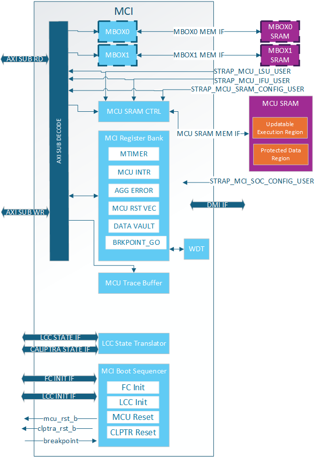

# Caliptra SS Integration Specification

## Calpitra SS top level diagram - @Nilesh

### Overview

### Links to individual IPs

### Top level Address map

| Slave | Connected to  | Start Address | End Address |
|---|---|---|---|
| 0 | imem | 64'h1000_0000 | 64'h1000_FFFF |
| 1 | I3c | 64'h2000_4000 | 64'h2000_4FFF |
| 2 | n/a | 64'h8000_0000 | 64'h80FF_FFFF |
| 3 | SoC IFC (tb) | 64'h3000_0000,
  64'h0003_0000 | 64'h3FFF_FFFF,
  64'h0003_FFFF |
| 4 | MCI | 64'h2100_0000 | 64'h2200_0000 |
| 5 | Fuse Ctrl | 64'h7000_0000 | 64'h7000_01FF |
| 6 | Fuse Ctrl Core | 64'h7000_0200 | 64'h7000_03FF |
| 7 | Life Cycle Ctrl | 64'h7000_0400 | 64'h7000_05FF |

### Same as MCU

## Top level / remaining functional flows & signals. - @Nilesh

### Overview

### Parameters & Defines

### Interface

**Table: Caliptra SS Straps**

| Facing | Type | width | Name | Description |
|---|---|---|---|---|
| External | input | 1 | cptra_ss_strap_mcu_lsu_axi_user_i | MCU LSU AXI user strap input |
| External | input | 1 | cptra_ss_strap_mcu_ifu_axi_user_i | MCU IFU AXI user strap input |
| External | input | 1 | cptra_ss_strap_clp_axi_user_i | CLP AXI user strap input |
| External | input | 1 | cptra_ss_strap_mcu_reset_vector_i | MCU reset vector strap input |
| External | input | 1 | cptra_ss_strap_caliptra_base_addr_i | Caliptra base address strap input |
| External | input | 1 | cptra_ss_strap_mci_base_addr_i | MCI base address strap input |
| External | input | 1 | cptra_ss_strap_recovery_ifc_base_addr_i | Recovery interface base address strap input |
| External | input | 1 | cptra_ss_strap_otp_fc_base_addr_i | OTP FC base address strap input |
| External | input | 1 | cptra_ss_strap_uds_seed_base_addr_i | UDS seed base address strap input |
| External | input | 1 | cptra_ss_strap_prod_debug_unlock_auth_pk_hash_reg_bank_offset_i | Prod debug unlock auth PK hash reg bank offset input |
| External | input | 1 | cptra_ss_strap_num_of_prod_debug_unlock_auth_pk_hashes_i | Number of prod debug unlock auth PK hashes input |
| External | input | 1 | cptra_ss_strap_generic_0_i | Generic strap input 0 |
| External | input | 1 | cptra_ss_strap_generic_1_i | Generic strap input 1 |
| External | input | 1 | cptra_ss_strap_generic_2_i | Generic strap input 2 |
| External | input | 1 | cptra_ss_strap_generic_3_i | Generic strap input 3 |

**Table: Caliptra SS Ports**

| Facing | Type | width | Name | Description |
|---|---|---|---|---|
| External | input | 1 | cptra_ss_clk_i | Caliptra subsystem clock input |
| External | input | 1 | cptra_ss_pwrgood_i | Power good signal input |
| External | input | 1 | cptra_ss_rst_b_i | Reset signal input, active low |
| External | interface | 1 | cptra_ss_cptra_core_s_axi_if | Caliptra core AXI sub-interface |
| External | interface | 1 | cptra_ss_cptra_core_m_axi_if | Caliptra core AXI manager interface |
| External | interface | 1 | cptra_ss_mci_s_axi_if | Caliptra SS MCI AXI sub-interface |
| External | interface | 1 | cptra_ss_mcu_rom_s_axi_if | Caliptra SS MCU ROM AXI sub-interface |
| External | interface | 1 | mcu_rom_mem_export_if | MCU ROM memory export interface |
| External | interface | 1 | cptra_ss_mci_m_axi_if | Caliptra SS MCI AXI manager interface |
| External | interface | 1 | cptra_ss_mcu_lsu_m_axi_if | Caliptra SS MCU LSU AXI manager interface |
| External | interface | 1 | cptra_ss_mcu_ifu_m_axi_if | Caliptra SS MCU IFU AXI manager interface |
| External | interface | 1 | cptra_ss_i3c_s_axi_if | Caliptra SS I3C AXI sub-interface |
| External | input | 1 | cptra_ss_lc_axi_wr_req_i | LC controller AXI write request input |
| External | output | 1 | cptra_ss_lc_axi_wr_rsp_o | LC controller AXI write response output |
| External | input | 1 | cptra_ss_lc_axi_rd_req_i | LC controller AXI read request input |
| External | output | 1 | cptra_ss_lc_axi_rd_rsp_o | LC controller AXI read response output |
| External | input | 1 | cptra_ss_otp_core_axi_wr_req_i | OTP controller AXI write request input |
| External | output | 1 | cptra_ss_otp_core_axi_wr_rsp_o | OTP controller AXI write response output |
| External | input | 1 | cptra_ss_otp_core_axi_rd_req_i | OTP controller AXI read request input |
| External | output | 1 | cptra_ss_otp_core_axi_rd_rsp_o | OTP controller AXI read response output |
| External | input | 1 | cptra_ss_cptra_obf_key_i | Caliptra core obfuscation key input |
| External | input | 1 | cptra_ss_cptra_csr_hmac_key_i | Caliptra core CSR HMAC key input |
| External | input | 1 | cptra_ss_cptra_core_jtag_tck_i | JTAG clock input |
| External | input | 1 | cptra_ss_cptra_core_jtag_tms_i | JTAG TMS input |
| External | input | 1 | cptra_ss_cptra_core_jtag_tdi_i | JTAG TDI input |
| External | input | 1 | cptra_ss_cptra_core_jtag_trst_n_i | JTAG reset input, active low |
| External | output | 1 | cptra_ss_cptra_core_jtag_tdo_o | JTAG TDO output |
| External | output | 1 | cptra_ss_cptra_core_jtag_tdoEn_o | JTAG TDO enable output |
| External | output | 1 | cptra_ss_cptra_generic_fw_exec_ctrl_o | Generic firmware execution control output |
| External | input | 1 | cptra_ss_lc_ctrl_jtag_i | LC controller JTAG request input |
| External | output | 1 | cptra_ss_lc_ctrl_jtag_o | LC controller JTAG response output |
| External | interface | 1 | cptra_ss_cptra_core_el2_mem_export | Caliptra core EL2 memory export interface |
| External | output | 1 | cptra_ss_cptra_core_mbox_sram_cs_o | Mailbox SRAM chip select output |
| External | output | 1 | cptra_ss_cptra_core_mbox_sram_we_o | Mailbox SRAM write enable output |
| External | output | 1 | cptra_sscptra_core_mbox_sram_addr_o | Mailbox SRAM address output |
| External | output | 1 | cptra_ss_cptra_core_mbox_sram_wdata_o | Mailbox SRAM write data output |
| External | input | 1 | cptra_ss_cptra_core_mbox_sram_rdata_i | Mailbox SRAM read data input |
| External | output | 1 | cptra_ss_cptra_core_imem_cs_o | Instruction memory chip select output |
| External | output | 1 | cptra_ss_cptra_core_imem_addr_o | Instruction memory address output |
| External | input | 1 | cptra_ss_cptra_core_imem_rdata_i | Instruction memory read data input |
| External | input | 1 | cptra_ss_cptra_core_bootfsm_bp_i | Boot FSM breakpoint input |
| External | output | 1 | cptra_ss_cptra_core_etrng_req_o | External TRNG request output |
| External | input | 1 | cptra_ss_cptra_core_itrng_data_i | Internal TRNG data input |
| External | input | 1 | cptra_ss_cptra_core_itrng_valid_i | Internal TRNG valid input |
| External | interface | 1 | cptra_ss_mcu_rom_macro_req_if | MCU ROM macro request interface |
| External | interface | 1 | cptra_ss_mci_mcu_sram_req_if | MCI MCU SRAM request interface |
| External | interface | 1 | cptra_ss_mci_mbox0_sram_req_if | MCI mailbox 0 SRAM request interface |
| External | interface | 1 | cptra_ss_mci_mbox1_sram_req_if | MCI mailbox 1 SRAM request interface |
| External | interface | 1 | cptra_ss_mcu0_el2_mem_export | MCU0 EL2 memory export interface |
| External | input | 1 | cptra_ss_mci_generic_input_wires_i | Generic input wires for MCI |
| External | input | 1 | cptra_ss_mcu_no_rom_config_i | No ROM configuration input |
| External | input | 1 | cptra_ss_mci_boot_seq_brkpoint_i | MCI boot sequence breakpoint input |
| External | input | 1 | cptra_ss_lc_Allow_RMA_on_PPD_i | Allow RMA on PPD input |
| External | output | 1 | cptra_ss_mci_generic_output_wires_o | Generic output wires for MCI |
| External | output | 1 | cptra_ss_mci_error_fatal_o | MCI error fatal output |
| External | output | 1 | cptra_ss_mci_error_non_fatal_o | MCI error non-fatal output |
| External | input | 1 | cptra_ss_mcu_jtag_tck_i | MCU JTAG clock input |
| External | input | 1 | cptra_ss_mcu_jtag_tms_i | MCU JTAG TMS input |
| External | input | 1 | cptra_ss_mcu_jtag_tdi_i | MCU JTAG TDI input |
| External | input | 1 | cptra_ss_mcu_jtag_trst_n_i | MCU JTAG reset input, active low |
| External | output | 1 | cptra_ss_mcu_jtag_tdo_o | MCU JTAG TDO output |
| External | output | 1 | cptra_ss_mcu_jtag_tdoEn_o | MCU JTAG TDO enable output |
| External | input | 1 | cptra_ss_debug_intent_i | Debug intent signal input |
| External | output | 1 | cptra_ss_dbg_manuf_enable_o | Debug manufacturing enable output |
| External | output | 1 | cptra_ss_cptra_core_soc_prod_dbg_unlock_level_o | SoC production debug unlock level output |
| External | input | 1 | cptra_ss_lc_clk_byp_ack_i | LC clock bypass acknowledge input |
| External | output | 1 | cptra_ss_lc_clk_byp_req_o | LC clock bypass request output |
| External | input | 1 | cptra_ss_lc_ctrl_scan_rst_ni_i | LC controller scan reset input, active low |
| External | input | 1 | cptra_ss_lc_esclate_scrap_state0_i | LC escalate scrap state 0 input |
| External | input | 1 | cptra_ss_lc_esclate_scrap_state1_i | LC escalate scrap state 1 input |
| External | output | 1 | cptra_ss_soc_dft_en_o | SoC DFT enable output |
| External | output | 1 | cptra_ss_soc_hw_debug_en_o | SoC hardware debug enable output |
| External | input | 1 | cptra_ss_fuse_macro_prim_tl_i | Fuse macro primary TL input |
| External | output | 1 | cptra_ss_fuse_macro_prim_tl_o | Fuse macro primary TL output |
| External | input | 1 | cptra_ss_i3c_scl_i | I3C clock input |
| External | input | 1 | cptra_ss_i3c_sda_i | I3C data input |
| External | output | 1 | cptra_ss_i3c_scl_o | I3C clock output |
| External | output | 1 | cptra_ss_i3c_sda_o | I3C data output |
| External | output | 1 | cptra_ss_sel_od_pp_o | Select open-drain push-pull output |
| External | inout | 1 | cptra_ss_i3c_scl_io | I3C clock bidirectional |
| External | inout | 1 | cptra_ss_i3c_sda_io | I3C data bidirectional |
| External | input | 1 | cptra_ss_cptra_core_generic_input_wires_i | Generic input wires for Caliptra core |
| External | input | 1 | cptra_ss_cptra_core_scan_mode_i | Caliptra core scan mode input |
| External | output | 1 | cptra_error_fatal | Fatal error output |
| External | output | 1 | cptra_error_non_fatal | Non-fatal error output |
| External | output | 1 | ready_for_fuses | Ready for fuses output |
| External | output | 1 | ready_for_mb_processing | Ready for mailbox processing output |
| External | output | 1 | mailbox_data_avail | Mailbox data available output |

### Memory Map	/ Address map

### Requirements : Connectivity, Clock & Reset, Constraints & Violations etc

### Programming interface

### Sequences : Reset, Boot,

### How to test : Smoke & more

### Other requirements

## Caliptra Core -

## Integration specification link

# MCU - @Nilesh

### Overview

### Parameters & Defines

### Interface

### Memory Map	/ Address map

### Requirements : Connectivity, Clock & Reset, Constraints & Violations etc

### Programming interface

### Sequences : Reset, Boot,

### How to test : Smoke & more

### Other requirements

# FC Controller - @Emre

### Overview

### Parameters & Defines

### Interface

### Memory Map	/ Address map

### Requirements : Connectivity, Clock & Reset, Constraints & Violations etc

### Programming interface

### Sequences : Reset, Boot,

### How to test : Smoke & more

### Other requirements

# LC Controller - @Emre

### Overview

### Parameters & Defines

### Interface

### Memory Map	/ Address map

### Requirements : Connectivity, Clock & Reset, Constraints & Violations etc

### Programming interface

### Sequences : Reset, Boot,

### How to test : Smoke & more

### Other requirements

# Manufacturer Control Interface (MCI) - @Clayton

### Overview
Manufacturer Control Interface provides the following features for Caliptra SS:

* Boot Sequencer for the SS

    * FC Init

    * LCC Init

    * MCU Reset

        * Hitless Update Capability

* Caliptra Reset

* MCU SRAM

* MCU watchdog timer

* Mailboxes

* LCC State Translator for Caliptra Core

* Error Aggregation

* Register Bank for MCU/SOC

The Boot Sequence is what brings the subsystem up. It will do fuse controller and life cycle controller initialization. It then brings up MCU and Caliptra based on the breakpoint and no rom config input pins. Once MCI has done the subsystem bring up, it provides other functionality like the MCU SRAM, DAM for MCU, Error aggregation for the SS and more.

If there is an issue within MCI whether it be the Boot Sequencer or another component. The SOC can utilize the breakpoint and DMI capability to halt the Boot Sequencer before bring up the MCU and do targeted register accesses via the DMI port which is connected to the MCU.

*MCI Block Diagram*:

### Parameters & Defines

*Note: Additional parameter limitations can be seen in the Requirements section* 

**Table: AXI Integration Parameters**

| Facing | Parameter name | Location | Description |
| :---- | :---- | :---- | :---- |
| External | AXI\_ADDR\_WIDTH | mci\_top | AXI address width |
| External | AXI\_DATA\_WIDTH | mci\_top | AXI data width |
| External | AXI\_USER\_WIDTH | mci\_top | AXI user width |
| External | AXI\_ID\_WIDTH | mci\_top | AXI ID width |

##### 

**Table: MCU SRAM Integration Parameters**

| Facing | Parameter name | Location | Description |
| :---- | :---- | :---- | :---- |
| External | MCU\_SRAM\_SIZE\_KB  | mci\_top | Size of MCU SRAM in KB. i.e. Min: 4 Max: 2048(2MB) |

**Table: MCI Boot Sequencer Integration Parameters**

| Facing | Parameter name | Location | Description |
| :---- | :---- | :---- | :---- |
| External | MIN\_MCU\_RST\_COUNTER\_WIDTH | mci\_top | Size of MCU reset counter which determines the min reset time for the MCU. When the timer overflows MCU can be brought up. |

**Table: MCI MBOX Integration Parameters**

| Facing | Parameter name | Location | Description |
| :---- | :---- | :---- | :---- |
| FIXME    | MCI\_MBOX0\_DMI\_DLEN\_ADDR |  mci\_top | FIXME |
| External | MCI\_MBOX0\_SIZE\_KB | external | mci\_top | Size of MBOX0 SRAM. If set to 0 the entire MBOX0 is removed from MCI. Min: 0 Max 2048 (2MB) |
| FIXME    | MCI\_MBOX1\_DMI\_DLEN\_ADDR |  mci\_top | FIXME |
| External | MCI\_MBOX1\_SIZE\_KB | external | mci\_top | Size of MBOX1 SRAM. If set to 0 the entire MBOX1 is removed from MCI. Min: 0 Max 2048 (2MB) |

**FIXME none right now?**   
**Table: MCI Integration Definitions**

| Defines | Defines file | Description |
| :---- | :---- | :---- |
|  |  |  |
|  |  |  |
|  |  |  |

### Interface

*Note: Additional interface connection requirements/guidance can be seen in the Requirements section* 

*Note: Any port listed as “STATIC” must be stable before mci\_pwrgood is asserted. If the signal changes value after mci\_pwrgood assertion will cause functional issues in MCI*

*Note: Internal means the signal is not directly exposed to the SOC. External means it is directly exposed for SOC to consume and connect.* 

*Note: If a signal (like the clock) is combined with other IPs it is still listed as Ext.* 

*Note: If a signal stays in the SS but will need SOC connection (AXI interfaces) due to the SS not instantiating a component (like an AXI interconnect) it is listed as Ext because the SOC will need to connect.*

*Note: Any port with known internal and external connections (i.e. agg\_error\_fatal) will have External/Internal with note in a different section on which ports are reserved for internal vs external use.*

**Table: MCI Clocks**

| Facing | Type | Width | Name | Clock | Description |
| :---- | :---- | :---- | :---- | :---- | :---- |
| External | Input | 1 | clk |  | MCI Clock. Connected to subsystem top level clk input.|

##### 

**Table: MCI Resets**

| Facing | Type | Width | Name | Clock | Description |
| :---- | :---- | :---- | :---- | :---- | :---- |
| External | Input | 1 | mci\_pwrgood | Async assert Sync deassert clk | Active high power good indicator. Deepest reset domain for MCI.  |
| External | Input | 1 | mci\_rst\_b | Async assert Sync deassert clk | Active low asynchronous reset for MCI.  |
| Internal | Output | 1 | mcu\_rst\_b | clk | Reset for MCU.  When scan\_mode set this is directly controlled by mci\_rst\_b |
| Internal | Output | 1 | cptra\_rst\_b | clk | Reset for Caliptra. When scan\_mode set this is directly controlled by mci\_rst\_b  |

##### 

**Table: MCI AXI Interface**

| Facing | Type | Width | Name | Clock | Description |
| :---- | :---- | :---- | :---- | :---- | :---- |
| External | interface |    | s\_axi\_w\_if | clk | AXI subordinate write interface. |
| External | interface |    | s\_axi\_r\_if | clk | AXI subordinate write interface. |
| External | interface |    | m\_axi\_w\_if | clk | AXI manager write interface. |
| External | interface |    | m\_axi\_r\_if | clk | AXI manager read interface. |

##### 

**Table: MCI Straps**

| Facing | Type | Width | Name | Clock | Description |
| :---- | :---- | :---- | :---- | :---- | :---- |
| External | Input | AXI\_USER\_WIDTH | strap\_mcu\_lsu\_axi\_user | STATIC | AXI USER for MCU’s load/store unit. |
| External | Input | AXI\_USER\_WIDTH | strap\_mcu\_ifu\_axi\_user | STATIC | AXI USER for MCU’s instruction fetch unit. |
| External | Input | AXI\_USER\_WIDTH | strap\_clp\_axi\_user | STATIC | AXI USER for Caliptra. |
| External | Input | 32 | strap\_mcu\_reset\_vector | STATIC | Default reset vector for MCI. Can be overridden via MCI register write.  |

##### 

**Table: MCI MISC Interface**

| Facing | Type | Width | Name | Clock | Description |
| :---- | :---- | :---- | :---- | :---- | :---- |
| Internal | Input | 1 | mcu\_sram\_fw\_exec\_region\_lock | Async | MCU SRAM execution region protection control.  0: Caliptra access to the region 1: MCU LSU/IFU access to the region. Negedge use as an interrupt request for MCU to reset itself.  Positive edge bring MCU out of reset during hitless update flow.  |
| External | Input | 64 | mci\_generic\_input | Async | Placeholder of input wires for late binding features. These values are reflected into registers that are exposed to MCU firmware |
| External | Output | 64 | mci\_generic\_output | clk | Placeholder of output wires for late binding features. Firmware can set the wires appropriately via register writes. |
| Internal | Output | 32 | mcu\_reset\_vector | clk | Reset vector for MCU whose default value is strap\_mcu\_reset\_vector but can be overridden via MCI registers. This value shall be stable whenever MCU is out of reset.  |
| External | Input | 1 | mcu\_no\_rom\_config | Async | Enables the MCU no rom configuration flow. On boot this means MCU is held in reset until mcu\_sram\_fw\_exec\_region\_lock is asserted is asserted allowing for caliptra or some other SOC entity to populate the MCU SRAM and then bring MCU out of reset.  **FIXME** |
| External | Input | 1 | mci\_boot\_seq\_brkpoint | Async | MCI boot sequencer breakpoint request. This should be set before mcu\_rst\_b is deasserted to ensure the MCI boot sequencer sees the request. When set the MCI boot sequencer will halt after it initializes LCC and FC. At this point the user can run any debug flows required. Once the user is ready they can assert the GO\_BREKPOINT CSR VIA FIXME allowing MCU and Caliptra to be brought out of reset.  |

##### 

**Table: MCI Errors and Interrupts Interface**

| Facing | Type | Width | Name | Clock | Description |
| :---- | :---- | :---- | :---- | :---- | :---- |
| Internal/External | interface | 32 | agg\_error\_fatal | Async | Fatal errors from other Caliptra SS IPs or other SOC entities fed into MCI’s aggregate error infrastructure and will be reflected for SOC consumption via the all\_error\_fatal output wire of MCI |
| Internal/External | interface | 32 | agg\_error\_non\_fatal | Async | Non-fatal errors from other Caliptra SS IPs or other SOC entities fed into MCI’s aggregate error infrastructure and will be reflected for SOC consumption via the all\_error\_non\_fatal output wire of MCI. |
| External | Output | 1 | all\_error\_fatal | clk | Fatal error interrupt for SOC consumption |
| External | Output | 1 | all\_error\_non\_fatal | clk | Non-fatal error interrupt for SOC consumption |
| Internal | Output | 1 | mcu\_timer\_int | clk | MCU’s standard RISK-V MTIMER interrupt. |
| Internal | Output | 1 | mci\_intr | clk | MCI interrupt indication for MCU. This will be set when an unmasked interrupt occurs within MCI. This is a level interrupt and must be cleared by MCU firmware.     |
| Internal | Output | 1 | nmi\_intr | clk | Non-maskable interrupt for MCU. This is connected to the watchdog (WDT) timer within MCI and will be asserted when the wdt is in cascade mode and both timers timeout. It can only be cleared by asserting mci\_rst\_b. This interrupt is also fed into the all\_error\_fatal infrastructure for SOC consumption.  |
| Internal | Output | 32 | mci\_nmi\_vector | clk | Non-maskable interrupt vector for MCU. This is controllable only by MCU FW.  |

**Table: MCI LCC Bring Up Interface**

| Facing | Type | Width | Name | Clock | Description |
| :---- | :---- | :---- | :---- | :---- | :---- |
| Internal | Input | 1 | lc\_done | Async | LCC initialization done response used by MCU boot sequencer to move to the next state.  |
| Internal | Output | 1 | lc\_init | clk | LCC initialization request asserted by the MCU boot sequencer after every MCI reset.  |

##### 

**Table: MCI FC Bring Up Interface**

| Facing | Type | Width | Name | Clock | Description |
| :---- | :---- | :---- | :---- | :---- | :---- |
| Internal | Input | 1 | fc\_opt\_done | Async | FC initialization done response used by MCU boot sequencer to move to the next state.  |
| Internal | Output | 1 | fc\_opt\_init | clk | FC initialization request asserted by the MCU boot sequencer after every MCI reset.  |

**Table: MCI SRAM Interface**

| Facing | Type | Width | Name | Clock | Description |
| :---- | :---- | :---- | :---- | :---- | :---- |
| External | interface | mci\_mcu\_sram\_req\_if | Data width is DATA+ECC  Address width shall be wide enough to address entire SRAM.   | clk | MCU SRAM memory interface.  |
| External | interface | mci\_mbox0\_sram\_req\_if | Data width is DATA+ECC  Address width shall be wide enough to address entire SRAM. | clk | MBOX0 SRAM memory interface.  |
| External | interface | mci\_mbox1\_sram\_req\_if | Data width is DATA+ECC  Address width shall be wide enough to address entire SRAM. | clk | MBOX1 SRAM memory interface.  |

**Table: MCI LCC Gasket Interface**

| Facing | Type | Width | Name | Clock | Description |
| :---- | :---- | :---- | :---- | :---- | :---- |
| Internal | Input | Struct | from\_lcc\_to\_otp\_program\_i | clk | **FIXME** |
| Internal | Input | Struct | lc\_dft\_en\_i | clk | **FIXME** |
| Internal | Input | Struct | lc\_hw\_debug\_en\_i | clk | **FIXME** |
| Internal | Input | Struct | from\_otp\_to\_lcc\_program\_i  | clk | **FIXME** |
| Internal | Input | 1 | ss\_dbg\_manuf\_enable\_i | clk | **FIXME** |
| Internal | Input | 64 | ss\_soc\_dbg\_unlock\_level\_i | clk | **FIXME** |
| External | Output | 1 | SOC\_DFT\_EN | clk | **FIXME** |
| External | Output | 1 | SOC\_HW\_DEBUG\_EN | clk | **FIXME** |
| Internal | Output | Struct | security\_state\_o | clk | **FIXME** |

### Memory Map	/ Address map

#### Top Level Memory Map

| Internal Block | Address Offset (from base address) |
| :---- | :---- |
| CSRs | 0x0 |
| Mailbox 0 | 0x80000 |
| Mailbox 1 | 0x90000 |
| MCI DMA | 0xA0000 FIXME???  |
| MCU SRAM | 0x200000 |

#### MCU SRAM Memory Map

MCU SRAM is split into 2 sections:

1. Updatable Execution Region  
2. Protected Data Region

The two regions have different access protection. The size of the regions is dynamically changed via the FW\_SRAM\_EXEC\_REGION\_SIZE register in 4KB increments.

**Table: MCU SRAM Regions**

| MCU SRAM Region | Address Start Offset |
| :---- | :---- |
| Updatable Execution Region | 0x0 |
| Protected Region | FW\_SRAM\_EXEC\_REGION\_SIZE \* 1024 \* 4 |

*NOTE: FW\_SRAM\_EXEC\_REGION\_SIZE is base 0 meaning the minimum size for the Updatable Execution Region is 4KB.*

*NOTE: If FW\_SRAM\_EXEC\_REGION\_SIZE is the size of the SRAM, there is no protected Region.* 

### Requirements : Connectivity, Clock & Reset, Constraints & Violations etc

#### AXI Parameters and AXI Interface Parameter Alignment

Due to SystemVerilog limitations MCI exposed both AXI parameters and AXI interfaces that are parameterized. Parameters between all AXI interface and the MCI AXI parameters must be consistent. 

#### AXI DATA\_WIDTH Limitation

MCI DATA\_WIDTH was only verified with a value of 32\. If a different width is required the user will have to make internal MCI changes and no functionality is guaranteed. 

#### AXI ADDR\_WIDTH Limitation

AXI ADDR\_WIDTH must be wide enough to fully address the MCI address space. 

#### MCI Base Address Requirement

The base address assigned to MCI must align to the MCI total addressable space. This can be calculated based off of the MCU SRAM size since it is the last block in the MCI memory map. 

    To calculate the base address alignment use the following calculation:

      bits \= $clog2(MCU\_SRAM\_OFFSET \+ ((MCU\_SRAM\_SIZE\_KB-1) \* 1024))

    MCU\_SRAM\_OFFSET can be found in the MCI’s [Top Level Memory Map](#top-level-memory-map).

*Example:*

      MCU\_SRAM\_OFFSET \= 0x200000 (2097152 decimal)
      
      MCU\_SRAM\_SIZE\_KB \= 1024 (1MB)
      
      bits \= $clog2(2097152 \+ ((1024-1) \* 1024))
      
      bits \= 22
      
      MCI base address would need to align to 0x20\_0000

#### Reset Synchronization

**MCI does not synchronize any resets inside the IP. It is expected all reset inputs are properly synchronized to the MCI clock domain before being passed to MCI.**

All MCI reset outputs are synchronous to the MCI clock domain and if they are used in a different clock domain they shall be properly synchronized outside of MCI. 

#### DFT Reset Control

MCI input resets do not have any built-in DFT reset control for scan. It is the integrator’s responsibility to add any DFT controls outside of MCI before the reset is connected to MCI. 

Simlar to Caliptra core - When scan\_mode is set the MCI generated resets  (mcu\_rst\_b, clpra\_rst\_b) will switch from MCI logic control to directly connected to the mci\_rst\_b. This gives DFT complete control of these resets within Caliptra SS.  

#### Integrator RTL modification requirements

MCI reused synchronizer modules from Caliptra Core like caliptra\_2ff\_syn.sv. Integrators are required to replace these modules with technology-specific sync cells. 

MCI does not itself contain modules that need to be directly modified by the integrator. 

#### Late Binding interface signals

The interface signals mci\_generic\_input and  mci\_generic\_output\_wires are placeholders on the SoC interface reserved for late binding features. This may include any feature that is required for correct operation of the design in the final integrated SoC and that may not be accommodated through existing interface signaling (such as the mailbox).

While these late binding interface pins are generic in nature until assigned a function, integrators must not define non-standard use cases for these pins. Defining standard use cases ensures that the security posture of MCI/MCU in the final implementation is not degraded relative to the consortium design intent. Bits in mci\_generic\_input that don't have a function defined in MCI must be tied to a 0-value. These undefined input bits shall not be connected to any flip flops (which would allow run-time transitions on the value).

Each wire connects to a register in the MCI register bank through which communication to the MCU may be facilitated. Each of the generic wire signals is 64 bits in size.These signals are considered ASYNC and each of the 64 bits are considered separate adhoc signals. Meaning there is no bus synchronization which means the connections to this port need to be thoroughly thought through to ensure the MCU doesn’t drop any requests. 

Activity on any bit of the mci\_generic\_input triggers a notification interrupt to the microcontroller indicating a bit toggle.

The following table describes the allocation of functionality on mci\_generic\_input . All bits not listed in this table must be tied to 0\.

**Table: MCI Generic Input Allocation** 

| Bits | Name | Description |
| :---- | :---- | :---- |
| 64:0 | RESERVED | No allocation function |

#### Error Aggregation Connectivity Requirements

MCI provides two ports (agg\_error\_fatal and agg\_error\_non\_fatal), for the SOC to connect any fatal or non-fatal error that need to be:

1. Seen by MCU via interrupt  
2. Seen by SOC via all\_error\_fatal or all\_error\_non\_fatal MCI output ports

These error signals are assumed to be ASYNC and are synchronized into the MCI local clock domain.

Errors connected to this infrastructure are required to be held until a different SOC entity clears the interrupt at the source. Pulses are not permitted. 

MCU has the ability to mask these aggregated interrupts to both its own interrupt along with the all\_error\_fata/all\_error\_non\_fatal output port. 

All fatal and non\_fatal error signals from Caliptra SS IPs (FC, I3C, Caliptra, LCC, etc.) shall connect to MCI to enable a unified error interface for the SOC. 

The following table describes the allocation of functionality on agg\_error\_fatal

**Table: MCI Agg Error Fatal Allocation**

| Bits | Name | Description |
| :---- | :---- | :---- |
|   | **LCC FATAL FIXME** |  |
|  | **FC FATAL FIXME** |  |
|  | **CALITPRA FATAL FIXME** |  |
|  | **I3C FATAL FIXME** |  |
|  | RESERVED | No allocation function |

 The following table describes the allocation of functionality on agg\_error\_non\_fatal

 **Table: MCI Agg Error Non-Fatal Allocation**

| Bits | Name | Description |
| :---- | :---- | :---- |
|   | **LCC NONFATAL FIXME** |  |
|  | **FC NONFATAL FIXME** |  |
|  | **CALITPRA NONFATAL FIXME** |  |
|  | **I3C NONFATAL FIXME** |  |
|  | RESERVED | No allocation function |

###### 

A more detailed microarchitecture of the error aggregation can be found in the Caliptra SS Hardware specification. 

#### Subsystem Internal Fuse Controller Initialization Connectivity Requirements

During Caliptra SS bring up the MCI handshakes with the FC to do initialization. The flow is:

1. MCI: Assert lc\_init  
2. FC: Assert lc\_done

Connections between MCI and FC are shown in the table below:

**Table: MCI to FC Init Connections**

| MCI Port | FC Port |
| ----- | ----- |
| fc\_opt\_init | pwr\_otp\_i.otp\_init |
| fc\_opt\_done | pwr\_otp\_o.otp\_done |

#### Subsystem Internal Life Cycle Controller Initialization Connectivity Requirements

During Caliptra SS bring up the MCI handshakes with the LCC to do initialization. The flow is:

3. MCI: Assert fc\_opt\_init  
4. FC: Assert fc\_opt\_done

Connections between MCI and LCC are shown in the table below:

**Table: MCI to LCC Init Connections**

| MCI Port | FC Port |
| ----- | ----- |
| lc\_init | pwr\_lc\_i.lc\_init |
| lc\_done | pwr\_lc\_o.lc\_done |

#### MCI MCU Connectivity Requirements

The table below shows connections between MCI and MCU that are not part of other features:

**Table: MCI to MCU Connections**

| MCI Port | Direction | MCU Port | Description |
| ----- | :---: | ----- | ----- |
| mcu\_reset\_vector | \-\> | rst\_vec | Reset vector for MCU |
| nmi\_intr | \-\> | nmi\_intr | WDT interrupt for MCU |
| mcu\_nmi\_vector | \-\> | nmi\_vec | MCU nonmaskable interrupt vector |
| mcu\_rst\_b | \-\> | rst\_l | MCU reset |

#### MCI Caliptra Core Connectivity Requirements

The table below shows connections between MCI and Caliptra Core that are not part of other features:

**Table: MCI to Caliptra Core Connections**

| MCI Port | Direction | Caliptra Port | Description |
| ----- | :---: | ----- | ----- |
| mcu\_sram\_fw\_exec\_region\_lock | \<- | ss\_generic\_fw\_exec\_ctrl\[2\] | Controls MCU SRAM protection and used to bring MCU into reset for hitless match  |
| cptra\_rst\_b | \-\> | cptra\_rst\_b | Reset for Caliptra |

#### LCC Gasket Connectivity Requirements

Below are the connections needed between MCI and LCC for the Gasket functionality

**Table: LCC Gasket - MCI to LCC Connections**

| MCI Port | Direction | LCC Port | Description |
| ----- | :---: | ----- | ----- |
| from\_lcc\_to\_otp\_program\_i | \<- | lc\_otp\_program\_o | See [LCC Section](LC-Controller) |
| lc\_dft\_en\_i | \<- | lc\_dft\_en\_o | See [LCC Section](LC-Controller)|
| lc\_hw\_debug\_en\_i | \<- | lc\_hw\_debug\_en\_o | See [LCC Section](LC-Controller)|
| from\_otp\_to\_lcc\_program\_i | \<- | otp\_lc\_data\_i | See [LCC Section](LC-Controller) |

**Table: LCC Gasket - MCI to Caliptra Core Connections**

| MCI Port | Direction | Caliptra Core Port | Description |
| ----- | :---: | ----- | ----- |
| ss\_dbg\_manuf\_enable\_i | \<- | ss\_dbg\_manuf\_enable |  See [Caliptra Integration spec](https://github.com/chipsalliance/caliptra-rtl/blob/main/docs/CaliptraIntegrationSpecification.md#soc-interface-definition)|
| ss\_soc\_dbg\_unlock\_level\_i | \<- | ss\_soc\_dbg\_unlock\_level | See [Caliptra Integration spec](https://github.com/chipsalliance/caliptra-rtl/blob/main/docs/CaliptraIntegrationSpecification.md#soc-interface-definition)|
| security\_state\_o | \-\> | security\_state | See [LCC state tranlation table](CaliptraSSHardwareSpecification.md#lcc-interpretation-for-caliptra-core-security-states) |

**Table: LCC Gasket - MCI to Caliptra SS Port Connections**

| MCI Port | Direction | SS Port | Description |
| ----- | :---: | ----- | ----- |
| SOC\_DFT\_EN | \-\> | cptra_ss_soc_dft_en_o | SOC DFT enable see [DFT LC States](CaliptraSSHardwareSpecification.md#dft--dfd-lc-states)|
| SOC\_HW\_DEBUG\_EN | \-\> | cptra_ss_soc_hw_debug_en_o | SOC HW Debug Enable see: [DFD LC States](CaliptraSSHardwareSpecification.md#dft--dfd-lc-states) |

#### MCU SRAM Sizing Requirements

MCU SRAM size is set via the MCU\_SRAM\_SIZE\_KB parameter. 

The minimum size supported is 4KBs.

The maximum size supported is 2MBs.

 It is suggested the size is on a 4KB boundary since the split between the execution region and secure region is done via MCI CSR in 4KB increments.

The size of the SRAM should be determined based on:

1. MCU runtime image size  
2. STACK  
3. Large data structures or persistent logs maintained by MCU  
4. .data/.bss sections  
5. Any other data MCU plans on storing the the MCU SRAM.

Storage guidance for Execution vs Protected region are as follows:

* Execution  
  * Executable Runtime Instructions for MCU  
  * .data/.bss sections  
  * STACK  
* Protected  
  * STACK  
  * Incorruptible data structures  
  * Persistent logs maintained by MCU

Access to MCU SRAM Execution Region is controlled by mcu\_sram\_fw\_exec\_region\_lock. Before MCU is brought out of reset for a hitless patch this signal must be asserted giving access to the MCU. Failure to do so will trigger an AXI access error since Caliptra will be the only entity allowed to access the SRAM until this signal is asserted.

#### MCI AXI DMA Requirements

FIXME use MCI AXI DMA block during secret fuse population (won’t be available)

### Programming interface

#### Mailbox FIXME waiting on Caliptra MBOX integration spec updates before doing this section

### Sequences : Reset, Boot,

#### MCI Boot Sequencer

The MCI is responsible for bringing up the Caliptra SS. This is done via the MCI Boot Sequencer. The primary job of this FSM is to:

1. Initialize the fuse controller  
2. Initialize the life cycle controller  
3. Allow a breakpoint for debug intervention before MCU or Caliptra are out of reset  
4. Bring MCU out of reset  
5. Bring Caliptra out of reset  
6. Control MCU reset for hitless updates

##### Breakpoint Flow

The SOC can halt the MCI Boot Sequencer via the mcu\_boot\_seq\_brkpoint port. When set to 1 it will cause the MCI Boot Sequence to halt after it has initialized both FC and LCC. 

This port shall be set and stable before mcu\_rst\_b is deasserted. Failure to do so will mean the breakpoint might be missed by MCI Boot Sequencer.

At this point a user can use the MCU JTAG to configure MCI or other components within the Caliptra SS for debug. 

To proceed after a breakpoint the SOC must write the BREKPOINT_GO register via AXI DEBUG USER or MCI DMI port.

##### MCU No ROM Config

**FIXME**

#### Reset Ordering

The following table defines the order in which resets can get asserted. A "\>\>" in a cell at row X and column Y indicates that if the reset in row X is asserted, the reset in row Y is also asserted. For the rest of the cells (in which symbol "\>\>" is not present) the preceding assumption is not true and so the paths between those resets are potential RDC violations. The "N/A" cells are ignored because they are between the same resets.

**Table: MCI Reset Ordering**

|  | mci\_pwrgood | mci\_rst\_b | mcu\_rst\_b | cptra\_rst\_b |
| :---- | :---- | :---- | :---- | :---- |
| **mci\_pwrgood** | N/A | \>\> | \>\> | \>\> |
| **mci\_rst\_b** |  | N/A | \>\> | \>\> |
| **mcu\_rst\_b** |  |  | N/A |  |
| **cptra\_rst\_b** |  |  |  | N/A |

#### MCU Hitless Patch Flow

Once both MCU and Caliptra have been brought up the MCI Boot Sequencer is in a “listening” state waiting for a MCU reset request. 

To see the MCU Hitless Flow please see the following spec: [Caliptra Hitless Update Support](https://github.com/chipsalliance/Caliptra/blob/main/doc/Caliptra.md#subsystem-support-for-hitless-updates)

MCI registers relevant to this flow are:

- Caliptra
   - SS_GENERIC_FW_EXEC_CTRL[0].go[2]
- MCI 
   - RESET_STATUS.mcu
   - MCU_RESET_REQ
   - RESET_REASON

#### Error Flows

##### Example all\_error\_fatal Flow

Below is an example flow an SOC can follow that would properly clear all interrupts for all\_error\_fatal:

Setup assumes all interrupts to MCU and all\_error\_fatal are enabled via MCI CSRs

1. agg\_error\_fatal bit 0 is asserted by an IP  
   1. error\_agg\_error\_fatal0\_sts for MCU will be asserted  
   2. agg\_error\_fatal0 for SOC all\_error\_fatal will be asserted  
2. MCU:  
   1. Interrupted via mci\_intr  
   2. Takes action on error  
      1. This could just be a loop waiting for a reset as fatal errors typically need a system wide reset.  
   3. Waits for interrupt source to be cleared see SOC steps  
   4. W1C error\_agg\_error\_fatal0\_sts to clear the interrupt  
3. SOC:  
   1. Interrupted via all\_error\_fatal  
   2. Takes action on error  
      1. Could be logging or resetting of the SOC  
   3. Clears the source of the error causing agg\_error\_fatal\[0\] to be cleared  
   4.  W1C agg\_error\_fatal0  
4. At this point all interrupt registers within MCI register bank are cleared but all\_error\_fatal is still asserted.   
5. Reset MCI via mci\_rst\_b   
   1. Clears the all\_error\_fatal output port

##### Example all\_error\_non\_fatal Flow

Below is an example flow an SOC can follow that would properly clear all interrupts for all\_non\_error\_fatal:

Setup assumes all interrupts to MCU and all\_error\_non\_fatal are enabled via MCI CSRs

1. agg\_error\_fatal bit 0 is asserted by an IP  
   1. notif\_agg\_error\_fatal0\_sts for MCU will be asserted  
   2. agg\_error\_non\_fatal0 for SOC all\_error\_non\_fatal will be asserted  
2. MCU:  
   1. Interrupted via mci\_intr  
   2. Takes action on error  
      1. Could just be a logging of the non-fatal error  
   3. Waits for interrupt source to be cleared see SOC steps  
   4. W1C notif\_agg\_error\_fatal0\_sts to clear the interrupt  
3. SOC:  
   1. Interrupted via all\_error\_non\_fatal  
   2. Takes action on error  
      1. Could be logging or resetting of the SOC  
   3. Clears the source of the error causing agg\_error\_non\_fatal\[0\] to be cleared  
   4.  W1C agg\_error\_non\_fatal0  
4. Once MCU and SOC have finished their flows all interrupts will be cleared

### How to test : Smoke & more

### Other requirements

## I3C core - @Nilesh

### Overview

### Parameters & Defines

### Interface

### Memory Map	/ Address map

### Requirements : Connectivity, Clock & Reset, Constraints & Violations etc

### Programming interface

### Sequences : Reset, Boot,

### How to test : Smoke & more

### Other requirements

## Memories - @Nilesh

### Overview

### Parameters & Defines

### Interface

### Memory Map	/ Address map

### Requirements : Connectivity, Clock & Reset, Constraints & Violations etc

### Programming interface

### Sequences : Reset, Boot,

### How to test : Smoke & more

### Other requirements

## Terminology
