# Caliptra Subsystem USB OCP Recovery Boot Flow

This document is the command-level source list for a later stick diagram. It
uses these actors:

| Actor | Responsibility |
|---|---|
| Recovery Agent (Host) | Enumerates the USB device, discovers recovery capabilities, pushes each recovery image, requests activation, and monitors status. |
| Recovery Device (USB Core) | Implements USB device EP0, exposes the OCP Recovery interface and command registers, buffers image data, reports status, and signals image availability. |
| Device Firmware (MCU) | Brings up the USB device controller, installs the USB/OCP-recovery descriptors, completes standard USB enumeration, and programs placeholder `PROT_CAP`/`DEVICE_ID`/`DEVICE_STATUS` values so the recovery interface is enumerable before Caliptra is online. |
| Device Firmware (Caliptra) | Once online, finalizes `PROT_CAP`/`DEVICE_ID`/`DEVICE_STATUS` (enabling the interface for host discovery/connection), then consumes and authenticates recovery images, updates recovery state, and boots each accepted image. |

## Scope and interpretation

- The normative protocol source is **OCP Secure Firmware Recovery v1.1**.
- The selected image-transfer mechanism is the **Indirect FIFO CMS** because
  that is the Caliptra Subsystem USB recovery data path.
- USB-controller register names and internal interrupt signals are
  Caliptra-specific implementation details. The OCP specification requires the
  externally visible USB and recovery behavior, but does not prescribe those
  internal register accesses.
- MCU and Caliptra firmware have distinct roles across boot, enumeration,
  recovery, and runtime. MCU owns USB device-controller bring-up, descriptor
  installation, and standard enumeration, and programs the initial (pre-Caliptra)
  contents of the OCP Recovery registers so the interface is enumerable as soon
  as the host attaches. Once Caliptra comes online it finalizes that
  configuration and takes over all recovery-specific register updates,
  consumption, and activation. See the general USB2 device programming flow in
  the [USB2 Programmer's Guide](https://github.com/chipsalliance/usb2/blob/main/docs/USB2_Programmers_Guide.md)
  for the MCU-owned controller bring-up and enumeration steps referenced below.
- One OCP Recovery command maps to exactly one USB EP0 control transfer.
  Reads use a Class/Interface Control IN transfer and writes use a
  Class/Interface Control OUT transfer. `bRequest=0x00`, `wValue[7:0]` contains
   the OCP command ID, and `wIndex[7:0]` contains the recovery interface number.
   For reads, the host sets `wLength` to the descriptor's
   `wMaxRdTransferSize`; for writes, `wLength` is the command payload length and
   must not exceed `wMaxWrTransferSize`.

## Complete ordered flow

### A. Power-on and USB recovery-interface initialization (MCU-owned)

1. **Recovery Device [USB Core]:** Power-on reset initializes the USB device
   controller and OCP Recovery register block. The recovery interface must be
   capable of remaining available in normal runtime and recovery mode once USB
   enumeration completes. Device interface mastering starts disabled if
   `DEVICE_RESET.InterfaceControl` is implemented.

2. **Device Firmware [MCU]:** Install the USB device, configuration,
   recovery-interface, and OCP Recovery functional descriptors before
   connecting the device to the host. The descriptors advertise:
   `bInterfaceClass=0xEF`, `bInterfaceSubClass=0x08`,
   `bInterfaceProtocol=0x01`, EP0 only, `wMaxWrTransferSize`,
   `wMaxRdTransferSize`, and OCP Recovery version 1.1.

3. **Device Firmware [MCU]:** Program the initial, pre-Caliptra contents of
   `PROT_CAP`, `DEVICE_ID`, and `DEVICE_STATUS`: advertise MCU's best-known
   recovery capabilities and device identity, and set `DEVICE_STATUS=0x0`
   (status pending) so the Recovery Agent knows to keep polling until Caliptra
   finalizes device state (Section C).

4. **Device Firmware [MCU]:** Configure the USB controller for device
   mode; initialize the EP0 SETUP, OUT, and IN descriptors and buffers; program
   the endpoint-list and data-buffer bases; enable the device connection; enable
   device, EP0 OUT, and EP0 IN interrupt sources; and clear stale interrupt
   status.

5. **Recovery Device [USB Core] -> Device Firmware [MCU]:** Assert the USB
   device interrupt when a bus-reset or firmware-serviced EP0 event occurs.
   Caliptra Subsystem routes `usb_dev_irq` to MCU external interrupt vector 3.
   Firmware may service this interrupt by polling the USB interrupt/status
   registers, as the current bring-up firmware does.

### B. Standard USB enumeration (MCU-owned)

6. **Recovery Agent [Host]:** Detect device attachment and issue a USB port/bus
   reset.

7. **Recovery Device [USB Core] -> Device Firmware [MCU]:** Report the bus
   reset through the device interrupt/status indication.

8. **Device Firmware [MCU]:** Acknowledge the bus-reset indication,
   restore EP0 to the Default state, reset the USB device address to zero,
   clear the selected configuration, and re-arm EP0 SETUP reception.

9. **Recovery Agent [Host]:** Perform standard USB enumeration, including
   `GET_DESCRIPTOR(Device)`.

10. **Recovery Device [USB Core] -> Device Firmware [MCU]:** Assert the EP0
    event indication for firmware-serviced standard requests.

11. **Device Firmware [MCU]:** Return the USB Device Descriptor and
    complete the control transfer.

12. **Recovery Agent [Host]:** Issue `SET_ADDRESS`.

13. **Device Firmware [MCU]:** Return the zero-length status response,
    stage the new USB device address, complete the transfer, and re-arm EP0.

14. **Recovery Agent [Host]:** Issue
    `GET_DESCRIPTOR(Configuration)` for the complete configuration hierarchy.

15. **Device Firmware [MCU]:** Return the Configuration Descriptor, the
    single OCP Recovery Interface Descriptor, and the OCP Recovery Functional
    Descriptor. The host learns the interface number and maximum OCP read/write
    transfer sizes from this response.

16. **Recovery Agent [Host]:** Issue `SET_CONFIGURATION` with the advertised
    non-zero configuration value.

17. **Device Firmware [MCU]:** Accept the configuration, return the
    zero-length status response, record the Configured state, and re-arm EP0.

18. **Recovery Device [USB Core]:** The OCP Recovery interface is now available
    over EP0 and must respond to OCP Recovery commands, though `DEVICE_STATUS`
    still reports the pending value MCU set in step 3 until Caliptra finalizes
    device state (Section C). If several recovery transports exist, the
    Recovery Agent selects USB as the sole transport for this recovery session.

> For the general USB device-controller bring-up and enumeration steps
> summarized in Sections A and B (steps 1-18), see the
> [USB2 Programmer's Guide](https://github.com/chipsalliance/usb2/blob/main/docs/USB2_Programmers_Guide.md),
> which is the authoritative source for the MCU-owned controller programming
> flow. This document only calls out the OCP-recovery-specific additions layered
> on top of that flow (descriptor content and the placeholder register values).

### C. Caliptra bring-up, recovery discovery, and entry

19. **Recovery Agent [Host]:** Poll `DEVICE_STATUS` (`0x24`) until byte 0 is
    non-zero. While Caliptra has not yet come online this returns the `0x0`
    placeholder MCU set in step 3, and the Recovery Agent continues polling.
    This read also clears any host-visible `PROTOCOL_ERROR`.

20. **Device Firmware [Caliptra], once online:** Finalize the `PROT_CAP`
    capability bitmap and `DEVICE_ID` left as placeholders by MCU. In this
    design Caliptra always requires an externally supplied recovery image, so
    it sets `DEVICE_STATUS=0x3` (Recovery mode, ready to accept a recovery
    image) directly -- there is no intermediate `0x1` (Device Healthy) value in
    this flow -- and populates the recovery reason code. It then immediately
    sets `RECOVERY_STATUS.DeviceRecoveryStatus=0x1` (Awaiting recovery image)
    with the current `RecoveryImageIndex`. This transition is what enables the
    OCP Recovery interface for meaningful discovery and connection by the
    host: the Recovery Agent's poll loop in step 19 completes once
    `DEVICE_STATUS` becomes `0x3`.

21. **Recovery Agent [Host]:** Read `PROT_CAP` (`0x22`). Verify the `"OCP RECV"`
    magic, protocol version 1.1, mandatory `DEVICE_ID` and `DEVICE_STATUS`
    capabilities, Push C-image support, FIFO CMS support (`bit 12`), CMS count,
    and maximum response time; record the advertised heartbeat period. By this
    point `DEVICE_STATUS` is non-zero, so `PROT_CAP` reflects Caliptra's
    finalized values from step 20, not MCU's placeholder.

22. **Recovery Agent [Host]:** Read `DEVICE_ID` (`0x23`) and identify the
    Recovery Device, using Caliptra's finalized descriptor from step 20.

23. **Recovery Agent [Host]:** Read `RECOVERY_STATUS` (`0x27`) and confirm
    `DeviceRecoveryStatus=0x1`. Record the `RecoveryImageIndex`; it identifies
    the recovery stage whose image must now be supplied.

### D. Transfer one recovery image through the FIFO CMS (Caliptra-owned)

24. **Recovery Agent [Host]:** Write `RECOVERY_CTRL` (`0x26`) selecting the
    code CMS used for recovery, with `RecoveryImageSelection=0x1` (use recovery
    image from the CMS) and `ActivateRecoveryImage=0`. For the mandatory pushed
    code region, `CMS=0`. This command must complete before activation.

25. **Recovery Agent [Host]:** Write `INDIRECT_FIFO_CTRL` (`0x2D`) with
    `CMS=0`, `Reset=1`, and `ImageSize` equal to the complete image size in
    four-byte units. This resets the FIFO read and write indexes.

26. **Device Firmware [Caliptra]:** Read `INDIRECT_FIFO_CTRL.ImageSize` once,
    after the host's write in step 25 takes effect, and latch the complete
    image size locally.

27. **Recovery Agent [Host]:** Read `INDIRECT_FIFO_STATUS` (`0x2E`). Confirm
    that the selected region is a write-only code space, and record FIFO size
    and maximum transfer size.

28. **Recovery Agent [Host]:** Partition the image into ordered chunks. Each
    chunk must be no larger than all of:
    the remaining image bytes, `INDIRECT_FIFO_STATUS.MaxTransferSize`, and the
    USB functional descriptor's `wMaxWrTransferSize`.

29. **Recovery Agent [Host]:** Write the next chunk with
    `INDIRECT_FIFO_DATA` (`0x2F`) in one EP0 Control OUT transfer.

30. **Recovery Device [USB Core]:** Validate the USB control transfer, append
    the accepted bytes to the selected FIFO, and advance the write index in
    four-byte units. A transfer that would overflow the internal FIFO must be
    rejected rather than overwrite unread image data. Over USB,
    rejection is represented through flow control (NAK or NYET handshake tokens
    per the USB 2.0 PING protocol).

31. **Recovery Device [USB Core] -> Device Firmware [Caliptra]:** Assert or
    maintain the Caliptra-specific recovery-payload-available indication when
    FIFO image data is available. In Caliptra Subsystem this is exposed as
    `cptra_ss_usb_recovery_payload_available_o`.

32. **Device Firmware [Caliptra]:** Drain available words by reading the fixed
    `INDIRECT_FIFO_DATA` aperture; store them in the destination image buffer;
    and thereby advance the FIFO read index.

33. **Recovery Agent [Host]:** Apply FIFO flow control as needed. The host
    either continuously issues `INDIRECT_FIFO_DATA` writes and relies on
    USB-level flow control (the device's NAK/NYET responses) to pace delivery
    to the available FIFO space, or polls `INDIRECT_FIFO_STATUS.STATUS` for
    the `FIFO_FULL`/`FIFO_EMPTY` bits before issuing more
    `INDIRECT_FIFO_DATA` writes.

34. **Recovery Agent [Host], Recovery Device [USB Core], and Device Firmware
    [Caliptra]:** Repeat steps 29-33 until the Recovery Agent has written and
    Device Firmware has consumed all `ImageSize` words without reordering or
    omission.

35. **Device Firmware [Caliptra]:** Verify that the full expected image has
    arrived, close the writable recovery region as needed to prevent
    time-of-check/time-of-use modification, and perform the device's required
    image integrity, authenticity, anti-rollback, and placement checks.

36. **Device Firmware [Caliptra]:** Set `DEVICE_STATUS=0x4` (Recovery Pending)
    when the complete image is waiting for activation. The recovery reason code
    remains populated.

37. **Recovery Agent [Host]:** Poll `DEVICE_STATUS` (`0x24`) until byte 0 is
    `0x4`. A fatal or boot-failure status terminates the successful flow.

### E. Activate and boot the image (Caliptra-owned)

38. **Recovery Agent [Host]:** Write `RECOVERY_CTRL` (`0x26`) with the selected
    code CMS/image mode and `ActivateRecoveryImage=0xF`.

39. **Recovery Device [USB Core] -> Device Firmware [Caliptra]:** Latch the
    write-one activation request and signal it to the recovery firmware/FSM.
    The device clears the activation field after accepting the request.

40. **Device Firmware [Caliptra]:** Set
    `RECOVERY_STATUS.DeviceRecoveryStatus=0x2` (Booting recovery image), then
    restart through the immutable device trust anchor. A management reset may
    implement this activation if it does not violate the required recovery
    behavior.

41. **Device Firmware [Caliptra]:** Authenticate and launch the selected
    recovery image stage. The running stage may initialize additional hardware
    or prepare storage required for a later recovery image.

42. **Recovery Device [USB Core]:** Keep the OCP Recovery EP0 interface
    responsive across the activation/restart so the Recovery Agent can observe
    progress and provide another image if requested.

43. **Recovery Agent [Host]:** Poll `RECOVERY_STATUS` (`0x27`) and
    `DEVICE_STATUS` (`0x24`) within the device's advertised maximum response
    time. Interpret the result as follows:
    - `RECOVERY_STATUS=0x1` with an incremented `RecoveryImageIndex`: another
      recovery image stage is required.
    - `RECOVERY_STATUS=0x3`: all recovery stages succeeded.
    - `RECOVERY_STATUS=0xC`, `0xD`, or `0xF`, or a device boot/fatal status:
      recovery failed.

### F. Multi-stage continuation or final completion (Caliptra-owned)

44. **Device Firmware [Caliptra], more stages required:** Reset the FIFO for
    the next image, increment `RecoveryImageIndex`, set `RECOVERY_STATUS=0x1`
    (Awaiting recovery image), set `DEVICE_STATUS=0x3` (Recovery mode).

45. **Recovery Agent [Host], more stages required:** Observe the new image
    index and repeat steps 24-43 for that stage. Repeat until every required
    device firmware image has been transferred, accepted, activated, and
    booted.

46. **Device Firmware [Caliptra], final stage successful:** Set
    `RECOVERY_STATUS=0x3` (Recovery successful). While the recovery image is
    running, `DEVICE_STATUS=0x5` (Running Recovery Image) is the defined
    intermediate device state.

47. **Device Firmware [Caliptra]:** Complete the device-specific transition
    from recovery firmware to operational firmware.

48. **Device Firmware [Caliptra]:** Set `DEVICE_STATUS=0x1` (Device Healthy)
    once operational firmware is running. This is the terminal successful
    state requested for the diagram: all required device firmware has been
    transferred and booted.

49. **Recovery Agent [Host]:** Read `RECOVERY_STATUS=0x3` and
    `DEVICE_STATUS=0x1`, then end the recovery session.

## Error branches to retain in the diagram

- An unsupported command, unsupported parameter, incorrect write length, or
  invalid transfer integrity check sets the corresponding
  `DEVICE_STATUS.PROTOCOL_ERROR`; reading `DEVICE_STATUS` clears that field.
- A USB EP0 STALL is recovered first with
  `CLEAR_FEATURE(ENDPOINT_HALT)`. If that fails, the host escalates to USB
  port/bus reset and resumes from enumeration (MCU-owned, Section B).
- A FIFO write that would overrun unread data is flow-controlled; it is not a
  successful image transfer.
- Image authentication failure is reported as `RECOVERY_STATUS=0xD`; general
  stage activation failure is `0xC`; invalid CMS is `0xF`.
- A failed stage must not advance to the next image index or to Device Healthy.

## Specification sources

- OCP Secure Firmware Recovery v1.1 section 6, Recovery Process.
- Section 7.4, Recovery Image Push.
- Section 7.5, Recovery Image Selection.
- Section 7.6, Recovery Image Activation.
- Section 7.8, Normal/Healthy Operation.
- Section 8 and Table 1, command availability and scope.
- Section 8.1, Capability/Discovery.
- Sections 8.2, 8.2.1, 8.2.2, and 8.2.5, indirect memory and FIFO CMS.
- Sections 8.5 through 8.5.6, USB EP0 transport, descriptors, enumeration, and
  USB-specific error recovery.
- Section 9.1, protocol error handling.
- Section 9.2 command definitions for `PROT_CAP`, `DEVICE_ID`,
  `DEVICE_STATUS`, `DEVICE_RESET`, `RECOVERY_CTRL`, `RECOVERY_STATUS`,
  `INDIRECT_FIFO_CTRL`, `INDIRECT_FIFO_STATUS`, and `INDIRECT_FIFO_DATA`.
- [USB2 Programmer's Guide](https://github.com/chipsalliance/usb2/blob/main/docs/USB2_Programmers_Guide.md),
  for the MCU-owned USB device-controller bring-up and enumeration flow
  (Sections A and B).

## Implementation references

- `src/integration/test_suites/libs/usb/usb.c` (MCU): USB controller and EP0
  initialization, bus-reset handling, enumeration request handling, and USB
  interrupt servicing.
- `src/integration/test_suites/libs/usb/usb_ocp_recovery.c` (MCU): OCP Recovery
  USB interface and functional descriptors, and placeholder `PROT_CAP`/
  `DEVICE_ID`/`DEVICE_STATUS` programming.
- `src/integration/test_suites/caliptra_ss_usb_ocp_recovery_init/` (MCU): MCU
  USB ownership and Caliptra streaming-boot handoff.
- `src/integration/test_suites/cptra_usb_ocp_recovery/` (Caliptra): Caliptra-side
  register finalization, recovery aperture polling, and FIFO consumption
  example.
- `src/integration/rtl/caliptra_ss_top.sv` (RTL): USB device interrupt routing
  and `cptra_ss_usb_recovery_payload_available_o`.

## Sequence diagram

```mermaid
%%{init: {'theme': 'base', 'themeVariables': {
  'signalColor': '#000000',
  'signalTextColor': '#222222',
  'labelTextColor': '#222222',
  'loopTextColor': '#222222',
  'noteTextColor': '#222222',
  'actorTextColor': '#222222',
  'actorBorder': '#000000',
  'activationBorderColor': '#000000'
}}}%%
sequenceDiagram
    participant Agent as Recovery Agent (Host)
    participant USB   as Recovery Device (USB Core)
    participant MCU   as Device Firmware (MCU)
    participant FW    as Device Firmware (Caliptra)

    rect rgb(180, 210, 245)
        Note over Agent,MCU: A. Power-on and USB Recovery-Interface Initialization (MCU)
        USB->>USB: Power-on reset, init USB controller and OCP Recovery registers
        MCU->>MCU: Install USB / config / interface / OCP Recovery descriptors
        MCU->>USB: Program placeholder PROT_CAP, DEVICE_ID
        MCU->>USB: DEVICE_STATUS=0x0 (status pending, awaiting Caliptra)
        MCU->>USB: Configure EP0 descriptors and buffers, enable connection and interrupts
        USB-->>MCU: usb_dev_irq (bus-reset or EP0 event)
    end

    rect rgb(160, 210, 175)
        Note over Agent,MCU: B. Standard USB Enumeration (MCU)
        Agent->>USB: USB port / bus reset
        USB-->>MCU: Report bus reset
        MCU->>MCU: Ack bus-reset, restore EP0 Default state, reset address to 0, re-arm EP0
        Agent->>USB: GET_DESCRIPTOR(Device)
        USB-->>MCU: EP0 SETUP event
        MCU-->>Agent: Device Descriptor
        Agent->>USB: SET_ADDRESS
        USB-->>MCU: EP0 SETUP event
        MCU-->>Agent: ZLP status response
        MCU->>USB: Stage new device address, re-arm EP0
        Agent->>USB: GET_DESCRIPTOR(Configuration)
        USB-->>MCU: EP0 SETUP event
        MCU-->>Agent: Configuration + Interface + OCP Recovery Functional Descriptor
        Agent->>USB: SET_CONFIGURATION
        USB-->>MCU: EP0 SETUP event
        MCU-->>Agent: ZLP status response
        MCU->>MCU: Record Configured state, re-arm EP0
        Note over USB: OCP Recovery interface enumerable over EP0 - DEVICE_STATUS still pending until Caliptra finalizes
    end

    rect rgb(220, 190, 120)
        Note over Agent,FW: C. Caliptra Bring-up, Recovery Discovery, and Entry
        loop Poll until DEVICE_STATUS != 0
            Agent->>USB: OCP IN: DEVICE_STATUS (0x24)
            USB-->>Agent: DEVICE_STATUS=0x0 (pending, MCU placeholder)
        end
        FW->>FW: Caliptra comes online
        FW->>USB: Finalize PROT_CAP, DEVICE_ID
        FW->>USB: DEVICE_STATUS=0x3 (Recovery mode) -- interface enabled for discovery
        FW->>USB: RECOVERY_STATUS=0x1 (Awaiting recovery image), set RecoveryImageIndex
        Agent->>USB: OCP IN: DEVICE_STATUS (0x24)
        USB-->>Agent: DEVICE_STATUS=0x3
        Agent->>USB: OCP IN: PROT_CAP (0x22)
        USB-->>Agent: PROT_CAP -- Caliptra-finalized values
        Agent->>USB: OCP IN: DEVICE_ID (0x23)
        USB-->>Agent: Device identity -- Caliptra-finalized
        Agent->>USB: OCP IN: RECOVERY_STATUS (0x27)
        USB-->>Agent: RECOVERY_STATUS=0x1, RecoveryImageIndex=N
    end

    rect rgb(210, 140, 140)
        Note over Agent,FW: D. Transfer Recovery Image via Indirect FIFO CMS
        Agent->>USB: OCP OUT: RECOVERY_CTRL (0x26) CMS=0, RecoveryImageSelection=0x1, Activate=0
        Agent->>USB: OCP OUT: INDIRECT_FIFO_CTRL (0x2D) CMS=0, Reset=1, ImageSize=N words
        FW->>USB: INDIRECT_FIFO_CTRL.ImageSize (read once, latch N locally)
        Agent->>USB: OCP IN: INDIRECT_FIFO_STATUS (0x2E)
        USB-->>Agent: FIFO size, MaxTransferSize, STATUS (FIFO_EMPTY/FIFO_FULL)
        loop Until all ImageSize words transferred and consumed
            Agent->>USB: OCP OUT: INDIRECT_FIFO_DATA (0x2F) -- next chunk
            Note over Agent,USB: Host paces chunks via NAK/NYET flow control<br/>or by polling INDIRECT_FIFO_STATUS.STATUS
            USB->>USB: Append chunk to FIFO, advance write index
            USB-->>FW: Assert cptra_ss_usb_recovery_payload_available_o
            FW->>USB: INDIRECT_FIFO_DATA aperture (drain available words)
            USB->>USB: Advance FIFO read index
            FW->>FW: Store words in image buffer, track against latched N
        end
        FW->>FW: Verify full image received, close recovery region, integrity / authenticity / anti-rollback check
        FW->>USB: DEVICE_STATUS=0x4 (Recovery Pending)
        loop Poll until DEVICE_STATUS == 0x4
            Agent->>USB: OCP IN: DEVICE_STATUS (0x24)
            USB-->>Agent: DEVICE_STATUS
        end
    end

    rect rgb(175, 145, 210)
        Note over Agent,FW: E. Activate and Boot the Image
        Agent->>USB: OCP OUT: RECOVERY_CTRL (0x26) ActivateRecoveryImage=0xF
        USB-->>FW: Latch activation request, signal recovery FSM
        USB->>USB: Clear activation field after accepting request
        FW->>USB: RECOVERY_STATUS=0x2 (Booting recovery image)
        FW->>FW: Authenticate and launch recovery image stage
        Note over USB: OCP Recovery EP0 remains responsive during activation / restart
        loop Poll within advertised max response time
            Agent->>USB: OCP IN: RECOVERY_STATUS (0x27) + DEVICE_STATUS (0x24)
            USB-->>Agent: Status response
        end
    end

    rect rgb(100, 175, 155)
        Note over Agent,FW: F. Final Completion
        FW->>USB: RECOVERY_STATUS=0x3 (Recovery successful)
        FW->>USB: DEVICE_STATUS=0x5 (Running Recovery Image)
        FW->>FW: Transition from recovery firmware to operational firmware
        FW->>USB: HW_STATUS -- updated post-recovery hardware health
        FW->>USB: DEVICE_STATUS=0x1 (Device Healthy)
        Agent->>USB: OCP IN: RECOVERY_STATUS (0x27) + DEVICE_STATUS (0x24)
        USB-->>Agent: RECOVERY_STATUS=0x3, DEVICE_STATUS=0x1
        Note over Agent: Recovery session complete
    end
```

