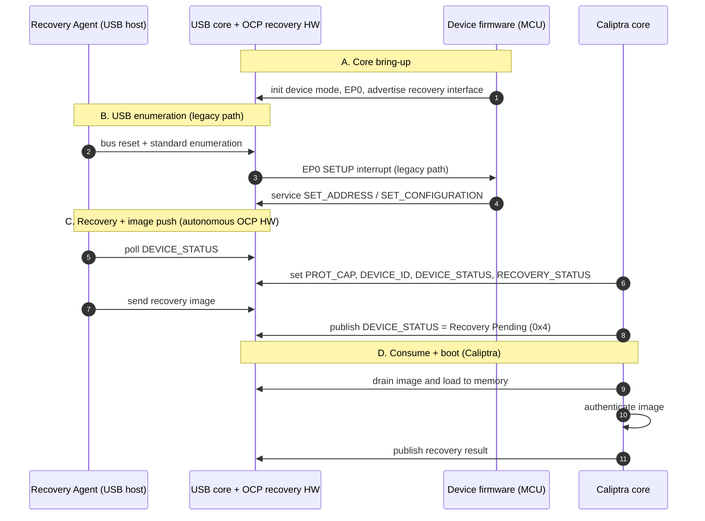
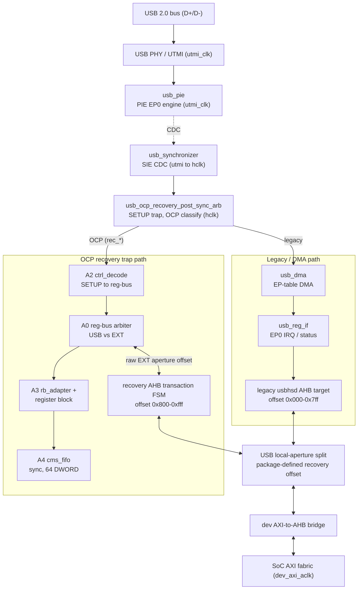
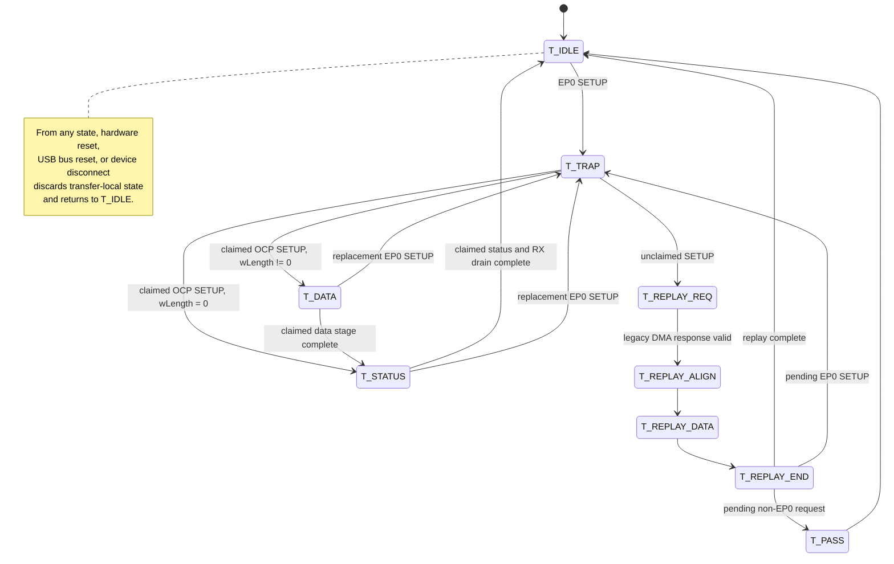

# USB2 OCP Recovery Enhancements - Microarchitecture Specification

Status: design nearly-complete (OCP Recovery arbiter architecture).

Scope: the OCP Secure Firmware Recovery enhancements added to the Caliptra
Subsystem USB 2.0 device block (`third_party/usb2`). This document describes
*definitively how the hardware is implemented in RTL* and how *production*
firmware is expected to interact with it.

> Register reference note: Section 7 below inlines the full register/field
> layout as a temporary measure. Once the generated register-reference HTML
> page is published, this inline table will be replaced with a link to it.

---

## 1. Overview and use model

The USB2 block is a USB 2.0 device controller (PIE / DMA / register-interface
SIE) that Caliptra Subsystem uses for both standard USB scenarios and for OCP Recovery.
The OCP Recovery enhancement adds a recovery interface on EP0 so that a USB **Recovery
Agent (host)** can push a firmware image into the device and have **Caliptra**
consume it. OCP "streaming boot" is the firmware-download use case of the
recovery specification.

Two use models share the same device and EP0:

- **Legacy USB.** Standard enumeration and any non-recovery control transfer are
  handled exactly as the unmodified IP would, serviced by device firmware through
  the legacy register-interface endpoint interrupt path.
- **OCP Recovery.** Recovery-class EP0 control transfers are claimed by dedicated
  hardware (`usb_ocp_recovery_top`) and serviced without per-command firmware
  intervention. Image DWORDs land in an on-chip FIFO that Caliptra drains over AXI;
  Caliptra firmware owns recovery progress and the Recovery Agent-visible status.

Both models are simultaneously available once the device is enumerated; the OCP
path can be globally disabled by a safety fallback bit (Section 4).

The device presents a recovery interface with `bInterfaceClass=0xEF`,
`bInterfaceSubClass=0x08`, `bInterfaceProtocol=0x01`, and an OCP Recovery
functional descriptor (type `0x24`, subtype `0x01`, `bcdOCPRecVersion=0x0110`)
advertising `wMaxWrTransferSize` and `wMaxRdTransferSize`. Each OCP command maps
to exactly one EP0 control transfer, classified from the SETUP encoding:
`bmRequestType[6:5]=01` (Class), `[4:0]=00001` (Interface), `bRequest=0x00`
(`OCP_RECOVERY_TRANSFER`), `wValue[7:0]` = OCP command ID, `wIndex[7:0]` =
recovery interface number.

---

## 2. High-level recovery flow

> Refer to companion document: [`../CaliptraSSUSBRecoveryDiagram.md`](../CaliptraSSUSBRecoveryDiagram.md)
> for the command-level, actor-oriented protocol flow.

1. **A - Core bring-up.** Device firmware initializes the USB controller in device
   mode and advertises the recovery interface (Section 5).
2. **B - Enumeration (legacy path).** The host resets and enumerates. Standard EP0
   SETUPs raise the legacy endpoint interrupt and are serviced by device firmware
   until the device is configured.
3. **C - Recovery + image push (autonomous).** The host reads recovery
   capabilities/status and streams the image into the CMS FIFO via
   `INDIRECT_FIFO_DATA`. These OCP-class transfers are claimed and serviced
   entirely by `usb_ocp_recovery_top`; firmware is not involved per command.
4. **D - Consume + boot (Caliptra).** Caliptra waits for `payload_available`,
   publishes the corresponding `DEVICE_STATUS` transition, drains
   `INDIRECT_FIFO_DATA` over AXI, authenticates the image, publishes the result,
   and clears `RECOVERY_CTRL.ACTIVATE_REC_IMG` after consumption.

---

## 3. Microarchitecture

Blocks A0/A2-A4 are internal to `usb_ocp_recovery_top` (clock domains are listed in
Section 3.1). The SoC reaches both the legacy controller and recovery aperture
through the same device AXI-to-AHB bridge (bottom). The split and the recovery
AHB transaction FSM live in the integration wrapper. USB-sourced traffic enters
each path from the top (through the arbiter); firmware/Caliptra AXI traffic
enters the same two paths from the bottom (through the bridge), which is why
`regif` and `a0` each have a bidirectional link to their respective AHB-side
block. The wrapper performs only package-defined coarse aperture ownership
selection; it does not translate an AHB access into an OCP command.

### 3.1 Clock domains

| Domain | Blocks |
|---|---|
| `utmi_clk` (PHY/PIE) | USB PHY/UTMI, `usb_pie` EP0 protocol engine |
| `hclk == dev_axi_aclk` (SoC) | `usb_synchronizer` (hclk side), `usb_ocp_recovery_post_sync_arb`, `usb_dma`, `usb_reg_if`, all of `usb_ocp_recovery_top`, the EXT/AXI bridge |

`usb_synchronizer` is the single USB clock-domain crossing (utmi to hclk). All OCP
recovery logic runs on the SoC clock, so the recovery register and FIFO surfaces
are single-domain and require no OCP-specific CDC.

### 3.2 Reset architecture

The recovery stack receives the USB device subordinate reset directly as
`dev_axi_aresetn` and uses active-low reset naming throughout.

- **Handwritten recovery logic.** `usb_ocp_recovery_top`, A2, A3, and the handwritten
  A4 control logic use synchronous `rst_ni` logic in the `dev_axi_aclk`
  domain. A4's synchronous FIFO storage primitive receives the same
  active-low reset asynchronously. Its separate synchronous `clr_i` is the
  mechanism for a FIFO flush or transfer abort, so a batch reset does not rely on
  a reset assertion/release sequence.
- **Generated register block.** The register definitions declare `rst_ni` as an
  active-low, asynchronous reset signal and make it the default reset signal.
  Generated field storage therefore resets on the falling edge of `rst_ni`.
  `usb_ocp_recovery_top` drives the register block's `rst_ni` input from its own
  `rst_ni` input. The generated module retains a legacy active-high `rst`
  compatibility input, tied to the inverse of `rst_ni` at integration; field
  storage reset polarity is controlled by the generated active-low reset signal.
- **Assertions.** Handwritten assertion blocks are enabled only when `rst_ni` is
  high, and their temporal properties are disabled while it is low.

### 3.3 Post-synchronizer arbiter

`usb_ocp_recovery_post_sync_arb` splices into the hclk side of
`usb_synchronizer`, between the synchronizer and its two legacy consumers
(`usb_dma`, `usb_reg_if`). It:

- **Traps every EP0 SETUP** in hclk, captures the 8 payload bytes, and classifies
  it as OCP-recovery class or not using the SETUP encoding described in Section 1.
- **Claims** a recovery-class transfer: the SETUP and all downstream side effects
  are withheld from `usb_dma`/`usb_reg_if`, so the legacy path produces no SRAM
  write, descriptor update, endpoint interrupt, data-toggle change, or NAK-status
  effect. The claimed SETUP/DATA/STATUS is serviced on the `rec_*` surface into
  `usb_ocp_recovery_top`.
- **Replays** everything else bit-identically to `usb_dma`/`usb_reg_if`: any
  non-OCP EP0 SETUP, any non-EP0 transaction, and every DATA/handshake beat of an
  unclaimed transfer (transparent legacy pass-through).

Because the device must ACK the SETUP stage, a claimed SETUP is trapped and
answered with a fabricated bit-accurate response; unclaimed SETUPs are replayed
to the legacy DMA so standard enumeration is unaffected.

#### Arbiter transfer state machine

`T_TRAP` always owns the SETUP response long enough to capture and classify it.
Only `T_DATA` and `T_STATUS` own a claimed recovery transfer; those states suppress
legacy DMA/register delivery and use the recovery stack's RX/TX staging. A new EP0
SETUP abandons a claimed transfer and becomes the next trapped request. Hardware
reset, USB bus reset, or synchronized `usbreg_dev_connect` deassertion discards all
transfer-local state and returns the arbiter to `T_IDLE`.

### 3.4 `usb_ocp_recovery_top` (OCP service stack)

Clocked by `dev_axi_aclk`:

| Block | Role |
|---|---|
| **A2** ctrl_decode | Decodes the claimed EP0 SETUP/DATA into a word-wide register-bus (`rb_*`) access stream. |
| **A0** reg-bus arbiter | Arbitrates the internal register bus between the USB command side and raw EXT aperture accesses; USB has priority, EXT proceeds when USB is idle. |
| **A3** USB hardware endpoint, rb_adapter + register block | The top-level USB hardware endpoint maps USB commands to generated register-block base offsets and keeps USB traffic outside firmware CPUif. EXT accesses bypass command mapping and use their raw aperture offset directly at the generated CPU interface. |
| **A4** cms_fifo | Owns `INDIRECT_FIFO_*`; a 64-DWORD synchronous FIFO backing store for the image payload, plus `WRITE_INDEX`/`READ_INDEX`/full/empty status and batch notification. |

### 3.5 CMS image FIFO

The image data path is exposed through `INDIRECT_FIFO_*` and backed by a
synchronous 64-DWORD FIFO. `FIFO_SIZE` and `MAX_TRANSFER_SIZE` both report 64
DWORDs. `WRITE_INDEX` and `READ_INDEX` wrap modulo 64 and are debug fields:
they may be equal at both empty and full, so `FULL` and `EMPTY` are the
authoritative occupancy indicators.

The host supplies normal 64-B OUT transfers while the FIFO is available.
`payload_available` asserts when the FIFO reaches 64 DWORDs, or when a nonempty
terminal image batch completes, and remains asserted until the FIFO is empty.
Caliptra waits for this level before reading `INDIRECT_FIFO_DATA`; while it is
asserted, later FIFO DATA OUT transfers receive USB NAK until the batch drains.
The final DWORD of a non-4-byte-aligned transfer is zero-padded at the FIFO
write boundary. Caliptra uses the image byte length to ignore padding.

This design advertises the minimum single-packet transfer size,
`wMaxRdTransferSize = wMaxWrTransferSize = 64`. Because a read requests exactly
64 B and the device returns <= 64 B, every OCP DATA stage fits in a single HS
MaxPacket (64 B); large payloads are streamed as many <= 64-B
`INDIRECT_FIFO_DATA` chunks, never one large transfer.

### 3.6 EXT / AXI register + drain path

Caliptra reaches the OCP register aperture as an AXI master: SoC AXI fabric to the
device AXI-to-AHB bridge and then the package-defined recovery portion of the
local USB device aperture. For the current 4 KiB local USB window:

- `0x000-0x7ff` remains the legacy `usbhsd` register aperture.
- `0x800-0xfff` is the recovery aperture. The wrapper range-checks the
  package-defined offset and end, subtracts the package-defined base,
  DWORD-aligns the resulting raw offset, and captures it with the AHB
  transaction metadata.

The captured offset is passed as `ext_aperture_offset` into the A0/A3 path.
For EXT accesses, A3 drives that raw offset directly onto the generated CPUif
address; the generated register block performs the per-register address
decode. USB traffic remains command-based, as required by the OCP USB
transport, and A3 maps only that USB path from command plus word offset to the
generated register aperture.

The wrapper holds a raw EXT request through the AHB completion handshake and
captures the returned data/error in the completion cycle. All OCP register
reads/writes and the image drain (`INDIRECT_FIFO_DATA` reads) use this path; there
is no separate sideband drain port. EXT FIFO-data reads are held until
`payload_available` is asserted, and EXT FIFO accesses are deferred while a claimed
USB FIFO transfer owns the resource.

### 3.7 Firmware-owned recovery procedure

The hardware does not implement an OCP recovery lifecycle state machine. Caliptra
firmware owns `DEVICE_STATUS.DEV_STATUS`, `DEVICE_STATUS.REC_REASON_CODE`, all
`RECOVERY_STATUS` fields, and `HW_STATUS.FATAL_ERR` through the EXT CPU interface.
The USB Recovery Agent reads those same stored values but cannot write them. Firmware
uses the OCP-defined state and reason encodings to report recovery entry, pending
images, execution outcomes, and fatal conditions.

`RECOVERY_CTRL.ACTIVATE_REC_IMG` is a request field: the Recovery Agent sets it and
firmware clears it after it has consumed and verified the requested image.
`recovery_image_activated` is the required Caliptra streaming-boot level indication
and asserts whenever the stored `RECOVERY_CTRL.ACTIVATE_REC_IMG` value is
`0x0F`, regardless of the write source. Firmware performs any platform
boot or reset action under its own recovery procedure.

The only control-plane state in `usb_ocp_recovery_top` is the
`DEVICE_STATUS.PROT_ERROR` sticky latch. USB-only unsupported-command and host-write-
to-read-only-command decodes set it to the OCP-defined unsupported-command value.
Only a completed Recovery Agent `DEVICE_STATUS` read clears it; firmware reads are
non-destructive.

`DEVICE_RESET` remains stored until firmware consumes and clears it. In contrast,
`INDIRECT_FIFO_CTRL.RESET` atomically clears A4 FIFO state and self-clears for
subsequent readback, while `CALIPTRA_STATUS.REGION_RESET` retains the firmware-visible
sticky reset history.

---

## 4. Path enablement - legacy and OCP coexisting

Both paths are always structurally present; the arbiter routes per transfer:

- **Legacy path is never removed.** Standard enumeration and every non-recovery
  EP0 transfer are replayed to `usb_dma`/`usb_reg_if` and serviced by device
  firmware, exactly as the unmodified IP. This is what lets normal USB operation
  and OCP recovery share one device and EP0.
- **OCP path is active by default.** Once the recovery interface is advertised and
  the device is enumerated, recovery-class SETUPs are claimed automatically. There
  is no firmware "enable recovery" step; it is active whenever the device is
  configured.
- **Global override (chicken bit).** `CALIPTRA_CTRL.OCP_PATH_DISABLE` (a
  Caliptra-specific control field outside the OCP command aperture, EXT/firmware
  write-only) forces the arbiter to never claim an OCP-class SETUP, so every EP0
  transfer falls through to the legacy SIE path bit-identically to the
  un-arbitered IP. Reset default `0` (OCP recovery path active).

---

## 5. Required initialization before OCP recovery

OCP recovery is only serviceable after the USB device controller is initialized and
the device is enumerated and configured. This device-controller bring-up and
enumeration is MCU firmware's responsibility, following the general USB2 device
programming flow in the
[USB2 Programmer's Guide](https://github.com/chipsalliance/usb2/blob/main/docs/USB2_Programmers_Guide.md)
(cold-boot sequencing, device-mode/EP0 initialization, and standard enumeration).
That guide is the authoritative source for the generic controller bring-up steps;
this document only calls out the one OCP-recovery-specific requirement layered on
top of it:

- **Advertise the recovery interface** by presenting the OCP recovery
  configuration/interface/functional descriptors (Section 1) before connecting to
  the host, so the host discovers the recovery interface during enumeration.

MCU firmware also programs the pre-Caliptra placeholder contents of `PROT_CAP`,
`DEVICE_ID`, and `DEVICE_STATUS` so the interface is enumerable before Caliptra
comes online; Caliptra firmware finalizes those registers once it boots (Section 6).

Only after the device is configured are recovery-class control transfers claimed
and serviced. The OCP path itself needs no separate enable and remains active while
`OCP_PATH_DISABLE` is clear.

> Timing note: the SETUP handler and endpoint arming for a claimed transfer must
> complete inside the USB host / link-layer retry windows; production firmware must
> not stall the critical arm-and-clear sequence with slow operations.

---

## 6. Caliptra interaction (production)

Caliptra is the recovery image consumer (the OCP "Device Firmware" role). As an AXI
master it interacts with the OCP recovery register aperture:

1. **Finalize configuration.** Once Caliptra comes online, finalize the
   `PROT_CAP` capability bitmap and `DEVICE_ID` left as MCU-programmed
   placeholders, then set `DEVICE_STATUS` to a real value. This is what enables
   the recovery interface for meaningful discovery/connection by the host: until
   this point `DEVICE_STATUS` reads back the pending value MCU set, and the host
   is expected to keep polling.
2. **Detect recovery.** Set `RECOVERY_STATUS` to `0x1` (awaiting recovery image), then
   monitor `RECOVERY_CTRL` for a command from the host.
3. **Wait for a batch.** Wait for `cptra_ss_usb_recovery_payload_available_o`;
   then read the image length from `INDIRECT_FIFO_CTRL` and inspect
   `INDIRECT_FIFO_STATUS`.
4. **Drain.** Burst data from `INDIRECT_FIFO_DATA` repeatedly until the
   notified batch is empty. Each read in the burst pops one DWORD from the CMS FIFO.
5. **Authenticate.** Verify the image through Caliptra's normal secure-boot /
   authentication path.
6. **Activate / report.** On success, drive image selection and activation via
   `RECOVERY_CTRL` and boot the image; on failure, report via `RECOVERY_STATUS`.

OCP commands used on this path: `DEVICE_STATUS`, `INDIRECT_FIFO_CTRL`,
`INDIRECT_FIFO_STATUS`, `INDIRECT_FIFO_DATA`, `RECOVERY_CTRL`, `RECOVERY_STATUS`.

> Register bit-behavior scope: the per-command bit behavior defined by OCP
> (clear-on-read, RW, RO) is the contract between the Recovery Agent (USB host) and
> the device. It is not a contract for internal firmware (EXT/AXI) accesses; for
> example, `DEVICE_STATUS` Protocol-Error clear-on-read applies to host reads, not
> to Caliptra reads. Caliptra is able to write to spec-defined RO fields (such as
> RECOVERY_REASON).

---

## 7. Register aperture

The recovery register aperture is placed at offset `0x800` within the USB
register space (legacy `usbhsd` registers occupy `0x000`). Commands in the
aperture: `PROT_CAP`, `DEVICE_ID`, `DEVICE_STATUS`, `DEVICE_RESET`,
`RECOVERY_CTRL`, `RECOVERY_STATUS`, `HW_STATUS`, `INDIRECT_FIFO_CTRL`,
`INDIRECT_FIFO_STATUS`, `INDIRECT_FIFO_DATA`, plus the Caliptra-specific
`CALIPTRA_CTRL` (`OCP_PATH_DISABLE`) and `CALIPTRA_STATUS`
(`REGION_RESET`, `OVERFLOW`, `IMAGE_DONE`, `BATCH_ABORTED`).

The tables below give the byte offset, bit range, access type, reset value, and
description for every field in the aperture.

#### Recovery Protocol Capabilities (`PROT_CAP`) - offset 0x800

Advertises recovery-protocol capabilities. Host-read-only: a host write is rejected and sets DEVICE_STATUS.PROT_ERROR. Firmware configures the advertised capability bits at boot.

| Byte offset | Bits | Field | Access | Reset | Description |
|---|---|---|---|---|---|
| 0x800 | [31:0] | REC_MAGIC_STRING_0 | RO | 0x2050434F | ASCII bytes 0-3 of the "OCP RECV" recovery-protocol magic string. |
| 0x804 | [31:0] | REC_MAGIC_STRING_1 | RO | 0x56434552 | ASCII bytes 4-7 of the "OCP RECV" recovery-protocol magic string. |
| 0x808 | [15:0] | REC_PROT_VERSION | RO | 0x0101 | Recovery protocol version: major=1, minor=1. |
| 0x808 | [16] | AGENT_CAPS_IDENTIFICATION | RW | 0x1 | Capability bit: DEVICE_ID supported. |
| 0x808 | [17] | AGENT_CAPS_FORCED_RECOVERY | RW | 0x1 | Capability bit: forced-recovery-from-reset supported. |
| 0x808 | [18] | AGENT_CAPS_MGMT_RESET | RW | 0x0 | Capability bit: management reset. Not supported. |
| 0x808 | [19] | AGENT_CAPS_DEVICE_RESET | RW | 0x1 | Capability bit: DEVICE_RESET command supported. |
| 0x808 | [20] | AGENT_CAPS_DEVICE_STATUS | RW | 0x1 | Capability bit: DEVICE_STATUS command supported. |
| 0x808 | [21] | AGENT_CAPS_RECOVERY_MEM_ACCESS | RW | 0x0 | Capability bit: direct CMS-memory window. Not implemented (this agent is FIFO-only). |
| 0x808 | [22] | AGENT_CAPS_LOCAL_C_IMAGE | RW | 0x0 | Capability bit: local C-image support. Not supported. |
| 0x808 | [23] | AGENT_CAPS_PUSH_C_IMAGE | RW | 0x1 | Capability bit: push C-image (FIFO streaming boot) supported. |
| 0x808 | [24] | AGENT_CAPS_INTERFACE_ISOLATION | RW | 0x0 | Capability bit: interface isolation. Not supported. |
| 0x808 | [25] | AGENT_CAPS_HARDWARE_STATUS | RW | 0x1 | Capability bit: HW_STATUS command supported. |
| 0x808 | [26] | AGENT_CAPS_VENDOR_COMMAND | RW | 0x1 | Capability bit: VENDOR command supported. |
| 0x808 | [27] | AGENT_CAPS_FLASHLESS_BOOT | RW | 0x1 | Capability bit: flashless boot supported (enter via DEVICE_RESET.FORCED_RECOVERY=0xE). |
| 0x808 | [28] | AGENT_CAPS_FIFO_CMS_SUPPORT | RW | 0x1 | Capability bit: Indirect FIFO CMS transport supported. |
| 0x808 | [31:29] | AGENT_CAPS_RESERVED | RO | 0x0 | Reserved. |
| 0x80C | [7:0] | NUM_OF_CMS_REGIONS | RW | 0x01 | Number of component memory spaces advertised. One FIFO-backed CMS region. |
| 0x80C | [15:8] | MAX_RESP_TIME | RW | 0x00 | Maximum command response time, in 2^N microseconds. |
| 0x80C | [23:16] | HEARTBEAT_PERIOD | RW | 0x00 | Heartbeat period, in 2^N microseconds. 0 = not supported. |
| 0x80C | [31:24] | RESERVED_31_24 | RO | 0x00 | Reserved. |

#### Device Identification (`DEVICE_ID`) - offset 0x810

Reports device identification data. Read-only to both host and firmware; every field is driven by a fixed hardware parameter (no runtime hardware or firmware write path).

| Byte offset | Bits | Field | Access | Reset | Description |
|---|---|---|---|---|---|
| 0x810 | [7:0] | DESC_TYPE | RO | 0x00 | Selects the DEVICE_ID descriptor encoding (PCI, IANA, UUID, PnP, ACPI, NVMe-MI, etc). Driven by a fixed hardware parameter. |
| 0x810 | [15:8] | VENDOR_SPECIFIC_STR_LENGTH | RO | 0x00 | Length of the optional vendor-specific descriptor string. Driven by a fixed hardware parameter. |
| 0x810 | [31:16] | DATA_3_2 | RO | 0x0000 | First descriptor-specific payload bytes for the selected DEVICE_ID type. Driven by a fixed hardware parameter. |
| 0x814 | [31:0] | DATA_7_4 | RO | 0x00000000 | Descriptor-specific DEVICE_ID payload bytes 4-7. Driven by a fixed hardware parameter. |
| 0x818 | [31:0] | DATA_11_8 | RO | 0x00000000 | Descriptor-specific DEVICE_ID payload bytes 8-11. Driven by a fixed hardware parameter. |
| 0x81C | [31:0] | DATA_15_12 | RO | 0x00000000 | Descriptor-specific DEVICE_ID payload bytes 12-15. Driven by a fixed hardware parameter. |
| 0x820 | [31:0] | DATA_19_16 | RO | 0x00000000 | Descriptor-specific DEVICE_ID payload bytes 16-19. Driven by a fixed hardware parameter. |
| 0x824 | [31:0] | DATA_23_20 | RO | 0x00000000 | Descriptor-specific DEVICE_ID payload bytes 20-23. Driven by a fixed hardware parameter. |

#### Device Status (`DEVICE_STATUS`) - offset 0x828

Reports device health and recovery progress. DEV_STATUS and REC_REASON_CODE are firmware-owned via cpuif (Caliptra publishes recovery-state transitions here). PROT_ERROR, HEARTBEAT, and the VENDOR_STATUS payload bytes are driven directly by hardware; firmware and the Recovery Agent only read them (PROT_ERROR is additionally sticky and host-read-clearing).

| Byte offset | Bits | Field | Access | Reset | Description |
|---|---|---|---|---|---|
| 0x828 | [7:0] | DEV_STATUS | RW | 0x01 | Device health / recovery state. Firmware-owned via cpuif; the Recovery Agent reads the same stored value. |
| 0x828 | [15:8] | PROT_ERROR | RO | 0x00 | Protocol-error code, set by hardware on an unsupported/invalid USB command. Sticky until a completed Recovery Agent read clears it; firmware reads are non-destructive. |
| 0x828 | [31:16] | REC_REASON_CODE | RW | 0x0000 | 16-bit recovery reason code. Firmware-owned via cpuif; the Recovery Agent reads the same stored value. |
| 0x82C | [15:0] | HEARTBEAT | RO | 0x0000 | Heartbeat counter. Driven by hardware. |
| 0x82C | [23:16] | VENDOR_STATUS_LENGTH | RO | 0x00 | Length of the vendor-status payload. Driven by hardware. |
| 0x82C | [31:24] | VENDOR_STATUS_0 | RO | 0x00 | Vendor-status payload byte 0. Driven by hardware. |
| 0x830 | [31:0] | VENDOR_STATUS_4_1 | RO | 0x00000000 | Vendor-status payload bytes 1-4. Driven by hardware. |
| 0x834 | [31:0] | VENDOR_STATUS_8_5 | RO | 0x00000000 | Vendor-status payload bytes 5-8. Driven by hardware. |
| 0x838 | [31:0] | VENDOR_STATUS_12_9 | RO | 0x00000000 | Vendor-status payload bytes 9-12. Driven by hardware. |
| 0x83C | [31:0] | VENDOR_STATUS_16_13 | RO | 0x00000000 | Vendor-status payload bytes 13-16. Driven by hardware. |
| 0x840 | [31:0] | VENDOR_STATUS_20_17 | RO | 0x00000000 | Vendor-status payload bytes 17-20. Driven by hardware. |
| 0x844 | [31:0] | VENDOR_STATUS_24_21 | RO | 0x00000000 | Vendor-status payload bytes 21-24. Driven by hardware. |
| 0x848 | [31:0] | VENDOR_STATUS_28_25 | RO | 0x00000000 | Vendor-status payload bytes 25-28. Driven by hardware. |
| 0x84C | [31:0] | VENDOR_STATUS_32_29 | RO | 0x00000000 | Vendor-status payload bytes 29-32. Driven by hardware. |
| 0x850 | [31:0] | VENDOR_STATUS_36_33 | RO | 0x00000000 | Vendor-status payload bytes 33-36. Driven by hardware. |
| 0x854 | [31:0] | VENDOR_STATUS_40_37 | RO | 0x00000000 | Vendor-status payload bytes 37-40. Driven by hardware. |
| 0x858 | [31:0] | VENDOR_STATUS_44_41 | RO | 0x00000000 | Vendor-status payload bytes 41-44. Driven by hardware. |
| 0x85C | [31:0] | VENDOR_STATUS_48_45 | RO | 0x00000000 | Vendor-status payload bytes 45-48. Driven by hardware. |
| 0x860 | [31:0] | VENDOR_STATUS_52_49 | RO | 0x00000000 | Vendor-status payload bytes 49-52. Driven by hardware. |
| 0x864 | [31:0] | VENDOR_STATUS_56_53 | RO | 0x00000000 | Vendor-status payload bytes 53-56. Driven by hardware. |

#### Device Reset (`DEVICE_RESET`) - offset 0x868

Requests a device or management reset, and controls forced-recovery / flashless-boot entry on the next platform reset. Written by the Recovery Agent via the hardware command path; firmware can read or clear the stored request over the EXT interface.

| Byte offset | Bits | Field | Access | Reset | Description |
|---|---|---|---|---|---|
| 0x868 | [7:0] | RESET_CTRL | RW | 0x00 | Requests a device reset or management reset. Written by the Recovery Agent; firmware can read or clear the request. |
| 0x868 | [15:8] | FORCED_RECOVERY | RW | 0x00 | Controls forced recovery / flashless boot on the next platform reset (0xE = flashless boot, 0xF = recovery mode). |
| 0x868 | [23:16] | IF_CTRL | RW | 0x00 | Interface-mastering enable control. |
| 0x868 | [31:24] | RESERVED_31_24 | RO | 0x00 | Reserved padding (not part of the 3-byte command payload). |

#### Recovery Control (`RECOVERY_CTRL`) - offset 0x86C

Selects and activates a recovery image. ACTIVATE_REC_IMG is a request field: the Recovery Agent sets it (0x0F) and firmware clears it once the image is consumed and verified.

| Byte offset | Bits | Field | Access | Reset | Description |
|---|---|---|---|---|---|
| 0x86C | [7:0] | CMS | RW | 0x00 | Selects the component memory space containing the recovery image. |
| 0x86C | [15:8] | REC_IMG_SEL | RW | 0x00 | Selects memory-window vs. device-stored recovery image source. |
| 0x86C | [23:16] | ACTIVATE_REC_IMG | RW | 0x00 | Requests activation of the selected recovery image. Recovery Agent writes 0x0F; firmware clears the stored request after consuming it. |
| 0x86C | [31:24] | RESERVED_31_24 | RO | 0x00 | Reserved padding (not part of the 3-byte command payload). |

#### Recovery Status (`RECOVERY_STATUS`) - offset 0x870

Reports recovery outcome. Firmware-owned; the Recovery Agent reads the same stored value.

| Byte offset | Bits | Field | Access | Reset | Description |
|---|---|---|---|---|---|
| 0x870 | [3:0] | DEV_REC_STATUS | RW | 0x0 | Recovery status code. Firmware-owned; the Recovery Agent reads the same stored value. |
| 0x870 | [7:4] | REC_IMG_INDEX | RW | 0x0 | Index of the recovery image being reported on. |
| 0x870 | [15:8] | VENDOR_SPECIFIC_STATUS | RW | 0x00 | Vendor-specific recovery status. |
| 0x870 | [31:16] | RESERVED_31_16 | RO | 0x0000 | Reserved padding. |

#### Hardware Status (`HW_STATUS`) - offset 0x874

Reports hardware health. Firmware-owned; the Recovery Agent reads the same stored value.

| Byte offset | Bits | Field | Access | Reset | Description |
|---|---|---|---|---|---|
| 0x874 | [0] | TEMP_CRITICAL | RW | 0x0 | Temperature-critical indication. |
| 0x874 | [1] | SOFT_ERR | RW | 0x0 | Hardware soft-error indication. |
| 0x874 | [2] | FATAL_ERR | RW | 0x0 | Hardware fatal-error indication. Firmware-owned. |
| 0x874 | [7:3] | RESERVED_7_3 | RW | 0x00 | Reserved. |
| 0x874 | [15:8] | VENDOR_HW_STATUS | RW | 0x00 | Vendor-defined hardware status bitmap. |
| 0x874 | [23:16] | CTEMP | RW | 0x00 | Composite temperature reading. |
| 0x874 | [31:24] | VENDOR_HW_STATUS_LEN | RW | 0x00 | Length of the vendor hardware-status payload. |

#### Indirect FIFO Control (`INDIRECT_FIFO_CTRL`) - offset 0x984

Selects the FIFO-backed CMS region, resets the FIFO indices, and programs the expected image size (in DWORDs).

| Byte offset | Bits | Field | Access | Reset | Description |
|---|---|---|---|---|---|
| 0x984 | [7:0] | CMS | RW | 0x00 | Selects the FIFO-backed component memory space. |
| 0x984 | [15:8] | RESET | RW | 0x00 | Write 1 to reset the FIFO read/write indices; self-clears after the reset is applied. |
| 0x984 | [31:16] | RESERVED_31_16 | RO | 0x0000 | Reserved. |
| 0x988 | [31:0] | IMAGE_SIZE | RW | 0x00000000 | Image size to load, in 4-byte (DWORD) units. |

#### Indirect FIFO Status (`INDIRECT_FIFO_STATUS`) - offset 0x98C

Reports image FIFO occupancy and capabilities. EMPTY/FULL are authoritative; WRITE_INDEX/READ_INDEX are debug fields that wrap modulo the FIFO depth and may be equal at both empty and full.

| Byte offset | Bits | Field | Access | Reset | Description |
|---|---|---|---|---|---|
| 0x98C | [0] | EMPTY | RO | 0x1 | FIFO-empty indicator. Authoritative occupancy flag (preferred over comparing indices). |
| 0x98C | [1] | FULL | RO | 0x0 | FIFO-full indicator. Authoritative occupancy flag (preferred over comparing indices). |
| 0x98C | [7:2] | RESERVED_7_2 | RO | 0x0 | Reserved. |
| 0x98C | [15:8] | REGION_TYPE | RO | 0x00 | Selected FIFO region type. Returns 0x00 (code space) in this implementation. |
| 0x98C | [31:16] | RESERVED_31_16 | RO | 0x0000 | Reserved. |
| 0x990 | [31:0] | WRITE_INDEX | RO | 0x00000000 | FIFO write index, in 4-byte units. Debug field; wraps modulo the FIFO depth (use EMPTY/FULL for occupancy). |
| 0x994 | [31:0] | READ_INDEX | RO | 0x00000000 | FIFO read index, in 4-byte units. Debug field; wraps modulo the FIFO depth (use EMPTY/FULL for occupancy). |
| 0x998 | [31:0] | FIFO_SIZE | RO | 0x00000000 | Total FIFO depth, in 4-byte units (64 DWORDs backing store). |
| 0x99C | [31:0] | MAX_TRANSFER_SIZE | RO | 0x00000000 | Maximum single-transfer size, in 4-byte units (64 DWORDs). |

#### Indirect FIFO Data (`INDIRECT_FIFO_DATA`) - offset 0x9A0

Image data FIFO. The Recovery Agent writes DWORDs over USB; Caliptra reads (and pops) DWORDs over the EXT/AXI path.

| Byte offset | Bits | Field | Access | Reset | Description |
|---|---|---|---|---|---|
| 0x9A0 | [31:0] | DATA | RO | 0x00000000 | FIFO head DWORD. Each firmware read pops exactly one entry from the image FIFO. |

#### Vendor (`VENDOR`) - offset 0x9A4

Reserved placeholder for a future vendor-defined command.

| Byte offset | Bits | Field | Access | Reset | Description |
|---|---|---|---|---|---|
| 0x9A4 | [7:0] | VENDOR_DATA | RW | 0x00 | Placeholder byte for the vendor-defined command space (reserved for future use). |
| 0x9A4 | [31:8] | RESERVED_31_8 | RO | 0x000000 | Reserved padding. |

#### Caliptra-specific Control (`CALIPTRA_CTRL`) - offset 0xA00

Caliptra-specific control bits outside the OCP command aperture. Firmware/EXT write-only; not reachable by the USB host command decode.

| Byte offset | Bits | Field | Access | Reset | Description |
|---|---|---|---|---|---|
| 0xA00 | [0] | OCP_PATH_DISABLE | RW | 0x0 | Emergency fallback: when set, forces every EP0 transfer through the legacy path and disables OCP recovery classification. Firmware/EXT write-only; a USB-host write is ignored. Reset default 0 (recovery path active). |
| 0xA00 | [31:1] | RESERVED_31_1 | RO | 0x0 | Reserved for future Caliptra-specific control bits. |

#### Caliptra-specific Status (`CALIPTRA_STATUS`) - offset 0xA04

Caliptra-specific sticky FIFO status bits outside the OCP command aperture.

| Byte offset | Bits | Field | Access | Reset | Description |
|---|---|---|---|---|---|
| 0xA04 | [0] | REGION_RESET | RO | 0x0 | Sticky: set when an INDIRECT_FIFO_CTRL region reset occurs; cleared on the next region reset. |
| 0xA04 | [1] | OVERFLOW | RO | 0x0 | Sticky: set on a genuine FIFO-full overflow drop while the image is still incomplete. |
| 0xA04 | [2] | IMAGE_DONE | RO | 0x0 | Sticky: set when the pushed DWORD count reaches the programmed image size. |
| 0xA04 | [3] | BATCH_ABORTED | RO | 0x0 | Sticky: set when a new EP0 SETUP aborts a claimed FIFO OUT transfer, flushing the unconsumed batch. Cleared by an INDIRECT_FIFO_CTRL reset. |
| 0xA04 | [31:4] | RESERVED_31_4 | RO | 0x0 | Reserved for future Caliptra-specific status bits. |

#### Window Size Padding (`WINDOW_PAD`) - offset 0xFFC

Padding-only register forcing the recovery aperture to occupy a natural 2 KiB address window.

| Byte offset | Bits | Field | Access | Reset | Description |
|---|---|---|---|---|---|
| 0xFFC | [31:0] | DATA | RO | 0x00000000 | Padding only, forces the register block to occupy a natural 2 KiB window. Not part of the OCP Recovery register set. |

---

## 8. Key invariants

- **Single-packet OCP DATA.** Advertised `wMaxRd/WrTransferSize = 64`, so each OCP
  read/write DATA stage is at most one HS MaxPacket (64 B). Enforced by an arbiter
  assertion on IN response bytes and OUT byte count.
- **Legacy transparency.** A claimed transfer produces zero legacy side effects; an
  unclaimed transfer is replayed bit-identically. Standard enumeration is
  unaffected whether or not `OCP_PATH_DISABLE` is set.
- **Batch integrity.** A superseding SETUP or bus reset during a claimed FIFO OUT
  transfer clears A2/A4 state, flushes the unconsumed batch, and sets
  `CALIPTRA_STATUS.BATCH_ABORTED`. A host CRC error or lost-ACK retry does not
  create a duplicate FIFO write.
- **SETUP handshake.** The device always ACKs the SETUP stage; claimed SETUPs are
  trapped and answered, never NAK/STALLed at the SETUP stage.

---

## 9. Companion documentation

- Protocol-flow companion: [`../CaliptraSSUSBRecoveryDiagram.md`](../CaliptraSSUSBRecoveryDiagram.md)
