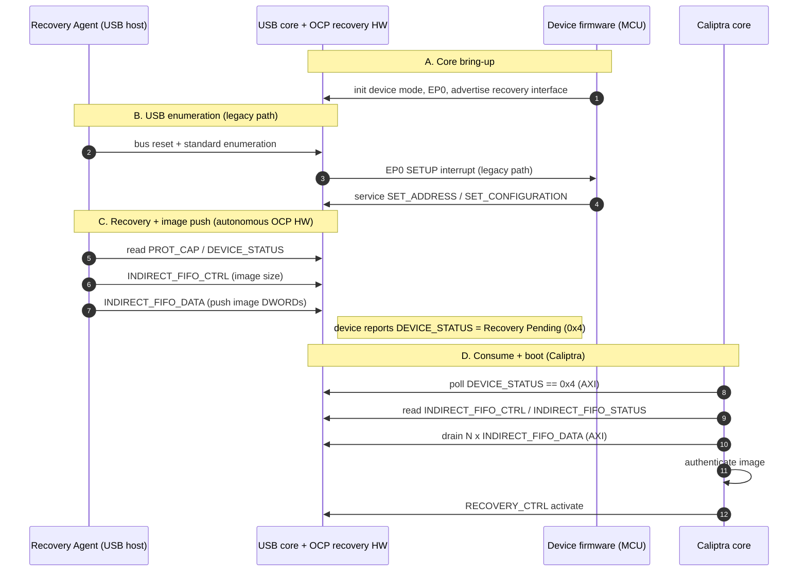
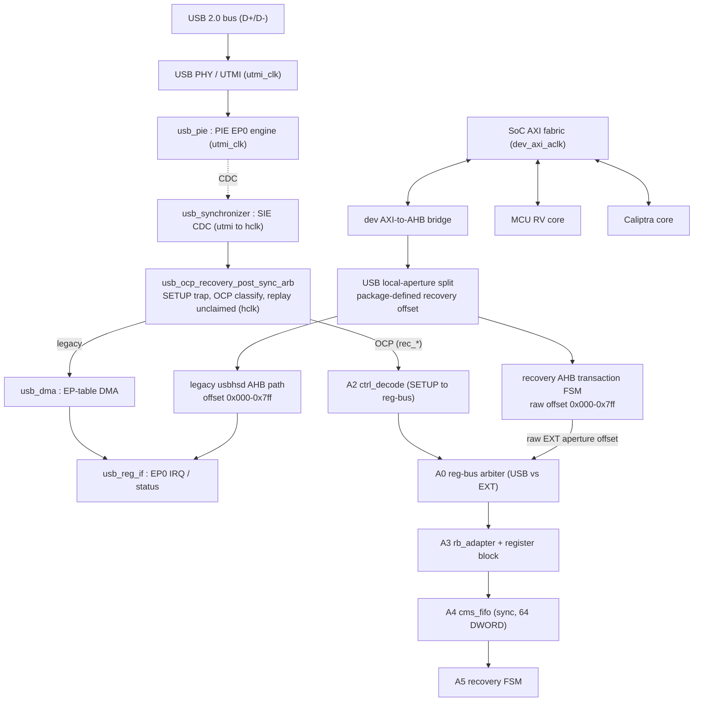
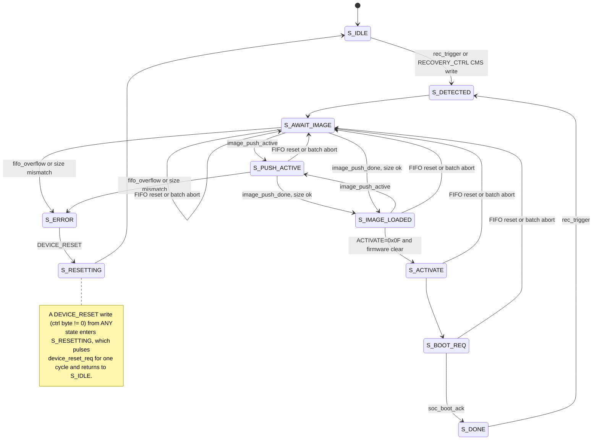

# USB2 OCP Recovery Enhancements - Microarchitecture Specification

Status: design complete (post-synchronizer arbiter architecture).

Scope: the OCP Secure Firmware Recovery enhancements added to the Caliptra
Subsystem USB 2.0 device block (`third_party/usb2`). This document describes
*definitively how the hardware is implemented in RTL* and how *production*
firmware is expected to interact with it. It does not restate the register field
layout (see the register reference in Section 8), and it does not describe the
repository's validation/stimulus firmware.

> Companion document: [`../CaliptraSSUSBRecoveryDiagram.md`](../CaliptraSSUSBRecoveryDiagram.md)
> gives the command-level, actor-oriented protocol flow.

---

## 1. Overview and use model

The USB2 block is a USB 2.0 device controller (PIE / DMA / register-interface
SIE) that Caliptra Subsystem uses for both standard USB scenarios and for OCP Recovery.
The OCP Recovery enhancement adds a recovery interface on EP0 so that a USB **Recovery
Agent (host)** can push a firmware image into the device and have **Caliptra**
consume it. OCP "streaming boot" is the firmware-download use case of the
recovery specification.

Two use models share the same device and EP0:

- **Legacy USB.** Standard enumeration and any non-recovery control transfer are
  handled exactly as the unmodified IP would, serviced by device firmware through
  the legacy register-interface endpoint interrupt path.
- **OCP Recovery.** Recovery-class EP0 control transfers are claimed by dedicated
  hardware (`usb_ocp_recovery_top`) and serviced autonomously, with no per-command
  firmware intervention. Image DWORDs land in an on-chip FIFO that Caliptra drains
  over AXI.

Both models are simultaneously available once the device is enumerated; the OCP
path can be globally disabled by a safety fallback bit (Section 5).

---

## 2. Specification compliance

| Specification | Where it applies |
|---|---|
| **OCP Secure Firmware Recovery v1.1** | Command set and semantics (Sec 9.2), Indirect Memory / FIFO CMS data path (Sec 8.2), USB transport binding (Sec 8.5). |
| **USB 2.0** | Control-transfer model (Sec 5.5), SETUP handshake rules - a function must ACK a SETUP and may not NAK/STALL the SETUP stage (Sec 8.4.6.4), SETUP/DATA/STATUS phasing and abandon-on-new-SETUP (Sec 8.5.3), SETUP byte layout (Sec 9.3, Table 9-2). |

OCP v1.1 Sec 8.5 binding facts realized by the design:

- **Recovery interface (Sec 8.5.2 / 8.5.4).** The device presents a recovery
  interface with `bInterfaceClass=0xEF`, `bInterfaceSubClass=0x08`,
  `bInterfaceProtocol=0x01`, and an OCP Recovery functional descriptor
  (type `0x24`, subtype `0x01`, `bcdOCPRecVersion=0x0110`) advertising
  `wMaxWrTransferSize` and `wMaxRdTransferSize`.
- **Command-to-transfer mapping (Sec 8.5.1).** One OCP command is one EP0 control
  transfer. The arbiter classifies a recovery-class transfer by SETUP encoding:
  `bmRequestType[6:5]=01` (Class), `[4:0]=00001` (Interface), `bRequest=0x00`
  (`OCP_RECOVERY_TRANSFER`), `wValue[7:0]` = OCP command ID, `wIndex[7:0]` =
  recovery interface number.
- **Transfer size / single packet.** This design advertises the Sec 8.5 minimum,
  `wMaxRdTransferSize = wMaxWrTransferSize = 64`. Because a read requests exactly
  64 B and the device returns <= 64 B, every OCP DATA stage fits in a single HS
  MaxPacket (64 B); large payloads are streamed as many <= 64-B
  `INDIRECT_FIFO_DATA` chunks, never one large transfer.

---

## 3. High-level recovery flow

1. **A - Core bring-up.** Device firmware initializes the USB controller in device
   mode and advertises the recovery interface (Section 6).
2. **B - Enumeration (legacy path).** The host resets and enumerates. Standard EP0
   SETUPs raise the legacy endpoint interrupt and are serviced by device firmware
   until the device is configured.
3. **C - Recovery + image push (autonomous).** The host reads recovery
   capabilities/status and streams the image into the CMS FIFO via
   `INDIRECT_FIFO_DATA`. These OCP-class transfers are claimed and serviced
   entirely by `usb_ocp_recovery_top`; firmware is not involved per command.
4. **D - Consume + boot (Caliptra).** Caliptra, acting as the recovery image
   consumer, detects the recovery-pending state via `DEVICE_STATUS`, drains
   `INDIRECT_FIFO_DATA` over AXI, authenticates the image, and activates it via
   `RECOVERY_CTRL` (Section 7).

---

## 4. Microarchitecture

Blocks A2-A5 are internal to `usb_ocp_recovery_top` (clock domains are listed in
Section 4.1). The SoC reaches both the legacy controller and recovery aperture
through the same device AXI-to-AHB bridge. The wrapper performs only
package-defined coarse aperture ownership selection; it does not translate an
AHB access into an OCP command.

### 4.1 Clock domains

| Domain | Blocks |
|---|---|
| `utmi_clk` (PHY/PIE) | USB PHY/UTMI, `usb_pie` EP0 protocol engine |
| `hclk == dev_axi_aclk` (SoC) | `usb_synchronizer` (hclk side), `usb_ocp_recovery_post_sync_arb`, `usb_dma`, `usb_reg_if`, all of `usb_ocp_recovery_top`, the EXT/AXI bridge |

`usb_synchronizer` is the single USB clock-domain crossing (utmi to hclk). All OCP
recovery logic runs on the SoC clock, so the recovery register and FIFO surfaces
are single-domain and require no OCP-specific CDC.

### 4.2 Reset architecture

The recovery stack receives the USB device subordinate reset directly as
`dev_axi_aresetn` and uses active-low reset naming throughout.

- **Handwritten recovery logic.** `usb_ocp_recovery_top`, A2, A3, the handwritten
  A4 control logic, and A5 use synchronous `rst_ni` logic in the `dev_axi_aclk`
  domain. A4's `caliptra_prim_fifo_sync` storage primitive receives the same
  active-low reset asynchronously. Its separate synchronous `clr_i` is the
  mechanism for a FIFO flush or transfer abort, so a batch reset does not rely on
  a reset assertion/release sequence.
- **Generated register block.** The RDL declares `rst_ni` as an
  `activelow`, `async` reset signal and makes it the default `resetsignal`.
  PeakRDL-generated field storage therefore resets on
  `negedge hwif_in.rst_ni`. `usb_ocp_recovery_top` drives
  `rb_hwif_in.rst_ni` from its `rst_ni` input. The
  generated module retains a legacy active-high `rst` compatibility input, tied
  to `~rst_ni` at integration; field storage reset polarity is controlled by the
  RDL-generated `hwif_in.rst_ni` signal.
- **Assertions.** Handwritten assertion blocks are enabled only when `rst_ni` is
  high, and their temporal properties are disabled while it is low.

### 4.3 Post-synchronizer arbiter

`usb_ocp_recovery_post_sync_arb`
(`third_party/usb2/src/ip_xxx_3511/RTL/usb_ocp_recovery_post_sync_arb.{e,m}.vhdl`)
splices into the hclk side of `usb_synchronizer`, between the synchronizer and its
two legacy consumers (`usb_dma`, `usb_reg_if`). It:

- **Traps every EP0 SETUP** in hclk, captures the 8 payload bytes, and classifies
  it as OCP-recovery class or not (Sec 8.5.1 encoding in Section 2).
- **Claims** a recovery-class transfer: the SETUP and all downstream side effects
  are withheld from `usb_dma`/`usb_reg_if`, so the legacy path produces no SRAM
  write, descriptor update, endpoint interrupt, data-toggle change, or NAK-status
  effect. The claimed SETUP/DATA/STATUS is serviced on the `rec_*` surface into
  `usb_ocp_recovery_top`.
- **Replays** everything else bit-identically to `usb_dma`/`usb_reg_if`: any
  non-OCP EP0 SETUP, any non-EP0 transaction, and every DATA/handshake beat of an
  unclaimed transfer (transparent legacy pass-through).

Because the device must ACK the SETUP stage (USB 2.0 Sec 8.4.6.4), a claimed SETUP
is trapped and answered with a fabricated bit-accurate response; unclaimed SETUPs
are replayed to the legacy DMA so standard enumeration is unaffected.

### 4.4 `usb_ocp_recovery_top` (OCP service stack)

Clocked by `dev_axi_aclk`
(`third_party/usb2/src/integration/rtl/usb_ocp_recovery_top.sv`):

| Block | File | Role |
|---|---|---|
| **A2** ctrl_decode | `usb_ocp_recovery_ctrl_decode.sv` | Decodes the claimed EP0 SETUP/DATA into a word-wide register-bus (`rb_*`) access stream. |
| **A0** reg-bus arbiter | (in `usb_ocp_recovery_top.sv`) | Arbitrates the internal register bus between the USB command side and raw EXT aperture accesses; USB has priority, EXT proceeds when USB is idle. |
| **A3** rb_adapter + register block | `usb_ocp_recovery_rb_adapter.sv`, `usb_ocp_recovery_hwif_adapter.sv`, register block | Maps USB commands to RDL-derived base offsets. EXT accesses bypass this command mapping and use their raw aperture offset directly at the generated CPU interface. |
| **A4** cms_fifo | `usb_ocp_recovery_cms_fifo.sv` | Owns `INDIRECT_FIFO_*`; a 64-DWORD synchronous FIFO backing store for the image payload, plus `WRITE_INDEX`/`READ_INDEX`/full/empty status. |
| **A5** fsm | `usb_ocp_recovery_fsm.sv` | Recovery state, `RECOVERY_CTRL.ACTIVATE` handling, `PROTOCOL_ERROR` latch, image accounting. |

### 4.5 CMS image FIFO

The image data path is exposed through `INDIRECT_FIFO_*` and backed by a
synchronous 64-DWORD FIFO. `FIFO_SIZE` and `MAX_TRANSFER_SIZE` both report 64
DWORDs. `WRITE_INDEX` and `READ_INDEX` wrap modulo 64 and are debug fields:
they may be equal at both empty and full, so `FULL` and `EMPTY` are the
authoritative occupancy indicators.

The host supplies normal 64-B OUT transfers while the FIFO is available.
`payload_available` asserts when the FIFO reaches 64 DWORDs, or when a nonempty
terminal image batch completes, and remains asserted until the FIFO is empty.
Caliptra waits for this level before reading `INDIRECT_FIFO_DATA`; while it is
asserted, later FIFO DATA OUT transfers receive USB NAK until the batch drains.
The final DWORD of a non-4-byte-aligned transfer is zero-padded at the FIFO
write boundary. Caliptra uses the image byte length to ignore padding.

### 4.6 EXT / AXI register + drain path

Caliptra reaches the OCP register aperture as an AXI master: SoC AXI fabric to the
device AXI-to-AHB bridge and then the package-defined recovery portion of the
local USB device aperture. `usb_ocp_recovery_pkg` is the source of truth:
`OCP_RECOVERY_APERTURE_OFFSET_BYTES`, `OCP_RECOVERY_APERTURE_SIZE_BYTES`, and
the derived `OCP_RECOVERY_APERTURE_ADDR_W` define the split and raw offset
width. For the current 4 KiB local USB window:

- `0x000-0x7ff` remains the legacy `usbhsd` register aperture.
- `0x800-0xfff` is the recovery aperture. The wrapper range-checks the
  package-defined offset and end, subtracts the package-defined base,
  DWORD-aligns the resulting raw offset, and captures it with the AHB
  transaction metadata.

The captured offset is passed as `ext_aperture_offset` into the A0/A3 path.
For EXT accesses, A3 drives that raw offset directly onto the generated CPUif
address; the generated RDL register block performs the per-register address
decode. The old wrapper table that converted an AHB address to an OCP command and
command-relative offset has been removed. USB traffic remains command-based, as
required by the OCP USB transport, and A3 maps only that USB path from command plus
word offset to the RDL aperture.

The wrapper holds a raw EXT request through the AHB completion handshake and
captures the returned data/error in the completion cycle. All OCP register
reads/writes and the image drain (`INDIRECT_FIFO_DATA` reads) use this path; there
is no separate sideband drain port. EXT FIFO-data reads are held until
`payload_available` is asserted, and EXT FIFO accesses are deferred while a claimed
USB FIFO transfer owns the resource.

### 4.7 Recovery state machine (block A5)

The recovery FSM (`usb_ocp_recovery_fsm.sv`) implements the OCP v1.1 Sec 6 recovery
process. It consumes control-field write strobes from the register block (A3) and
image-push progress from the CMS FIFO (A4), sequences the recovery, and drives the
device status registers (`DEVICE_STATUS`, `RECOVERY_STATUS`) plus the SoC sideband
(`recovery_active`, `image_ready`, `boot_req`, `device_reset_req`, `fatal_err`). It is
a 10-state machine (`enum logic [3:0]`).

State-to-status mapping (OCP v1.1 Sec 9.2):

| State | DEVICE_STATUS byte 0 | RECOVERY_STATUS [3:0] | Sideband asserted |
|---|---|---|---|
| S_IDLE | 0x01 Device healthy | 0x0 Not in recovery | - |
| S_DETECTED | 0x03 Recovery mode | 0x1 Awaiting image | recovery_active |
| S_AWAIT_IMAGE | 0x03 Recovery mode | 0x1 Awaiting image | recovery_active |
| S_PUSH_ACTIVE | 0x03 Recovery mode | 0x1 Awaiting image | recovery_active |
| S_IMAGE_LOADED | 0x04 Recovery pending | 0x1 Awaiting image | recovery_active, image_ready |
| S_ACTIVATE | 0x04 Recovery pending | 0x2 Booting image | recovery_active, image_ready |
| S_BOOT_REQ | 0x05 Running recovery | 0x2 Booting image | recovery_active, image_ready, boot_req |
| S_DONE | 0x05 Running recovery | 0x3 Recovery success | recovery_active |
| S_ERROR | 0x0F Fatal error | 0xC Failed / 0xD Auth failure | fatal_err |
| S_RESETTING | 0x00 Status pending | 0x0 Not in recovery | device_reset_req (pulse) |

Key behaviors:

- **Entry.** `S_IDLE -> S_DETECTED` on a platform `rec_trigger`, or when the host writes
  the CMS-select byte of `RECOVERY_CTRL` (host-initiated recovery). `RECOVERY_STATUS`
  byte 0 also carries the image index in bits [7:4].
- **Image push.** `S_AWAIT_IMAGE`/`S_PUSH_ACTIVE` track FIFO push progress. On
  `image_push_done` with `bytes_pushed == image_size` the FSM advances to
  `S_IMAGE_LOADED`; a size mismatch or `fifo_overflow` diverts to `S_ERROR`.
- **Two-party activation.** From `S_IMAGE_LOADED`, the Recovery Agent's
  `RECOVERY_CTRL.ACTIVATE = 0x0F` sets an internal `activation_pending`, but the FSM
  advances to `S_ACTIVATE` only after device firmware also clears activation
  (`firmware_activate_clear`, i.e. Caliptra writes 0 to `RECOVERY_CTRL.ACTIVATE` after
  it has drained and verified the image). This prevents boot before the image is
  consumed.
- **Boot.** `S_ACTIVATE -> S_BOOT_REQ` pulses `boot_req` to the SoC; `soc_boot_ack`
  advances to `S_DONE`. A fresh `rec_trigger` from `S_DONE` re-enters recovery.
- **Reset.** A `DEVICE_RESET` write with a non-zero control byte, from any state, enters
  `S_RESETTING`, which pulses `device_reset_req` and returns to `S_IDLE`.
- **Error.** `S_ERROR` latches `fatal_err`, reports `DEVICE_STATUS = 0x0F` and the
  matching `RECOVERY_STATUS` failure code, and is sticky until a `DEVICE_RESET`.

---

## 5. Path enablement - legacy and OCP coexisting

Both paths are always structurally present; the arbiter routes per transfer:

- **Legacy path is never removed.** Standard enumeration and every non-recovery
  EP0 transfer are replayed to `usb_dma`/`usb_reg_if` and serviced by device
  firmware, exactly as the unmodified IP. This is what lets normal USB operation
  and OCP recovery share one device and EP0.
- **OCP path is active by default.** Once the recovery interface is advertised and
  the device is enumerated, recovery-class SETUPs are claimed automatically. There
  is no firmware "enable recovery" step; it is active whenever the device is
  configured.
- **Global override (chicken bit).** `CALIPTRA_CTRL.OCP_PATH_DISABLE` (a
  Caliptra-specific control field outside the OCP command aperture, EXT/firmware
  write-only) forces the arbiter to never claim an OCP-class SETUP, so every EP0
  transfer falls through to the legacy SIE path bit-identically to the
  un-arbitered IP. Reset default `0` (OCP recovery path active).

---

## 6. Required initialization before OCP recovery

OCP recovery is only serviceable after the USB device controller is initialized and
the device is enumerated and configured. This is the responsibility of the
integrator's device firmware. At minimum it must:

1. **Advertise the recovery interface** by presenting the OCP recovery
   configuration/interface/functional descriptors (Section 2) before connecting to
   the host, so the host discovers the recovery interface during enumeration.
2. **Initialize the controller in device mode**: select device mode, program the
   EP0 descriptor/DMA structures and the endpoint-list and data-buffer base
   registers, enable device mode, and enable and clear the device/EP0 interrupt
   sources.
3. **Complete standard USB enumeration over the legacy path**: service the bus
   reset and the host's `GET_DESCRIPTOR` / `SET_ADDRESS` / `SET_CONFIGURATION`
   until the device reaches the configured state.

Only after the device is configured are recovery-class control transfers claimed
and serviced. The OCP path itself needs no separate enable and remains active while
`OCP_PATH_DISABLE` is clear.

> Timing note: the SETUP handler and endpoint arming for a claimed transfer must
> complete inside the USB host / link-layer retry windows; production firmware must
> not stall the critical arm-and-clear sequence with slow operations.

---

## 7. Caliptra interaction (production)

Caliptra is the recovery image consumer (the OCP "Device Firmware" role). As an AXI
master it interacts with the OCP recovery register aperture:

1. **Detect recovery.** Poll `DEVICE_STATUS` until byte 0 reports Recovery Pending
   (`0x4`, OCP v1.1 Sec 9.2), i.e. the device holds a recovery image awaiting
   activation.
2. **Wait for a batch.** Wait for `cptra_ss_usb_recovery_payload_available_o`;
   then read the image length from `INDIRECT_FIFO_CTRL` and inspect
   `INDIRECT_FIFO_STATUS`. Use FULL/EMPTY rather than equal indices to determine
   occupancy.
3. **Drain.** Read `INDIRECT_FIFO_DATA` repeatedly (one DWORD per read) until the
   notified batch is empty. Each read pops one DWORD from the CMS FIFO.
4. **Recover an aborted batch.** Poll `CALIPTRA_STATUS.BATCH_ABORTED`. If set, discard
   any local image state and write `INDIRECT_FIFO_CTRL.RESET` to clear the sticky
   status and rearm the FIFO before accepting a restarted host batch.
5. **Authenticate.** Verify the image through Caliptra's normal secure-boot /
   authentication path.
6. **Activate / report.** On success, drive image selection and activation via
   `RECOVERY_CTRL` (OCP v1.1 Sec 9.2) and boot the image; on failure, report via
   `RECOVERY_STATUS`.

OCP commands used on this path: `DEVICE_STATUS`, `INDIRECT_FIFO_CTRL`,
`INDIRECT_FIFO_STATUS`, `INDIRECT_FIFO_DATA`, `RECOVERY_CTRL`, `RECOVERY_STATUS`.

> Register bit-behavior scope: the per-command bit behavior defined by OCP
> (clear-on-read, RW, RO) is the contract between the Recovery Agent (USB host) and
> the device. It is not a contract for internal firmware (EXT/AXI) accesses; for
> example, `DEVICE_STATUS` Protocol-Error clear-on-read applies to host reads, not
> to Caliptra reads.

---

## 8. Register aperture

The USB transport view of the OCP v1.1 Sec 9.2 command window is defined by the
register map (`third_party/usb2/systemrdl/usb_ocp_recovery_reg.rdl`) and placed at
offset `0x800` within the USB register space (legacy `usbhsd` registers occupy
`0x000`; see `src/integration/rtl/soc_address_map.rdl`). The field-level layout is
not duplicated here:

- **[Register reference](registers_html/index.html)**

Commands in the aperture: `PROT_CAP`, `DEVICE_ID`, `DEVICE_STATUS`, `DEVICE_RESET`,
`RECOVERY_CTRL`, `RECOVERY_STATUS`, `HW_STATUS`, `INDIRECT_FIFO_CTRL`,
`INDIRECT_FIFO_STATUS`, `INDIRECT_FIFO_DATA`, plus the Caliptra-specific
`CALIPTRA_CTRL` (`OCP_PATH_DISABLE`) and `CALIPTRA_STATUS`
(`REGION_RESET`, `OVERFLOW`, `IMAGE_DONE`, `BATCH_ABORTED`).

---

## 9. Key invariants

- **Single-packet OCP DATA.** Advertised `wMaxRd/WrTransferSize = 64`, so each OCP
  read/write DATA stage is at most one HS MaxPacket (64 B). Enforced by an arbiter
  assertion on IN response bytes and OUT byte count.
- **Legacy transparency.** A claimed transfer produces zero legacy side effects; an
  unclaimed transfer is replayed bit-identically. Standard enumeration is
  unaffected whether or not `OCP_PATH_DISABLE` is set.
- **Batch integrity.** A superseding SETUP or bus reset during a claimed FIFO OUT
  transfer clears A2/A4 state, flushes the unconsumed batch, and sets
  `CALIPTRA_STATUS.BATCH_ABORTED`. A host CRC error or lost-ACK retry does not
  create a duplicate FIFO write.
- **SETUP handshake.** The device always ACKs the SETUP stage (USB 2.0 Sec
  8.4.6.4); claimed SETUPs are trapped and answered, never NAK/STALLed at the SETUP
  stage.

---

## 10. RTL source references

- Arbiter: `third_party/usb2/src/ip_xxx_3511/RTL/usb_ocp_recovery_post_sync_arb.{e,m}.vhdl`
- Service stack: `third_party/usb2/src/integration/rtl/usb_ocp_recovery_top.sv`
  (+ `usb_ocp_recovery_ctrl_decode.sv`, `usb_ocp_recovery_rb_adapter.sv`,
  `usb_ocp_recovery_hwif_adapter.sv`, `usb_ocp_recovery_cms_fifo.sv`,
  `usb_ocp_recovery_fsm.sv`, `usb_ocp_recovery_pkg.sv`)
- Integration wrapper: `third_party/usb2/src/integration/rtl/ip_xxx_3516_hs_mem_wrapper.sv`
- Register map: `third_party/usb2/systemrdl/usb_ocp_recovery_reg.rdl`
- Protocol-flow companion: [`../CaliptraSSUSBRecoveryDiagram.md`](../CaliptraSSUSBRecoveryDiagram.md)
