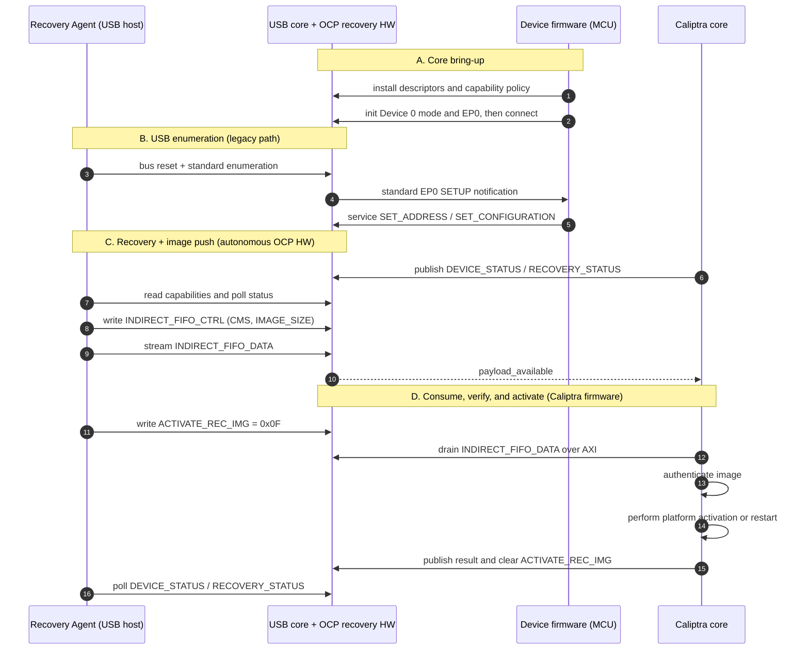
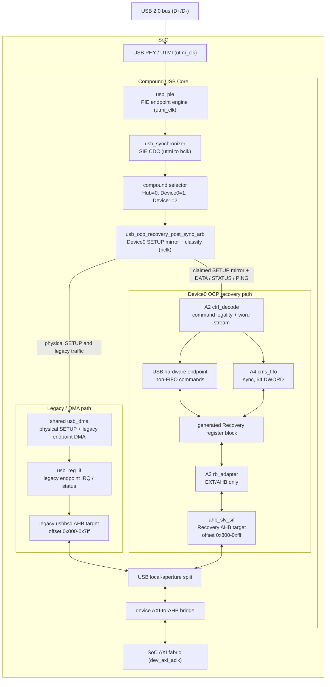
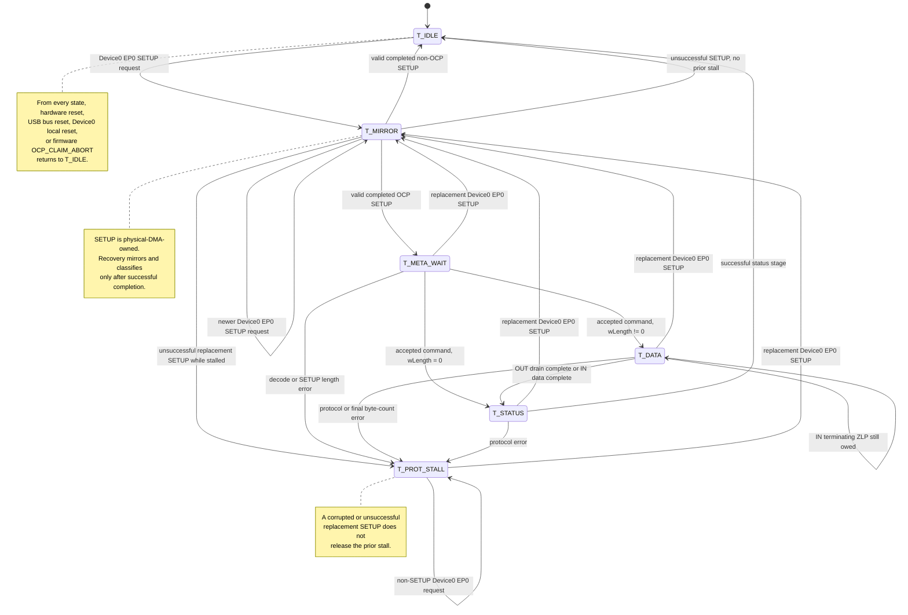

# USB2 OCP Recovery Enhancements - Microarchitecture Specification

Status: implemented (OCP Recovery mirrored-SETUP architecture).

Scope: the OCP Secure Firmware Recovery enhancements added to the Caliptra
Subsystem USB 2.0 device block (`third_party/usb2`). This document describes
*definitively how the hardware is implemented in RTL* and how *production*
firmware is expected to interact with it.

> Register reference note: the USB register reference is generated from
> SystemRDL and published at
> [Caliptra Subsystem Register Reference](https://chipsalliance.github.io/caliptra-ss/main/regs/?p=).
> The source register definition is
> `third_party/usb2/systemrdl/usb_ocp_recovery_reg.rdl`.

---

## 1. Overview and use model

The USB2 block is a USB 2.0 device controller (PIE / DMA / register-interface
SIE) that Caliptra Subsystem uses for both standard USB scenarios and for OCP
Recovery. The OCP Recovery enhancement adds a recovery interface on EP0 so
that a USB **Recovery Agent (host)** can push a firmware image into the device
and have **Caliptra** consume it. OCP "streaming boot" is the
firmware-download use case of the recovery specification.

Two use models share the same device and EP0:

- **Legacy USB.** Standard enumeration and any non-recovery control transfer
  are handled by the legacy USB DMA/register-interface path and serviced by
  device firmware.
- **OCP Recovery.** Recovery-class EP0 control transfers are claimed by
  dedicated hardware (`usb_ocp_recovery_top`) and serviced without
  per-command MCU firmware intervention. Image DWORDs land in an on-chip FIFO
  that Caliptra drains over AXI; Caliptra firmware owns recovery progress and
  the Recovery Agent-visible status.

In the compound Hub design, Recovery is available only on Device 0. The
compound selector values are Hub `0`, Device 0 `1`, and Device 1 `2`. Hub,
Device 1, and non-EP0 traffic continue through the legacy path while Device 0
retains an OCP EP0 claim.

Both use models are simultaneously available once the device is enumerated.
The OCP path can be globally disabled by a safety fallback bit (Section 4).

The device presents a recovery interface with `bInterfaceClass=0xEF`,
`bInterfaceSubClass=0x08`, `bInterfaceProtocol=0x01`, and an OCP Recovery
functional descriptor (type `0x24`, subtype `0x01`,
`bcdOCPRecVersion=0x0110`) advertising `wMaxWrTransferSize` and
`wMaxRdTransferSize`. The OCP v1.1 descriptor is 10 bytes in this field order:
length, type, subtype, reserved byte, maximum write size, maximum read size,
and BCD version. Each OCP command maps to exactly one EP0 control transfer,
classified from the SETUP encoding:
`bmRequestType[6:5]=01` (Class), `[4:0]=00001` (Interface), `bRequest=0x00`
(`OCP_RECOVERY_TRANSFER`), `wValue[7:0]` = OCP command ID, and
`wIndex[7:0]` = recovery interface number.

---

## 2. High-level recovery flow

> Refer to companion document:
> [`../CaliptraSSUSBRecoveryDiagram.md`](../CaliptraSSUSBRecoveryDiagram.md)
> for the command-level, actor-oriented protocol flow.

1. **A - Core bring-up.** Device firmware installs the Recovery descriptor and
   platform capability policy, initializes Device 0 and EP0, and connects the
   device (Section 5).
2. **B - Enumeration (legacy path).** The host resets and enumerates. Standard
   EP0 SETUPs use the legacy endpoint path and are serviced by device firmware
   until the device is configured.
3. **C - Recovery + image push (autonomous).** The host reads Recovery
   capabilities/status and streams the image into the CMS FIFO through
   `INDIRECT_FIFO_DATA`. These OCP-class transfers are claimed and serviced by
   hardware; MCU firmware is not involved per command.
4. **D - Consume, verify, and activate (Caliptra).** Caliptra waits for
   `payload_available`, drains `INDIRECT_FIFO_DATA` over AXI, authenticates the
   image, handles the activation request, performs any platform restart, and
   publishes the result.

---

## 3. Microarchitecture

The arbiter is inserted after `usb_synchronizer` and before the shared legacy
DMA. Every real Device 0 EP0 SETUP remains on the physical DMA path and is
mirrored into the OCP classifier. Claimed later DATA/STATUS/PING stages use
the Recovery path. USB Recovery Agent commands use direct hardware-interface
or FIFO paths and do not pass through the firmware CPU interface.

The SoC reaches both the legacy controller and Recovery aperture through the
same device AXI-to-AHB bridge. The integration wrapper performs the coarse
`0x000-0x7ff` legacy versus `0x800-0xfff` Recovery selection. The Recovery
AHB slave interface is implemented inside `usb_ocp_recovery_top`.

### 3.1 Clock domains

| Domain | Frequency (MHz) | Blocks |
|---|---|---|
| `utmi_clk` (PHY/PIE) | 60 | USB PHY/UTMI, `usb_pie` protocol engine |
| `hclk == dev_axi_aclk` (SoC) | Min: 60 MHz; max: integration-specific | `usb_synchronizer` hclk side, `usb_ocp_recovery_post_sync_arb`, shared `usb_dma`, `usb_reg_if`, all of `usb_ocp_recovery_top`, and the EXT/AXI bridge |

`usb_synchronizer` is the single USB clock-domain crossing (utmi to hclk). All
OCP Recovery logic runs on the SoC clock, so the active Recovery register and
FIFO surfaces are single-domain and require no additional data-path CDC.

### 3.2 Reset architecture

The Recovery stack receives the USB device subordinate reset as
`dev_axi_aresetn` and uses active-low reset naming throughout.

- **Handwritten Recovery logic.** `usb_ocp_recovery_top`, A2, A3, A4, and the
  post-sync arbiter operate in the `dev_axi_aclk`/hclk domain. A4's FIFO
  storage uses the same reset and has a separate synchronous clear for FIFO
  region reset and batch teardown.
- **Generated register block.** The SystemRDL definition declares `rst_ni` as
  its active-low reset. `usb_ocp_recovery_top` drives the generated block from
  its own `rst_ni`.
- **USB and Device 0 local reset.** USB bus reset, Device 0 port reset, or
  Device 0 disconnect clears retained claim, packet staging, reservations,
  response snapshots, and SETUP success-mask tracking. This local cleanup
  does not reset the shared compound DMA.
- **Assertions.** Handwritten assertion blocks are disabled while their
  active-low reset is asserted.

### 3.3 Post-synchronizer arbiter

`usb_ocp_recovery_post_sync_arb` splices into the hclk side of
`usb_synchronizer`, between the synchronizer and the shared legacy consumers
(`usb_dma`, `usb_reg_if`). It:

- **Forwards and mirrors every Device 0 EP0 SETUP.** The real SETUP request,
  eight data bytes, completion, and notification remain on the physical DMA
  path. The same bytes are captured for OCP classification.
- **Classifies only a successfully completed eight-byte SETUP.** A valid OCP
  envelope retains Device 0 EP0 ownership for later DATA/STATUS/PING. A valid
  non-OCP SETUP remains legacy-owned.
- **Masks only claimed SETUP success publication.** The matching physical DMA
  transaction still receives the real SETUP and performs normal SETUP SRAM,
  `setup_received`, address-update, and toggle effects. Its successful
  completion is withheld from legacy endpoint interrupt/dispatch publication.
- **Routes each later transaction by identity.** Claimed Device 0 EP0
  DATA/STATUS/PING uses the Recovery stack. Hub, Device 1, and non-EP0
  transactions remain legacy-owned even while Device 0 retains a claim.
- **Snapshots response metadata.** Endpoint validity, active/disabled/STALL
  state, toggle, byte count, maximum-packet value, and isochronous/rate
  feedback attributes are captured for the active transaction and held stable
  through wire completion.

#### Arbiter transfer state machine

The transition priority in RTL is:

1. hardware reset, USB bus reset, Device 0 local reset, or firmware claim
   abort returns to `T_IDLE`;
2. a Device 0 EP0 SETUP request enters `T_MIRROR` from any current state;
3. an accepted firmware general-error request enters `T_PROT_STALL` while a
   claim is active;
4. otherwise the current-state transition above applies.

`T_MIRROR` captures the physical SETUP while the shared DMA services it. On
successful completion, a claimed OCP request advances to `T_META_WAIT`; a
normal request returns to `T_IDLE`. `T_META_WAIT` waits for command response
metadata and FIFO admission before exposing DATA-stage behavior. `T_DATA`
owns claimed data transfer, complete-packet validation, and FIFO drain.
`T_STATUS` owns the claimed status stage. `T_PROT_STALL` persistently returns
protocol STALL until a successful replacement SETUP or explicit reset/abort
release.

### 3.4 `usb_ocp_recovery_top` (OCP service stack)

Clocked by `dev_axi_aclk`:

| Block | Role |
|---|---|
| **A2** ctrl_decode | Validates the claimed SETUP command, direction, and length and converts DATA into a word-wide command stream. |
| **USB hardware endpoint** | Services non-FIFO Recovery Agent commands directly from generated register storage/hardware interfaces. Host writes to read-only commands are rejected here as defense in depth. |
| **A3** rb_adapter + register block | A3 converts held EXT/AHB requests into one generated CPU-interface request. It is not used by USB command traffic. |
| **A4** cms_fifo | Owns `INDIRECT_FIFO_*`; a 64-DWORD synchronous FIFO backing store for the image payload, plus indices, full/empty status, and batch notification. |

#### Command legality and protocol STALL

The SETUP transaction itself is ACKed by the USB controller. A claimed command
with an unsupported command, illegal direction, invalid transfer envelope, or
capability-disabled `DEVICE_RESET` enters persistent protocol STALL before
any command side effect.

Fixed-size writes require their exact OCP-defined length.
`INDIRECT_FIFO_DATA` writes accept one through 64 bytes. Fixed-size reads
accept a request from the command's required minimum length through the
advertised 64-byte read envelope and return up to the command-defined response
length, clipped to the host's `wLength`. Invalid OUT/write length uses protocol
error `0x03`; invalid IN framing or length uses `0xFF`.

Protocol-error encodings are:

| Value | Meaning |
|---|---|
| `0x00` | No error |
| `0x01` | Unsupported command or host write to a read-only command |
| `0x02` | Unsupported parameter; defined with no current USB RTL producer |
| `0x03` | OUT/write length or accepted OUT final byte-count error |
| `0x04` | CRC error; defined with no current USB RTL producer |
| `0xFF` | Invalid IN framing/length or firmware general error |

Current USB RTL producers drive `0x01`, `0x03`, and `0xFF`. Link CRC, PID,
bit-stuff, and PHY failures discard uncommitted packet staging and use normal
USB retry behavior instead of setting `0x04`.

The first error wins. Only a completed Recovery Agent `DEVICE_STATUS` read
clears `PROT_ERROR`; firmware/EXT reads are non-destructive. The clear has
priority over a new error in the same cycle.

### 3.5 CMS image FIFO

The image data path is exposed through `INDIRECT_FIFO_*` and backed by a
synchronous 64-DWORD FIFO. `FIFO_SIZE` and `MAX_TRANSFER_SIZE` both report 64
DWORDs. `WRITE_INDEX` and `READ_INDEX` wrap modulo 64 and are debug fields:
they may be equal at both empty and full, so `FULL` and `EMPTY` are the
authoritative occupancy indicators. All 64 physical entries are usable.

The host supplies normal one-to-64-byte OUT transfers. Before accepting a FIFO
DATA packet, the arbiter reserves capacity for the complete packet.
Reservation persists across PING and retry behavior. Insufficient capacity
produces pre-acceptance NAK flow control; at high speed, a successfully
accepted packet that consumes the final reserved capacity may complete with
NYET. Capacity pressure is not an OCP protocol error.

Claimed OUT data is staged in a complete 64-byte packet buffer. The staged
bytes are invisible to the FIFO until the packet:

- completes successfully;
- has the exact expected final byte count; and
- passes link-level validation.

A byte-count mismatch discovered after EOP ACKs the DATA transaction, commits
no FIFO data, sets error `0x03`, and STALLs the following STATUS stage. A
CRC-failed or otherwise link-invalid packet is discarded and may be retried
without modifying the FIFO or setting an OCP protocol error.

A validated 64-byte packet drains as 16 consecutive DWORD transfers. STATUS
remains NAK while validation/drain is incomplete. A partial final DWORD uses
byte enables and zero padding. `INDIRECT_FIFO_CTRL.IMAGE_SIZE` is programmed
and reported in DWORD units; byte-exact final image length, if required, comes
from the image format or a higher-level firmware contract.

`payload_available` asserts when the FIFO reaches 64 DWORDs, or when a
nonempty terminal image batch completes, and remains asserted until the FIFO
is empty. Caliptra waits for this level before reading
`INDIRECT_FIFO_DATA`; each accepted EXT read pops exactly one DWORD.

The published-batch contract requires every later `INDIRECT_FIFO_DATA` OUT
request to receive NAK while `payload_available` remains asserted, including
after Caliptra has partially drained the batch and physical FIFO space has
reopened. Caliptra drains each published batch completely, up to 256 bytes,
and host software waits for FIFO empty and `payload_available` deassertion
before submitting the next batch. The post-sync arbiter input
`fifo_payload_available_i` is the dedicated admission interlock for this
policy. FIFO free-space admission and packet reservation are both gated by
this published-batch interlock, so partial drain cannot reopen host admission.

This design advertises the minimum single-packet transfer size,
`wMaxRdTransferSize = wMaxWrTransferSize = 64`. Each OCP DATA stage fits in
one 64-byte MaxPacket; large images are streamed as many
`INDIRECT_FIFO_DATA` transfers.

### 3.6 EXT / AXI register + drain path

Caliptra reaches the OCP register aperture as an AXI master: SoC AXI fabric to
the device AXI-to-AHB bridge and then the package-defined Recovery portion of
the local USB device aperture. For the current 4 KiB local USB window:

- `0x000-0x7ff` remains the legacy `usbhsd` register aperture.
- `0x800-0xfff` is the Recovery aperture. The integration wrapper
  range-checks the address and subtracts the Recovery base.

`usb_ocp_recovery_top` contains `ahb_slv_sif`, which validates aligned
32-bit accesses and holds the AHB transaction until the selected internal
owner responds. A3 (`usb_ocp_recovery_rb_adapter`) converts a held EXT request
into one generated CPU-interface request so software side effects occur
exactly once. USB Recovery Agent commands do not use A3.

USB non-FIFO commands use the direct hardware endpoint. USB FIFO commands use
A4 directly. New EXT requests are admitted when no USB command is requesting
the resource. Once an EXT transfer is admitted, it remains in flight until
acknowledgement.

Every EXT FIFO control, status, and data access is deferred while a claimed
USB FIFO command or packet reservation owns the FIFO aperture. EXT
`INDIRECT_FIFO_DATA` reads additionally wait for `payload_available`. There is
no active sideband FIFO drain path; firmware uses the generated register
aperture.

### 3.7 Firmware-owned recovery procedure

The hardware does not implement an OCP recovery lifecycle or platform
boot-request/acknowledgement state machine. Caliptra firmware owns
`DEVICE_STATUS.DEV_STATUS`, `DEVICE_STATUS.REC_REASON_CODE`,
`RECOVERY_STATUS`, and firmware-programmable hardware status through the EXT
CPU interface. The USB Recovery Agent reads those stored values but cannot
write host-read-only fields.

`RECOVERY_CTRL.ACTIVATE_REC_IMG` is a request field. The Recovery Agent writes
`0x0F`; `recovery_image_activated` reflects that stored value. Caliptra
firmware drains and verifies the image, performs any platform activation or
restart, publishes the result, and clears the request.

`DEVICE_STATUS.PROT_ERROR` is a sticky hardware latch. A completed Recovery
Agent `DEVICE_STATUS` read returns and clears it; firmware reads are
non-destructive.

If an incomplete FIFO DATA batch is interrupted by replacement SETUP, bus
reset, Device 0 disconnect/reset, or firmware claim abort, hardware clears
packet staging/reservation, flushes the incomplete batch, and sets
`CALIPTRA_STATUS.BATCH_ABORTED`. Firmware may then request
`OCP_PROTOCOL_ERROR_GENERAL` (`0xFF`). That request is accepted only while
`BATCH_ABORTED` is asserted and self-clears. It records
`DEVICE_STATUS.PROT_ERROR=0xFF`; it also enters persistent protocol STALL only
if a Device 0 OCP claim remains active.

`INDIRECT_FIFO_CTRL.RESET` atomically clears FIFO state and self-clears for
subsequent readback. `CALIPTRA_CTRL.OCP_CLAIM_ABORT` is a firmware-only
write-one request that releases the retained claim, protocol STALL, staging,
and reservation and then self-clears.

---

## 4. Path enablement - legacy and OCP coexisting

Both paths are always structurally present; the arbiter routes per
transaction:

- **Legacy path is never removed.** Standard enumeration and every
  non-recovery EP0 transfer use the physical legacy DMA/register path.
- **Physical SETUP delivery is always retained.** Every real Device 0 EP0
  SETUP reaches the shared DMA. Recovery mirrors the bytes for classification.
  If claimed, only the matching successful SETUP interrupt/dispatch
  publication is masked.
- **OCP path is active by default.** Once the Recovery interface is advertised
  and the device is enumerated, valid Recovery-class SETUPs are claimed
  automatically. There is no per-transfer firmware enable step.
- **Compound isolation.** Only Device 0 is claimable. Hub, Device 1, and
  non-EP0 transactions remain legacy-owned during Device 0 claim, drain,
  STATUS wait, or protocol STALL.
- **Global override (chicken bit).** `CALIPTRA_CTRL.OCP_PATH_DISABLE` is an
  EXT/firmware-only field that prevents new OCP claims. With it set, Device 0
  EP0 traffic remains on the legacy path. Reset default `0` means Recovery
  classification is active.

---

## 5. Required initialization before OCP recovery

OCP Recovery is serviceable only after the USB device controller is initialized
and Device 0 is enumerated and configured. Device-controller bring-up and
enumeration are MCU firmware responsibilities, following the general USB2
device programming flow in the
[USB2 Programmer's Guide](https://github.com/chipsalliance/usb2/blob/main/docs/USB2_Programmers_Guide.md).
That guide is authoritative for generic controller bring-up; this document
calls out the Recovery-specific requirements:

- **Advertise the Recovery interface.** Install the OCP Recovery
  configuration/interface/functional descriptors before connecting Device 0,
  so the host discovers the interface during enumeration. Validation OCP v1.1
  firmware enumeration uses the descriptor returned by
  `usb_ocp_recovery_get_v1p1_config_descriptor()`; the
  `usb_ocp_recovery_get_config_descriptor()` helper retains the compatibility
  field order.
- **Apply platform capability policy before connection.** The current platform
  clears Forced Recovery, Management Reset, Device Reset, Interface Isolation,
  and Flashless Boot. The resulting runtime `AGENT_CAPS` value is `0x1691`.
- **Do not service claimed OCP commands through the MCU class hook.** Hardware
  owns claimed DATA/STATUS/PING stages. The legacy class hook returns false for
  the OCP envelope and logs a warning if such a request unexpectedly reaches
  MCU dispatch.

`DEVICE_RESET` command support follows the live reset-related capability
fields. With all five unsupported platform capabilities cleared, the command
is rejected as unsupported. If firmware later advertises any of those
capabilities, the implemented command accepts reads requesting 3 through
64 bytes and exact 3-byte writes.

Only after Device 0 is configured are Recovery-class control transfers
serviceable. The OCP path itself needs no separate enable and remains active
while `OCP_PATH_DISABLE` is clear.

---

## 6. Caliptra interaction (production)

Caliptra is the recovery image consumer (the OCP "Device Firmware" role). As
an AXI master it interacts with the OCP Recovery register aperture:

1. **Publish status.** Program the firmware-owned `DEVICE_STATUS`,
   `RECOVERY_STATUS`, and hardware-status fields used by the Recovery Agent.
2. **Detect a batch.** Wait for
   `cptra_ss_usb_recovery_payload_available_o`; then read
   `INDIRECT_FIFO_CTRL.IMAGE_SIZE` in DWORD units and inspect
   `INDIRECT_FIFO_STATUS`.
3. **Drain.** Read `INDIRECT_FIFO_DATA` repeatedly until the notified batch is
   empty. Each accepted read pops one DWORD from the CMS FIFO.
4. **Authenticate.** Verify the image through Caliptra's normal secure-boot or
   authentication path.
5. **Handle activation.** Observe `ACTIVATE_REC_IMG == 0x0F`, perform the
   platform activation/restart required by firmware policy, publish success or
   failure, and clear the request.
6. **Handle interrupted batches.** If `BATCH_ABORTED` is set, discard any
   partial image state and, when appropriate, request firmware-originated
   general protocol error `0xFF`.

OCP commands used on this path include `DEVICE_STATUS`,
`INDIRECT_FIFO_CTRL`, `INDIRECT_FIFO_STATUS`, `INDIRECT_FIFO_DATA`,
`RECOVERY_CTRL`, and `RECOVERY_STATUS`.

> Register bit-behavior scope: the per-command behavior defined by OCP
> (clear-on-read, RW, RO) is the contract between the Recovery Agent and the
> device. It is not necessarily the contract for internal firmware EXT/AXI
> accesses. For example, `DEVICE_STATUS.PROT_ERROR` clear-on-read applies to a
> completed Recovery Agent read, not a Caliptra read.

---

## 7. Register aperture

The Recovery register aperture is placed at offset `0x800` within the local USB
register space; legacy `usbhsd` registers occupy `0x000-0x7ff`, and Recovery
occupies `0x800-0xfff`.

The generated field descriptions, offsets, access types, and reset values are
published in the
[Caliptra Subsystem Register Reference](https://chipsalliance.github.io/caliptra-ss/main/regs/?p=).
The maintained source is:

`third_party/usb2/systemrdl/usb_ocp_recovery_reg.rdl`

The aperture includes the OCP commands `PROT_CAP`, `DEVICE_ID`,
`DEVICE_STATUS`, `DEVICE_RESET`, `RECOVERY_CTRL`, `RECOVERY_STATUS`,
`HW_STATUS`, `INDIRECT_FIFO_CTRL`, `INDIRECT_FIFO_STATUS`,
`INDIRECT_FIFO_DATA`, and `VENDOR`, plus Caliptra-specific
`CALIPTRA_CTRL` and `CALIPTRA_STATUS`.

---

## 8. Key invariants

- **Single-packet OCP DATA.** Advertised
  `wMaxRdTransferSize = wMaxWrTransferSize = 64`, so each OCP DATA stage is at
  most one 64-byte MaxPacket.
- **Physical SETUP preservation.** Every real Device 0 EP0 SETUP reaches the
  shared physical DMA. Recovery classification never fabricates or replays a
  SETUP.
- **Selective success masking.** A claimed SETUP retains physical SETUP side
  effects but suppresses only the matching legacy successful-completion
  interrupt/dispatch publication.
- **Compound transparency.** Hub, Device 1, and non-EP0 traffic remain
  independently serviceable during all retained Device 0 OCP states.
- **Transaction-stable responses.** Response metadata is snapped for the
  active transaction and cannot change before wire completion.
- **Persistent protocol STALL.** A protocol error remains stalled until a
  successfully completed replacement SETUP, bus reset, Device 0 local reset,
  or firmware claim abort. A corrupt replacement SETUP does not release it.
- **Packet and batch integrity.** A USB OUT packet is committed only after
  complete-packet validation. A superseding SETUP or teardown during an
  incomplete FIFO write flushes the incomplete batch and sets
  `BATCH_ABORTED`; a CRC retry does neither.
- **FIFO occupancy.** All 64 entries are usable. Equal indices are legal at
  empty and full; `EMPTY` and `FULL` are authoritative.
- **Reservation before acceptance.** PING/DATA acceptance implies capacity is
  reserved for the whole packet. Capacity pressure NAK/NYET is flow control,
  not protocol error.
- **Published-batch isolation.** While `payload_available` is asserted, every
  new FIFO DATA request receives NAK until the FIFO becomes empty and
  `payload_available` deasserts. Partial firmware drain does not reopen host
  admission.
- **Bounded drain.** A valid 64-byte packet drains as 16 consecutive accepted
  DWORDs while STATUS remains NAK.
- **Local teardown.** Device 0 disconnect/reset clears Recovery-local state
  without resetting the shared compound DMA.

---

## 9. Companion documentation

- Protocol-flow companion:
  [`../CaliptraSSUSBRecoveryDiagram.md`](../CaliptraSSUSBRecoveryDiagram.md)
- Generated register reference:
  [Caliptra Subsystem Register Reference](https://chipsalliance.github.io/caliptra-ss/main/regs/?p=)

---

## 10. Implemented mirrored-SETUP firmware contract

**Status: implemented.** The former trap/replay architecture has been replaced
by post-synchronizer mirrored SETUP. The legacy firmware register interface is
unchanged.

The implementation forwards every real Device 0 EP0 SETUP request/data/
completion to the shared legacy DMA while observing the same eight-byte
payload for OCP classification. A claimed SETUP may overwrite the legacy
SETUP SRAM and produces the normal valid `setup_received` effects. Hardware
suppresses only the claimed SETUP's matching successful DMA interrupt/
dispatch publication. Subsequent DATA/STATUS/PING transactions remain
OCP-owned; Hub, Device 1, and non-EP0 transactions remain legacy-owned.

### 10.1 Supersession and firmware responsibility

A replacement SETUP supersedes the preceding EP0 operation (USB 2.0 Section
5.5.5). Obsolete requests are not queued for later firmware execution. The
architecture does not add a hardware authorization/session mechanism that can
cancel CPU instructions or prevent a stale firmware write already in flight.

Production MCU firmware must:

1. Retain its legacy responsibility to handle a new SETUP superseding an
   unfinished legacy EP0 request, including discarding the obsolete request.
2. Recognize the OCP request envelope and active Recovery interface. Leave
   claimed requests to hardware: do not execute them, arm a legacy response,
   or issue a legacy STALL merely because they are class requests.
3. Consume or clear legacy SETUP-pending bookkeeping using the existing
   interface and SETUP-buffer coherence rules. Clearing the software flag does
   not clear hardware OCP ownership.
4. Not require a legacy SETUP interrupt to service OCP Recovery. Hardware
   services claimed control transfers; Caliptra firmware uses Recovery
   registers and `payload_available`.
5. Apply existing shared-SETUP-buffer supersession discipline. A newer SETUP
   payload may overwrite an earlier payload while firmware is active.

The MCU legacy dispatcher and Caliptra Recovery library are separate flows.
Suppressing a claimed SETUP's successful legacy interrupt does not prevent
Recovery service. Any legacy flag cleanup is bookkeeping, not a new
per-OCP-command firmware dispatch requirement.

`DEVCMDSTAT.SETUP` is a sticky pending bit, not a counter or generation
number. If it is already one, another SETUP leaves it one. Forwarding
`setup_received` does not by itself detect every replacement, make two SRAM
word reads atomic, or cancel an already-executing handler. No atomic hardware
cancellation guarantee is implied.

### 10.2 Hardware boundaries and timing obligations

The implemented hardware boundaries are:

- OCP captures and validates its own SETUP copy, maintains its own control
  toggles, and isolates claimed DATA/STATUS/PING and NAK reporting from legacy
  DMA.
- Forwarding valid `setup_received` preserves the existing software flag,
  address update, SETUP SRAM, and legacy toggle effects. The local DMA success
  mask does not change the real PIE result.
- The success mask is qualified by the Device 0 SETUP transaction owner and
  retained until the matching DMA valid lifecycle retires. A raw next
  `epinfo_req` is not treated as proof of DMA retirement.
- USB bus reset and Device 0 local reset clear mask/tracking unconditionally,
  without requiring normal DMA retirement.
- Non-EP0, Hub, and Device 1 responses, success, and interrupts are selected
  by current transaction identity and are not suppressed by retained Device 0
  EP0 claim or stall state.
- Late preparation of an obsolete legacy response cannot drive the wire while
  Recovery owns Device 0 EP0. Firmware remains responsible for not exposing
  stale prepared state when a later legacy SETUP returns ownership.
- Response metadata remains transaction-stable. Late register or error changes
  affect a later request, not the transaction already on the wire.
- FIFO packet capacity is reserved before ACK/PING acceptance, and an accepted
  FIFO packet cannot later fail because firmware consumed or changed capacity.

### 10.3 Relationship to Caliptra firmware and error recovery

The legacy SETUP observation/ignore requirement concerns MCU device firmware,
not per-command service of OCP Recovery. Caliptra's FIFO drain and
firmware-owned Recovery status obligations in Sections 3.7 and 6 remain.

For an active, incomplete `INDIRECT_FIFO_DATA` write, a replacement SETUP,
USB bus reset, Device 0 disconnect/reset, or firmware `OCP_CLAIM_ABORT` aborts
the operation whether RX is still arriving, fully staged, partly draining, or
waiting for STATUS. The batch-abort indication describes the interrupted FIFO
operation, not merely a cycle on which a FIFO push occurred. Other OCP
commands, a successfully completed transfer, and a CRC retry alone do not set
`BATCH_ABORTED`.

After observing `BATCH_ABORTED`, firmware may request general error `0xFF`.
Hardware accepts that request only while the batch-aborted condition is
present, self-clears the request bit, and records `PROT_ERROR=0xFF`. If a
Device 0 OCP claim remains active, the arbiter also holds Device 0 EP0 in
persistent protocol STALL. A completed Recovery Agent `DEVICE_STATUS` read
returns and clears the error.

**Reconnect assumption:** a USB bus reset occurs after Device 0 reconnection
and before new endpoint traffic. Existing shared DMA state may remain valid if
disconnect suppressed its natural `endtransfer`; reconnect reset flushes that
state. Recovery-local claim, staging, reservation, success-mask, and response
tracking do not wait for shared DMA retirement. Reset is teardown, not a
successful transfer completion.
